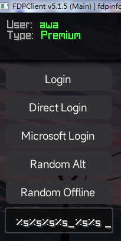
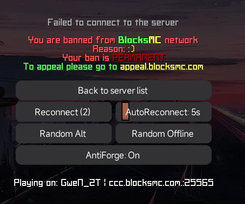
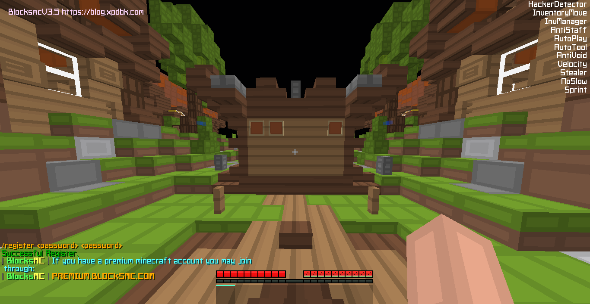
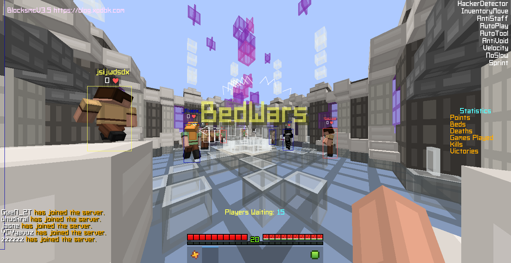
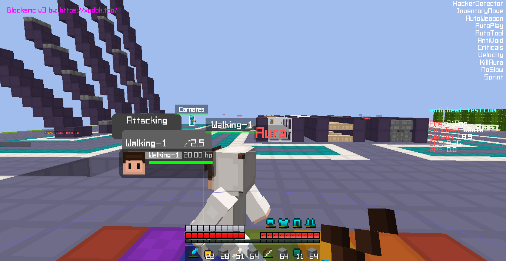
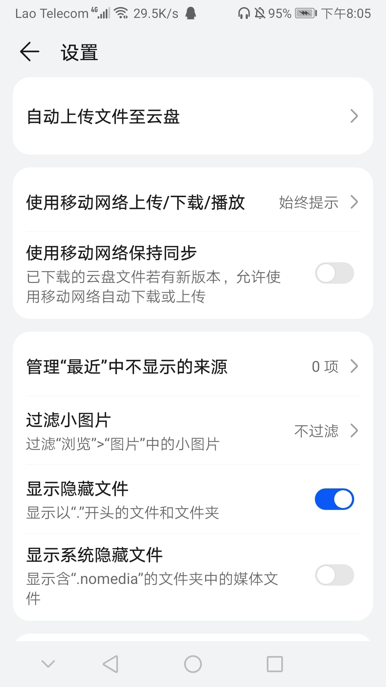

# BMC服务器配置

> 注意：对于此配置请使用`FDP5.1.5`或者`5.1`版本
> 
>  `5.2.0`版本改动过大不兼容此配置（懒得整原因如下↓）
> 
> `5.2.0`版本的内存泄露极其严重具体请到../minecraft-1.8.9-fdp/文章查看
> 
> `regedithaha20` 的论坛已经无了

## BMC服务器特性列表（必须掌握）

| 范围时间     | 早上              | 中午             | 下午             | 晚上             | 夜晚          |
| -------- | --------------- | -------------- | -------------- | -------------- | ----------- |
| **粗略时间** | 7点到11点          | 12点到3点         | 4点到7点          | 4点到10点         | 11点到7点      |
| **概率**   | 15%到38%         | 36%到77%        | 45%到75%        | 80%到99%        | 29%到完全      |
| **表现形式** | 被/report非常可能ban | 被/report可能会Ban | 被/report直接被Ban | 不用/report直接ban | 甚至自动穿盔甲都ban |

**全部被Ban原因**

| 反作弊 封禁24小时和7天      | 客服（工作人员）检测 封禁7天 |
| ------------------ |:---------------:|
| Hacker             | aimbot          |
| Aimbot（杀戮检测）7天     | auto armor      |
| Fly（搭路检测）7天        | Fly             |
| AutoArmor（高延迟原因）7天 | no knockback    |

常见问题简明解答

| 类型   | 被封禁    | 高延迟     | 卡         | 改进配置     | 可以咨询？         |
| ---- | ------ | ------- | --------- | -------- | ------------- |
| 问题描述 | 连锁IP封禁 | 高于300ms | 30FPS     | 我想改进你的配置 | 可以加你电报或者QQ咨询吗 |
| 解决方案 | 重启入户光猫 | 加速器     | 自己寻找优化MOD | 跟我私聊     | 可以的有时间我回      |

## 常见问题复杂解答

你的延迟高于`300ms`（~~别玩了，不用加速器还想开军舰！~~）。

（可以开自动骂人`insult`）可以配置打完人自动阴阳怪气

**自动骂人配置的更改方法（仅用于FDP）**

```json
[
  "[",
  "  \"%name% 我看你需要蛋白质 盖亚！\",",
  "  \"%name% ^^看起来你需要IQ\",",
  "  \"%name% ^^真的L哈哈\",",
  "  \"%name% 这就是亼\",",
  "]" # 可以发挥你的全部的想象力
]
```


被服务器踢出去了你之后不要着急[重启光猫](https://zhidao.baidu.com/question/1546511523377942507.html?qbl=relate_question_4)请一定要重新进一下[服务器](https://blocksmc.com)看看是否真的被BAN。

~~一次重启光猫可以玩5次~~（参考时间表）

重启光猫是在换你的IP，~~所有~~的服务器都是基于IP ban的。

**重启光猫的方法**

https://www.bilibili.com/video/BV1aT41197N2

**我的材质包**

> 这个[PVP材质包和HUD配置 整合](https://blog.xpdbk.com/post/minecraft-1.8.9-pack-hud/#v2-hud)里面

**BlockSmc服务器IP**

> BMC服务器离线登陆IP（客服在后面追XD）:`blocksmc.com`
> 
> BMC服务器正版登录IP（封的速度更慢）:`premium.blocksmc.com`

## Blocksmc新手教程

  

**服务器菜单里面的常用选项** **随机ID器** **注册方法**

  

## Blocksmc V5 （回归暴力）

- [x] 再次优化搭路

- [x] 去除没用的step

- [x] 超级忽略反作弊但是忽略不了客服（安全也封客服乱ban人）

- [x] 修复了一些bug并适配最新构建FDP

[!] 请使用FDP 2023.5.13 最新构建版本

> [蓝奏云](https://pvphack.lanzoue.com/iqtZ40w181sb) 访问密码：`667p`
> 
> 压缩密码：`ConfigByLEl_FENG`
> 
> 完整性校验（`SHA-1`）：SHA1: `c8dbcb975f742a5d8ba19da040e92a8bc907fe2e`

## Blocksmc v4 fix

VEV LOG：

- [x] Noslow优化

- [x] 删除部分暴力功能

- [x] 防客服封号（只能防一点）

- [x] 新的step

- [x] 防封慢速搭路

[!]  请使用FDP 5.2.7 版本

> 压缩密码：`4124124`
> 
> [蓝奏云](https://pvphack.lanzoue.com/ifZkl0r3ac7a) 访问密码：`heza`
> 
> 已存在归档网盘

## LB+ Blocksmc V1

| 说明         | 键位     |
| ---------- | ------ |
| Xray（透视）   | K      |
| 起床模式       | LCtrl  |
| 现代GUI      | RShift |
| 搭路         | V      |
| 自动整理与拿东西   | C      |
| 现代GUI      | RShift |
| 自动整理与拿东西   | C      |
| 远古GUI      | O      |
| 续写散文（大哥转头） | U      |
| 速度+转圈圈     | X      |
| 安全搭路       | Z      |
| 自动瞄准和自动射弓箭 | B      |

不要按 `L` 键 里面的功能都没用

这个搭路和杀戮都不稳定 我急忙做出来的

演示视频： https://www.bilibili.com/video/BV18j411u7cj

> 自释放压缩包密码`AwT9Y2Y8`
> 
> [归档网盘地址](https://drive2.xpdbk.com) [蓝奏云](https://pvphack.lanzoue.com/iaeDG0psodfg) 蓝奏云访问密码：`2t5r`
> 
> 本文件是安全的不要魔改之后来栽赃我
> 
> 压缩文件完整性校验 ↓
> 
> 名称: `BMC LB+ V1.exe`
> 
> 大小: `37576309` 字节 (`35` MiB)
> 
> CRC32: `91172A6B`
> 
> CRC64: `692D82CC985ADF55`
> 
> SHA256: `133daad85166cf8373c7efbbe6a20f5e1f3e4290d75a91065b05bd0d65118ad0`
> 
> SHA1: `90d7c0982457e41d953f4b2f3ca19812075ae6c6`
> 
> BLAKE2sp: `7b8f2edd208b079c4fdb31fcb41610787754e11b915089039dfb29b60bca0e70`

## BMC FDP V3.5 配置（开源+起床战争增强）

**开源库**

`GITHUB`仓库

```link
https://github.com/1x000/BMC/
```

`GITEE`仓库

```link
https://gitee.com/cat-owo/BMC/
```

> 蓝奏云
> 
> JSON配置（配置本体）
> 
> https://pvphack.lanzoue.com/ihzKq0mpn8xc  
> 密码:`co9a`
> 
> 压缩密码：`biexiang114514`

DEV 日志

`V3.5相对于V3:`

- [x] 隔空挖床

- [x] NCP longjump Lmao FLY（不要用不稳定）

- [x] NCP 自动搭路加强（Tower不回弹）

- [x] 增加安全搭路

- [x] 进一步完善客户端

- [x] killaura CPS加强

- [ ] 自动登录（~~登dua郎~~）

- [ ] 不封的暴力刀爆

- [ ] Rise同款 ZOOM FLY

- [ ] 无顶头瞬间FLY

[!] 不要使用 FASTUSE FASTUSE 仅为测试版

[!]不要长时间使用TOWER（稳定待测试）

[!] 隔空挖床不会被检测，但在挖床时请关掉 killaura（做一个冲锋队）

**起床演示视频**

https://www.bilibili.com/video/BV1iG4y1U7aH

**空岛演示视频**

https://www.bilibili.com/video/BV1oR4y1B7pZ

**搭路测试**

https://www.bilibili.com/video/BV1XY411v7dR

## BMC FDP V3 配置 （配置增强）



BMC配置的DEV log:

`V3配置相对于V3 start的DEV log:`

- [x] 合法的Speed

- [x] 简单的键位设置

- [x] 超简洁HUD

- [ ] NCP ZOOM FLY（抱歉我还没时间解决）

- [ ] NCP 不封的搭路（需要时间解决谢谢提醒）

- [x] 修复老版配置BUG（搭路回弹+边缘卡方块间歇性封号）

- [x] 修复了杀戮瞄准不了的问题

- [x] 删减了一些影响帧数的视觉

- [x] 轻量的HUD

- [x] 合法暴击

- [x] 修复搭路非法发包封号

- [x] 需要IQ和电脑即可游玩

- [x] 没用的的Nofall

[!]请一定要把游戏语言变成英文语言！ 不然会乱码

[!]查看键位请按你的键盘上的 `Alt`

**v3 start**

- [x] FDP主程序更新到了5.1.5

- [x] 删除无用的视觉（优化嘛）

- [x] 稳定的魔力转圈圈

- [x] 更快的speed（在视觉上）

- [x] 修复老配置的bug

[!]请一定要把游戏语言变成英文语言！ 不然会乱码

[!]查看键位请按你的键盘上的 `Alt `

> 压缩包密码：`A1VnCzA5`

> 访问密码：`9pbj`

> [配置下载](https://pvphack.lanzoue.com/i0dOU0gv8i2b)

新版 5.1.5 FDP下载 [蓝奏云](https://pvphack.lanzoue.com/iRRzE0hpsxdc) 访问密码: `1be6`

5.1.5版本 演示视频:

https://www.bilibili.com/video/BV1Q8411L7Uh

### 我的经验：用正版号！这个服用正版封的比盗版慢！

## 更新手机版本（电脑削弱版）

> 手机版端文件[下载](https://pvphack.lanzoue.com/ixV0q0kdln6j) 访问密码：`27vw`
> 
> 澪启动器原版[下载](https://wwi.lanzouw.com/iiabLzt3vmf)

手机版本 注意事项：

把1.8.9文件夹复制到手机的

`/MioLancher/.minecraft/versions/复制到这来`

`.minecraft`是隐藏的所以需要进入官方手机文件管理里面打开`显示隐藏文件功能`



你懒的话可以使用MT管理器

[MT管理器下载](https://mt2.cn/)

[!] MT管理器请谨慎使用，可能会毁掉你的数据！（别问我是怎么知道的）

演示视频: https://www.bilibili.com/video/BV1XR4y1m7vd