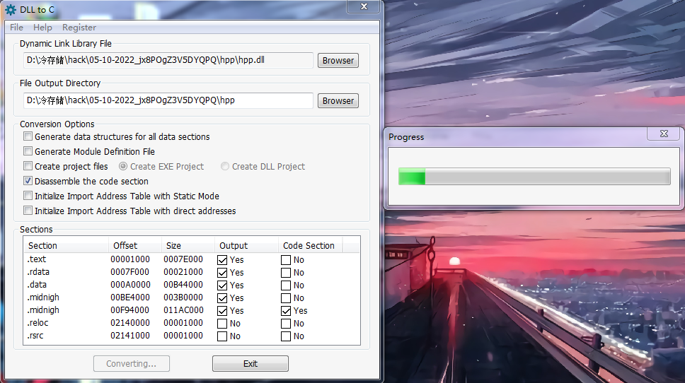

> 仅用来探讨技术和学习
> 
> 下载学习之后请24小时内删除

# DLL TO C



**DLL to C**是一款可怕的DLL反编译工具，能够把DLL转换成可编译的C或C++代码，当您丢失DLL的源代码时，您可以用DLL to C，它能够把DLL转换回可编译的代码，并且具有生成数据结构和反汇编代码段的功能，和其它的反编译或反汇编工具最大的不同是：它生成的代码是可以直接编译运行的，它可以为所有数据段生成数据结构并拆解代码段，还可以生成函数关系树，然后可以方便地导出DLL中所需的指定特征，它可以将汇编代码转换成C代码，C代码也是可编译的，非常强大

> [蓝奏云](https://pvphack.lanzoue.com/iQwL30ojfmhi)
> 
> 访问密码：`41ng`

**压缩密码**

```context
NbeV+lgz9Ce6m2da/8bkvXWr9nBtjfId
```

## 使用方法

1.运行Dll2C.exe
2. 打开文件TestWin32Dll\Win32Dll.dll
3. 单击“开始转换”按钮。
4.将生成的文件复制到你的VC项目目录中，然后将复制的文件添加到你的VC项目中。
5. 在您的 VC 项目中调用生成的代码。 您可以查看文件 TestWin32Dll\TestWin32Dll.cpp 以了解如何调用。

如果在编译或运行时出现错误，请尝试使用 Microsoft Visual Studio 2008 专业版进行编译。 如需更多帮助，请联系 support@dll-decompiler.com

## DLL TO C 反编译效果源码

`HPP.DLL` CS 1.6的纪

`NorAdrenaline.DLL` CS1.6的纪