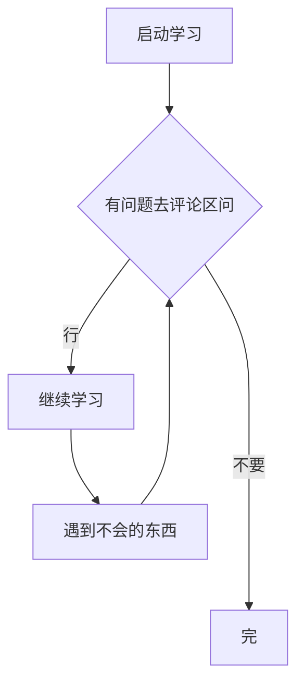

> 本篇文章以FDP 5.2.7版本展开，其他版本我会一一做

# FDP 功能翻译与解析

## 看下去必须要的东西

1. 需要你可以进入`FDP`

2. 需要会玩`Minecraft`

3. 需要随机应变

## 功能翻译

> 没时间做了QAQ 我会尽力

### Combat战斗列表

Aimbot:自动瞄准(Range:范围 TurnSpeed:转头速度 FOV:角度 OnClick:你点击的时候才瞄准 Jitter:瞄准时抖动)

AutoArmor:自动穿护甲(MaxDelay:最大延迟 MinDelay:最小延迟 InvPoen:手动打开背包穿护甲 Simulateinventory:假装打开背包 NoMove:不移动 ItemDelay:物品延迟 Hotbar:一起穿护甲)

AutoBow:自动弓

AutoClicker:自动点击(MaxCPS:最大点击次数 MiNCPS:最小点击次数 Right:右键点击 Left:左键点击 Jitter:点击时抖动)

AutoLeave:自动离开(Health:生命值 Mode:模式 Quit:退出 InvaildPacket:虚拟内存 SelfHurt:自己扣血 IllegalChat:非法聊天)

AutoPot:自动药水(Health:生命值 Delay:延迟 Openinv:手动打开背包 Mode:模式 Normal:普通 Jump:跳跃 Port:端口)

AutoSoup:自动喝汤(Health:生命值 Delay:延迟 Openinv:手动打开背包)

AutoSword:自动拿出最好的剑(攻击敌人时)

BowAimBot:攻击自动瞄准(Silent:沉默 Predict:预判 TatgetMode:射箭模式 Distance:距离 Direction:方向)

Criticals:刀刀暴击(Type:类型 Packet:暴力模式 NoGround:不暴击地面的 Hop:大跳 Jump:普通跳跃 LowJump:跳远 Delay:延迟)

FastBow:快速射箭(Mode:模式 Vanilla:快速 MineSecute:矿场？)

HitBox:击中的盒子(Size:尺码)

Ignite:自动打火石

Killaura:杀戮光环(MaxCPS:最大点击次数 MiNCPS:最小点击次数 HurtTime:受伤时间 Range:范围 RangeSprintReducement:还原奔跑距离 Prioriry:优先权 Health:生命值 Distance:距离 Direction:方向 TargetMode:杀戮模式 Single:最近的玩家 Switch:一直打某个玩家知道打不到或者死为止 Multi:攻击多个玩家 MultiMode:多个玩家的模式 Vanilla:快速 NCP:反作弊名称 Throughwalls:可以打到墙外的人 Swing:显示动作 KeepSprint:保持疾跑 AutoBlock:自动防砍 BlockRate:防砍几率 AAC:AAC反作弊模式 RayCast:攻击线连着的玩家 RayCastIgnored:不打射线连的玩家 LivingRayCast:攻击线连着的生物 Predict:预测 NoinvAttack:打开背包不攻击 NoinvDelay:打开背包不攻击的延迟 FailRate:失败速度？ MaxTurnspeed:最快转头速度 MinTurnspeed:最慢转头速度 RandomCenter:随机中心 Fov:角度 Mark:记号 FakeSharp:伪锋利)

Legitaura:自动瞄准但会自动点击(MaxCPS:最大点击次数 MiNCPS:最小点击次数 Range:范围 TurnSpeed:转头速度 HitBox:击中的盒子)

NoFriends:没有朋友

SuperKnockback:超级击退

TNTBlock:TNT自动格挡(Fuse:保险时间 AutoSword:自动拿出剑)

Teleporthit:TP攻击需要你手动打玩家

Trigger:玩家在你的准星上和你的攻击距离范围内点击(MaxCPS:最大点击次数 MiNCPS:最小点击次数)

Velocity:防击退(Horizontal:水平防击退 Vertical:垂直防击退 Mode:模式 Simple:简单的

 AAC:AAC反作弊模式 AACPush:AAC反作弊模式2 Jump:跳跃 Reverse:反向就是别人打你你不来要后退的但是这个模式会帮你向前 Reverse2:和刚刚那个一样 Glitch:差错 ReverseStrength:方向击退强度 Reverse2Strength:方向击退强度模式2的)

### Player玩家列表

AntiCactus:无视仙人掌的伤害。

AutoRespawn:自动帮你重生。

AutoTool:自动选择最好的攻击与你挖掘的方块所对应的工具。

Blink:瞬移 (按下时脱离实体 移动到指定地方时关闭即可)。

Eagle:到方块边缘时潜行。

FarmKingBot:自动操作FarmKingBot小游戏。

FastUse:快速使用。

InventoryCleaner:快速清理没用的物品。

NoFall:无视掉落伤害

PotionSaver:药水保护？不明。

Reach(build48):增加你挖掘方块距离与攻击距离。

Regen:快速回复你的生命值。

Zoot:取消Debuff。

### Movement 动作列表

AirJump:允许你在空气中跳跃。

AirLadder:爬梯子的时候不会受到远程伤害。

AutoWalk:自动向前行走。

BufferSpeed:在某方块上面加速。

BugUp:虚空回弹。

FastClimb:快速爬梯子。

FastSlabs:加速行走(平面行走)

FastStairs:加速上楼梯和台阶。

Fly:飞行。

Freeze:鬼畜转头,存才意义不明。

Glide:滑翔，在空气中MotionY。

HighJump:增加你的跳跃高度。

IceSpeed:在冰方块上面会增加移动速度。

InventoryMove:允许你打开背包物品栏的时候行走。

LadderJump:你触及梯子方块的时候会高跳。

LiquidWalk:水上行走。

LongJump:长跳。

NoClip:无视重力,并且可以穿墙。

NoSlow:取消使用物品时的减速。

NoWeb:取消你在蜘蛛网行走时的减速。

Parkour:当你在方块边缘的时候会跳跃。

ReverseStep:快速下台阶。

SafeWalk:你在方块边缘行走时不会下落。

SmileJump:在史莱姆方块上面跳跃。

Sneak:发送数据包让你潜行。

SnowSpeed:在雪方块上面获得加速。

SnowWalk:在雪方块上面行走。

Speed:加速。

Sprint:保持疾跑。

Step:自动上坡。

Strafe:让你的动作更加灵活,允许你在空中移动。

WallClimb:爬墙。

WallGlide:墙边滑翔。

WallSpeed:墙边加速。

WaterFly:在水上增减你的Y。

WaterSpeed:在水上加速。

WebWalk:在蜘蛛网上面行走。

### Render显示列表

AntiBlind:无视失明Debuff造成的视觉影响。

BlockESP:使某方块高亮显示。

BlockOverlay:玩家准心所指的方块将会高亮显示。

Breadcrumbs:你走过的地方会留下一条线。

CameraClip:隔墙看到玩家的装备与动作。

Chams:透过方块看见实体。

ClickGUI:GUI菜单。

ESP:透视实体。

FreeCam:灵魂出窍,变为一个独立实体可飞行移动,用于观察。

Fullbright:夜视。

HUD:HUD菜单。

ItemESP:透视物品。

NameTags:名字标签放大。

NoBob:没有手臂摇晃。

NoFov:没有视角影响。

NoScoreboard:关闭计分板显示。

NoSwing:没有攻击动作。

Projectiles:显示抛物线。

RemoteView:让你使用某玩家的视角观察。

SiwtchAnimation:其他攻击动作。

Tracers:在实体与你之间显示一条线。

TrueSight:显示隐身的实体。

Xray:透视矿物。

### World世界列表:

AutoBreak:破坏准星所指向的方块。

ChestAura:自动打开周围的箱子。

ChestStealer:自动取出箱子内物品并关闭箱子。

CivBreak:点击一个方块一下后会持续破坏所点方块。

FastBreak:加速破坏方块。

FastPlace:加速放置方块。

Fucker:自动破坏某方块。

Scaffold:自动搭路。

Timer:变速齿轮。

Tower:向上搭方块。

### Misc杂项列表:

AntiBot:KillAura不攻击服务器假人。

AtAllProvider:将一个命令同时执行多次。

AllControllerControl:使用别的控制器？不明

LiquidChat:水影IRC聊天，需要连接服务器。

MidClick:鼠标中键点击添加好友。

NameProtect:将你的ID字符串改为其他的。

NoRotateSet:无视摇头动作,不推荐开启。

Spammer:自动刷屏。

Teams:不攻击同队伍的玩家。

### Exploit漏洞列表:

AbortBreaking:保存方块挖掘进度。

AntiHunger:无视饥饿Debuff。

BedGodMode:你在床上睡觉时无法被攻击。

CommandSign:指令牌子。

ConsoleSpammer:在服务器后台发送大量垃圾信息。

Damage:给你自己受到伤害。

EmptyMessage:在聊天框内发送一个空格。

ForceUnicodeChat:强行发送聊天。

Ghost:允许你在死后可以做某些动作。

GhostHand:隔墙接触实体/隔墙破坏方块。

GodMode:在AAC服务器内无敌。

ItemTeleport:TP拾取物品。

KeepContainer:打开一个箱子后让箱子的动画一直是打开的动画。

Kick:将你自己踢出服务器。

MoreCarry:发送垃圾数据包卡服。

MultiActions:允许你同时进行多个动作。

NoPirchLimit:没有高音限制。

Paralyze:使延迟玩家瘫痪。

Phase:穿墙。

PingSpoof:延迟欺骗。

Plugins:显示你当前所在服务器的插件。

Teleport:传送。(目前不可用了

VClip:提升Y的高度。

VehicaleOneHit:意义不明