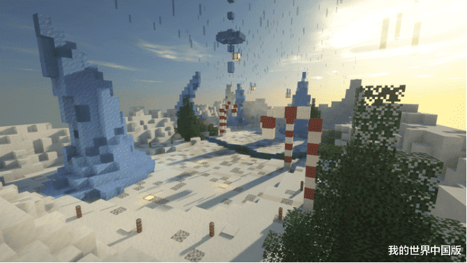

 

# FDP使用方法:

[这个是FDP下载网站(github)](https://github.com/skiddermc/fdpclient/releases)不稳定（时不时断联）

[FDP的介绍网站](https://fdpinfo.github.io)

配置文件使用方法：FDP进入游戏 打开聊天栏 输入 `.cfg` 然后空格 TAP3次 输入配置名字

配置文件放到`.minecraft\FDPCLIENT-1.8\configs`

`ALt`是编辑键位的按键

`RShift`用于打开`GUI`

里面的功能你来用谷歌翻译就可以了

但是`4.6.5`版本是最后支持中文的版本也是最后一个大包的版本 

`5.0.0`版本不建议使用BUG过多

`5.1.5`本人在5.2.0内存修复之前只用这个原因在下面

> `5.2.0`存在着严重的内存泄露问题
> 
> 我的电脑是4GB内存
> 
> 但是这个`5.2.0`版本硬生生给我吃了`3.5GB`
> 
> 甚至还要吃我的虚拟内存（卡）
> 
> 注：之前的版本最大占用`2GB`
> 
> 所以在作者修复这个问题之前我都不用`5.2.0`版本做配置
> 
> `2023/1/30 22:11`

下面的站点我提供`4.6.5到5.2.7`版本和各种 ~~优化`mods`~~暂未找到合适的

如果你不会用mod的话那就需要去学习一下了

# 

## FDP 全版本整合下载

[下载](https://pvphack.lanzoue.com/b031qw4wj)

> 访问密码： `h950`

## FDP发布日志

和[FDP github](https://github.com/SkidderMC/FDPClient/releases)同步

### V5.3.0

**一定要用最新版的！**

```bash
[=] hypixel绕过
     + 旧的 hypixel 火球飞
     * 更新了 hypixel gop
     + hypixel velo
     + hypixel 标志 nofall（旧？）
[=] vulan 绕过
     + 地速
     + 蜘蛛
     + 冲刺禁用器
     + 抗癌药
     + 更好的火神伤害飞行
[=] 更好的 killaura
     + 点击选择
     + 旋转延迟
     / 修复保持方向
     + 合法的，延迟的，旧的自动封锁
     + 分离 killaura 选项
[+] 重写超级击退
[*] 新的跳弓模式
[*] 更好的自动点击
[+] 更好的速度（取消速度选项、反向速度选项、矿工速度）
[*] 向后脚手架旋转固定
[+] 3.3.12 fly 重新添加
[*] 解补丁 blocksmc 步骤

[*] 气梯重命名为快速梯
[/] aac bhops合并为一种模式
[+] 自动杆
[+] BlinkUtils，更好的数据包缓存（更少的标志！）
[*] 修复 Killaura Raycast / Range Calculate
[*] 修复脚手架 NPE
[*] 修复 Disabler 无法正常工作的问题
[*] 修复计步器不重置的问题
[*] 修复 sprint 在不使用时发送数据包

[+] 一键点击gui
[+] 聊天增强
[+] 更好的 JumpCircle```

**完整更新日志**：https://github.com/SkidderMC/FDPClient/compare/v5.2.7...v5.3.0
```

#### **再次修复 Killaura**

[=] 更好的 JumpCircle  
[+] ChatEnhance  
[+] hypixel fireball fly  
[=] 修复冲刺模块错误  
[=] 修复步骤不重置计时器  
[-] 禁用回溯  
[+] vulcan jesus  
[+] ncplatest criticals

### v5.2.6 重要的

修复 Killaura 在 v5.2.5 上仍然无法正常工作  
修复 TickEvent 在 1 tick 中调用多次

**有人打滑了一个重复且完全无用的 Disabler，已移除**

### v5.2.5 发布

- [+] 禁用模式：
  - [+] 火神扫射
  - [+] 无旋转
- [+] StrafeFix 模块
- [+] 重写 Sprint & Strafe 模块
- [+] 转换NoClickDelay模块
- [+] BowAura 模组
- [+] 非法物品模块
- [+] 更新回溯模块
- [+] ViaVersionFix 模块
- [=] 修复 Killaura 选项：
  - [=] 光线投射
  - [=] 扫射
  - [=] 目标选择
- [=] 修复 GUI 而不是 AntiForge
- [=]修复传送位置
- [=] 修复速度模式：
  - 火神跳
  - 合法的
  - HypixelHop
- [=] 更好的 Noslow 模块
- [=] 修复 MovementUtils Strafe
- [=] 修复 FallingPlayer 计算
- [=] 修复 Mixin 问题
- [=] 修复 Pojav 崩溃问题
- [=] 固定滑块不使用彩色矩形
- [+] 添加自定义客户端品牌按钮
- [+] 添加禁用资源包修复按钮
- [+] 添加返回图标
- [+] 添加了 ServerSwitcher 按钮 GUI
- [+] 新的 targethuds stitch 和 chill lite
- [+] 新旁路
- [-] 删除无用的旁路/混合

### v5.2.0

- Bypass:  
  [+] Disabler - Legitfix, Boat(RektSky Old Verus Full BlocksMC), HeirteirAC, PacketInvalid, GroundConvert  
  [=] Disabler now can enable multiple modes at once  
  [-] Disabler - Old Kauri, Old Matrix
  
  [+] Fly - Vulcan Damage, BuzzTest, Blockdrop  
  [=] Fly Mode simplification / rename  
  VerusBoost1,2,3 = VerusBoost  
  VerusJump1,2 = VerusJump  
  Vulcan = VulcanClip  
  Vulcan2 = VulcanFast  
  Vulcan3 = VulcanGhost
  
  [-] Fly - Minemora
  
  [+] Longjump - Boost, Medusa, NCP latest, NCP Latest, Vulcan
  
  [+] Speed - VulcanLowHop, OldMineplex  
  [=] Speed - Update AACground, HypixelHop  
  [-] Speed - AACground2, AACHop4.3.8, Boost, Frame, LegitLowHop, RedeskyGround, Vulcan 2
  
  [=] NoSlow separate bypass for sword, eat, bow option
  
  [+] Blocks MC step  
  [+] Update Aimbot + more options to bypass  
  [=] Update Jesus - Medusa, Vulcan  
  [=] Update Sprint  
  [=] Update Airjump  
  [=] Update hypixel bowjump bypass  
  [=] Update simple velocity  
  [=] Update eagle
  
  [-] Old Velecity

- Modules:  
  [+] PotionSpoof Module  
  [+] PlayerFake Module  
  [+] NoC0F Module  
  [+] Trails Module  
  [+] Skeletal Module  
  [+] BackTrack Module  
  [+] Hotbar New Styles  
  [+] Element - Indicator  
  [+] TargetHUD - Tenacity 5  
  [=] Damage indicator Improvements  
  [=] Font Loading Fix  
  [=] NoClickDelay Fix  
  [=] ESP2D outline Fix  
  [=] Liquidbounce+ Gui Crash Fix  
  [=] Tracer Update  
  [=] Updates in KillAura Rotations And Others  
  [-] ClickGUI Grey/Glow  
  [+] c.l.o.c.k.

- Other:  
  [+] Boat Fly - Motion , Velocity , Clip  
  [+] Command - .IGN CopyName / TpCommand (TeleportCommand)  
  [+] Memory Fix  
  [=] Rewrite Longjump system  
  [=] Rewrite Jesus system  
  [+] unstable bypass warning  
  [+] Better WorkSpace

- `内存泄露之王Novo`都没你吃的多

### v5.1.5

[+] 发光/阴影支持更多元素（targethuds 和文本元素）  
[+] ClickGUI 风格 Bjur  
[+] ClickGUI 风格灰色  
[+] ClickGUI 风格轻微  
[+] 添加模块 AutoGG  
[+] 添加 PacketFix 模块  
[+] 更新按钮添加模块 (RGBRounded/Wolfram)  
[+] 更新 Criticials  
[+] 更新 MurderDetector  
[+] 更新 AutoClicker (Mode Gaussian)  
[+] 更新速度添加新的 NCP 模式  
[+] 更新 JumpCircles 模块  
[+] 添加 Moon TargetHUD  
[+]更新 ESP2D 添加 Outline Font  
[+] new mixins/fix optifine debug  
[+] element indicators  
[+] KugouMusicAPI  
[-] Useless Bypass  
[=] 更新 zh-cn 翻译（中文）  
[=] 修复了 chill TargetHud  
[=] 修复了 HurtCam 模块  
[/] 更好的工作空间

### v5.1.0

[+] 优化主菜单  
[+] ClickGUI 风格 Tenacity  
[+] ClickGUI 风格 Jello  
[+] ClickGUI 风格 Glow  
[+] ClickGUI 风格 LB+  
[+] 添加 NoClickDelay 模块  
[+] 添加登录命令  
[+] 添加 FightBot 模块  
[+ ] 添加了 ToggleSprint 模块  
[+]添加了 PespectiveMod 模块 [+] 添加  
了更新按钮模块 / Hyperium/Badlion/RGB  
[+] 更新名称标签添加模式附魔  
[+] 更新脚手架新计数器  
[+] 添加了新旁路  
[+] 修复了 JumpCircles 模块  
[+] 修复了 SuperHeroFX 模块  
[+] 修复了一些 mixin  
[=] 其他错误修复  
[=] 具有色度和新翼选项的翼模块 v2  
[=] 修复了 5.0b 的崩溃  
[=] 我们修复并放置了当前遗留的 liquidbounce b74  
抱歉让您久等了

### v5.0.0

[+] 新主菜单/选项更改主菜单（HUD 模块）  
[+] 添加 ClickGUI 风格经典（下拉）  
[+] 更新 ClickGUI 风格 Light  
[+] TargetHud 风格 Rise 6.0  
[+] TargetHud 风格 Bar  
[+] TargetHud 风格SparklingWater  
[+] TargetHud 样式 OldExhibition  
[+] 更新 DiscordRPC  
[+] 添加了 NoGuiClose 模块  
[+] 添加了 PacketDebugger 模块  
[+] 添加了 CustomHotbar 模块  
[+] HotBar 样式 LB/LB+/FDPCN/RISE  
[+] 添加了 JumpCircles 模块  
[+ ] ] 更新 KeyStrokes 添加样式 Juul  
[+] 更新 KeyStrokes 添加样式 Jello  
[+] 更新 ArrayList 添加文本 Alpha  
[+] 更新 Armor Element  
[+] 添加通知样式 Intellij  
[+] 添加通知样式 Tenacity  
[+] 在元素中发光颜色  
[+] 更新 ResetVL 添加选项  
[+] 更新 KillAura Jello Mark  
[+] 更新一些模块  
[+] 新字体  
[+] 新旁路矩阵  
[-] KeyPearl模块  
[-] 观察命令  
[-] 创意命令  
[-] TheAltening  
[ *] KeyBindManager 修复  
[* ] 优化 Jar 大小  
[ *] 更好的视觉效果  
[* ] 其他错误修复

### v4.6.5

[+] 添加了新的 ClickGUI 样式（NotFinished）  
[+] 添加了新的 TargetHUD 样式（WaterMelon/NewTenacity）  
[+] 添加了匹配命令（根据另一个模块状态切换模块）  
[+] 添加了 AirJump 模块  
[+] 更新了 FollowTargetHUD 模块  
[+] 更新 DiscordRPC 模块添加 ShowName 选项  
[+] 添加 Verus Float Speed  
[+] 添加更新速度 HypixelGroundSpeed [+]  
添加更新速度 Verus LowHop  
[+] 添加更新速度 VerusHop  
[+] 添加更新速度 MatrixHop2 GroundStrafe  
[+] 更新Fly 添加 Matrix Flag Mode  
[+] Update Phase 添加模式 Matrix  
[+] 更新 Nofall 更好的 Matrix  
[+] 更新 AutoJump ( Scaffold(Not KeepY) )  
[+] 更新脚手架（疯狂塔（motionTP2））  
[!] 将 AutoBow/AutoPot/AutoSoup/AntiFireBall 移动到 AutoBot 模块  
[/] 简化主菜单/修复黑暗模式  
[=] 更好的日语翻译  
[=] 修复经典通知样式的差距  
[=] 更好的工作空间

### v4.6.0

[+`]` 添加了新的通知样式  
[+] 添加了主题命令  
[+] 添加了新模式 Server Crasher  
[+] 添加了 blocksmc fly  
[+] 在 ui 中添加了 HudShadows 模块/  
[+] 添加了按钮阴影  
[+] 添加了 Verus Float Speed  
[+] 添加了 NCPLatest Speed  
[+} 添加了 Hypixel Speed  
[+] 添加了 Karhu TP  
[+] 添加了 AAC5 LongJump  
[+] 添加了 vulcan nofall 2  
[+] 添加了 packet antivoid  
[+] 添加了 matrix low hop  
[+] 添加了 hypixel low hop  
[+] 添加了合法的 lowhop 修复  
[+] 添加了 pika death tp automator（传送模式）  
[/] 修复了 Targethud 动画

### v4.5.5a

[+] OnlyThirdPerson BreadCrumbs   

[+] HyCraft Crash Disabler  

[=] 脚本 API :   

-> 通知 | Notifications.create("Example Title","Example String","info", 1000)   

-> MovementUtils , PacketUtils , InventoryUtils  

[=] 固定语言错误   

[=] 旧式通知（进行中）   

[+] 许可证现已保存 在资源 中并提取到 fdp 文件夹中

[+] 旧的通知样式（已知错误包括没有 bg alpha 和错误的颜色） v4.5.5b 修复了崩溃  

### v4.5.0

[+] TargetHUD 新样式：What/Exhibition/Rice/Remix/Chill/Slowly // 从 LB+ 移植的 targethuds  
[+] 新矩阵 fly  
[+] intave bhop  
[+] 新 ClickGUI  
[+] fakename 命令  
[+] ResetVL 模块  
[+] 新歌曲模块  
[+] MultiActions 模块  
[+] killaura 新标记圆圈和平台  
[+] 重新添加圆形按钮 (fdpclassic)  
[+] 新 Bypasses Matrix/NCP  
[=] 修复实体渲染错误  
[=] 修复并更新 nameprotect  
[=] 修复和更新目标strafe  
[=] 添加一些翻译修复（更多需要）  
[=] 添加自定义速度选项  
[=] 向 matrix661 添加 premotion 选项  
[=] 使用选项更新 matix boost-fly  
[=] 更新装甲元素  
[-] 移除 bs_uuid

### v4.4.5

[+] discord RPC 控制模块  
[+] 2DESP 模块 LB+/hat 和一些东西  
[+] AirLadder 模块  
[+] Pojav 分支  
[+] 更新 Fly HyCraft Fly（如果滞后再次使用它）  
[+] Chest 库存中的按钮stealer/killaura/invcleaner  
[+] Spoofer UUID  
[+] 连接命令  
[+] UUID 命令  
[+] BowJump 模块  
[+] AntiVanish 模块  
[+] 从客户端删除了所有 unlegitmc 实例  
[+] 新的绕过/修复了一些错误

### v4.4.0

[!!!] 此更新由大部分 UnlegitMC 和贡献者 FDP 和 LB+ 制作

[+] 优化/大小 -30 MB FDP 现在为 10 MB  
[+] 所有 ClickGUI 中的滚动模式  
[+] 字体更改/现在更好  
[+] 更新 HUD 新阴影模式/新颜色/其他选项/  
[+] 更新 KillAura 排序modes -> HurtTime（玩家的受伤时间），HealthAbsorption（带吸收效果的总生命值），RegenAmplifier（再生效果的放大器）。  
[+] 更新 Fucker -> ignoreFirstBlock 模式/渲染模式/冷却  
[+] 更新动画 -> noBlockParticles 模式  
[+] 更新 Nametags 新选项  
[+] 其他模块的新更新/  
[+] 添加了 GlowESP 模块  
[+] 添加了 Nuker模块  
[+] 添加了 AntiExploit 模块  
[+] 添加了 PackSpoofer 模块  
[+] 添加了 superheroFX 模块，例如 LB+ 制作的 ZeroDay / 风格  
[+] 添加了 KeyPearl 模块  
[+] Zywl 的效果元素重制  
[+] 更新装甲元素  
[+] 修复崩溃和更多错误  
[+] 其他我没有的东西记住（模块/旁路）