> 仅用来探讨技术和学习
> 
> 下载学习之后请24小时内删除

# Navicat Premium 15破解

**Navicat Premium 15** 可以真正被激活 **16**版本似乎有点难

> ## Navicat Premium介绍

**Navicat premium**是一款数据库管理工具，可以连接多个数据库。它允许您用一个程序同时连接到 `MySQL`、`SQLite`、`Oracle` 和 `PostgreSQL` 数据库，从而更方便地管理不同类型的数据库。

`Navicat Premium 15` ，工具是**收费**的，因为学习买的话，不怎么划算，所以这里有修改版的。

软件界面：

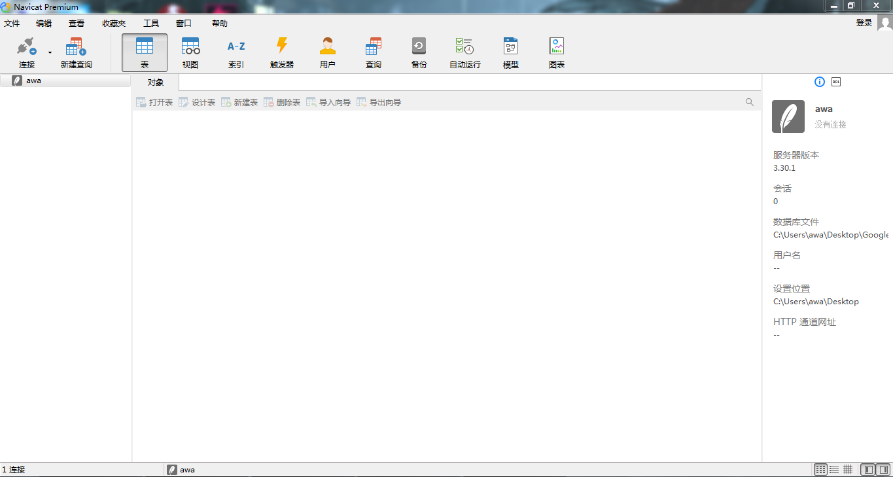

> ## 安装包和破解工具

`Navicat premium 15`安装包和破解工具

> [蓝奏云](https://kkdaj.lanzoui.com/ic03rbi)
> 
> 访问密码：无

> ## 开始安装

下载好后首先安装 `Navicat Premium 15` ，一路下一步就完了。

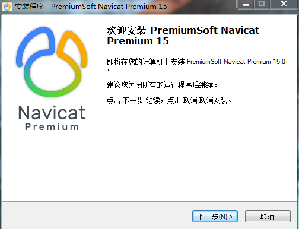

> ## 开始激活  激活必须断网

1. 使用注册机，先退出所有杀毒软件，再打开注册机。

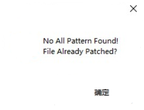

2. 在激活工具的第一个选项`1)Patch`里选择`Backup`，`Host`

3. **Navicat** 是`15`版本就选`15`版本

4. 点击，`Patch`按钮

如图：

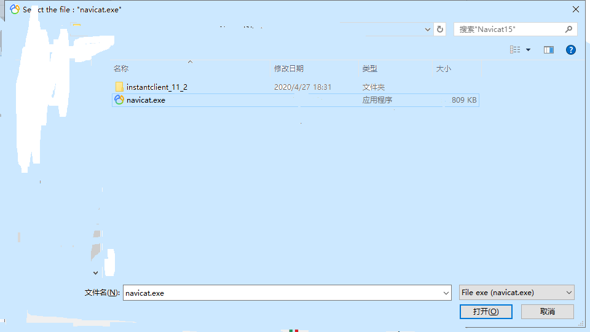

**以下提示说明Patch成功了。**

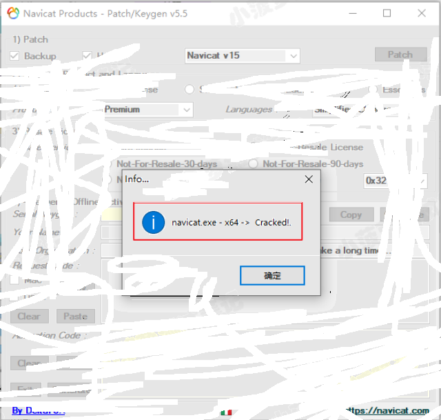

3. **Language**

`License`里选中`Enterprise`、在`Produce`里选`Premium`、在`Languages`里选`Simplified Chinese`(简体中文)

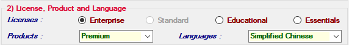

4. **Resale License**

选择`Site License`

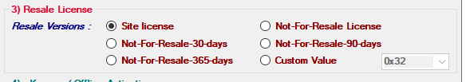

5. `Keygen / Offline Activation`

点击`Generate`按钮就会生成一个许可证秘钥，将许可证秘钥复制后就打开`Navicat Premium 15`

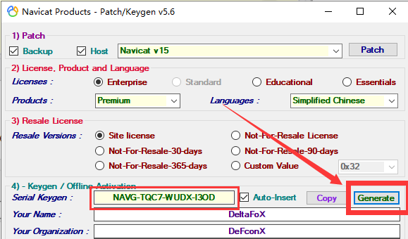

6. **打开`Navicat Premium 15`，点击注册**

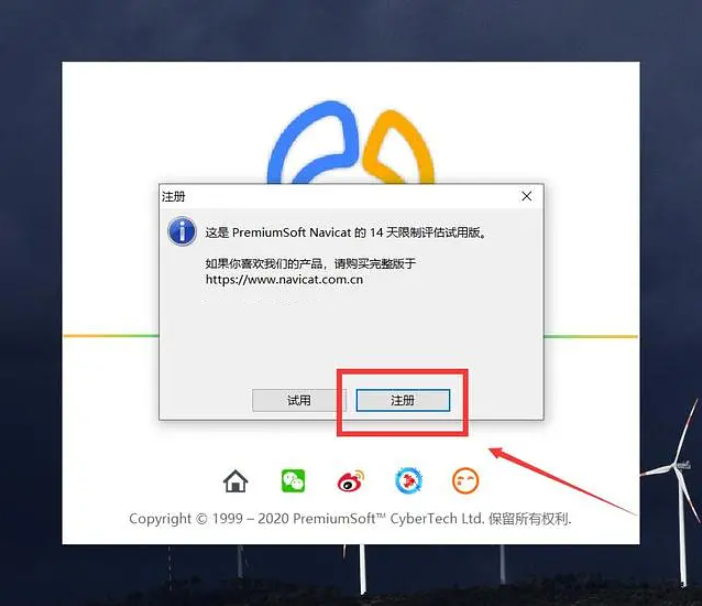

7. **粘贴秘钥，然后点击激活按钮**

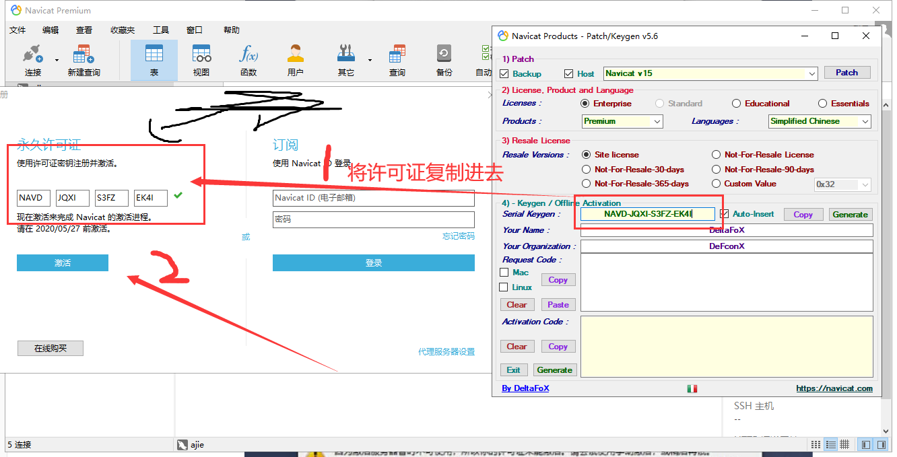

**在弹出的界面选择手动激活**

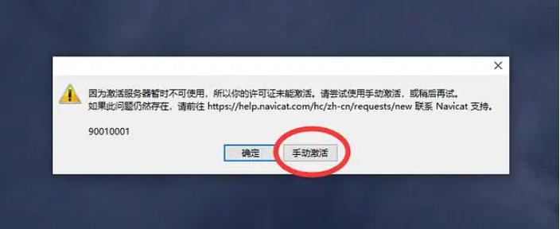

8. 将请求码粘贴到注册机`Request Code`框中（完整过程看图）

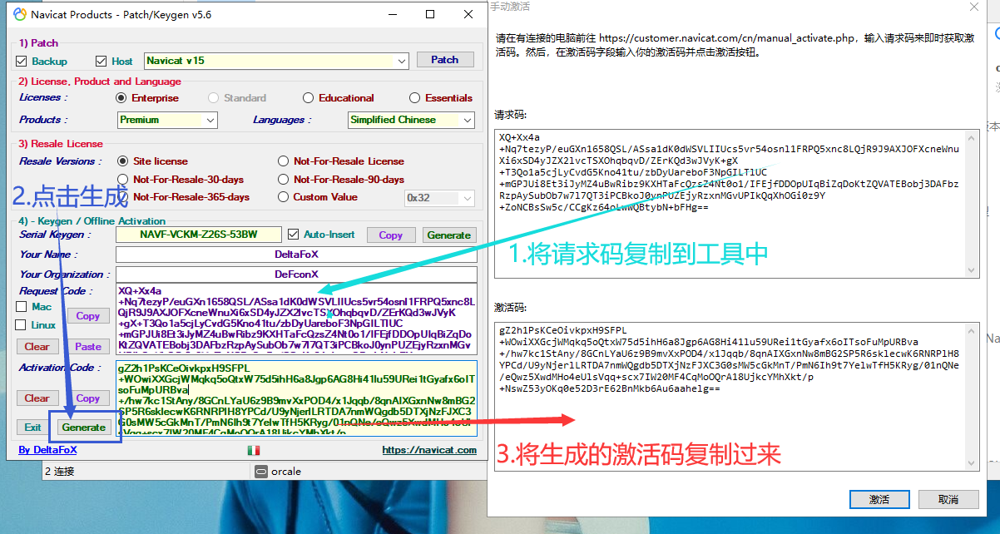

9. 点击激活页面的激活弹出（说明激活成功）

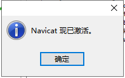

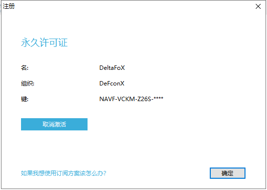

> 激活成功了 如果经济允许，还是希望可以支持正版！！！
> 
> 附上购买地址`http://www.navicat.com.cn/download/navicat-premium`