# 电脑桌面系统安装

> 本期的博客较长请加载完毕食用。

你是如何去应对[电脑](https://baike.baidu.com/item/%E8%AE%A1%E7%AE%97%E6%9C%BA/140338)系统的损坏的原因包括但是不限于，例如（[电脑病毒](https://baike.baidu.com/item/%E8%AE%A1%E7%AE%97%E6%9C%BA%E7%97%85%E6%AF%92/174112)，[流氓软件](https://baike.baidu.com/item/%E6%B5%81%E6%B0%93%E8%BD%AF%E4%BB%B6/402102)，恶意挂端）可以在下面评论区发表自己的想法。

**本篇适用范围但是不局限于此：**

- [x] 救助[C盘](https://baike.baidu.com/item/C%E7%9B%98?fromModule=lemma_search-box)文件（只能抢救一下文件）

- [ ] 维持系统原型（只能使用[还原点](https://baike.baidu.com/item/%E8%BF%98%E5%8E%9F%E7%82%B9?fromModule=lemma_search-box)或者[影子系统](https://baike.baidu.com/item/%E5%BD%B1%E5%AD%90%E7%B3%BB%E7%BB%9F/6721970)本文重新安装操作并不能百分百还原）

- [ ] 帮亲戚修理（建议别不然亲戚会持续找你解决问题，除非你可以忍受）

- [x] 帮助朋友（朋友嘛必须帮!）

- [x] 对现有的臃肿系统不满（C盘1GB了QwQ）

- [x] [驱动](https://baike.baidu.com/item/%E9%A9%B1%E5%8A%A8/2765136?fromModule=lemma_search-box)兼容性问题（[蓝屏](https://baike.baidu.com/item/%E7%94%B5%E8%84%91%E8%93%9D%E5%B1%8F?fromtitle=%E8%93%9D%E5%B1%8F&fromid=402002&fromModule=lemma_search-box)）

- [x] [虚拟机](https://baike.baidu.com/item/%E8%99%9A%E6%8B%9F%E6%9C%BA?fromModule=lemma_search-box)安装系统（测试中）

- [x] 因为运行了[2345](https://baike.baidu.com/search/none?word=2345&pn=0&rn=10&enc=utf8&fromModule=lemma_search-box)流氓软件全家桶被注入[恶意程序](https://baike.baidu.com/item/%E6%81%B6%E6%84%8F%E7%A8%8B%E5%BA%8F/411166?fromModule=lemma-qiyi_sense-lemma)了的情况

- [x] 想要降级系统 （例如[win10](https://baike.baidu.com/item/Windows%2010?fromtitle=win10&fromid=10936225&fromModule=lemma_search-box)降级[win7](https://baike.baidu.com/item/Windows%207?fromtitle=win7&fromid=7733225&fromModule=lemma_search-box)）

- [x] 想要在[Macos系统](https://baike.baidu.com/item/macOS?fromModule=lemma_search-box)的基础上添加windows（[M1处理器](https://baike.baidu.com/item/Apple%20M1/54366978?fromModule=search-result_lemma)和[英特尔处理器](https://baike.baidu.com/item/intel%E5%A4%84%E7%90%86%E5%99%A8/2157617?fromModule=search-result_lemma)）

- [x] 纯粹当[极客](https://baike.baidu.com/item/%E6%9E%81%E5%AE%A2/3683808?fromModule=lemma-qiyi_sense-lemma)

**[影子系统](https://baike.baidu.com/item/%E5%BD%B1%E5%AD%90%E7%B3%BB%E7%BB%9F/6721970)影子系统适用于（32位/64位）：Win10/Win8.1/Win8/Win7/XP**

**⒉硬件要求**

新版的影子系统已经有很强的兼容性，使用影子系统没有特殊的[硬件](https://baike.baidu.com/item/%E7%A1%AC%E4%BB%B6/479446?fromModule=lemma_inlink)要求。

建议配置：[CPU](https://baike.baidu.com/item/%E4%B8%AD%E5%A4%AE%E5%A4%84%E7%90%86%E5%99%A8/284033?fromModule=lemma_search-box&fromtitle=CPU&fromid=120556)（不是[CUP](https://baike.baidu.com/item/%E7%BD%A9%E6%9D%AF?fromModule=lemma_search-box) QwQ） 的速度为 `133 MHz` 或更高，[内存](https://baike.baidu.com/item/%E5%86%85%E5%AD%98?fromModule=lemma_search-box)容量：`128 MB` 以上

安装影子系统需要 `20 MB` 硬盘空间，建议系统分区的剩余空间在 `256 MB` 以上。

**⒊安装步骤**

运行下载的[安装程序](https://baike.baidu.com/item/%E5%AE%89%E8%A3%85%E7%A8%8B%E5%BA%8F?fromModule=lemma_search-box)，然后点击界面右下角的"下一步"。如果下载的是安装程序的[压缩包](https://baike.baidu.com/item/%E5%8E%8B%E7%BC%A9%E5%8C%85?fromModule=lemma_search-box)，需要先解压，然后再运行[解压](https://baike.baidu.com/item/%E8%A7%A3%E5%8E%8B%E7%BC%A9/2471723?fromModule=search-result_lemma)出来的[安装](https://baike.baidu.com/item/%E5%AE%89%E8%A3%85/484093?fromModule=lemma_inlink)程序。

点击"我接受此协议"，等待片刻软件便安装完成。

重启电脑后便可以使用影子系统。

[**还原点**](https://baike.baidu.com/item/%E8%BF%98%E5%8E%9F%E7%82%B9?fromModule=lemma_search-box)为[Windows](https://baike.baidu.com/item/Microsoft%20Windows/3304184)自带

## 第一步：ISO下载（最为重要的过程没有这个ISO就没有后面）

### BT下载方式

~~这似乎比电骡快，但是本人正在寻找[做种](https://baike.baidu.com/item/%E5%81%9A%E7%A7%8D/10961370)方法，我玩过[PT下载](https://baike.baidu.com/item/pt%E4%B8%8B%E8%BD%BD?fromModule=lemma_search-box)但是没有上传过[BT种子](https://baike.baidu.com/item/BT%E7%A7%8D%E5%AD%90?fromModule=lemma_search-box)QwQ。~~

我已经钻研完毕了，下载链接来喽哈哈哈哈哈

#### X64 win7 SP1

**文件名**

cn_windows_7_ultimate_with_sp1_x64_dvd_u_677408.iso

**SHA1**

`2CE0B2DB34D76ED3F697CE148CB7594432405E23`

**文件大小**

`3.19GB`

**下载链接**

```Magnet
magnet:?xt=urn:btih:RVDIVFWHDEBPX6YF2DJCJBKWQHL3ZD7G&dn=cn_windows_7_ultimate_with_sp1_x64_dvd_u_677408.iso&tr=udp%3A%2F%2Ftracker.publicbt.com%3A80%2Fannounce&tr=udp%3A%2F%2Ftracker.openbittorrent.com%3A80%2Fannounce&tr=http%3A%2F%2F198.211.31.199%3A6666%2Fannounce&tr=udp%3A%2F%2F198.211.31.199%3A6666%2Fannounce&tr=http%3A%2F%2Fbt.xpdbk.com%2Fannounce&tr=http%3A%2F%2F107.189.10.20.sslip.io%3A7777%2Fannounce&tr=http%3A%2F%2F1337.abcvg.info%2Fannounce&tr=http%3A%2F%2F207.241.226.111%3A6969%2Fannounce&tr=http%3A%2F%2F207.241.231.226%3A6969%2Fannounce&tr=http%3A%2F%2F%5B2001%3A1b10%3A1000%3A8101%3A0%3A242%3Aac11%3A2%5D%3A6969%2Fannounce&tr=http%3A%2F%2F%5B2a04%3Aac00%3A1%3A3dd8%3A%3A1%3A2710%5D%3A2710%2Fannounce&tr=http%3A%2F%2Fbt.endpot.com%2Fannounce&tr=http%3A%2F%2Fbt.okmp3.ru%3A2710%2Fannounce&tr=http%3A%2F%2Fchouchou.top%3A8080%2Fannounce&tr=http%3A%2F%2Ffe.dealclub.de%3A6969%2Fannounce&tr=http%3A%2F%2Fi-p-v-6.tk%3A6969%2Fannounce&tr=http%3A%2F%2Fincine.ru%3A6969%2Fannounce&tr=http%3A%2F%2Fipv6.1337.cx%3A6969%2Fannounce&tr=http%3A%2F%2Fipv6.govt.hu%3A6969%2Fannounce&tr=http%3A%2F%2Fnyaa.tracker.wf%3A7777%2Fannounce&tr=http%3A%2F%2Fopen-v6.demonoid.ch%3A6969%2Fannounce&tr=http%3A%2F%2Fopen.acgnxtracker.com%2Fannounce&tr=http%3A%2F%2Fopen.tracker.ink%3A6969%2Fannounce&tr=http%3A%2F%2Fp2p.0g.cx%3A6969%2Fannounce&tr=http%3A%2F%2Fretracker.hotplug.ru%3A2710%2Fannounce&tr=http%3A%2F%2Fshare.camoe.cn%3A8080%2Fannounce&tr=http%3A%2F%2Ft.nyaatracker.com%2Fannounce&tr=http%3A%2F%2Ftorrentsmd.com%3A8080%2Fannounce&tr=http%3A%2F%2Ftr.cili001.com%3A8070%2Fannounce&tr=http%3A%2F%2Ftracker.birkenwald.de%3A6969%2Fannounce&tr=http%3A%2F%2Ftracker.bt4g.com%3A2095%2Fannounce&tr=http%3A%2F%2Ftracker.dler.org%3A6969%2Fannounce&tr=http%3A%2F%2Ftracker.edkj.club%3A6969%2Fannounce&tr=http%3A%2F%2Ftracker.files.fm%3A6969%2Fannounce&tr=http%3A%2F%2Ftracker.gbitt.info%2Fannounce&tr=http%3A%2F%2Ftracker.ipv6tracker.ru%2Fannounce&tr=http%3A%2F%2Ftracker.k.vu%3A6969%2Fannounce&tr=http%3A%2F%2Ftracker.lelux.fi%2Fannounce&tr=http%3A%2F%2Ftracker.letpo.com%2Fannounce&tr=http%3A%2F%2Ftracker.mywaifu.best%3A6969%2Fannounce&tr=http%3A%2F%2Ftracker.opentrackr.org%3A1337%2Fannounce&tr=http%3A%2F%2Ftracker.qu.ax%3A6969%2Fannounce&tr=http%3A%2F%2Ftracker.skyts.net%3A6969%2Fannounce&tr=http%3A%2F%2Ftracker.srv00.com%3A6969%2Fannounce&tr=http%3A%2F%2Ftracker2.dler.org%2Fannounce&tr=http%3A%2F%2Ftrackme.theom.nz%2Fannounce&tr=http%3A%2F%2Fv6-tracker.0g.cx%3A6969%2Fannounce&tr=http%3A%2F%2Fvps02.net.orel.ru%2Fannounce&tr=http%3A%2F%2Fwepzone.net%3A6969%2Fannounce&tr=http%3A%2F%2Fwww.all4nothin.net%2Fannounce.php&tr=http%3A%2F%2Fwww.wareztorrent.com%2Fannounce&tr=https%3A%2F%2F1337.abcvg.info%2Fannounce&tr=https%3A%2F%2Fopentracker.i2p.rocks%2Fannounce&tr=https%3A%2F%2Ft1.hloli.org%2Fannounce&tr=https%3A%2F%2Ftr.abiir.top%2Fannounce&tr=https%3A%2F%2Ftr.abir.ga%2Fannounce&tr=https%3A%2F%2Ftr.burnabyhighstar.com%2Fannounce&tr=https%3A%2F%2Ftracker.foreverpirates.co%2Fannounce&tr=https%3A%2F%2Ftracker.gbitt.info%2Fannounce&tr=https%3A%2F%2Ftracker.imgoingto.icu%2Fannounce&tr=https%3A%2F%2Ftracker.jiesen.life%3A8443%2Fannounce&tr=https%3A%2F%2Ftracker.kuroy.me%2Fannounce&tr=https%3A%2F%2Ftracker.lilithraws.cf%2Fannounce&tr=https%3A%2F%2Ftracker.lilithraws.org%2Fannounce&tr=https%3A%2F%2Ftracker.loligirl.cn%2Fannounce&tr=https%3A%2F%2Ftracker.m-team.cc%2Fannounce.php&tr=https%3A%2F%2Ftracker.mlsub.net%2Fannounce&tr=https%3A%2F%2Ftracker.moeblog.cn%2Fannounce&tr=https%3A%2F%2Ftracker.nanoha.org%2Fannounce&tr=https%3A%2F%2Ftracker.tamersunion.org%2Fannounce&tr=https%3A%2F%2Ftracker1.520.jp%2Fannounce&tr=https%3A%2F%2Ftrackers.mlsub.net%2Fannounce&tr=https%3A%2F%2Ftrackme.theom.nz%2Fannounce&tr=udp%3A%2F%2F184.105.151.166%3A6969%2Fannounce&tr=udp%3A%2F%2F207.241.226.111%3A6969%2Fannounce&tr=udp%3A%2F%2F207.241.231.226%3A6969%2Fannounce&tr=udp%3A%2F%2F52.58.128.163%3A6969%2Fannounce&tr=udp%3A%2F%2F6ahddutb1ucc3cp.ru%3A6969%2Fannounce&tr=udp%3A%2F%2F9.rarbg.com%3A2810%2Fannounce&tr=udp%3A%2F%2F91.216.110.52%3A451%2Fannounce&tr=udp%3A%2F%2F%5B2001%3A1b10%3A1000%3A8101%3A0%3A242%3Aac11%3A2%5D%3A6969%2Fannounce&tr=udp%3A%2F%2F%5B2001%3A470%3A1%3A189%3A0%3A1%3A2%3A3%5D%3A6969%2Fannounce&tr=udp%3A%2F%2F%5B2a03%3A7220%3A8083%3Acd00%3A%3A1%5D%3A451%2Fannounce&tr=udp%3A%2F%2F%5B2a04%3Aac00%3A1%3A3dd8%3A%3A1%3A2710%5D%3A2710%2Fannounce&tr=udp%3A%2F%2F%5B2a0f%3Ae586%3Af%3Af%3A%3A81%5D%3A6969%2Fannounce&tr=udp%3A%2F%2Faarsen.me%3A6969%2Fannounce&tr=udp%3A%2F%2Facxx.de%3A6969%2Fannounce&tr=udp%3A%2F%2Fadmin.52ywp.com%3A6969%2Fannounce&tr=udp%3A%2F%2Faegir.sexy%3A6969%2Fannounce&tr=udp%3A%2F%2Fastrr.ru%3A6969%2Fannounce&tr=udp%3A%2F%2Fbedro.cloud%3A6969%2Fannounce&tr=udp%3A%2F%2Fblack-bird.ynh.fr%3A6969%2Fannounce&tr=udp%3A%2F%2Fbt.ktrackers.com%3A6666%2Fannounce&tr=udp%3A%2F%2Fbt1.archive.org%3A6969%2Fannounce&tr=udp%3A%2F%2Fbt2.archive.org%3A6969%2Fannounce&tr=udp%3A%2F%2Fcamera.lei001.com%3A6969%2Fannounce&tr=udp%3A%2F%2Fchouchou.top%3A8080%2Fannounce&tr=udp%3A%2F%2Fconcen.org%3A6969%2Fannounce&tr=udp%3A%2F%2Fcreative.7o7.cx%3A6969%2Fannounce&tr=udp%3A%2F%2Fcutscloud.duckdns.org%3A6969%2Fannounce&tr=udp%3A%2F%2Fdht.bt251.com%3A6969%2Fannounce&tr=udp%3A%2F%2Fepider.me%3A6969%2Fannounce&tr=udp%3A%2F%2Fexodus.desync.com%3A6969%2Fannounce&tr=udp%3A%2F%2Ffe.dealclub.de%3A6969%2Fannounce&tr=udp%3A%2F%2Ffh2.cmp-gaming.com%3A6969%2Fannounce&tr=udp%3A%2F%2Ffree.publictracker.xyz%3A6969%2Fannounce&tr=udp%3A%2F%2Ffreedom.1776.ga%3A6969%2Fannounce&tr=udp%3A%2F%2Fhtz3.noho.st%3A6969%2Fannounce&tr=udp%3A%2F%2Fipv4.tracker.harry.lu%3A80%2Fannounce&tr=udp%3A%2F%2Fipv6.69.mu%3A6969%2Fannounce&tr=udp%3A%2F%2Fipv6.tracker.monitorit4.me%3A6969%2Fannounce&tr=udp%3A%2F%2Fkokodayo.site%3A6969%2Fannounce&tr=udp%3A%2F%2Flaze.cc%3A6969%2Fannounce&tr=udp%3A%2F%2Fmail.artixlinux.org%3A6969%2Fannounce&tr=udp%3A%2F%2Fmail.zasaonsk.ga%3A6969%2Fannounce&tr=udp%3A%2F%2Fmirror.aptus.co.tz%3A6969%2Fannounce&tr=udp%3A%2F%2Fmoonburrow.club%3A6969%2Fannounce&tr=udp%3A%2F%2Fmovies.zsw.ca%3A6969%2Fannounce&tr=udp%3A%2F%2Fnew-line.net%3A6969%2Fannounce&tr=udp%3A%2F%2Fopen.4ever.tk%3A6969%2Fannounce&tr=udp%3A%2F%2Fopen.demonii.com%3A1337%2Fannounce&tr=udp%3A%2F%2Fopen.dstud.io%3A6969%2Fannounce&tr=udp%3A%2F%2Fopen.free-tracker.ga%3A6969%2Fannounce&tr=udp%3A%2F%2Fopen.publictracker.xyz%3A6969%2Fannounce&tr=udp%3A%2F%2Fopen.stealth.si%3A80%2Fannounce&tr=udp%3A%2F%2Fopen.tracker.ink%3A6969%2Fannounce&tr=udp%3A%2F%2Fopentor.org%3A2710%2Fannounce&tr=udp%3A%2F%2Fopentracker.i2p.rocks%3A6969%2Fannounce&tr=udp%3A%2F%2Fp4p.arenabg.com%3A1337%2Fannounce&tr=udp%3A%2F%2Fprivate.anonseed.com%3A6969%2Fannounce&tr=udp%3A%2F%2Fpsyco.fr%3A6969%2Fannounce&tr=udp%3A%2F%2Fpublic-tracker.ml%3A6969%2Fannounce&tr=udp%3A%2F%2Fpublic.publictracker.xyz%3A6969%2Fannounce&tr=udp%3A%2F%2Fqtstm32fan.ru%3A6969%2Fannounce&tr=udp%3A%2F%2Frep-art.ynh.fr%3A6969%2Fannounce&tr=udp%3A%2F%2Fretracker.hotplug.ru%3A2710%2Fannounce&tr=udp%3A%2F%2Fretracker.lanta-net.ru%3A2710%2Fannounce&tr=udp%3A%2F%2Frun.publictracker.xyz%3A6969%2Fannounce&tr=udp%3A%2F%2Fsanincode.com%3A6969%2Fannounce&tr=udp%3A%2F%2Fslicie.icon256.com%3A8000%2Fannounce&tr=udp%3A%2F%2Fstargrave.org%3A6969%2Fannounce&tr=udp%3A%2F%2Fstatic.54.161.216.95.clients.your-server.de%3A6969%2Fannounce&tr=udp%3A%2F%2Ft.133335.xyz%3A6969%2Fannounce&tr=udp%3A%2F%2Ftamas3.ynh.fr%3A6969%2Fannounce&tr=udp%3A%2F%2Fthagoat.rocks%3A6969%2Fannounce&tr=udp%3A%2F%2Fthemaninashed.com%3A6969%2Fannounce&tr=udp%3A%2F%2Fthouvenin.cloud%3A6969%2Fannounce&tr=udp%3A%2F%2Ftorrents.artixlinux.org%3A6969%2Fannounce&tr=udp%3A%2F%2Ftr.bangumi.moe%3A6969%2Fannounce&tr=udp%3A%2F%2Ftr.cili001.com%3A8070%2Fannounce&tr=udp%3A%2F%2Ftracker-udp.gbitt.info%3A80%2Fannounce&tr=udp%3A%2F%2Ftracker.4.babico.name.tr%3A3131%2Fannounce&tr=udp%3A%2F%2Ftracker.altrosky.nl%3A6969%2Fannounce&tr=udp%3A%2F%2Ftracker.artixlinux.org%3A6969%2Fannounce&tr=udp%3A%2F%2Ftracker.auctor.tv%3A6969%2Fannounce&tr=udp%3A%2F%2Ftracker.beeimg.com%3A6969%2Fannounce&tr=udp%3A%2F%2Ftracker.birkenwald.de%3A6969%2Fannounce&tr=udp%3A%2F%2Ftracker.bitsearch.to%3A1337%2Fannounce&tr=udp%3A%2F%2Ftracker.cyberia.is%3A6969%2Fannounce&tr=udp%3A%2F%2Ftracker.ddunlimited.net%3A6969%2Fannounce&tr=udp%3A%2F%2Ftracker.dler.com%3A6969%2Fannounce&tr=udp%3A%2F%2Ftracker.dler.org%3A6969%2Fannounce&tr=udp%3A%2F%2Ftracker.filemail.com%3A6969%2Fannounce&tr=udp%3A%2F%2Ftracker.jonaslsa.com%3A6969%2Fannounce&tr=udp%3A%2F%2Ftracker.joybomb.tw%3A6969%2Fannounce&tr=udp%3A%2F%2Ftracker.leech.ie%3A1337%2Fannounce&tr=udp%3A%2F%2Ftracker.lelux.fi%3A6969%2Fannounce&tr=udp%3A%2F%2Ftracker.moeking.me%3A6969%2Fannounce&tr=udp%3A%2F%2Ftracker.monitorit4.me%3A6969%2Fannounce&tr=udp%3A%2F%2Ftracker.openbtba.com%3A6969%2Fannounce&tr=udp%3A%2F%2Ftracker.opentrackr.org%3A1337%2Fannounce&tr=udp%3A%2F%2Ftracker.pimpmyworld.to%3A6969%2Fannounce&tr=udp%3A%2F%2Ftracker.publictracker.xyz%3A6969%2Fannounce&tr=udp%3A%2F%2Ftracker.qu.ax%3A6969%2Fannounce&tr=udp%3A%2F%2Ftracker.skynetcloud.site%3A6969%2Fannounce&tr=udp%3A%2F%2Ftracker.skyts.net%3A6969%2Fannounce&tr=udp%3A%2F%2Ftracker.srv00.com%3A6969%2Fannounce&tr=udp%3A%2F%2Ftracker.swateam.org.uk%3A2710%2Fannounce&tr=udp%3A%2F%2Ftracker.tcp.exchange%3A6969%2Fannounce&tr=udp%3A%2F%2Ftracker.theoks.net%3A6969%2Fannounce&tr=udp%3A%2F%2Ftracker.tiny-vps.com%3A6969%2Fannounce&tr=udp%3A%2F%2Ftracker.torrent.eu.org%3A451%2Fannounce&tr=udp%3A%2F%2Ftracker.yangxiaoguozi.cn%3A6969%2Fannounce&tr=udp%3A%2F%2Ftracker1.bt.moack.co.kr%3A80%2Fannounce&tr=udp%3A%2F%2Ftracker1.myporn.club%3A9337%2Fannounce&tr=udp%3A%2F%2Ftracker2.dler.com%3A80%2Fannounce&tr=udp%3A%2F%2Ftracker2.dler.org%3A80%2Fannounce&tr=udp%3A%2F%2Ftrackerb.jonaslsa.com%3A6969%2Fannounce&tr=udp%3A%2F%2Fu4.trakx.crim.ist%3A1337%2Fannounce&tr=udp%3A%2F%2Fuploads.gamecoast.net%3A6969%2Fannounce&tr=udp%3A%2F%2Fv1046920.hosted-by-vdsina.ru%3A6969%2Fannounce&tr=udp%3A%2F%2Fv2.iperson.xyz%3A6969%2Fannounce&tr=udp%3A%2F%2Fvibe.sleepyinternetfun.xyz%3A1738%2Fannounce&tr=udp%3A%2F%2Fwepzone.net%3A6969%2Fannounce&tr=udp%3A%2F%2Fwww.peckservers.com%3A9000%2Fannounce&tr=udp%3A%2F%2Fwww.torrent.eu.org%3A451%2Fannounce&tr=udp%3A%2F%2Fzecircle.xyz%3A6969%2Fannounce&tr=ws%3A%2F%2Fhub.bugout.link%3A80%2Fannounce&xl=3420557312
```

### ED2K下载

[ED2K](https://baike.baidu.com/item/ed2k/4837100)可视为[P2P下载](https://baike.baidu.com/item/P2P%E4%BC%A0%E6%92%AD/641788)链接，复制ed2k链接，打开[eMule](https://www.emule-project.com/home/perl/general.cgi?l=42)或[吸血雷](https://xl11.xunlei.com/)，新建下载，粘贴链接，开始下载。由于网络环境和下载工具的不确定性，本站不保证所有人都可以下载成功，如果失败可以更换网络或者下载工具重复尝试。下载完成后务必进行[SHA1](https://baike.baidu.com/item/SHA-1/1699692)校验（推荐使用[iHasher](https://share.weiyun.com/m4VMLcNb)）

**eMule客户端下载**

> [下载](https://pvphack.lanzoue.com/iiTdv0kdujsb)
> 
> SHA1校验码：`5524fde3425843cc5e351e642b26278240dbea7e`
> 
> 一键添加服务器 [请安装完再点](ed2k://|serverlist|http://upd.emule-security.org/server.met|/)
> 
> 最新服务器列表文件的地址：“[https://ed2k.im/server.met](https://jump.bdimg.com/safecheck/index?url=x+Z5mMbGPAspm9IPzRKCpMwrJ0k8RB3SxSRBUB9HnkPVW/wCfI4bYD/FbYrnobiAlgHIvQNUV963JolebWouG0Mz8rbRLCFdYU1b2OGECLZnwwzTVwMz+HY9qHh6BM0y)使用备用地址[https://upd.emule-security.org/server.met](https://jump.bdimg.com/safecheck/index?url=x+Z5mMbGPAuWruLu7Tco0pYT3mwTaykZC7GdJoGy7e77WSSbUptXmbm4CDnWtdTfuxoe66Oj1xRmjw1QDypwQlWrJEJcViR5l8zOb+LgnYNCBi/8mSt4yHqXO+98MiuSua0ACTid74ibkMntjBuG1jA8Zu4mdgY0)）输入到“从URL更新server.met”下方的框中，点击“更新”按钮即可。该方法不会去除列表中原有服务器。
> 
> Kad服务器链接：[请安装完再点](ed2k://|nodeslist|http://upd.emule-security.org/nodes.dat|/)
> 
> 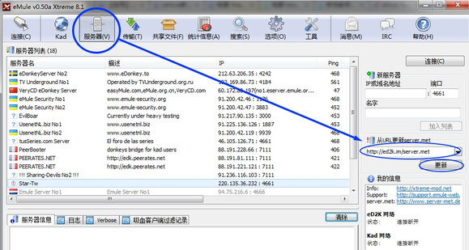

#### X64 win7 SP1

**文件名**

cn_windows_7_ultimate_with_sp1_x64_dvd_u_677408.iso

**SHA1**

`2CE0B2DB34D76ED3F697CE148CB7594432405E23`

**文件大小**

`3.19GB`

**下载链接**

```
ed2k://|file|cn_windows_7_ultimate_with_sp1_x64_dvd_u_677408.iso|3420557312|B58548681854236C7939003B583A8078|/
```

#### X86 win7 SP1

cn_windows_7_ultimate_with_sp1_x86_dvd_u_677486.iso

**SHA1**

`B92119F5B732ECE1C0850EDA30134536E18CCCE7`

**文件大小**

`2.47GB`

**下载链接**

    ed2k://|file|cn_windows_7_ultimate_with_sp1_x86_dvd_u_677486.iso|2653276160|7503E4B9B8738DFCB95872445C72AEFB|/

**声明**：本资源均来自于官方原版，与网站核对一致后再使用。所有操作系统默认均为试用版，如有正版密钥可以有效激活。

**速度：** `320KB/S` 慢也是必然的

> 以上信息来自[MSDN](https://msdn.itellyou.cn/)

## 第二步：制作系统安装PE盘

[微PE](https://www.wepe.com.cn/)是一种简化版的便携式操作系统，它可以直接装载在 U 盘里运行。通过它我们能做非常多的应急操作，比如删除文件、卸载软件、拷贝数据、格式化硬盘、重装系统等。

> [PE下载](https://mirrors.sdu.edu.cn/software/Windows/WePE/WePE32_V2.2.exe)
> 
> SHA1校验：`eb3cf86a7cd8e8d1940bf7a8b0cce11a0165428c`

**注意事项**：PE可以用来做一些比较危险与破坏安全的操作请不要在公司等重要电脑使用

> **PE支持USB3.0和NVME，但系统镜像并不全是**
> 
> Win10PE是支持USB3.0和NVME盘的。但最终是否支持还是取决于安装的系统本身。众所周知，原版的WIN10,WIN8.1原生支持，但XP、WIN7并不支持。如果在带NVME和USB3.0的新机器上装XP、WIN7，大概率会蓝屏或键盘鼠标不可用。
> 
> **优盘中PE是隐藏的，系统镜像存放于可见区**
> 
> 微PE内的PE系统存储于不可见的隐藏分区。系统ISO镜像、常用装机软件均在这个可见的分区内。这些可见的内容是可以随意删除和替换的。在新的Win10系统上，会多显示一个叫EFI的分区，不用管就好。另外建议不要将微PE优盘插入到正在运行的Windows系统和mac系统下避免感染病毒
> 
> **PE优盘是PE盘，而非可一键安装的系统盘**
> 
> 该U盘不是能够一键安装的系统安装盘，这点请特别注意。需要在开机时，选择从U盘启动进入，而不是在正常运行的系统下使用。通过U盘启动进入PE之后，如果要安装系统，需手工挂载ISO镜像，按照一定的流程安装。

### PE使用方法：

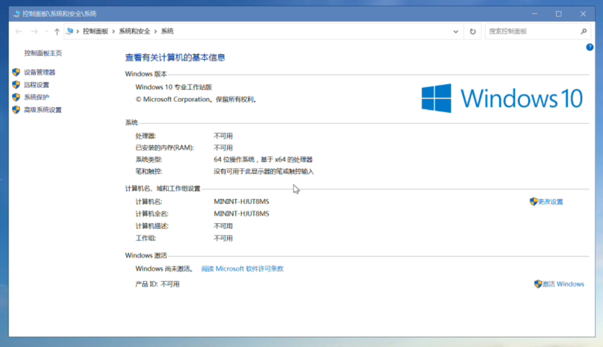

在电脑无法正常开机进入系统，身边又没有其他电脑时，手头有个 PE 盘或许能够帮你解决问题，防患于未然。

#### 制作 PE 启动 U 盘

首先我们需要准备一个空 U 盘，容量至少在 `8G` 以上，`USB 2.0`即可除非你想更快。

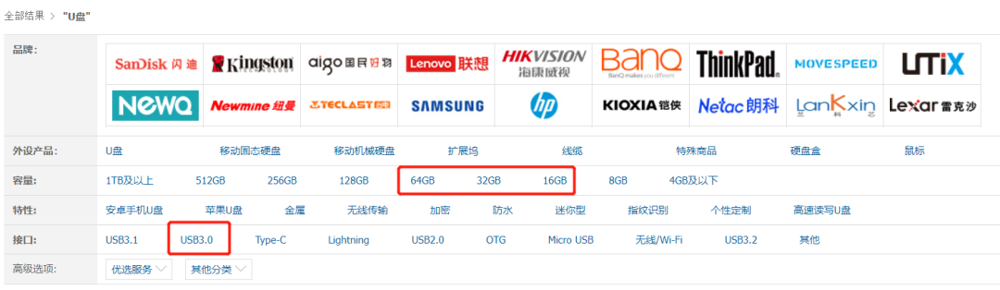

进入`首页`然后点击`下载`页面，找到你所需要的安装包，建议使用最新的 64位 版本。

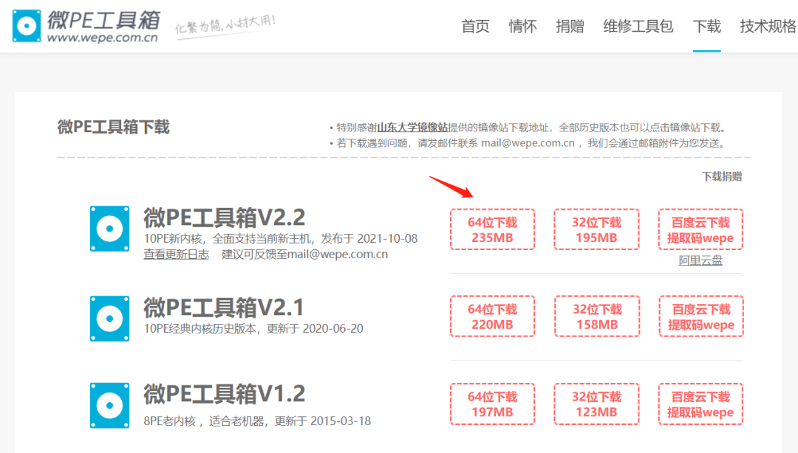

然后打开`WePE32_Vx.x.exe`

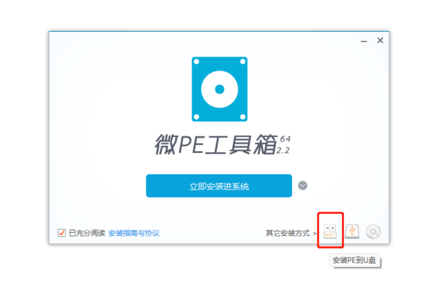

插入**空 U 盘**，运行下载好的安装包，选择`其它安装方式`里的`安装PE到U盘`。

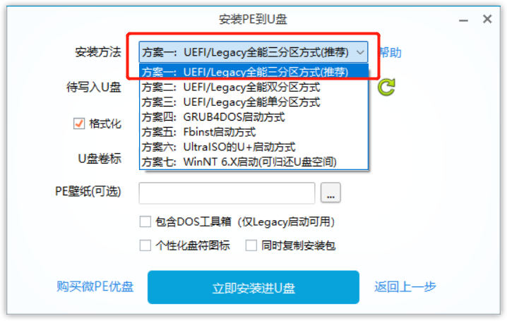

根据需求选择方案，建议使用推荐方案进行安装。

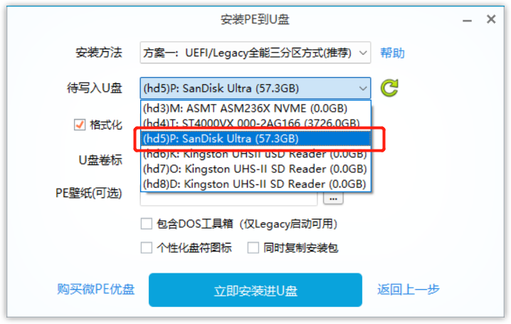

在选择待写入 U 盘的时候，请多次确认选择的是 **空 U 盘**！

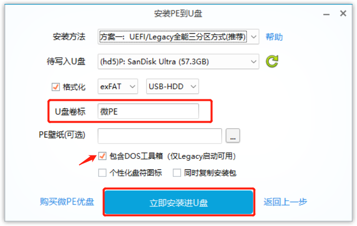

软件会对 U 盘进行格式化，U 盘卷标可以自定义，DOS 工具箱勾选项以备不时之需。

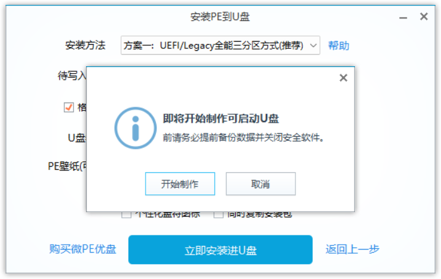

最后点按`立即安装进 U 盘`即可。

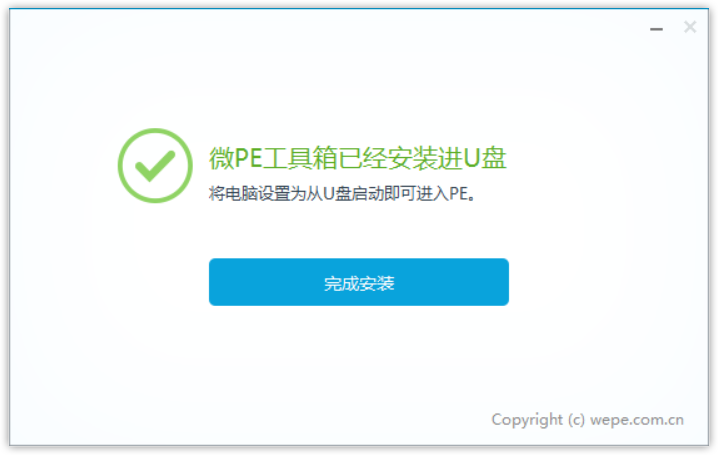

安装完成后，不要急着拔 U 盘。

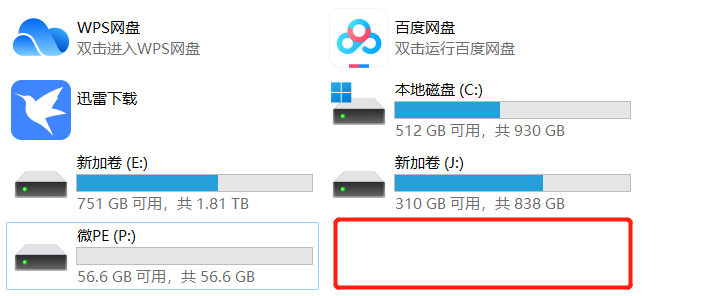

打开此电脑后，你可能看不到 PE 的盘符，但是会看到刚才重命名好的 U 盘。

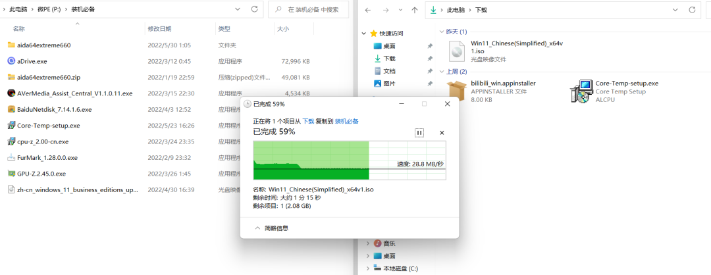

在【微 PE】盘里，新建文件夹，然后把你会用到的软件安装包，和操作系统磁盘映像（ISO）**复制粘贴** **到 U 盘文件夹里**。

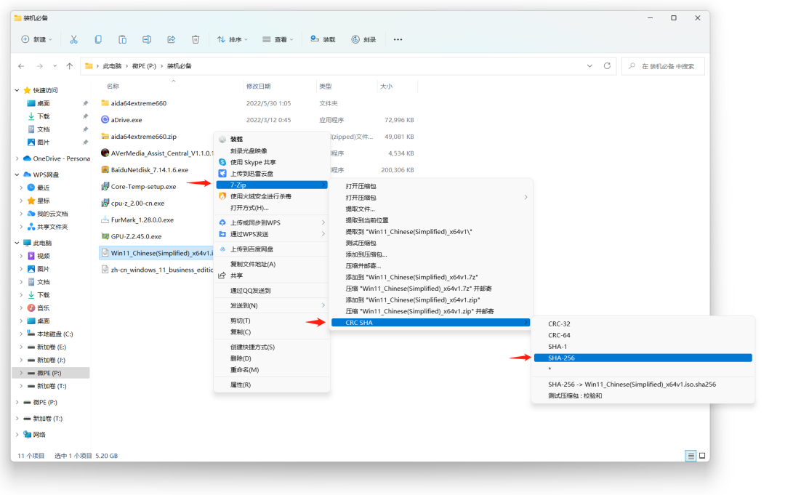

为了确保你下载的文件没有损坏，可以用 `7-ZIP` 这款压缩解压缩软件进行哈希校验。右键 ISO 文件，选择 `7-Zip`  里的 `CRC SHA` 然后找到 `SHA-256` 运行校验。

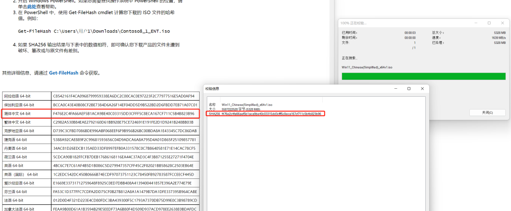

校验完成后，对比**微软官网**对应语言的 `SHA256` 值，数值**相符**说明文件未遭到破坏、篡改或与原文件有差别。

#### 使用 PE 启动 U 盘

> 无论是想装系统、拯救文件还是解锁密码等，要做的第一步就是从U盘启动进入PE系统。
> 
> 启动PE系统的关键操作顺序：

- 第一步：在开机时进入主板的启动项列表；
- 第二步：找到要启动的U盘，并辨别UEFI和Legeacy方式；
- 第三步：选择一个合适的WinPE系统版本进入。

首先我们需要进入 `BIOS` ，通常台式机在开机时点按键盘`DEL`键即可，笔记本则根据型号略有不同。

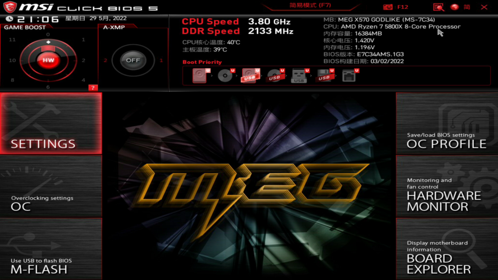

进入 BIOS 后，将 PE 启动 U 盘（前缀 UEFI）移动到第一启动项，部分主板或笔记本可以直接选择 U 盘启动，道理相通。

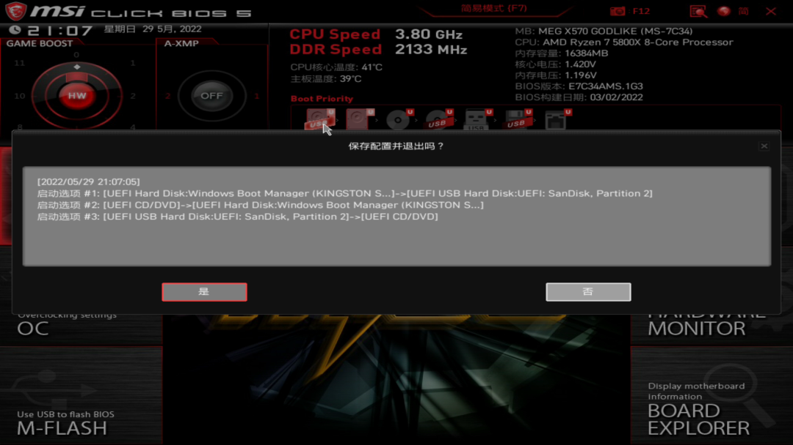

F10 保存设置后，电脑就会重启进入 PE 系统。

> 选择第一项敲击回车

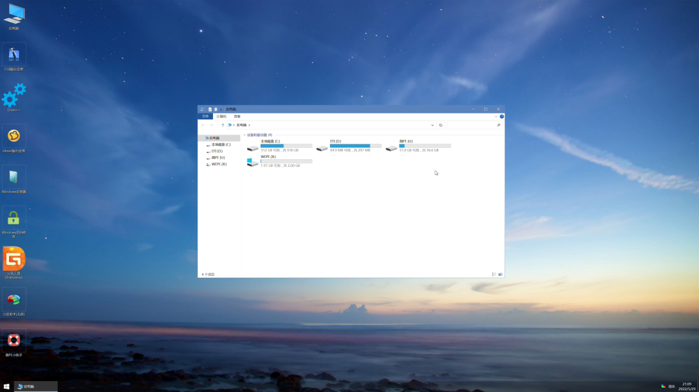

然后你就能看到熟悉的页面了，微 PE 在桌面放置了几个软件，在使用前你可以用bing搜索相关教程。

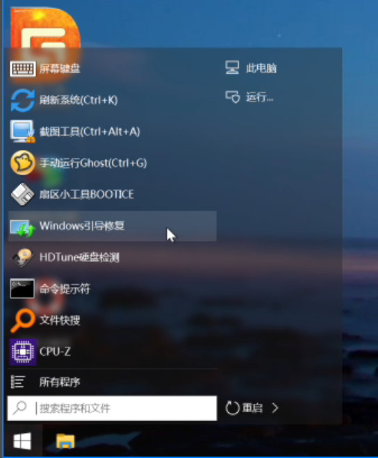

开始菜单里也有一些实用的程序，我们同样建议你在使用前查看教程，以免误操作造成损失。

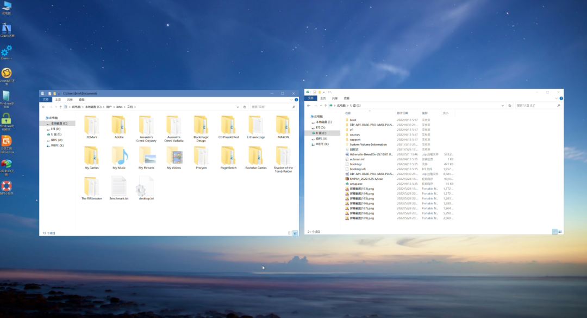

微 PE 可以访问未加密的硬盘，你可以直接在 PE 系统里备份**重要**文件到 U 盘。

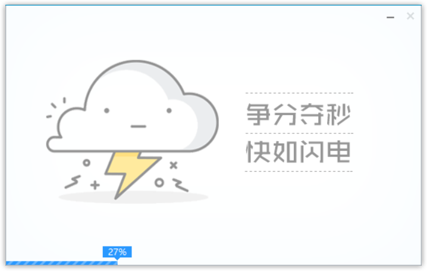

制作时请一定要使用**空 U 盘**来操作。

### 笔记本BIOS键位

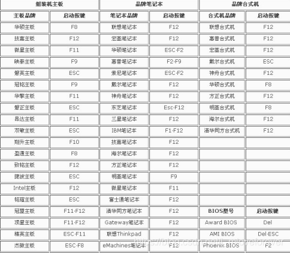

微PE支持两种启动方式：

- **UEFI**
- **Legacy**

**机器支持UEFI的话（新机器一般同时支持Legacy和UEFI），在这个启动项中一般会出现两个U盘的选项，一个是UEFI开头的，另一个是不带UEFI开头的或叫Legacy的**

## 第三步：判断分区表类型

进行到这里，就已经成功进入了微PE的桌面了，但是为了能够正确的使用PE，避免各种可能出现的问题、保护数据安全，请确认自己系统盘所在的磁盘号和磁盘分区表类型。


### PE下的盘符顺序和本地系统内很可能不同

PE下的硬盘驱动器盘符的顺序（就是C盘、D盘、E盘...这种盘的顺序）和本地系统内看到的可能不一样，特别当电脑里有2块以上硬盘的时候。平时在正常系统内看到的C盘，很有可能在PE里就显示成了D盘E盘之类的，在PE内看的C盘有可能不是真正的那种系统盘“C盘”。这是一种PE内正常的磁盘错乱的现象。没关系，不用管就行了。只需要认准一件事情：通过分析磁盘结构和分区结构，确认自己的系统盘的位置和盘符即可。

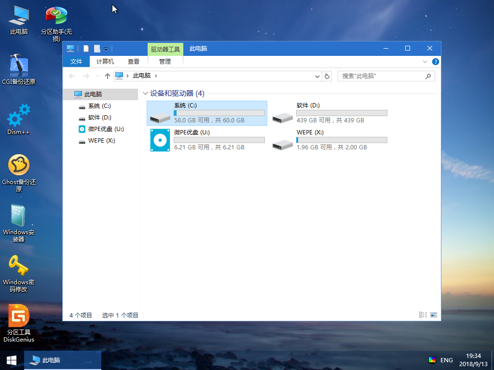

### 使用分区工具查看硬盘的分区结构

进行这个操作需要借助专业的分区工具，这里我们推荐分区助手，比较简单直观。打开PE桌面上的“分区助手(无损)”。查看电脑里的硬盘和分区信息，了解每个硬盘的分区表类型，并定位系统分区所在位置，大概会看到下面三种情况：

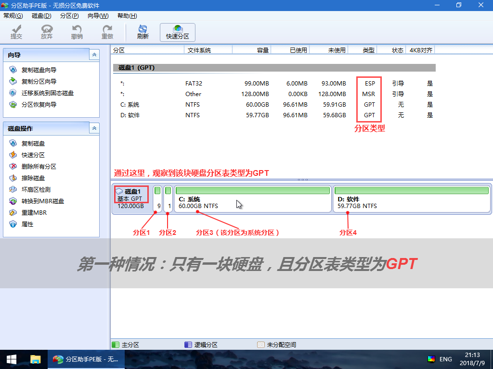

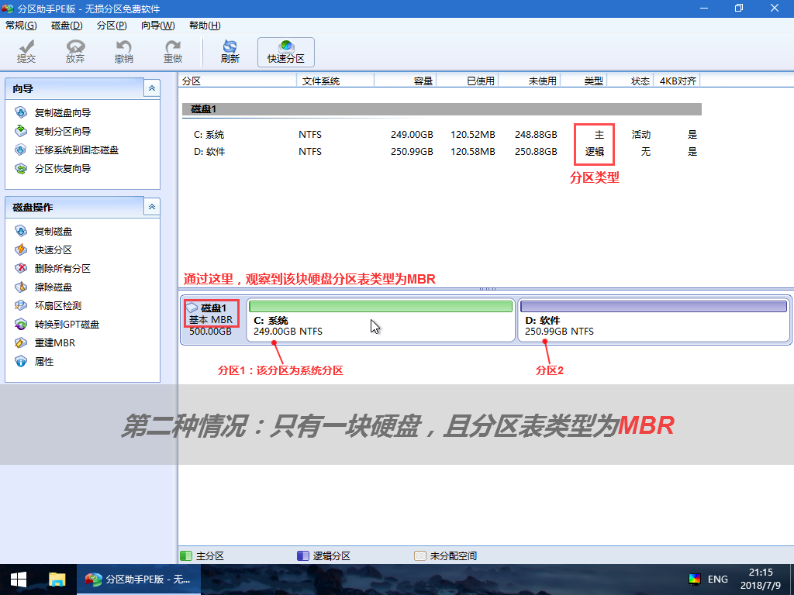

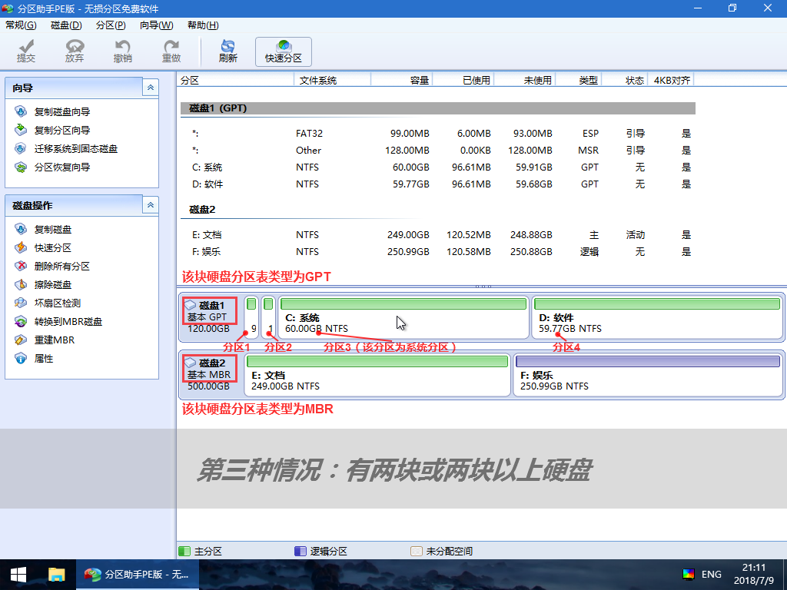

### 观察硬盘分区表类型方法

硬盘分区表有两种类型：

- **GPT**
- **MBR**

从以上图片中红色框框中圈出的位置上，我们可以准确辨别出硬盘的分区表类型。

如果概括起来解释这两种分区表的区别，就是：

- **GPT** *新型分区表类型，需对应UEFI启动，支持快速启动，支持2TB以上硬盘*
- **MBR** *传统分区表类型，需对应Legacy启动，旧机器上比较常见*

**请记下的分区表类型，这很重要。**

### 观察系统盘所在硬盘和分区方法：

通常情况下，PE下的C盘就是系统所在分区和硬盘。打开分区助手之后，直接去找被分配为C盘的那个分区。并通过下面这个策略去验证这个C盘是不是真正的系统所在分区：

- 对于MBR分区表的硬盘，一般第一个大容量的主分区就是系统盘所在分区。
- 对于GPT分区表的硬盘，一般第一个大容量的GPT就是所在分区。
- 打开PE桌面上的此电脑（计算机），打开C盘，看看里面有木有Windows目录。 其实，PE里，绝大多数系统盘所在分区，都会被分配为C盘。以上就是保险起见的多次确认。

**请记下的硬盘上系统盘的位置，这很重要。**

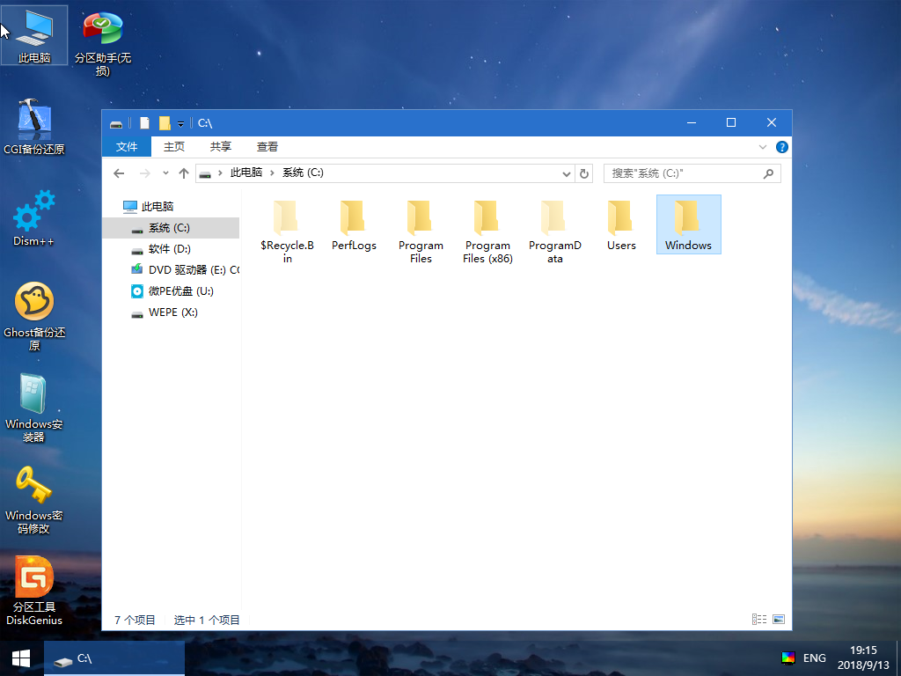

## 第四步：安装器方法安装原版Windows

本篇教程将详细介绍使用微PE中的第三方windows安装器安装微软原版系统的具体方法流程、注意事项、异常问题解决等。

第三方的Windows安装器利用了与微软原版Windows安装程序一样的原理，直接将系统中的文件，解压到硬盘上，实现最终的安装。 该方式的特点是：安装系统和PE的启动类型、PE的位数无关，以任何方式启动的PE，均能将系统安装至任意分区表类型的硬盘上。

本方法支持的系统：Windows 7，Windows 8.1，Windows 10等NT6系列的全部系统。甚至支持安装XP。

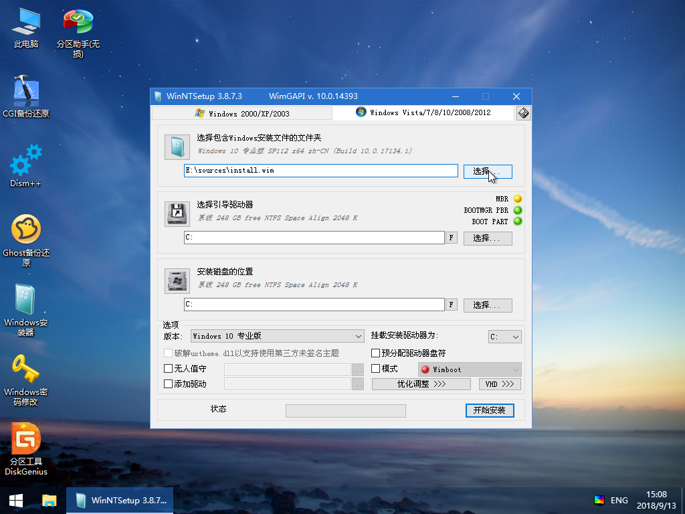

> 注意
> 
> 请特别注意，使用PE安装系统请务必使用原版系统镜像，并使用微软官方正规渠道的正版序列号激活，否者将会面临侵权的风险。

### 安装系统前的准备工作

使用安装器安装系统的具体操作步骤并不多，如果能按照下面的要求做足充分的判断，可极大提高成功率。

- **判断系统盘所在硬盘的位置？**
  
  如果的机器上装了多块硬盘，请做好区分，别装错了。如果需要提前分区，就先分好再装。

- **请务必提前做好数据备份**
  
  安装的时候要格式化C盘，请务必将C盘文件备份至其他。必要时，将文档照片类的不可再生数据存储至外部存储器一份。

### 正式开始安装系统

安装器安装原版系统的操作步骤为：

- 第一步：PE内将要安装的系统ISO镜像挂载为虚拟光驱；
- 第二步：打开桌面上的Windows安装器，输入选项后安装；
- 第三步：等待系统安装完成，做最后的系统配置；
- 第四步：进入桌面，装驱动装软件。

#### 第一步：将要安装的系统ISO镜像挂载为虚拟光驱

从U盘启动进入PE内，打开U盘内的存放系统镜像的“ISO”目录，找到要安装的镜像。

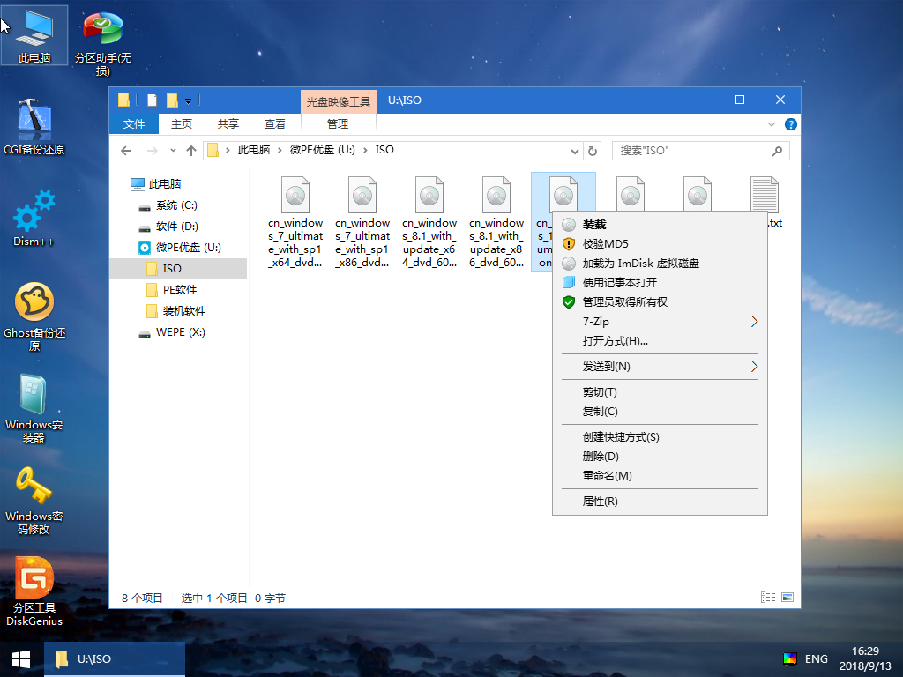

对着ISO镜像点右键，选择挂载，或者直接双击，该ISO就会被挂载为一个新的虚拟的光盘驱动器，和插入安装光盘效果类似。它会显示在“我的电脑”里，并且有一个盘符。

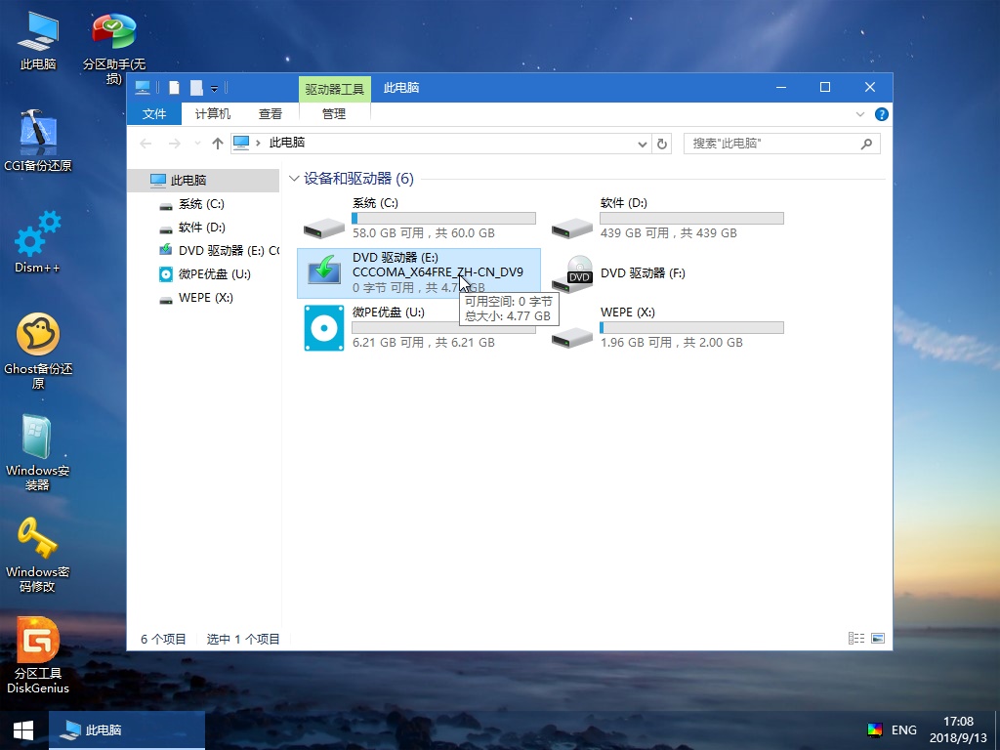

#### 第二步：打开桌面上的Windows安装器，输入选项后安装

执行桌面上的Windows安装器，按照提示进行选择。

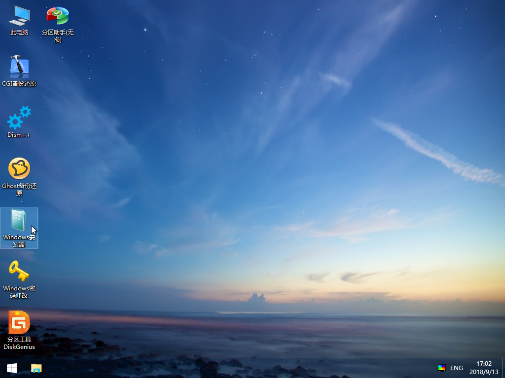

Windows安装器顶部有两个选项卡，右边的支持WIN10、8.1、7的安装，左边的支持XP的安装。请注意区别对待。


在第一个选项中，请选择系统包install.wim的位置（在刚才挂载出来的虚拟光驱里的source文件夹里），比如H:\sources\install.wim等等。

**注：如果是安装XP的话，选择左侧的选项卡，第一个选项选择挂载出来的虚拟光驱根目录或I386。**

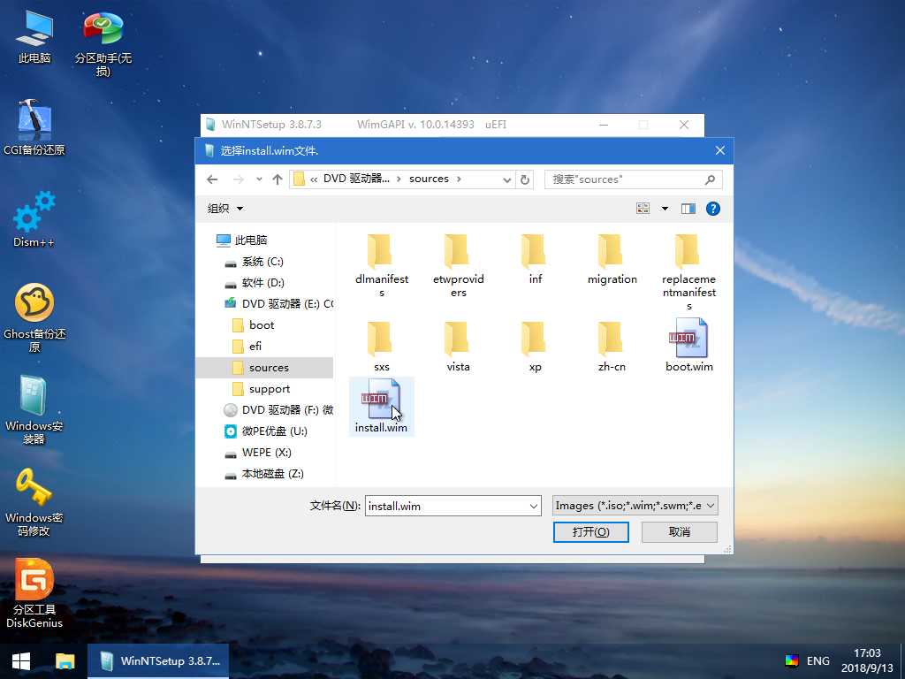

其余的两项填写要安装到的目标系统盘，正常情况下选择 C: 即可

当选择好三个选项之后，左下角的系统版本按照需要进行选择。

之后就可以点击开始安装，在弹出的确认对话框中再次点确认即可开始安装。

就写到这里明天再说
