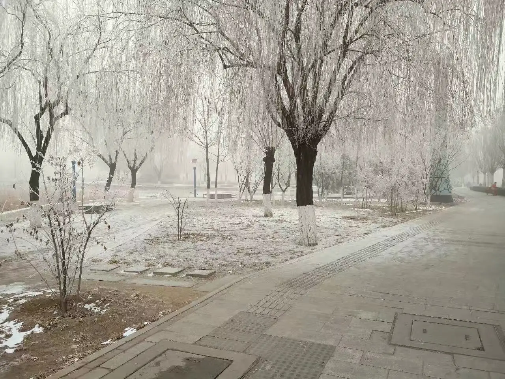
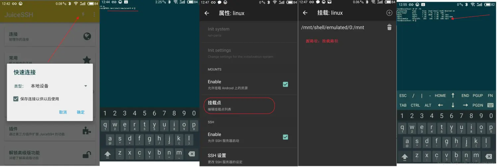
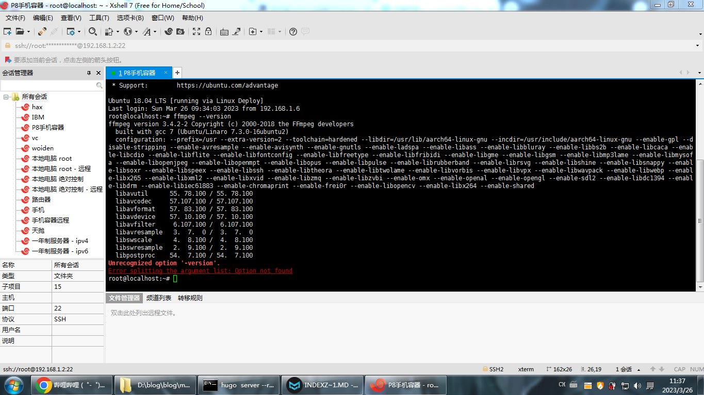
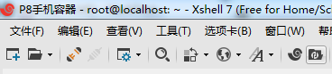
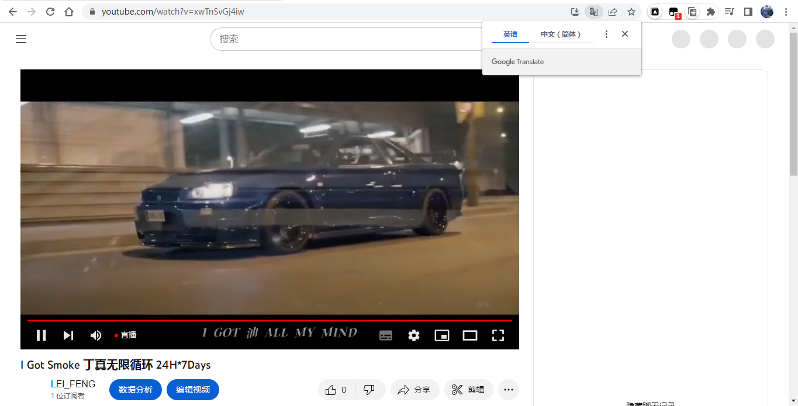
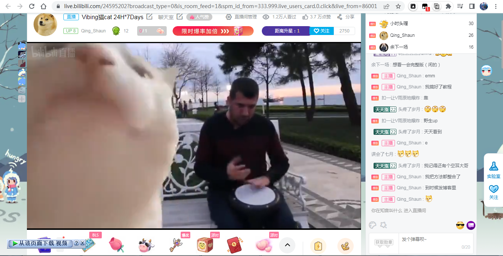

> 本文章的方法，禁止用来滥用。
> 
> 使用之前请看视频网站TOS，禁止违反视频网站纪律。

# 使用Linux进行24小时直播

> 材料：
> 
> 一台手机和一个不限流量的网络
> 
> 有问题请去评论区提问

## 安装 Ubuntu（必须）

### 手机24H直播

省电和安静相比于云服务器成本更低

### LinuxDeploy（需要Root权限）



**linux deploy**搭建环境时，从网上查阅了很多资料，感觉手机充当linux服务器时，性能差强人意。（但是直播足够了）

如果是linux的初学者，用手机来充当服务器学习，是一个不错的选择（遇到问题，然后去解决）。
市面上可以被root的手机很少（如果你的手机是一加和小米你可以root试试）

#### 可root的手机

小米红米全机型：
小米红米手机一直支持官方解锁BL（一般7天解锁），通过解锁BL后就可以刷机玩机获取
**root**操作等，小米的解锁BL也是最神奇的，支持微信支付宝指纹支付，堪称完美。

三星/一加/Realme/联想/华硕ROG机型
此5大机型也一样支持官方解锁BL，一般官方都提供了解锁方法，解锁时间最快，不需要
等待。有些是解锁命令解锁，有些是官方解锁工具解锁。通过解锁BL后一样支持玩机刷机
操作，但以上机型解锁BL后系统均不再支持微信指纹支付，必须依赖面具指纹模块，或者
上锁BL

努比亚红魔/魅族/黑鲨/LG机型
以上5个机型并不支持官方解锁BL，自然解锁BL刷机全靠开发者实现。庆幸的是以上机型
基本都可以飞官方解锁BL刷机操作，然后获取完美root等等。非官方解锁BL可能会使得手
机失去保修功能，希望保修的小伙伴，需要在保修之前刷回官方系统，再回锁BL

OPPO能深度测试机型
OPPO机型目前能root的并不多，都需要通过官方 **深度测试**，官方未开放深度测试的机型目前并没有任何解锁刷机root方法，已知只有这些机型可申请测试，并且申请时间为每月的1号或者15号，需要解锁root的用户请及时申请，解锁BL会导致数据清空，请备份数据再刷 
机。指纹支付也会一起失效，同一加机型

支持Find X/R17 Pro/Reno/Reno Ace/Find X2系列/Ace2/Reno3系列/R17全网通/K1/K3
/K5/R15x正式版/Reno4、Reno4 Pro、Reno4 SE 5G/Reno5 Pro+、Reno5 Pro、Reno5

> root不规范变砖两行泪

使用时需要注意的问题与总结：

- ~~在Linux Deploy设置中，Path里需要将BusyBox安装路径设置（默认/system/xbin）~~ **BusyBox**装了就开不了鸡了
- 启用允许挂载Android上的资源时，挂载点名称要注意，文档里名称，与自己手机使用的名称不一致（可通过文件管理工具查看）
- 下载网速是硬伤，安装系统时连接的国外服务器，有可能下载超时
- 不要从应用商店等下载apk，直接到github上，下载最新apk

以上问题，都可能造成ssh等服务启动失败，不能正常使用。



SD卡挂载示例

___

#### 使用环境

下载 Xshell

已ROOT手机一台

一台电脑

使用ssh访问linux deploy

___

#### 前置服务器安装说明

##### 手机安装 BusyBox app

[https://github.com/meefik/busybox/releases](https://github.com/meefik/busybox/releases)

~~应用界面，选择install(使用默认配置/system/xbin)~~ 请自己试试如果完蛋了就重新安装Linux Deploy

##### 手机安装 linux deploy

[Releases · meefik/linuxdeploy · GitHub](https://github.com/meefik/linuxdeploy/releases)

#### 修改linux deploy配置

linux deploy界面，选择左上角图标-配置：

| 属性      | 配置                         |
| ------- | -------------------------- |
| 屏幕常亮    | 选中                         |
| 锁定Wi-Fi | 选中                         |
| CPU唤醒   | 选中                         |
| PATH变量  | 与BusyBox中配置一致 /system/xbin |

修改后选择“更新环境”，保存配置。

#### 修改linux安装属性

linux deploy界面，选择右下角图标：

| 属性                         | 配置               | 说明                                 |
| -------------------------- | ---------------- | ---------------------------------- |
| 发行版本 GNU/Linux             | Ubuntu           | Ubuntu 安装最简单了                      |
| 架构                         | arm64            | 可以通过linux deploy右上角图标-状态，查看手机cpu架构 |
| 发行版本呢                      | 默认               |                                    |
| 镜像大小                       | 4096             | 最高支持4096MB                         |
| 文件系统                       | ext4             | 保持默认                               |
| 用户名                        | root             | ssh登陆时使用                           |
| 用户密码                       | 自己设置             | 英文大小写和数字                           |
| 本地化                        | zh\_CN.UTF-8     | 中文包即可                              |
| 启用 允许使用初始化系统               | 不启用              |                                    |
| 启用允许挂载android上的资源          | 选中               | 自己按照上面的方法挂载                        |
| 挂载点列表                      | /mnt/sdcard:/mnt | 源名称：挂载点名称                          |
| 注：不同手机名称不一样,可以通过MT文件查看工具查看 |                  |                                    |
| 启用SSH服务器                   | 选中               | 默认                                 |

#### 安装Ubuntu

linux deploy右上角图标-安装

#### 安装依赖项

```shell
sudo apt install ffmpeg screen
```

直接按`Y`即可

## Termux（不用root的通用方法）

> 事先说明这种方法性能更弱

通过 Termux 和 Ubuntu 22 在 Android 上运行 FFmpeg。 但是它需要手动设置大量命令，小心不要跳过任何步骤。 注意，这可能需要10至20分钟的时间或更长的时间，取决于您的技术知识水平。 互联网速度和 CPU 速度。

### 安装

#### Termux

> 警告
> 
> **Termux 的Play 商店版本已经过时，不支持，不要使用，请使用 [Github one在新窗口打开](https://github.com/termux/termux-app/releases/latest/)**

转到 [Termux Github 最新版本在新窗口打开](https://github.com/termux/termux-app/releases/latest/), 下载 `debug_universal.apk`, 解压缩它并运行它。

> 提示
> 
> **如果您的文件管理器不允许您运行 APK 文件， 安装并使用 `MT文件管理器` 并允许它在接到请求时安装第三方应用程序。**

> 重要警告
> 
> **一旦您安装了 Termux，打开它，拉下安卓菜单以通知， 在 Termux 通知中，向下拖动直到您看到以下选项：`Exit | Acquire wakelock`, 点击`Acquire wakelock` 并允许Termux在询问时拥有电池优化排除权限。 如果您不这样做，您的性能将会变得更差，Termux 可能会在后台运行时被 Android 杀死！**

#### 安装 Ubuntu 22.04

用于安装 Ubuntu 22。 在 Termux 中，您需要 `wget` and `proot`中, 我们将在下一步安装它们。

一旦您安装 Termux 后打开并运行以下命令（按顺序排列）：

1. `pkg update`

2. `pkg upgrade`

3. `pkg install proot wget`

> 提示
> 
> **如果你被要求在更新/升级命令过程中按Y/N 键，只需输入 Y 并按Enter**

然后您需要使用以下命令下载安装脚本：

```shell
wget https://raw.githubusercontent.com/MFDGaming/ubuntu-in-termux/master/ubuntu.sh
```

在脚本下载完毕时运行它：

```bash
bash ubuntu.sh
```

然后您将被问到一个问题，输入 `Y` 并按 `Enter`。

安装完成后，您可以使用 Ubuntu 启动：

```bash
./startubuntu.sh
```

#### 安装依赖

首先，我们需要更新 APT 软件包管理器仓库并安装依赖项。

要更新 APT 存储库，请运行以下命令：

```bash
apt update -y && apt upgrade -y
```

完成后，我们需要安装依赖项，命令如下：

```shell
sudo apt install ffmpeg screen
```

## 介绍 FFmpeg

[FFmpeg](https://ffmpeg.org/) 本身是一款非常强大的命令行实用程序，在 Linux 发行版、Windows 以及 macOS 等系统上均可运行，支持多种架构。FFmpeg 是用 C 语言和汇编语言编写的，性能强大，提供跨平台支持。

### FFmpeg 安装

在 Ubuntu 等 Linux 发行版上， FFmpeg 的安装比较简单。打开终端，运行以下命令安装即可。

#### Ubuntu 及与其相似的发行版

```shell
sudo apt install FFmpeg
```

FFmpeg 安装完成后，可输入以下命令查看安装是否成功。

```shell
ffmpeg --version
```



## 文件传输

> 这关非常重要关乎你的直播是否能打开
> 
> 需要安装Xftp

然后你发现最右边有一个Xftp按钮 点一下它（必须要连接SSH之后才能用）



**linuxdeploy**路径是这样的

```bash
/root
```

而**Termux**需要安装SSHD才能用SFTP

```bash
pkg install sshd
```

安装之后运行

```bash
sshd
```

设置密码

```text
 passwd 
```

查询手机ip，以实际手机ip为准

```text
ifconfig
```

查询当前用户

```text
 whoami
```

确认ssh服务的监听端口

```text
netstat -ntlp | grep sshd
```

默认SSH端口就是这台手机的`8022`端口

默认路径在这

```bash
/data/data/com.termux/files/home/ubuntu-fs/root
```

## 启动直播前的准备

Youtube准备

在Youtube直播不能直播有版权的东西（简单来说就是Youtube上面火的东西）

例如我直播的内容是丁真所以也没事

有能力的可以点开链接看雪豹直播doge

[I Got Smoke 丁真无限循环 24H*7Days - YouTube](https://www.youtube.com/watch?v=xwTnSvGj4iw)



Youtube直播对于你们来说太难了

### Bilibili直播

账号需要实名（满18岁）

需要IP地址在中国大陆

不在中国大陆的可以使用归雁加速器（自己搜）

https://live.bilibili.com/24595202



如果你具备了这些条件请继续往下看

## 直播脚本

> 请把以下的内容封装成 .sh格式 例如： `535ir.sh`

创建一个文件夹

```bash
mkdir zhibo
```

进入文件夹

```bash
cd zhibo
```

添加脚本

```bash
nano zhibo.sh
```

没NANO就安装一下

```bash
apt install nano
```

### Youtube直播脚本

```shell
#!/bin/bash
while true
do
ffmpeg -re -i "视频.mp4" -vcodec copy -acodec copy -f flv "服务器地址/直播码"
done
```

### Bilibili直播脚本

```shell
#!/bin/bash
while true
do
ffmpeg -re -i "视频.mp4" -vcodec copy -acodec copy -f flv "服务器地址/直播码"
done
```

## 运行直播

添加一个虚拟终端

```bash
screen -S 自定义名字
```

```bash
运行 ./脚本名.sh
```

回到虚拟终端

```bash
screen -r 你刚才自定义的名字
```

从虚拟终端退出

```bash
在 screen 终端 下 按下 Ctrl+a d键
```

> 踩坑的话请自行去Bing搜索搜索相关问题
> 
> 或者在评论区提问