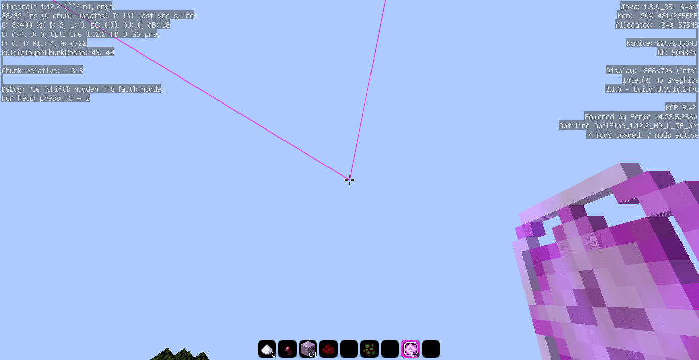

# impact使用和2B2T生存端

> 请不要在非无政府服务器上面使用我的端，因为此端只是2B2T生存端。



mod版本：[Impact Client 4.9.1](https://impactclient.net/)

`Impact mod`是Minecraft的高级实用模组，它与[Baritone](https://github.com/cabaletta/baritone)打包在一起。

## 端使用

> 这个端在水晶pvp方面比较烂，但是在生存辅助方面还是很好的。

属性：

- [ ] 良好的绕过（上古mod了绕不了什么）

- [x] 良好的baritone机器人兼容（baritone和impact是同一个作者开发的）

- [x] 良好的优化（最高100FPS）

- [x] 无后门（来测测）

- [x] 低等的水晶（打打凋零还是可以的）

- [x] 低绕过5B5T等服务器反作弊（已测试）

### 键位

---

打开gui 请按 右边SHIFT

拉吉水晶 R

跟随生物 N

杀戮光环 Z

自动走路 B

自由镜头 M

自动搭路 V

一键透视箱子 H

一键找末影箱 J

一键找地狱门 K

速度 X

---

### 注意：

为了节省空间和兼容winxp系统我把全部的lib全删了（需要点击PCL的补全文件）

如果允许不了请下载文件夹里面的运行环境

> [下载链接](https://drive.xpdbk.com/DEV%E7%AB%AF%20123%E7%BD%91%E7%9B%98%E7%BA%BF%E8%B7%AF)
> 
> 压缩密码：`4kij923e`

演示视频： 

## 贡献寻路缓存

贡献寻路缓存方法：将你的`.minecraft\baritone`目录下的文件分享出来（不要 `settings.txt`）

例如：

```html
/
└── .minecraft
    └── baritone
        ├── xx.xx
        ├── xx.xx
        └── xx.xx
```

可以在评论区贴出来你的网盘地址

## Impact 功能翻译（想折腾的可以看看）

[`Visible`：是否显示     `Keybind`：热键     `Mode`：模式]

### Impact Client 4.9.1 功能翻译

#### Combat 战斗类

Aimbot 自动瞄准

-Walls 无视障碍物瞄准

-Safe 重生/重进游戏后自动关闭

-瞄准对象 

-Teammates 队友 

-Invisible 隐形生物 

-Sleeping 睡觉中的生物 

-Friends 标记为朋友的玩家

-Player 玩家

-Hostile 敌对生物

-Passive 友好生物

-Range 达到与目标的距离时自动瞄准目标

-FOV(Field Of Vision) 目标距离玩家视线的角度

Anti Bot 防机器人侦测

-Modes 模式

-AAC 

-Hypixel

-Packet

-Auto Set 根据服务器自动设定自动瞄准的模式

Auto Armor 自动穿装备

-Delay 穿戴装备时的延迟

-Inventory Open 背包必须开启才能自动穿戴装备

-Auto Replace 自动穿戴耐久更高的盔甲

-Skulls 将头颅作为盔甲穿戴

-Elytra 将鞘翅作为盔甲穿戴

Auto Clicker 自动连点

-Sword 手持剑时才会启用

-Jitter 抖动点击

-Hold 当鼠标按住时才能自动连点

-Item Use 在使用物品时自动点击(吃东西/丢药水) 

-Hit Delay 攻击冷却时间

-TPS Sync 将点击延迟与服务器的TPS同步

-TriggerBot

-Range 达到与目标的距离时自动连点

-Hitbox Increase 修改目标实体的碰撞箱

-瞄准对象

-Teammates 队友

-Invisible 隐形生物

-Sleeping 睡觉中的生物

-Friends 标记为朋友的玩家

-Player 玩家

-Hostile 敌对生物

-Passive 友好生物

Auto Totem 自动图腾

-Counter 在功能列表中显示图腾的数量

-Smart 有危险时自动将图腾替换到副手(只有从高处掉落时才会替换图腾)

Auto Weapon 自动切换武器

Bow Aimbot 弓箭自动瞄准

-瞄准对象

-Teammates 队友

-Invisible 隐形生物

-Sleeping 睡觉中的生物

-Friends 标记为朋友的玩家

-Player 玩家

-Hostile 敌对生物

-Passive 友好生物

Criticals 暴击

-Modes 模式

-Packet 只发送暴击数据包给服务器

-Jump 大跳

-Falling 在落下时攻击(配合Kill Aura使用)

-MiniJump 小跳

-Particles 显示更多的粒子

Crystal Aura 水晶光环

-APS 每秒破坏水晶数

-Placement 放置水晶(有生物时才会放置)

-Range 达到与目标的距离时放置水晶

-FOV(Field Of Vision) 目标距离玩家视线的角度

-Suicide 模式

-Avoid 不破坏或放置水晶

-Place 放置水晶但不去破坏

-Commit 放置并破坏水晶

-Draw Outline 显示框线

-Place Color 显示放置位置

-Trigger Color 显示目标水晶位置

-Anti Weakness 自动计算放置水晶的位置防止生命值快速降低

HitBox 修改目标实体的碰撞箱

-Debug Boxes 当按下F3+B时会显示碰撞箱(不影响碰撞体积)

-Player 玩家

-Size Increase 调整碰撞箱大小

-Hostile 敌对生物

-Size Increase 调整碰撞箱大小

-Passive 友好生物 

Size Increase 调整碰撞箱大小

Hunt 自动跟踪

-对象

-Teammates 队友

-Invisible 隐形生物

-Sleeping 睡觉中的生物

-Friends 标记为朋友的玩家

-Player 玩家

-Hostile 敌对生物

-Passive 友好生物

Kill Aura 杀戮光环

-Modes 模式

-Single 攻击单个对象

-Switch 快速切换攻击对象

-Switch Timer 调整切换攻击对象的速度

-Tick 每隔1 Tick攻击一次

-Delay 攻击时会有冷却时间

-Multi 同时攻击多个目标对象

-Priority 攻击优先级

-Distance 距离

-Health 生命值

-Crosshair 准星

-Smart 智能

-Walls 穿墙攻击

-RayTrace 显示射线到实体碰撞箱上

-Immune 检查目标实体是否免疫伤害

-TPS Sync 将点击延迟与服务器的TPS同步

-Block 副手持有盾牌时会进行格挡(右手持剑时)

-Safe 重生/重进游戏后自动关闭

-NoSwing 不显示攻击动作

-Lock View 锁定攻击视角

-攻击对象

-Teammates 队友

-Invisible 隐形生物

-Sleeping 睡觉中的生物

-Friends 标记为朋友的玩家

-Player 玩家

-Hostile 敌对生物

-Passive 友好生物

-APS 每秒造成的攻击量

-APS Deviation APS的浮动范围

-Range 达到与目标的距离时自动攻击生物

-FOV(Field Of Vision) 目标距离玩家视线的角度

-Random Yaw 水平随机偏差量

-Random Pitch 垂直随机偏差量

-Alive Ticks 生物生成后必须等待的最小Tick数过后才能攻击

-Hit Chance 目标命中率

Pot 自动使用药水

-Speed 切换物品时的速度

-Random 添加随机延迟值到切换物品延迟上

SmoothAim 平滑瞄准

-Teammates 瞄准队友

-Safe 重生/重进游戏后自动关闭

-对象

-Teammates 队友

-Invisible 隐形生物

-Sleeping 睡觉中的生物

-Friends 标记为朋友的玩家

-Player 玩家

-Hostile 敌对生物

-Passive 友好生物

-SideButton 按下鼠标侧键时才平滑瞄准(如果没有请关闭) 

-Range 达到与目标的距离时自动瞄准

-FOV(Field Of Vision) 目标距离玩家视线的角度

-Random Speed 计算随机偏移量的速度

-Width Random 水平的随机偏移量

     0    →              1                →     2

低准度    决定是否在碰撞框内    高准度

-Height Random 垂直的随机偏移量

     0    →              1                 →    2

低准度    决定是否在碰撞框内    高准度

-Speed 瞄准目标的速度

Soup 自动喝汤(貌似不会喝) 

-Health 到达最低生命值时喝汤

-Speed 切换物品时的速度

-Random 添加随机延迟值到切换物品延迟上

#### Exploit 漏洞类

Anti Fire 抗火(只适用于1.8服务器)

Anti Hunger 抗饥饿

-Modes 模式

-Effective 药水效果

-Smart 智能

Franky 无实际用处(它的功能跟你想的一样)

采摘自:https://joeybabcock.me/wiki/Impact:Franky

原文:Though it's possible this mod previously enabled an old Minecraft crash exploit, currently the only function it serves is as more of a joke. It doesn't actually do anything but generally draws curiosity and those who understand will give a number of different answers as to what it does that usually aren't of any substance or just completely false.

译文:虽然这个功能在1.12.2以前有可能触发让Minecraft崩溃的漏洞，但目前它唯一的功能是作为一个笑话.它其实没有什么实质作用，但一般都会引起人们的好奇心，而对于它的作用，了解的人会给出很多不同的答案，这些答案通常没有任何实质意义，或者完全是假的.

原文

GhostHand 无视墙体/开箱子/攻击实体

Ignite 使用打火石让周围的玩家着火

-Swing 是否显示点火动作

-对象

-Teammates 队友

-Invisible 隐形生物

-Sleeping 睡觉中的生物

-Friends 标记为朋友的玩家

-Player 玩家

-Hostile 敌对生物

-Passive 友好生物

-Range 达到与目标的距离时点火

-FOV(Field Of Vision) 目标距离玩家视线的角度

Lag 更改Ping值

-Fake 通过阻塞大量数据包造成延迟

-Real 真实的延迟

-Latency 在原有延迟时间上增加延迟时间

-Render Real 显示玩家在服务器的真实位置

New Chunks 显示新区块

-Color 设置新区块的颜色

-Width 设置线条宽度

-Smooth Lines 让线条更平滑

Portals 传送门设置

-GUI 在传送门中可以开启背包/聊天栏界面

-God Mode 防止在传送后失去无敌的特性(开启后会被瞬移回原地)

#### Minigame 服务器小游戏类

Breaker 起床战争

-Beds 破坏床

-Cakes 破坏蛋糕

-Swing 破坏时不显示动作

CopsAndCrims 警察与罪犯

-Priority 优先级

-Crosshair 准星

-Smart 智能

-Delay 射击间格

-对象

-Teammates 队友

-Friends 标记为朋友的玩家

-RCS 后座力控制

-Silent 在未锁定目标的情况下向敌人开火

-Auto Shoot 自动射击

-Bone 瞄准

-Head 头

-Neck 颈

-Chest 胸

-Jimmies 臀

-Legs 腿

-Feet 脚

-Horizontal Recoil 水平后座力

-Vertical Recoil 垂直后座力

-FOV(Field Of Vision) 目标距离玩家视线的角度

Minestrike 枪战游戏 

-Mode 瞄准模式

-Aimlock 锁定目标

-Silent 沉默

-Aim Type 瞄准类型

-Always 始终瞄准

-Shooting 射击时瞄准

-Bone 瞄准

-Head 头

-Chest 胸

-Legs 腿

-Priority 优先级

-Distance 距离

-Crosshair 准星

-Aimbot 自动锁定敌人

-Auto Shoot 自动射击

-Friends 瞄准好友

-Scoped 只锁定射程内的敌人

-Player ESP 显示玩家位置

-Item ESP 显示物品

-Draw FOV 画出玩家视野

-FOV(Field Of Vision) 目标距离玩家视线的角度

-No Smoke Lag 防止烟雾造成的卡顿

-Ignore Smoke 追踪目标位置时忽略烟雾

-Latency Compensation 补偿你与其他玩家相比的延迟

-Visible Ticks 敌人进入可视范围后必须等待的最小Tick数后才能攻击

Murder 找出杀手

-Modes 选择所在服务器

-PlayMCM

-MCPZ

-Hypixel

PropHunt 躲猫猫

QuakeCraft 射击游戏 

SneakyAssassins 真假飞翔使

#### Misc 杂项类

Animations 修改盾牌动画

-Sword Blocking 使用剑格挡

-Block Mode 用剑格挡动画显示模式

-1.7

-1.8

-Pandora

-Sigma

-Better Shield 降低盾牌高度

-Lowered Amount 设定盾牌高度

Anti Aim 防自动瞄准

-Yaw 水平

-None 无

-Backwards 向后

-Slow Jitter 慢速抖动

-Fast Jitter 快速抖动

-Slow Spin 慢速旋转

-Fast Spin 快速旋转

-Random 随机

-Pitch 垂直

-None 无

-Up 上

-Down 下

-Random 随机

Anti Desync 防止客户端放置方块与服务器不同步

Anti Sound Lag 防止声音延迟

Anti Vanish 其他玩家消失时在聊天栏显示讯息(以UUID 显示)

Auto Cheat 自动检测服务器的反作弊插件

Auto DiSconnect 生命值过低时自动断开连接

Auto Reconnect 自动重连

-Delay 重连时的延迟时间

DiScord RPC 在DiScord中显示模组

Fancy Chat 改变聊天字体

-Mode 模式

-Full Width 全型字

-Parenthesis 字体括弧

-Circle 圆圈

Log Position 显示可视距离中玩家的登出位置

-Show Names 登出位置显示玩家名称

-Save Positions 将登出位置保存到文件中

Middle Click Friend 点击鼠标中键添加朋友

No SRP 禁止服务器强制使用材质包

Self Destruct 禁用所有模组(不会卸载)

Signs 告示牌

-Colored 允许使用格式化代码 "&"

Unpack 右键分解原木

#### Movement 移动类

Air Jump 允许在空中跳跃

Anti Hazard 回避危险

-Cacti 防止仙人掌造成的伤害

-Magma 防止岩浆块造成的伤害

-Pressure Plates 防止激活压力板

-Fire 防止走进火焰

Auto Jump 自动跳跃

Auto Walk 自动走路

-Basic 单纯向前走

-Smart 智能走路

-Lock 锁定

-None 不锁定方向

-45 允许偏移量 45

-90 允许偏移量 90

-Preserve Y 固定高度

-Persistent 永不放弃走路

Baritone Baritone机器人设定

-Combat Pause 战斗时暂停

-Allow Break 允许破坏方块

-Allow Place 允许放置方块

-Allow Sprint 允许冲刺

-Allow Parkour 允许跑酷(跳跃)

-Parkour Place 允许在跑酷(跳跃)时放置方块

-Bucket Fall 落地水

-Max Fall Height 落下最大高度

-Max Bucket Height 落地水最大高度

-Path Timeout 计算路径所需的最大时间

-Plan Ahead Timeout 规划路径所需的最大时间

-Render Cached Chunks 以半透明的形式显示方块(与OptiFine不兼容)

-Chat Debug 聊天栏中显示调适信息

-Free Look 可以自由观看四周

-Anti-Cheat Compatibility 使用Free Look时与服务器的反作弊兼容(建议开启)

-Follow Radius 跟随目标时的必须达到的距离

-Follow Offset Dist 与目标实际距离的偏移量

-Follow Offset Dir 与目标实际方向的偏移量

-Goal Ignore Depth 穿过方块显示目标位置

-Path Ignore Depth 穿过方块显示路径

-Current Path 当前路径颜色

-Next Path 下一条路径的颜色

-To Break 被破坏方块的颜色

-To Place 放置方块位置的颜色

-Walk Into 以斜线走过的方块颜色

-Best Path 最佳路径的颜色

-Most Recent Path 最新路径的颜色

-Goal Box 目标位置的颜色

BoatFly 船飞

-Up Speed 上升速度

-Down Speed 下降速度

-Stability 防止船下降

Click TP 左键传送到你点击的方块

Elytra+ 修改鞘翅飞行

-Modes 模式

-Control 控制

-Base Speed 移动速度

-Up Speed 上升速度

-Down Speed 下降速度

-Flight 飞行

Fast Fall 快速落下

Flight 飞行

-Modes 根据服务器反作弊插件选用模式

-Vanilla 原版

-Speed 飞行速度

-Mineplex  Mineplex服务器

-3D 朝向准星方向飞行

-Speed 飞行速度

-AAC (Another Anti Cheat)

-NCP (No Cheat Plus)

-Speed 飞行速度

-Falls 防止跌落伤害(有Bug)

-Overshoot 增加微量的移动(可以绕过更多反作弊插件)

-Confirm Packets 主动确认传送的数据包

-Load Disable 载入世界/其他维度时自动关闭Flight(建议开启)

-Positive 伪造正方向的Y坐标，而不是负方向的Y坐标

-Creative 向创造模式一样飞行

-Jetpack 喷射背包

-Max Velocity 上升速度

-Acceleration 上升加速度

-Glide 滑行

-Ascend 上升速度

-Descend 下降速度

-Anti Kick 使用Vanilla模式时防止被服务器踢出

High Jump 增加跳跃高度

-Multiplier 跳跃的高度倍增系数

Jesus 水上行走

-Solid 站在水上

-Flowing 可以站在流动水源上

-Extinguish 着火时停用此功能

-Dolphin 浮在水面

Levitation Control 控制漂浮效果

-Sneak Mode 蹲下时的模式

-Float 蹲下时漂浮

-Still 蹲下时不漂浮

-Anti Bullet 挡住潜影贝的攻击

-Range 达到与目标的距离时攻击潜影贝的子弹

-FOV(Field Of Vision) 目标距离玩家视线的角度

Long Jump 跳的更远(Impact版本4.9.1使用本功能时蹲下客户端会崩溃)

-Modes 模式

-Normal 普通

-Boost 助推距离

-NoDamage 减少饥饿值消耗

-Boost 助推距离

No Push 防止被其他实体推动

No Slow 不减速(Impact版本4.9.1开启本功能后后手上持有剑时，副手盾牌无法防御)

-Items 使用物品时不减速

-Modifier 受到使用物品时减速的比率

-Water 在水中行走不减速

-Slime 站在史莱姆方块上行走不减速

-SoulSand 站在灵魂沙上行走不减速

Parkour 跑酷(到方块边缘时自动跳跃，可以让你跳过五格)

Riding 载具控制

-Jump 生物每一次跳跃都是最高高度

-Control 强制控制生物移动

-Swim 可以在水上骑乘生物

-Entity Speed

-Speed 载具速度

-Entity Step

-Step 自动跳上方块的高度

Safe Walk 在方块边缘启用潜行行走

Speed 加速

-Modes 根据服务器反作弊插件选用模式

-Bhop 跳跑

-Vhop 快速的跳跑

-LowHop 速度较慢的跳跑

-Vanilla 原版

-Antishake 防手抖动

-Speed 速度调整

-Boost 在原有的速度上加倍

-实际 = 原始速度*Boost

-AAC (Another Anti Cheat)

-Boost 速度增加一倍

-Float 漂浮在空中

-Strafe

-Speed 要使用的基础速度

-Vanilla 原版

-NCP (No Cheat Plus)

-Multiplier 速度调整

-Jump 移动中跳跃

-On Ground 在地上时才加速(例:水中不会加速)

Spider 像蜘蛛一样爬墙

Sprint 强制冲刺

-Multi Directional 可向每个方位冲刺

-Keep 攻击时保持冲刺

Step 自动踏上一格高的方块

-Modes 根据服务器反作弊插件选用模式

-NCP (No Cheat Plus)

-Vanilla 原版

-Height 自动踏上的高度

Terrain 地形

-Ladder Speed 上梯子时移速

-Multiplier 速度调整

-No Web 经过蜘蛛网不减速

Velocity 防击退

-Horizontal 水平向接受击退的百分比

-HMultiplier 水平向击退距离增幅倍数

-Reverse 反转水平击退方向

-Vertical 垂直向接受击退的百分比

-VMultiplier 垂直向击退距离增幅倍数

-Reverse 反转垂直击退方向

-Explosions 防爆炸击退

-Damage Fix 防止在受伤时减速

-Chance 实际使用到的百分比

-1 = 完全使用

-0 = 不使用

Yaw 锁定视角

-Round 每45°一个增量

-Mouse Control 移动滑鼠来改变锁定方向

#### Player 玩家类

Anti AFK 防挂机侦测

-Jump 跳

-Spin 旋转

-Spin Speed 旋转速度

-Walk 走动

-Swing 挥手

-Swing Speed 挥手的速度

Auto Eat 自动吃东西

-Priority 优先级

-Saturation 饱食度

-Slot 根据物品栏顺序

-Hunger 自动吃东西所需达到的最高饱食度

-Speed 切换物品时的速度

-Random 添加随机延迟值到切换物品延迟上

Auto Eject 自动丢弃物品

-Weapons 自动丢弃低级的武器

-Armor 自动丢弃低级的盔甲

-Custom 自定义丢弃物品

-impact 资料夹下 eject.cfg 

-文件格式 : 一行一个命名ID

-添加.eject add 命名 ID/移除 .eject remove 命名 ID

-Delay 丢弃物品的延迟

Auto Farm 自动耕作

Auto Fish 自动钓鱼

-Mode 模式

-Bounce 根据浮球下沉判断

-Splash Sound 根据溅水声判断

-Any Splash 任何溅水声都会影响

-Auto Cast 自动投钓竿

-Auto Cast Delay 投钓竿时的延迟时间

-Catch Delay 上钩后，收杆的等待时间

-Recast Delay 重新投钓竿的等待时间

Auto Mine 自动挖掘

-Bot Mode 使用 Baritone 自动挖掘

-Target 挖掘的矿物

-Diamond 钻石矿

-Iron 铁矿

-Gold 金矿

-Emerald 绿宝石矿

-Redstone 红石矿(包含发光的红石矿)

-Lapis 青金石矿

-Coal 煤矿

-Quartz 石英矿

-Logs 原木

-Legit Mine 只挖掘裸露的矿物

-Y Level 挖掘时的深度

-Include Diagonals 挖掘位于对角线上的矿物

Auto Tool 自动替换工具

Blink 瞬移

Type 类型

All 阻塞所有数据包

Position 阻塞位置信息的数据包

Show Player 显示玩家实际位置

Chest Stealer 自动偷取箱子中的物品

-Mode 模式

-Shift 按住 Shift 点击物品

-Pickup 直接用鼠标拿取物品

-Delay 偷取时的延迟

-Auto Steal 打开箱子时自动偷取

-Auto Close 没有物品时自动关闭箱子

-Smart 尝试从非箱子类容器偷取物品

Fast Interact 快速使用

-Fast Place 快速放置方块

-Place Speed 放置速度

-Fast Break 减少破坏方块后破坏下一个方块的间格

-Break Delay 破坏延迟

-Fast Use 减少使用物品时的间格 (可以快速使用经验瓶)

-Use Speed 使用速度

Freecam 以旁观者模式观看(灵魂出窍)

-Horizontal Speed 水平移动时的速度

-Vertical Speed 垂直移动时的速度

-Reload Chunks 在开启/关闭Freecam时,重新加载区块

-Rerender Chunks 重新渲染区块(强烈建议开启)

Inventory 修改物品栏

-Shulker Tooltip 潜影盒列表显示物品的最大行数

-Shulker Collate 显示潜影盒列表时，把相同项目显示在同一行

-Secret Close 关闭物品栏时不通知服务器

-Extra Slots 可以在合成栏存放物品

-Durability 显示耐久度(任何物品都能显示)

-Move Around 开启物品栏时可以进行移动

-Look Around 使用方向键进行视野旋转

-Yaw Speed 水平旋转的速度

-Pitch Speed 垂直旋转速度

Item Saver 将低耐久度的物品移置背包

-Durability 所剩耐久度百分比

Liquid Interact 在水和岩浆上放置方块

No Fall 防止摔落伤害

-Packet 向服务器发送数据包

-Hypixel 让No Fall在Hypixel中起作用

-Catch 一格一格下落

-Bucket 落地水

-Collect 是否将水收回

-Lethal 只在摔落高度会死亡的情况下使用

-Web 蜘蛛网

-Lethal 只在摔落高度会死亡的情况下使用

*Impact 4.9.1-1.12.2使用Bucket和Web功能如果离地129格下落会失败

No Rotate 防止服务器强制控制你的视线方向

Respawn 重生

-Auto-Respawn 自动重生

-Home 自动执行 /home

-Delay 自动重生等待时间

-Death Coords 显示死亡座标

-Save Coords 储存死亡座标

Scaffold 在脚下放置方块

-Safe 避免走的太快而跌落

-Swing 不显示放置动作

-Prefer Offhand 优先使用副手的方块

-Tower 再向上搭的时候更顺畅

-Debug 调试模式

-Face 显示放置方块时玩家的实际朝向 

-Place Offset 显示放置时的随机偏移量

-Predict Trace 显示出一条预测路径的线

Skin Blinker 切换皮肤(外层皮肤)

-Mode 模式

-Random 随机切换

-Toggle 同时切换

-Delay 切换延迟

-选择要切换皮肤的位置

-Hat 头

-Jacket 身体

-Right Sleeve 右手

-Left Sleeve 左手

-Right Leg 右脚

-Left Leg 左脚

-Cape 斗篷

Sneak 蹲下

-Packet 发送数据包服务器

#### Render 显示类

Anti Blind 消除失明和恶心药水效果

Anti Overlay 修改覆盖

-Water 在水中不会降低能见度

-Lava 在岩浆中不会降低能见度

-Pumpkin 戴上南瓜头不会遮盖视线

-Hurt Effect 受伤时画面不会震动

-Scoreboard 移除记分板

-Fire 移除火焰遮挡的视线范围

-Boss Bar 移除 Boss 血条

-Totem 移除触发不死图腾的遮挡

-Elder Guardian 移除远古守卫者附加挖掘减速时显示在画面上的效果

Breadcrumbs 显示移动轨迹

-Walls 线条穿墙

-Color 颜色

-Alpha 透明度

-Smoothing 平滑线条

-Width 线条粗细

-Height 线条离地的高度

Camera Clip 第三人称视角可以穿墙

Cape 显示披风(付费功能)

-Cape

-Auto 自动

-None 无

-Vanilla

-Optifine

-Impact

-Others' capes 显示其他 Impact 用户的披风

Chams 实体显示

-Modes 显示模式

-Solid 实心

-Texture 显示出生物特征

-Wallhack 完全穿墙

-Walls 显示时是否穿过障碍物(Wallhack模式下无效)

-渲染对象

-Player 玩家

-Hostile 敌对生物

-Passive 友好生物

ClickGui 功能选单

-Pause 在单人游戏中会自动暂停游戏

-Scale 缩放 GUI

-Round Scale 四舍五入缩放值到整数

-Snap 以网格排列 GUI(这将使 GUI 变得更整齐)

-Opacity 更改透明度

-Blur 模糊显示

-Intensity 模糊效果的强度

-Extended Tooltips 在提示框上显示功能名称

-Search 高亮显示搜索到的功能

Crosshair+ 更改十字准星

-Outline 准星周围添加黑色轮廓

-Dot 中间加个点

-Gap 十字准线距离中间的缝隙大小

-Size 十字准线的长度

-Width 十字准线的粗细

-Color 十字准线的颜色

-Scale 大小

Enchant Color 修改附魔的颜色

-Color 附魔颜色

-Items 物品显示附魔颜色

-Armor 盔甲显示附魔颜色

ESP 显示实体

-Modes 模式

-Shader

-Shader 显示模式

-Outline 外框

-Box 箱子

-Fade 使线条淡出

-Filled 填满

-Opacity 不透明度

-Box 箱子

-2D 2D方框

-Overlay 只在游戏时显示

-Skeleton 骨架

-对象

-Invisible 隐形生物

-Sleeping 睡觉中生物

-Player 玩家

-Friends 标记为朋友的玩家

-Include 显示

-Restrict 不显示

-Only 只显示

-Teammates 对友

-Include 显示

-Restrict 不显示

-Only 只显示

-Hostile 敌对生物

-Passive 友好生物

-Items 掉落物

-Other 其他(水晶/盔甲架/船)

-Anti Bot 不显示机器人

-Rainbow Friends 彩虹色显示朋友

-Rainbow Damage 彩虹色显示受伤的实体

-Color 颜色显示模式

-Custom 自定义颜色

-Team 队伍

-Health 生命值

-Width 轮廓的粗细

HUD Impact功能界面

-Watermark 显示水印

-Module List 功能列表

-Color 颜色

-Random 随机

-Category 根据功能所在类别

-Fade 黯淡

-Rainbow 彩虹

-Saturation 颜色饱和度

-Brightness 颜色亮度

-Style 启用/禁用功能时在功能列表的动画

-Flare 完全使用

-Direkt 部分使用

-None 无

-Suffix 后缀

-Color 颜色

-Brackets 括号

-Color 颜色

-Text Shadow 文字阴影(只在TTF Font 时有效)

-Potion Effects 显示药水效果(中文玩家必须关闭TTF Font)

-Potion Counter 显示飞溅治疗药水的数量

-Coordinates 显示坐标

-Nether 显示地域的等效坐标

-Overworld 显示主世界的等效坐标

-Freecam 显示开启Freecam时的坐标

-Speed 玩家移动速度

-Distance 距离单位

-Time 时间单位

-Moving Average 移动的平均速度

-Duration 多少Tick一个单位

-Facing 显示玩家面朝的方向

-Info 显示FPS和服务器的TPS

-Nicer FPS 更快的更新速度显示 FPS

-Tab GUI 显示功能标签

-Lag Meter 显示Ping值

-Duration(Secs)显示的最小滞后量

-Blink 数字闪烁

-Bold 字体加粗

-Statistics 显示生命值和饱食度

-Biome 显示当前所在的生态群系

-Entities 显示出范围内的所有实体的个别数量(中文玩家必须关闭TTF Font)

-Armor 快捷栏上显示盔甲及其耐久

-TTF Font 使用TTF字体(无法显示中文)

-Baritone 显示Baritone相关信息

-Time 显示时间

Light 游戏亮度调整

-Brighten 明亮

-Gamma 伽马值调整

-Fade 开启Brighten时淡入淡出

-Monochrome 使用更明亮的颜色代替照明

-Skylight 天空的亮度

Main Menu 改变主菜单

-Custom 使用Imapct的主菜单

-Wallpaper 更改背景

-Image 选择背景图片

-Randomize Image 自动随机更换背景

-Hide Text(premium) 显示隐藏的Impact水印(付费功能)

Nametags 修改名称标签

-TTF 使用TTF字体(无法显示中文)

-Items 掉落物标签

-Collate 显示相同掉落物的模式

-None 无

-Distance 掉落物间的距离

-Coverage 名称标签的重叠

-Dynamic 根据距离动态调整大小

-Tamed 训服的动物上显示标签

-Dynamic 根据距离动态调整大小

-Sounds 声音

-Duration 标签的显示时长

-Fade 标签淡出的时间

-Dynamic 根据距离动态调整大小

-Health 生命值 

-Separate 分开显示多余的生命值

-Armor 显示物品和盔甲

-Rank 显示队伍的前缀和后缀

-Gamemode 显示玩家游戏模式

-Priority 让距离近的标签显示在距离远的上层

-Sleeping 睡觉中的玩家显示标签

-Invisibles 隐形效果的玩家显示标签

-Scale 标签大小

-Player Scaling 根据距离动态调整大小

-Min Dist 标签开始变小的距离

-Max Dist 标签开始变大的距离

No Render 不显示掉落物(减少卡顿)

-Remove 完全移除掉落物(即使关闭后也不会显示出原始被隐藏的掉落物)

Radar 小地图

-Mode 模式

-Static 不会随着玩家视角旋转

-Dynamic 随着玩家视角旋转

-Path 显示Baritone路径

-Stipple 用虚线显示

-Stipple Length 虚线的长度

-Render 显示

-Invisible 隐形生物

-Sleeping 睡觉中的生物

-Player 玩家

-Hostile 敌对生物

-Passive 友好生物

-Opacity 地图透明度

-Size 地图尺寸

-Blip Size 地图上点的大小

Search 查找目标方块

-Color 目标外框颜色

-Max Blocks 目标方块的最大数量

-Refresh Rate 查询搜索目标的速度

-Width 目标外框的粗细

-Smooth Lines 平滑线条

-Fill 填满外框

-Shader 利用几何着色器来渲染外框

-Tracers 准星与目标物间划一条线

Storage ESP 在储存容器周围显示方框

-Chest 箱子

-Color 颜色

-Ignore Dungeons 忽略地牢宝箱

-Trapped Chest 陷阱箱

-Color 颜色

-Ender Chest 末影箱

-Color 颜色

-Dispenser 发射器

-Color 颜色

-Furnace 熔炉

-Color 颜色

-Hopper 漏斗

-Color 颜色

-Shulker Box 潜影盒

-Color 颜色

-Minecart Chest 运输矿车

-Color 颜色

-Minecart Furnace 动力矿车

-Color 颜色

-Minecart Hopper 漏斗矿车

-Color 颜色

-Item Frame 物品展示框

-Color 颜色

-Has Item 展示框有物品时才会显示

-Fade 根据距离的远近，使ESP框淡化

-Fade Distance 开始淡化的距离

-Line Width 轮廓粗细

Tracers 在准星与目标间显示线条

-Invisible 隐形的生物

-Sleeping 睡觉中的生物

-Player 玩家

-Friends 标记为朋友的玩家

-Include 显示线条

-Restrict 不显示线条

-Only 只显示线条

-Custom Color 为朋友绘制不同颜色

-Color 线条颜色

-Teammates 队友

-Include 显示线条

-Restrict 不显示线条

-Only 只显示线条

-Color 线条颜色

-Max Distance 最大显示线条的距离

-Disable After Max 启用 Max Distance

-Distance Color 根据远近改变颜色

-Far Color 距离远时所使用的颜色

-Min Distance 开始改变颜色的距离

-Hostile 敌对生物

-Color 线条颜色

-Max Distance 最大显示线条的距离

-Disable After Max 启用 Max Distance

-Distance Color 根据远近改变颜色

-Far Color 距离远时所使用的颜色

-Min Distance 开始改变颜色的距离

-Passive 友好生物

-Color 线条颜色

-Max Distance 最大显示线条的距离

-Disable After Max 启用 Max Distance

-Distance Color 根据远近改变颜色

-Far Color 距离远时所使用的颜色

-Min Distance 开始改变颜色的距离

-Anti Bot 不显示与机器人间的线条

-Rainbow Damage 彩虹色线条表示受伤的实体

-Ignore Stationary 不在静止实体上绘制线条

-Smooth 平滑线条

-Complete 线条是否穿过身体

-Body 在目标身上画一条直线

-Opacity 线的透明度

-Width 线的粗细

Trajectories 显示预测抛物线

-Entities 击中实体后停止

-Centered 划出抛物线

-Color 线条颜色

-Width 线条粗细

Wireframe 以线的形式显示方块

-Line Width 调整线宽

XRay 穿墙看到目标方块

World 世界类

Build 建造  

(左键和右键分别选取位置，根据模式进行填充/左键或右键点击空白处可取消选取)

-Modes 模式

-Fill 完全填满

-Wall 只填充四面

Nuker 破坏

-Origin

-Proximity 360 度破坏

-Mouse 只破坏准星所指的面和其相邻面

-Target

-Normal 普通破坏

-Flatten 不破坏地面

-Auto Break 自动破坏 (未开启时单击左键进行破坏)

-Filter 自定义破坏的方块

-impact 资料夹下nuker.cfg 

-文件格式 : 一行一个命名ID

-添加 .nuker add 命名 ID/移除 .nuker remove 命名 ID

-Radius 破坏半径

-Auto Tool 使用最合适的工具进行破坏

-ESP 显示出将被破坏的方块

-Color 方块颜色

Timer  时间Tick控制(仅限用户端)

-Multiplier TPS倍数

Weather 天气控制

-Rain 选择是否下雨

-Thunder 选择是否打雷

### Impact 4.9.1-1.12.2 指令列表:

.help 展示Impact的命令详细列表

.prefix set 修改Impact指令前缀 如:.prefix set *

.peek 查看手中潜影盒里的物品(不能修改)

.clip v 向上或下瞬移

.clip h 前后瞬移

.friend add 添加朋友 如:.friend add LEl_FENG

.friend list 所有朋友

.friend del 删除朋友 如:.friend del LEl_FENG

.b goto 到某个地方 如:.b goto 0 100 0

.b mine 挖掘某种方块 如:挖基岩 .b mine bedrock(bushi 挖钻石.b mine diamond_ore

.b stop 停止一切自动操作

.plugins 查询服务器的所有插件

## baritone机器人入门功能配置方法（够用了）

首先，和MC中指令输入前缀 "/" 相仿，Impact中的指令前缀为"."，而本文中使用机器人Baritone，则前缀为".b"。

例如，获取MC帮助，可以输入"/help"，而获取Impact帮助，可以输入".help"，获取Baritone帮助，则可以输入".b help"。

下面是Baritone常用指令（红色为指令，记得指令前面要加".b"）：

goto x y z 或 goto x z 或 goto y 

功能：前往给定坐标（会自动规划路线并合理使用工具）

示例： .b goto 0 0  即前往原点

cancel 或 stop 

功能：取消、停止目前操作

 goto XXX 

功能：前往XXX（XXX为某种方块类型），这里是前往搜索到的某个方块，而不是某个坐标

示例：.b goto ender_chest  这里将会搜索附近的末影箱，并自动规划路线前往

follow player XXX 

功能：跟随某个玩家,其中,XXX为要跟随的玩家名

follow players 

功能：跟随范围内的任何玩家（一般和杀戮光环功能配合使用=-=效果你懂得）

follow entity XXX

功能：跟踪某个生物，其中，XXX为生物名称。

示例：.b follow entity pig ，你就会一直跟着一头猪。

follow entities 

功能：跟踪任何生物

farm 

功能：自动收获，自动种植，或自动骨粉催熟作物

mine XXX

功能：自动采矿，XXX为矿物名称

示例：.b mine diamond_ore 则你将自动挖钻石矿，也可以设置多种矿物，如：.b mine diamond_ore iron_ore ，则你将自动挖钻石矿或铁矿。另外，也可以设置想要挖掘的数量，如：.b mine diamond_ore 64，则你挖掘到64个钻石矿后将停止挖矿。

提示：在设置里可以打开legitMine功能，则此时你将只会挖自己眼前能看到的矿物（即不再透视了）。你将在y=11层随机挖掘，直到你视野中出现矿石。

build 

功能：根据工程文件自动建筑。

操作：这里需要有一个工程文件图（文件后缀为.schematic），并且该文件放在schematic文件夹中，才能让Baritone机器人自动帮你建筑。指令为.b build XXX.schematic，建筑的时候，你所在的位置将作为建筑原点。当然你也可以指定建筑原点，指令为.b build XXX.schematic x y z , 则将以给定坐标为建筑原点。

提示：多说两句，这个虽然是Baritone的超实用功能之一（当然基本上是在服务器的生存模式，因为没法用Mcedit或者Worldedit），但是实际使用中会存在很多限制和bug（不知道现在是什么样，我拿我两年前的体会来说）：

首先，建造的时候手中建材只能用物品栏中的九种材料，即使是放在背包里的材料也是不行的。因此建造的建筑尽量选取建材种类少的。

其次，Baritone自动建造的顺序是从下向上，一层一层建造的，只有完成了下一层，才会开始上一层的建造。因此很多建筑结构会导致机器人的行动出现循环，比如说有时候必须在下面那层多出来一个，才能继续上面的一层建造，但是Baritone就偏偏要把下面那层多余的敲干净。这就很头疼了，一般只能人工暂停（.b stop），手动处理这部分结构，然后再继续（.b continue）。

最后，使用的schematic文件也有很多问题，比如要求对应版本，1.7的建筑导出建筑文件在1.12基本用不了。一般是可以用Mcedit处理的，但是Mcedit似乎没有更新到1.12.2（现在如果更新到了求资源！），我拿着旧版本处理就很麻烦。

## baritone机器人实用功能配置方法

### 一、指令前缀

Baritone怎么使用呢？就和MC原版指令类似，在聊天框里输入相应的指令就好了。不过MC的原版指令前缀是【/】,Baritone默认的指令前缀则是【#】。如果你用的是Impact客户端，也可以用【.b】

### 二、实用功能

在介绍功能之前，我们首先需要记住一个指令，那就是帮助指令【#help】。当想查询一个指令时，比如想知道【#sel】怎么用，就可以【#help sel】查找。而且【#help】里还可以用鼠标点击翻页和查看，是不是非常方便！

下面介绍基本指令，个人比较懒就不加前缀了，大家用的时候别忘了加奥。每个指令的后面我会介绍功能，比较重要的指令会根据我自己的经验多说两句。

【thisway 1000】设置一个往你面对的方向走一千格距离的目标。

【path】行动。设定目标后需要这个指令才能动起来。

【invert】远离目标，会使你离目标越来越远。

【goal】将当前位置设定为目标地点（比如你离开之后就可以用【path】准确回来了）

【goal x y z】或【goal x z】或【goal y】设置目标为一个给定的坐标

【goal clear】清除之前设置的目标地点

【goto x y z】或【goto x z】或【goto y】立即前往给定的坐标。这个指令相当于【goal】和【path】二合一了

【cancel】或【stop】终止当前行动

【pause】暂停当前行动（和终止不同，暂停还能继续，终止就完全结束了）

【resume】继续之前暂停的行动

【goto 方块】前往最近的给定的方块。比如【goto portal】，是前往最近的传送门。【goto ender_chest】，是寻找最近的末影箱。注意参数必须是方块类型，比如你去找小麦种子或者钻石剑，他就会报错

【mine 方块】重点功能！采集给定的方块。我之前的文章中mine翻译成采矿，但其实只要是属于方块类型都可以开采，不仅仅包含矿物。例如，你可以【mine diamond_ore】，自动挖钻石矿；也可以【mine bubble_ore】，自动采集珊瑚。如果对采集数量有要求，就在方块前面加上数字，【mine 数量 方块】，比如采集64个钻石矿，就是【mine 64 diamond_ore】。在服务器里使用这功能一般都是作弊的，但咱又不想自己动手，怎么办呢？这时候打开采集限制功能，【legitMine true】，这时候你只能挖眼前能看到的东西，挖出来的矿道形状就像你在随机挖掘，就掩盖作弊嫌疑了**。

【click】赋予鼠标指令功能。这时候左键单击方块，你就会站进方块里面；右键单击方块，就会站到方块上面，相当于不用wasd控制人物，而是鼠标点哪里就可以去哪里。鼠标左键按住并拖拽相当于【sel】功能，选出一定的范围。

【sel】系列功能。重要功能！用于选定区域和对选定区域的处理。配合灵魂出窍比较好用，【sel 1】【sel 2】可以通过选定两顶点框定一个长方体区域，其中选定一点时该点为玩家本人所在的位置。也可以指定坐标，如【sel 1 x y z】。【sel clear】取消选区。【sel set/fill 指定方块】将选区内填充满指定方块，如果选区内原来有非指定方块占位的话会挖掉再放指定方块。【sel replace 被替换方块 指定方块】，将区域内被替换方块替换成指定方块。【sel cleararea】清空这片选区，就是把这片区域挖空。此外还有好多功能，大家可以在游戏里查看。

【follow player 玩家姓名】跟随指定玩家。【follow players】跟随指定范围内的任意玩家（一般和杀戮光环功能配合使用=-=效果你懂得）。【follow entity 生物种类】，跟随指定种类的生物。【follow entities】跟随任意生物。

【wp】路径点功能。【wp s/save 名称】建立名为指定名称的路径点，【wp goto 名称】前往给定名称的路径点。感觉这个功能挺实用的，还可以分类贴标签等等，更多功能可以用【help wp】在游戏里看。

【build】系列功能，重点功能！根据工程文件自动建筑。首先你要有一个工程文件（文件后缀为.schematic），并且该文件放在schematic文件夹中，才能让Baritone机器人自动帮你建筑。工程文件可以用一些软件导出，我记得的好像有mcedit、创世神。【build 文件名】就可以开始建造了，建造的建筑以你所处位置为基点。你也可以【build 文件名x y z】手动设置基点。关于自动建筑有很多地方需要自己配置，比如建筑从上往下还是从下往上等等，具体配置可以看我的另一篇文章baritone的进阶配置。

【schematica】建造已经打开的工程文件

【tunnel】挖掘隧道，默认一个宽两个高（刚好容一个steve通过）。【tunnel 高度 宽度 长度】可以挖掘自定义长宽高的隧道（其实就是个长方体了）。注意某些必要情况下挖掘的隧道可能会偏移直线，比如为了避开岩浆。

【farm】自动收获、种植作物，或者用骨粉催熟作物。【farm 范围半径】收货指定范围内的农作物。

【explore x z】从给定坐标处向最近的没去过的区块探图，没给坐标就默认从玩家当前位置开始探。

【come】一般配合灵魂出窍使用，让机器人前往你当前灵魂出窍所在位置

【blacklist】在行动时使用，排除最近的目标。比如现在一个传送门离你100格远，一个传送门离你500格远，你用【goto portal】前往传送门。则使用【blacklist】会把离你最近的100格的传人门排除掉，而是前往500格远的那个。

【find】寻找方块。（简单但实用的功能）

【surface】或【top】前往表面，一般在洞穴里回地表的时候很实用。

### 三、实用配置

Baritone机器人还能够自己进行一些偏好设置，这些配置足有上百条，在另一篇文章进阶配置里我会相加罗列。不过这里先挑出来一些实用的、有意思的设置出来。怎么进行设置呢？跟原版指令用法相同，就是个参数的事。

【allowBreak】是否允许破坏方块。默认是打开的。一般baritone规划最佳路线的时候，可能会挖掉路线上的一些方块什么的。有特殊情况不想破坏方块的话，可以【allowBreak false】，否则就是true。

【allowSprint】是否允许疾跑。看你是想节省饱食度还是想节省时间咯。

【allowPlace】是否允许放置方块。有时候机器人寻路也会放置方块追求路线最优。

【allowParkour】是否允许跑酷。对，就是平时MC里的那个跑酷。但作者亲自提醒说，这个跑酷功能不是很可靠。

【allowParkourPlace】是否允许跑酷中放置方块。显然更危险了。

【blockPlacementPenalty】设置方块放置时间间隔，就是机器人放两个方块至少要过多长时间，以tick为单位，默认是20ticks。设置更高的间隔可以使机器人规划路线时尽量省着放方块。

【renderCachedChunks】是否将已缓存的区块渲染为半透明。是个很有意思的配置，在低视距的服务器上很有用！打开这个功能后，需要重新加载一下世界（比如重新连接，或者进出传送门，或者死亡重生等等），这样就可以成功渲染了。不过这个功能比较费cpu，同时帧率PPT警告（电脑的考验时间到了！）注意流水在渲染出来后会看上去是岩浆，固体在在主世界渲染成石头，地狱里是地狱岩，末地是末地石。【cachedChunksOpacity】用来调整透明度。另外开Optifine的话这功能是无效的。

【avoidance】是否避开怪物以及刷怪笼。（很实用！我之前挂机寻路总是迎面撞上怪也不知道躲开，就是因为不知道有这个功能）

【legitMine】是否合规挖矿（不开启透视）。开了透视一旦被抓到，挖矿的矿道就是如山铁证。但开启合规挖矿功能后，你挖矿的痕迹就像正常人一样。

【followRadius】设置跟随半径，是对上文【follow】功能的配置。

【backfill】是否堵上背后挖掘的隧道。防止泄露踪迹。

【buildInLayers】是否严格按层数建造。开启后将严格按层数建造，这层只要有一个方块不建完就不会开始下一层。是对【build】功能的配置。另外【layerOrder】，建造方向，true是从上往下建造，false是从下往上建造。

【buildRepeat a,b,c】在距离多远处重复建造。其中a、b、c分别代表重复建造的位置距离基点在x、y、z轴上的偏移量，默认(0，0，0)就是不重复建造。【buildRepeatCount】重复建造几次，-1是无限次。

【worldExploringChunkOffset】设置探图时区块偏移量，把这个偏移量设置成渲染距离可以让加载更有效率。（虽然确实如此，但谁会在意这点加再效率呢）

【acceptableThrowawayItems】一次性使用物名单，一次性使用物指比如圆石这样用来搭路、搭桥并且搭完就扔下不管的东西（富人建议把绿宝石块加入名单）

【blocksToavoidBreaking】不可破坏物名单，免得被机器人不小心破坏掉。

【mineScanDroppedItems】采集是否考虑掉落物。默认的采集在扫描时是不考虑本来就在地上的掉落物的（挖完掉到地上才变成掉落物的不算）。

【allowDiagonalAscend】是否允许斜着跳到上一层的方块。作者说挺安全的，比斜着下还安全。

## Baritone机器人进阶配置方法

此外，文中在命令后会给出可写的参数类型。几个参数类型以及例子如下：

(a) true/false类型的，如[allowBreak true]；

(b) 数字类型的，如[jumpPenalty 3.0]；

(c) 物品方块列表类型的，[acceptableThrowawayItems dirt,stone,cobblestone]，其中多个物品中间用逗号隔开。注意这类配置每次写入方块列表都会清除之前的列表，重新采用当前写入的列表，而不是在原有列表中新添。

话不多说，那就现在开始吧！

【allowBreak】true/false，默认true。是否允许破坏方块。

【allowSprint】true/false，默认true。是否允许疾跑。

【allowPlace】true/false，默认true。是否允许放置方块。

【allowInventory】true/false，默认false。是否允许Baritone将背包里的东西拿到物品栏（即1-9热键）。

【assumeExternalAutoTool】true/false默认false。是否使用了其他自动切换工具mod。如果true的话baritone就会禁用自己的工具自动切换功能。

【autoTool】true/false，默认true。是否自动切换最合适的工具。

【blockPlacementPenalty】数字，默认：20.0，单位为游戏刻（1tick=0.05秒）。方块放置惩罚，即放置方块的最小间隔时间。这个1秒间隔的默认放置速度，主要是为了减少浪费手中有限方块的可能性。减少间隔时间增大baritone规划路径时的计算量。

【blockBreakAdditionalPenalty】数字，默认：2.0，单位tick。方块破坏额外惩罚，即破坏方块的最小时间间隔。主要是防止失手破坏更多方块。（所以说默认情况下，最快也就一秒钟破坏10个方块罢了）

【jumpPenalty】数字，默认2.0，单位tick。跳跃惩罚，即按空格键的最小间隔时间。这个限制的目的是节省饥饿度。

【walkOnWaterOnePenalty】数字，默认3.0，单位tick。水上行走惩罚。因为在水面上前进非常消耗饥饿度。

【allowWaterBucketFall】true/false，默认true。是否允许落地水。但成功率可疑。

【assumeWalkOnWater】true/false，默认false。是否允许在水上行走。允许baritone在静止的水面上行走。（冰霜行者配备）

【assumeWalkOnLava】true/false，默认false。是否允许在岩浆里行走。记得喝抗火药水。

【assumeStep】true/false，默认false。是否上升时只能走台阶，而不是跳上去。

【assumeSafeWalk】true/false，默认false。是否安全行走，而非在方块边缘潜行。

【allowJumpAt256】true/false，默认false。是否允许在256格处跳跃，这个默认false是因为此功能曾在constantiam服务器（国外的一个服务器）失效了。

【allowParkourAscend】true/false，默认true。是否允许跑酷跳跃。前置的配置：[allowParkour true]。

【allowDiagonalDescend】true/false，默认false。是否允许向斜方向跳下。有点不太安全，但比[allowParkour]要好一点，但在地狱里会更危险。

【allowDiagonalAscend】true/false，默认false。是否允许斜方向跳上去。比斜方向跳下去安全多了。

【allowDownward】true/false，默认true。是否允许垂直挖掘。猛男垂直挖矿必选。

【acceptableThrowawayItems】方块，默认泥土、原石、石头、地狱岩。可接受的用于放置的一次性方块，如寻路时搭桥搭路等。

【blocksToAvoid】方块，默认空。避免接触的方块。

【blocksToDisallowBreaking】方块，默认空。禁止破坏的方块。

【blocksToAvoidBreaking】方块，默认工作台、熔炉、箱子、陷阱箱、告示牌。尽量避免破坏的方块。避免不了那就没办法咯。

【avoidBreakingMultiplier】数字，默认0.1。破坏速度乘数，顾名思义。

【buildIgnoreBlocks】方块。建筑时当作空气一样忽略的方块。比如建筑文件里要求某一区域是空气，但恰好此名单里的方块就在该区域内，那么也会被忽略（而不会被清理掉）。

【buildSkipBlocks】方块。建筑时当作正确方块而跳过的方块。该名单上的方块在建筑文件要求的任何地方都是正确的。

【buildSubstitutes】映射。用法，[buildSubstitutes 原本方块 可替代方块]，例[buildSubstitutes stone dirt,cobblestone]。设置可替换的建筑方块。建筑时会首先应用可替代方块中能用的第一个方块，记得把原本方块也写进可替代方块里。（格式应该是这样写的，但不知道为啥我自己用不了）。

【okIfAir】方块。建筑时列表中的方块所在的位置只允许空气存在。就是不让建。

【buildIgnoreExisting】true/false，默认false。是否忽略建筑范围内已存在的非空气方块。如果为true，则不清理建造范围内原本存在的方块，而是只搭建新方块。

【buildIgnoreDirection】true/false，默认false。建筑时是否忽略方向。例如带釉陶瓦的方向。

【avoidUpdatingFallingBlocks】true/false，默认true。是否避免更新重力方块，如避免破坏未受支撑的重力方块旁边的方块，即，不会触发沙子或沙砾的坍塌。

【allowVines】true/false，默认false。是否启用关于藤蔓的一些高级（寻路等）功能。作者建议：建议永远不要启用，藤蔓很有可能让baritone陷入各种奇怪的死循环中。

【allowWalkOnBottomSlab】true/false，默认true。是否允许在下半砖行走，因为复杂的半砖机制会影响baritone的高效寻路。除非你家里到处都是下半砖，否则还是别开了。

【allowParkour】true/false，默认false。是否允许跑酷。非常不可靠的功能。

【allowParkourPlace】true/false，默认false。是否允许跑酷时放方块。比起跑酷功能，实际上很可靠。

【considerPotionEffects】true/false，默认true。考虑药水效果。例如你中了挖掘疲劳或有急迫效果时，在挖掘时就会自动调整。

【sprintAscends】true/false，默认true。允许疾跑跳上方块。

【overshootTraverse】true/false，默认true。如果到达目的地时不小心超过了目标方块一格，同样视作完成。一般来说当速度很快时（超过20m/s）有帮助，免得老是跑过头而反复横跳。

【pauseMiningForFallingBlocks】true/false，默认true。是否在重力方块下落时等待。挖方块开路时如果遇到重力方块下落，将等到其全部停止运动再继续前进。

【rightClickSpeed】数字（整数），默认4，单位tick。鼠标右键点击最小间隔。

【blockReachDistance】数字，默认4.5。能够接触的最远方块距离，就是胳膊有多长。

【randomLooking】数字，默认0.01，单位度。每tick随机化俯仰和航偏多少度，设置为0则是禁用。（路径规划用的）

【costHeuristic】数字，默认3.563。探路成本，baritone寻路的一个核心参数。建议维持默认。

【pathingMaxChunkBorderFetch】数字（整数），默认50。在规划的路径到达已知区域的边界前，对已加载或缓存区块外进行获取的最大次数。又一个寻路核心参数，没必要改。

【backtrackCostFavoringCoefficient】数字，默认0.5，设置为1.0则为禁用。该功能见https://github.com/cabaletta/baritone/issues/18 

英文完整配置表见此链接：https://baritone.leijurv.com/baritone/api/Settings.html

## Baritone常见指令&问题

### 自动挖矿怎么同时挖几种矿物啊，只挖普通的钻石不挖深板岩石的矿石

#mine diamond_ore gold_ore lapis_ore (此指令可以同时挖掘钻石矿、金矿、青金石矿)  
如果想同时挖掘别的多种方块也是同理（每个不同方块中间用空格分开）

### 能不能能让机器人尽量少破坏方块 能走就能走,如果实在走不过去才破坏方块

allowbreak false，禁止破坏方块

### 有时候挖矿挖完之后掉进两格深基岩坑他就提示寻路失败怎么办，每次都要我手动跳出来

acceptableThrowawayItems+方塊名

### 怎么设置到达一个地方，然后跳下去，每次最近的路是跳下去，偏偏走最远的

试试【maxFallHeightNoWater 数字】，设置允许自由跳下的最高高度，可以设置高一点

### primaryTimeoutMS是指unable to find a path后继续寻找吗

Pathing ends after this amount of time, but only if a path has been found  
If no valid path (length above the minimum) has been found, pathing continues up until the failure timeout 若寻路成功，则自动行路经过该设置的时间后终止。若未寻找到有效路径，则继续寻找路径直至失败超时。

### 我想问问如果想进坑，不能破坏方块，不会自动下去怎么做，一直到边缘就停下来

这还得看你坑里有没有水或者岩浆，有的话参考文中【assume...】两条

### 请问一下自动种地狱疣啥指令啊？

根据github中的提问来看，应该是需要【replantNetherWart true】配置。（You need to enable replantNetherWart (by running #set replantNetherWart true) for Baritone to replant netherwarts）

### 最重要的应该是allowInventory，能把背包物品自动移到手上这个很好用

嗯 这个应该是建筑必开的 默认false只让用物品栏个人猜测可能是防止误用

### 请问下怎么才能自动挖区块呢

先#sel 一个区域，然后再#cleararea，即可清空该片区域

### 怎么才能不让他挖基岩呢

#blocksToDisallowBreaking bedrock 即在禁止破坏的方块名单中添加基岩

### 我想知道一次性方块具体怎么用

后面跟方块名 如#acceptableThrowawayItems stone

### 砍橡木不拿上苹果

我就假设砍完橡木树叶立刻消失并且掉落苹果哈，试一下下面两个设置  
【mineScanDroppedItems true】扫描掉落物  
【mineDropLoiterDurationMSThanksLouca 毫秒数】挖掘之后等待掉落物多长时间。  
另外还可以【mine 树叶】，这样比较有效，毕竟苹果是树叶的掉落物，不是橡木方块的掉落物

## baritone机器人官方使用文档

baritone.api

## Class Settings

- java.lang.Object
- - baritone.api.Settings

- ---

  public final class [Settings](https://baritone.leijurv.com/src-html/baritone/api/Settings.html#line.45)
  extends java.lang.Object

  Baritone's settings. Settings apply to all Baritone instances.

- - ### Nested Class Summary
    
    |     |     |
    | --- | --- |Nested Classes
    | Modifier and Type | Class and Description |
    | `class` | `[Settings.Setting](https://baritone.leijurv.com/baritone/api/Settings.Setting.html "class in baritone.api")<[T](https://baritone.leijurv.com/baritone/api/Settings.Setting.html "type parameter in Settings.Setting")>` |

- ### Field Summary
  
  |     |     |
  | --- | --- |Fields
  | Modifier and Type | Field and Description |
  | `[Settings.Setting](https://baritone.leijurv.com/baritone/api/Settings.Setting.html "class in baritone.api")<java.util.List<net.minecraft.item.Item>>` | `[acceptableThrowawayItems](https://baritone.leijurv.com/baritone/api/Settings.html#acceptableThrowawayItems)`<br><br>Blocks that Baritone is allowed to place (as throwaway, for sneak bridging, pillaring, etc.) |
  | `[Settings.Setting](https://baritone.leijurv.com/baritone/api/Settings.Setting.html "class in baritone.api")<java.lang.Boolean>` | `[allowBreak](https://baritone.leijurv.com/baritone/api/Settings.html#allowBreak)`<br><br>Allow Baritone to break blocks |
  | `[Settings.Setting](https://baritone.leijurv.com/baritone/api/Settings.Setting.html "class in baritone.api")<java.util.List<net.minecraft.block.Block>>` | `[allowBreakAnyway](https://baritone.leijurv.com/baritone/api/Settings.html#allowBreakAnyway)`<br><br>Blocks that baritone will be allowed to break even with allowBreak set to false |
  | `[Settings.Setting](https://baritone.leijurv.com/baritone/api/Settings.Setting.html "class in baritone.api")<java.lang.Boolean>` | `[allowDiagonalAscend](https://baritone.leijurv.com/baritone/api/Settings.html#allowDiagonalAscend)`<br><br>Allow diagonal ascending |
  | `[Settings.Setting](https://baritone.leijurv.com/baritone/api/Settings.Setting.html "class in baritone.api")<java.lang.Boolean>` | `[allowDiagonalDescend](https://baritone.leijurv.com/baritone/api/Settings.html#allowDiagonalDescend)`<br><br>Allow descending diagonally |
  | `[Settings.Setting](https://baritone.leijurv.com/baritone/api/Settings.Setting.html "class in baritone.api")<java.lang.Boolean>` | `[allowDownward](https://baritone.leijurv.com/baritone/api/Settings.html#allowDownward)`<br><br>Allow mining the block directly beneath its feet |
  | `[Settings.Setting](https://baritone.leijurv.com/baritone/api/Settings.Setting.html "class in baritone.api")<java.lang.Boolean>` | `[allowInventory](https://baritone.leijurv.com/baritone/api/Settings.html#allowInventory)`<br><br>Allow Baritone to move items in your inventory to your hotbar |
  | `[Settings.Setting](https://baritone.leijurv.com/baritone/api/Settings.Setting.html "class in baritone.api")<java.lang.Boolean>` | `[allowJumpAt256](https://baritone.leijurv.com/baritone/api/Settings.html#allowJumpAt256)`<br><br>If true, parkour is allowed to make jumps when standing on blocks at the maximum height, so player feet is y=256 |
  | `[Settings.Setting](https://baritone.leijurv.com/baritone/api/Settings.Setting.html "class in baritone.api")<java.lang.Boolean>` | `[allowOnlyExposedOres](https://baritone.leijurv.com/baritone/api/Settings.html#allowOnlyExposedOres)`<br><br>This will only allow baritone to mine exposed ores, can be used to stop ore obfuscators on servers that use them. |
  | `[Settings.Setting](https://baritone.leijurv.com/baritone/api/Settings.Setting.html "class in baritone.api")<java.lang.Integer>` | `[allowOnlyExposedOresDistance](https://baritone.leijurv.com/baritone/api/Settings.html#allowOnlyExposedOresDistance)`<br><br>When allowOnlyExposedOres is enabled this is the distance around to search. |
  | `[Settings.Setting](https://baritone.leijurv.com/baritone/api/Settings.Setting.html "class in baritone.api")<java.lang.Boolean>` | `[allowOvershootDiagonalDescend](https://baritone.leijurv.com/baritone/api/Settings.html#allowOvershootDiagonalDescend)`<br><br>Is it okay to sprint through a descend followed by a diagonal? The player overshoots the landing, but not enough to fall off. |
  | `[Settings.Setting](https://baritone.leijurv.com/baritone/api/Settings.Setting.html "class in baritone.api")<java.lang.Boolean>` | `[allowParkour](https://baritone.leijurv.com/baritone/api/Settings.html#allowParkour)`<br><br>You know what it is |
  | `[Settings.Setting](https://baritone.leijurv.com/baritone/api/Settings.Setting.html "class in baritone.api")<java.lang.Boolean>` | `[allowParkourAscend](https://baritone.leijurv.com/baritone/api/Settings.html#allowParkourAscend)`<br><br>This should be monetized it's so good |
  | `[Settings.Setting](https://baritone.leijurv.com/baritone/api/Settings.Setting.html "class in baritone.api")<java.lang.Boolean>` | `[allowParkourPlace](https://baritone.leijurv.com/baritone/api/Settings.html#allowParkourPlace)`<br><br>Actually pretty reliable. |
  | `[Settings.Setting](https://baritone.leijurv.com/baritone/api/Settings.Setting.html "class in baritone.api")<java.lang.Boolean>` | `[allowPlace](https://baritone.leijurv.com/baritone/api/Settings.html#allowPlace)`<br><br>Allow Baritone to place blocks |
  | `[Settings.Setting](https://baritone.leijurv.com/baritone/api/Settings.Setting.html "class in baritone.api")<java.lang.Boolean>` | `[allowSprint](https://baritone.leijurv.com/baritone/api/Settings.html#allowSprint)`<br><br>Allow Baritone to sprint |
  | `[Settings.Setting](https://baritone.leijurv.com/baritone/api/Settings.Setting.html "class in baritone.api")<java.lang.Boolean>` | `[allowVines](https://baritone.leijurv.com/baritone/api/Settings.html#allowVines)`<br><br>Enables some more advanced vine features. |
  | `[Settings.Setting](https://baritone.leijurv.com/baritone/api/Settings.Setting.html "class in baritone.api")<java.lang.Boolean>` | `[allowWalkOnBottomSlab](https://baritone.leijurv.com/baritone/api/Settings.html#allowWalkOnBottomSlab)`<br><br>Slab behavior is complicated, disable this for higher path reliability. |
  | `[Settings.Setting](https://baritone.leijurv.com/baritone/api/Settings.Setting.html "class in baritone.api")<java.lang.Boolean>` | `[allowWaterBucketFall](https://baritone.leijurv.com/baritone/api/Settings.html#allowWaterBucketFall)`<br><br>Allow Baritone to fall arbitrary distances and place a water bucket beneath it. |
  | `java.util.List<[Settings.Setting](https://baritone.leijurv.com/baritone/api/Settings.Setting.html "class in baritone.api")<?>>` | `[allSettings](https://baritone.leijurv.com/baritone/api/Settings.html#allSettings)`<br><br>A list of all settings |
  | `[Settings.Setting](https://baritone.leijurv.com/baritone/api/Settings.Setting.html "class in baritone.api")<java.lang.Boolean>` | `[antiCheatCompatibility](https://baritone.leijurv.com/baritone/api/Settings.html#antiCheatCompatibility)`<br><br>Will cause some minor behavioral differences to ensure that Baritone works on anticheats. |
  | `[Settings.Setting](https://baritone.leijurv.com/baritone/api/Settings.Setting.html "class in baritone.api")<java.lang.Boolean>` | `[assumeExternalAutoTool](https://baritone.leijurv.com/baritone/api/Settings.html#assumeExternalAutoTool)`<br><br>Disable baritone's auto-tool at runtime, but still assume that another mod will provide auto tool functionality |
  | `[Settings.Setting](https://baritone.leijurv.com/baritone/api/Settings.Setting.html "class in baritone.api")<java.lang.Boolean>` | `[assumeSafeWalk](https://baritone.leijurv.com/baritone/api/Settings.html#assumeSafeWalk)`<br><br>Assume safe walk functionality; don't sneak on a backplace traverse. |
  | `[Settings.Setting](https://baritone.leijurv.com/baritone/api/Settings.Setting.html "class in baritone.api")<java.lang.Boolean>` | `[assumeStep](https://baritone.leijurv.com/baritone/api/Settings.html#assumeStep)`<br><br>Assume step functionality; don't jump on an Ascend. |
  | `[Settings.Setting](https://baritone.leijurv.com/baritone/api/Settings.Setting.html "class in baritone.api")<java.lang.Boolean>` | `[assumeWalkOnLava](https://baritone.leijurv.com/baritone/api/Settings.html#assumeWalkOnLava)`<br><br>If you have Fire Resistance and Jesus then I guess you could turn this on lol |
  | `[Settings.Setting](https://baritone.leijurv.com/baritone/api/Settings.Setting.html "class in baritone.api")<java.lang.Boolean>` | `[assumeWalkOnWater](https://baritone.leijurv.com/baritone/api/Settings.html#assumeWalkOnWater)`<br><br>Allow Baritone to assume it can walk on still water just like any other block. |
  | `[Settings.Setting](https://baritone.leijurv.com/baritone/api/Settings.Setting.html "class in baritone.api")<java.lang.Boolean>` | `[autoTool](https://baritone.leijurv.com/baritone/api/Settings.html#autoTool)`<br><br>Automatically select the best available tool |
  | `[Settings.Setting](https://baritone.leijurv.com/baritone/api/Settings.Setting.html "class in baritone.api")<java.lang.Boolean>` | `[avoidance](https://baritone.leijurv.com/baritone/api/Settings.html#avoidance)`<br><br>Toggle the following 4 settings |
  | `[Settings.Setting](https://baritone.leijurv.com/baritone/api/Settings.Setting.html "class in baritone.api")<java.lang.Double>` | `[avoidBreakingMultiplier](https://baritone.leijurv.com/baritone/api/Settings.html#avoidBreakingMultiplier)`<br><br>this multiplies the break speed, if set above 1 it's "encourage breaking" instead |
  | `[Settings.Setting](https://baritone.leijurv.com/baritone/api/Settings.Setting.html "class in baritone.api")<java.lang.Boolean>` | `[avoidUpdatingFallingBlocks](https://baritone.leijurv.com/baritone/api/Settings.html#avoidUpdatingFallingBlocks)`<br><br>If this setting is true, Baritone will never break a block that is adjacent to an unsupported falling block. |
  | `[Settings.Setting](https://baritone.leijurv.com/baritone/api/Settings.Setting.html "class in baritone.api")<java.lang.Integer>` | `[axisHeight](https://baritone.leijurv.com/baritone/api/Settings.html#axisHeight)`<br><br>The "axis" command (aka GoalAxis) will go to a axis, or diagonal axis, at this Y level. |
  | `[Settings.Setting](https://baritone.leijurv.com/baritone/api/Settings.Setting.html "class in baritone.api")<java.lang.Boolean>` | `[backfill](https://baritone.leijurv.com/baritone/api/Settings.html#backfill)`<br><br>Fill in blocks behind you |
  | `[Settings.Setting](https://baritone.leijurv.com/baritone/api/Settings.Setting.html "class in baritone.api")<java.lang.Double>` | `[backtrackCostFavoringCoefficient](https://baritone.leijurv.com/baritone/api/Settings.html#backtrackCostFavoringCoefficient)`<br><br>Set to 1.0 to effectively disable this feature |
  | `[Settings.Setting](https://baritone.leijurv.com/baritone/api/Settings.Setting.html "class in baritone.api")<java.lang.Boolean>` | `[blacklistClosestOnFailure](https://baritone.leijurv.com/baritone/api/Settings.html#blacklistClosestOnFailure)`<br><br>When GetToBlockProcess or MineProcess fails to calculate a path, instead of just giving up, mark the closest instance of that block as "unreachable" and go towards the next closest. |
  | `[Settings.Setting](https://baritone.leijurv.com/baritone/api/Settings.Setting.html "class in baritone.api")<java.lang.Double>` | `[blockBreakAdditionalPenalty](https://baritone.leijurv.com/baritone/api/Settings.html#blockBreakAdditionalPenalty)`<br><br>This is just a tiebreaker to make it less likely to break blocks if it can avoid it. |
  | `[Settings.Setting](https://baritone.leijurv.com/baritone/api/Settings.Setting.html "class in baritone.api")<java.lang.Double>` | `[blockPlacementPenalty](https://baritone.leijurv.com/baritone/api/Settings.html#blockPlacementPenalty)`<br><br>It doesn't actually take twenty ticks to place a block, this cost is so high because we want to generally conserve blocks which might be limited. |
  | `[Settings.Setting](https://baritone.leijurv.com/baritone/api/Settings.Setting.html "class in baritone.api")<java.lang.Float>` | `[blockReachDistance](https://baritone.leijurv.com/baritone/api/Settings.html#blockReachDistance)`<br><br>Block reach distance |
  | `[Settings.Setting](https://baritone.leijurv.com/baritone/api/Settings.Setting.html "class in baritone.api")<java.util.List<net.minecraft.block.Block>>` | `[blocksToAvoid](https://baritone.leijurv.com/baritone/api/Settings.html#blocksToAvoid)`<br><br>Blocks that Baritone will attempt to avoid (Used in avoidance) |
  | `[Settings.Setting](https://baritone.leijurv.com/baritone/api/Settings.Setting.html "class in baritone.api")<java.util.List<net.minecraft.block.Block>>` | `[blocksToAvoidBreaking](https://baritone.leijurv.com/baritone/api/Settings.html#blocksToAvoidBreaking)`<br><br>blocks that baritone shouldn't break, but can if it needs to. |
  | `[Settings.Setting](https://baritone.leijurv.com/baritone/api/Settings.Setting.html "class in baritone.api")<java.util.List<net.minecraft.block.Block>>` | `[blocksToDisallowBreaking](https://baritone.leijurv.com/baritone/api/Settings.html#blocksToDisallowBreaking)`<br><br>Blocks that Baritone is not allowed to break |
  | `[Settings.Setting](https://baritone.leijurv.com/baritone/api/Settings.Setting.html "class in baritone.api")<java.lang.Double>` | `[breakCorrectBlockPenaltyMultiplier](https://baritone.leijurv.com/baritone/api/Settings.html#breakCorrectBlockPenaltyMultiplier)`<br><br>Multiply the cost of breaking a block that's correct in the builder's schematic by this coefficient |
  | `[Settings.Setting](https://baritone.leijurv.com/baritone/api/Settings.Setting.html "class in baritone.api")<java.lang.Boolean>` | `[breakFromAbove](https://baritone.leijurv.com/baritone/api/Settings.html#breakFromAbove)`<br><br>Allow standing above a block while mining it, in BuilderProcess |
  | `[Settings.Setting](https://baritone.leijurv.com/baritone/api/Settings.Setting.html "class in baritone.api")<java.lang.Integer>` | `[builderTickScanRadius](https://baritone.leijurv.com/baritone/api/Settings.html#builderTickScanRadius)`<br><br>Distance to scan every tick for updates. |
  | `[Settings.Setting](https://baritone.leijurv.com/baritone/api/Settings.Setting.html "class in baritone.api")<java.util.List<net.minecraft.block.Block>>` | `[buildIgnoreBlocks](https://baritone.leijurv.com/baritone/api/Settings.html#buildIgnoreBlocks)`<br><br>A list of blocks to be treated as if they're air. |
  | `[Settings.Setting](https://baritone.leijurv.com/baritone/api/Settings.Setting.html "class in baritone.api")<java.lang.Boolean>` | `[buildIgnoreDirection](https://baritone.leijurv.com/baritone/api/Settings.html#buildIgnoreDirection)`<br><br>If this is true, the builder will ignore directionality of certain blocks like glazed terracotta. |
  | `[Settings.Setting](https://baritone.leijurv.com/baritone/api/Settings.Setting.html "class in baritone.api")<java.lang.Boolean>` | `[buildIgnoreExisting](https://baritone.leijurv.com/baritone/api/Settings.html#buildIgnoreExisting)`<br><br>If this is true, the builder will treat all non-air blocks as correct. |
  | `[Settings.Setting](https://baritone.leijurv.com/baritone/api/Settings.Setting.html "class in baritone.api")<java.util.List<java.lang.String>>` | `[buildIgnoreProperties](https://baritone.leijurv.com/baritone/api/Settings.html#buildIgnoreProperties)`<br><br>A list of names of block properties the builder will ignore. |
  | `[Settings.Setting](https://baritone.leijurv.com/baritone/api/Settings.Setting.html "class in baritone.api")<java.lang.Boolean>` | `[buildInLayers](https://baritone.leijurv.com/baritone/api/Settings.html#buildInLayers)`<br><br>Don't consider the next layer in builder until the current one is done |
  | `[Settings.Setting](https://baritone.leijurv.com/baritone/api/Settings.Setting.html "class in baritone.api")<java.lang.Boolean>` | `[buildOnlySelection](https://baritone.leijurv.com/baritone/api/Settings.html#buildOnlySelection)`<br><br>Only build the selected part of schematics |
  | `[Settings.Setting](https://baritone.leijurv.com/baritone/api/Settings.Setting.html "class in baritone.api")<net.minecraft.util.math.Vec3i>` | `[buildRepeat](https://baritone.leijurv.com/baritone/api/Settings.html#buildRepeat)`<br><br>How far to move before repeating the build. |
  | `[Settings.Setting](https://baritone.leijurv.com/baritone/api/Settings.Setting.html "class in baritone.api")<java.lang.Integer>` | `[buildRepeatCount](https://baritone.leijurv.com/baritone/api/Settings.html#buildRepeatCount)`<br><br>How many times to buildrepeat. |
  | `[Settings.Setting](https://baritone.leijurv.com/baritone/api/Settings.Setting.html "class in baritone.api")<java.lang.Boolean>` | `[buildRepeatSneaky](https://baritone.leijurv.com/baritone/api/Settings.html#buildRepeatSneaky)`<br><br>Don't notify schematics that they are moved. |
  | `[Settings.Setting](https://baritone.leijurv.com/baritone/api/Settings.Setting.html "class in baritone.api")<java.util.List<net.minecraft.block.Block>>` | `[buildSkipBlocks](https://baritone.leijurv.com/baritone/api/Settings.html#buildSkipBlocks)`<br><br>A list of blocks to be treated as correct. |
  | `[Settings.Setting](https://baritone.leijurv.com/baritone/api/Settings.Setting.html "class in baritone.api")<java.util.Map<net.minecraft.block.Block,java.util.List<net.minecraft.block.Block>>>` | `[buildSubstitutes](https://baritone.leijurv.com/baritone/api/Settings.html#buildSubstitutes)`<br><br>A mapping of blocks to blocks to be built instead |
  | `[Settings.Setting](https://baritone.leijurv.com/baritone/api/Settings.Setting.html "class in baritone.api")<java.util.Map<net.minecraft.block.Block,java.util.List<net.minecraft.block.Block>>>` | `[buildValidSubstitutes](https://baritone.leijurv.com/baritone/api/Settings.html#buildValidSubstitutes)`<br><br>A mapping of blocks to blocks treated as correct in their position |
  | `java.util.Map<java.lang.String,[Settings.Setting](https://baritone.leijurv.com/baritone/api/Settings.Setting.html "class in baritone.api")<?>>` | `[byLowerName](https://baritone.leijurv.com/baritone/api/Settings.html#byLowerName)`<br><br>A map of lowercase setting field names to their respective setting |
  | `[Settings.Setting](https://baritone.leijurv.com/baritone/api/Settings.Setting.html "class in baritone.api")<java.lang.Long>` | `[cachedChunksExpirySeconds](https://baritone.leijurv.com/baritone/api/Settings.html#cachedChunksExpirySeconds)`<br><br>Cached chunks (regardless of if they're in RAM or saved to disk) expire and are deleted after this number of seconds -1 to disable |
  | `[Settings.Setting](https://baritone.leijurv.com/baritone/api/Settings.Setting.html "class in baritone.api")<java.lang.Float>` | `[cachedChunksOpacity](https://baritone.leijurv.com/baritone/api/Settings.html#cachedChunksOpacity)`<br><br>0.0f = not visible, fully transparent (instead of setting this to 0, turn off renderCachedChunks) 1.0f = fully opaque |
  | `[Settings.Setting](https://baritone.leijurv.com/baritone/api/Settings.Setting.html "class in baritone.api")<java.lang.Boolean>` | `[cancelOnGoalInvalidation](https://baritone.leijurv.com/baritone/api/Settings.html#cancelOnGoalInvalidation)`<br><br>Cancel the current path if the goal has changed, and the path originally ended in the goal but doesn't anymore. |
  | `[Settings.Setting](https://baritone.leijurv.com/baritone/api/Settings.Setting.html "class in baritone.api")<java.lang.Boolean>` | `[censorCoordinates](https://baritone.leijurv.com/baritone/api/Settings.html#censorCoordinates)`<br><br>Censor coordinates in goals and block positions |
  | `[Settings.Setting](https://baritone.leijurv.com/baritone/api/Settings.Setting.html "class in baritone.api")<java.lang.Boolean>` | `[censorRanCommands](https://baritone.leijurv.com/baritone/api/Settings.html#censorRanCommands)`<br><br>Censor arguments to ran commands, to hide, for example, coordinates to #goal |
  | `[Settings.Setting](https://baritone.leijurv.com/baritone/api/Settings.Setting.html "class in baritone.api")<java.lang.Boolean>` | `[chatControl](https://baritone.leijurv.com/baritone/api/Settings.html#chatControl)`<br><br>Allow chat based control of Baritone. |
  | `[Settings.Setting](https://baritone.leijurv.com/baritone/api/Settings.Setting.html "class in baritone.api")<java.lang.Boolean>` | `[chatControlAnyway](https://baritone.leijurv.com/baritone/api/Settings.html#chatControlAnyway)`<br><br>Some clients like Impact try to force chatControl to off, so here's a second setting to do it anyway |
  | `[Settings.Setting](https://baritone.leijurv.com/baritone/api/Settings.Setting.html "class in baritone.api")<java.lang.Boolean>` | `[chatDebug](https://baritone.leijurv.com/baritone/api/Settings.html#chatDebug)`<br><br>Print all the debug messages to chat |
  | `[Settings.Setting](https://baritone.leijurv.com/baritone/api/Settings.Setting.html "class in baritone.api")<java.lang.Boolean>` | `[chunkCaching](https://baritone.leijurv.com/baritone/api/Settings.html#chunkCaching)`<br><br>The big one. |
  | `[Settings.Setting](https://baritone.leijurv.com/baritone/api/Settings.Setting.html "class in baritone.api")<java.awt.Color>` | `[colorBestPathSoFar](https://baritone.leijurv.com/baritone/api/Settings.html#colorBestPathSoFar)`<br><br>The color of the best path so far |
  | `[Settings.Setting](https://baritone.leijurv.com/baritone/api/Settings.Setting.html "class in baritone.api")<java.awt.Color>` | `[colorBlocksToBreak](https://baritone.leijurv.com/baritone/api/Settings.html#colorBlocksToBreak)`<br><br>The color of the blocks to break |
  | `[Settings.Setting](https://baritone.leijurv.com/baritone/api/Settings.Setting.html "class in baritone.api")<java.awt.Color>` | `[colorBlocksToPlace](https://baritone.leijurv.com/baritone/api/Settings.html#colorBlocksToPlace)`<br><br>The color of the blocks to place |
  | `[Settings.Setting](https://baritone.leijurv.com/baritone/api/Settings.Setting.html "class in baritone.api")<java.awt.Color>` | `[colorBlocksToWalkInto](https://baritone.leijurv.com/baritone/api/Settings.html#colorBlocksToWalkInto)`<br><br>The color of the blocks to walk into |
  | `[Settings.Setting](https://baritone.leijurv.com/baritone/api/Settings.Setting.html "class in baritone.api")<java.awt.Color>` | `[colorCurrentPath](https://baritone.leijurv.com/baritone/api/Settings.html#colorCurrentPath)`<br><br>The color of the current path |
  | `[Settings.Setting](https://baritone.leijurv.com/baritone/api/Settings.Setting.html "class in baritone.api")<java.awt.Color>` | `[colorGoalBox](https://baritone.leijurv.com/baritone/api/Settings.html#colorGoalBox)`<br><br>The color of the goal box |
  | `[Settings.Setting](https://baritone.leijurv.com/baritone/api/Settings.Setting.html "class in baritone.api")<java.awt.Color>` | `[colorInvertedGoalBox](https://baritone.leijurv.com/baritone/api/Settings.html#colorInvertedGoalBox)`<br><br>The color of the goal box when it's inverted |
  | `[Settings.Setting](https://baritone.leijurv.com/baritone/api/Settings.Setting.html "class in baritone.api")<java.awt.Color>` | `[colorMostRecentConsidered](https://baritone.leijurv.com/baritone/api/Settings.html#colorMostRecentConsidered)`<br><br>The color of the path to the most recent considered node |
  | `[Settings.Setting](https://baritone.leijurv.com/baritone/api/Settings.Setting.html "class in baritone.api")<java.awt.Color>` | `[colorNextPath](https://baritone.leijurv.com/baritone/api/Settings.html#colorNextPath)`<br><br>The color of the next path |
  | `[Settings.Setting](https://baritone.leijurv.com/baritone/api/Settings.Setting.html "class in baritone.api")<java.awt.Color>` | `[colorSelection](https://baritone.leijurv.com/baritone/api/Settings.html#colorSelection)`<br><br>The color of all selections |
  | `[Settings.Setting](https://baritone.leijurv.com/baritone/api/Settings.Setting.html "class in baritone.api")<java.awt.Color>` | `[colorSelectionPos1](https://baritone.leijurv.com/baritone/api/Settings.html#colorSelectionPos1)`<br><br>The color of the selection pos 1 |
  | `[Settings.Setting](https://baritone.leijurv.com/baritone/api/Settings.Setting.html "class in baritone.api")<java.awt.Color>` | `[colorSelectionPos2](https://baritone.leijurv.com/baritone/api/Settings.html#colorSelectionPos2)`<br><br>The color of the selection pos 2 |
  | `[Settings.Setting](https://baritone.leijurv.com/baritone/api/Settings.Setting.html "class in baritone.api")<java.lang.Boolean>` | `[considerPotionEffects](https://baritone.leijurv.com/baritone/api/Settings.html#considerPotionEffects)`<br><br>For example, if you have Mining Fatigue or Haste, adjust the costs of breaking blocks accordingly. |
  | `[Settings.Setting](https://baritone.leijurv.com/baritone/api/Settings.Setting.html "class in baritone.api")<java.lang.Double>` | `[costHeuristic](https://baritone.leijurv.com/baritone/api/Settings.html#costHeuristic)`<br><br>This is the big A* setting. |
  | `[Settings.Setting](https://baritone.leijurv.com/baritone/api/Settings.Setting.html "class in baritone.api")<java.lang.Integer>` | `[costVerificationLookahead](https://baritone.leijurv.com/baritone/api/Settings.html#costVerificationLookahead)`<br><br>Stop 5 movements before anything that made the path COST_INF. |
  | `[Settings.Setting](https://baritone.leijurv.com/baritone/api/Settings.Setting.html "class in baritone.api")<java.lang.Boolean>` | `[cutoffAtLoadBoundary](https://baritone.leijurv.com/baritone/api/Settings.html#cutoffAtLoadBoundary)`<br><br>After calculating a path (potentially through cached chunks), artificially cut it off to just the part that is entirely within currently loaded chunks. |
  | `[Settings.Setting](https://baritone.leijurv.com/baritone/api/Settings.Setting.html "class in baritone.api")<java.lang.Boolean>` | `[desktopNotifications](https://baritone.leijurv.com/baritone/api/Settings.html#desktopNotifications)`<br><br>Desktop notifications |
  | `[Settings.Setting](https://baritone.leijurv.com/baritone/api/Settings.Setting.html "class in baritone.api")<java.lang.Boolean>` | `[disableCompletionCheck](https://baritone.leijurv.com/baritone/api/Settings.html#disableCompletionCheck)`<br><br>Turn this on if your exploration filter is enormous, you don't want it to check if it's done, and you are just fine with it just hanging on completion |
  | `[Settings.Setting](https://baritone.leijurv.com/baritone/api/Settings.Setting.html "class in baritone.api")<java.lang.Boolean>` | `[disconnectOnArrival](https://baritone.leijurv.com/baritone/api/Settings.html#disconnectOnArrival)`<br><br>Disconnect from the server upon arriving at your goal |
  | `[Settings.Setting](https://baritone.leijurv.com/baritone/api/Settings.Setting.html "class in baritone.api")<java.lang.Boolean>` | `[distanceTrim](https://baritone.leijurv.com/baritone/api/Settings.html#distanceTrim)`<br><br>Trim incorrect positions too far away, helps performance but hurts reliability in very large schematics |
  | `[Settings.Setting](https://baritone.leijurv.com/baritone/api/Settings.Setting.html "class in baritone.api")<java.lang.Boolean>` | `[doBedWaypoints](https://baritone.leijurv.com/baritone/api/Settings.html#doBedWaypoints)`<br><br>allows baritone to save bed waypoints when interacting with beds |
  | `[Settings.Setting](https://baritone.leijurv.com/baritone/api/Settings.Setting.html "class in baritone.api")<java.lang.Boolean>` | `[doDeathWaypoints](https://baritone.leijurv.com/baritone/api/Settings.html#doDeathWaypoints)`<br><br>allows baritone to save death waypoints |
  | `[Settings.Setting](https://baritone.leijurv.com/baritone/api/Settings.Setting.html "class in baritone.api")<java.lang.Boolean>` | `[echoCommands](https://baritone.leijurv.com/baritone/api/Settings.html#echoCommands)`<br><br>Echo commands to chat when they are run |
  | `[Settings.Setting](https://baritone.leijurv.com/baritone/api/Settings.Setting.html "class in baritone.api")<java.lang.Boolean>` | `[enterPortal](https://baritone.leijurv.com/baritone/api/Settings.html#enterPortal)`<br><br>When running a goto towards a nether portal block, walk all the way into the portal instead of stopping one block before. |
  | `[Settings.Setting](https://baritone.leijurv.com/baritone/api/Settings.Setting.html "class in baritone.api")<java.lang.Integer>` | `[exploreChunkSetMinimumSize](https://baritone.leijurv.com/baritone/api/Settings.html#exploreChunkSetMinimumSize)`<br><br>Take the 10 closest chunks, even if they aren't strictly tied for distance metric from origin. |
  | `[Settings.Setting](https://baritone.leijurv.com/baritone/api/Settings.Setting.html "class in baritone.api")<java.lang.Boolean>` | `[exploreForBlocks](https://baritone.leijurv.com/baritone/api/Settings.html#exploreForBlocks)`<br><br>When GetToBlock or non-legit Mine doesn't know any locations for the desired block, explore randomly instead of giving up. |
  | `[Settings.Setting](https://baritone.leijurv.com/baritone/api/Settings.Setting.html "class in baritone.api")<java.lang.Integer>` | `[exploreMaintainY](https://baritone.leijurv.com/baritone/api/Settings.html#exploreMaintainY)`<br><br>Attempt to maintain Y coordinate while exploring |
  | `[Settings.Setting](https://baritone.leijurv.com/baritone/api/Settings.Setting.html "class in baritone.api")<java.lang.Boolean>` | `[extendCacheOnThreshold](https://baritone.leijurv.com/baritone/api/Settings.html#extendCacheOnThreshold)`<br><br>When the cache scan gives less blocks than the maximum threshold (but still above zero), scan the main world too. |
  | `[Settings.Setting](https://baritone.leijurv.com/baritone/api/Settings.Setting.html "class in baritone.api")<java.lang.Boolean>` | `[fadePath](https://baritone.leijurv.com/baritone/api/Settings.html#fadePath)`<br><br>Start fading out the path at 20 movements ahead, and stop rendering it entirely 30 movements ahead. |
  | `[Settings.Setting](https://baritone.leijurv.com/baritone/api/Settings.Setting.html "class in baritone.api")<java.lang.Long>` | `[failureTimeoutMS](https://baritone.leijurv.com/baritone/api/Settings.html#failureTimeoutMS)`<br><br>Pathing can never take longer than this, even if that means failing to find any path at all |
  | `[Settings.Setting](https://baritone.leijurv.com/baritone/api/Settings.Setting.html "class in baritone.api")<java.lang.Float>` | `[followOffsetDirection](https://baritone.leijurv.com/baritone/api/Settings.html#followOffsetDirection)`<br><br>The actual GoalNear is set in this direction from the entity you're following. |
  | `[Settings.Setting](https://baritone.leijurv.com/baritone/api/Settings.Setting.html "class in baritone.api")<java.lang.Double>` | `[followOffsetDistance](https://baritone.leijurv.com/baritone/api/Settings.html#followOffsetDistance)`<br><br>The actual GoalNear is set this distance away from the entity you're following |
  | `[Settings.Setting](https://baritone.leijurv.com/baritone/api/Settings.Setting.html "class in baritone.api")<java.lang.Integer>` | `[followRadius](https://baritone.leijurv.com/baritone/api/Settings.html#followRadius)`<br><br>The radius (for the GoalNear) of how close to your target position you actually have to be |
  | `[Settings.Setting](https://baritone.leijurv.com/baritone/api/Settings.Setting.html "class in baritone.api")<java.lang.Boolean>` | `[forceInternalMining](https://baritone.leijurv.com/baritone/api/Settings.html#forceInternalMining)`<br><br>When mining block of a certain type, try to mine two at once instead of one. |
  | `[Settings.Setting](https://baritone.leijurv.com/baritone/api/Settings.Setting.html "class in baritone.api")<java.lang.Boolean>` | `[freeLook](https://baritone.leijurv.com/baritone/api/Settings.html#freeLook)`<br><br>Move without having to force the client-sided rotations |
  | `[Settings.Setting](https://baritone.leijurv.com/baritone/api/Settings.Setting.html "class in baritone.api")<java.lang.Boolean>` | `[goalBreakFromAbove](https://baritone.leijurv.com/baritone/api/Settings.html#goalBreakFromAbove)`<br><br>As well as breaking from above, set a goal to up and to the side of all blocks to break. |
  | `[Settings.Setting](https://baritone.leijurv.com/baritone/api/Settings.Setting.html "class in baritone.api")<java.lang.Float>` | `[goalRenderLineWidthPixels](https://baritone.leijurv.com/baritone/api/Settings.html#goalRenderLineWidthPixels)`<br><br>Line width of the goal when rendered, in pixels |
  | `[Settings.Setting](https://baritone.leijurv.com/baritone/api/Settings.Setting.html "class in baritone.api")<java.lang.Integer>` | `[incorrectSize](https://baritone.leijurv.com/baritone/api/Settings.html#incorrectSize)`<br><br>The set of incorrect blocks can never grow beyond this size |
  | `[Settings.Setting](https://baritone.leijurv.com/baritone/api/Settings.Setting.html "class in baritone.api")<java.lang.Boolean>` | `[internalMiningAirException](https://baritone.leijurv.com/baritone/api/Settings.html#internalMiningAirException)`<br><br>Modification to the previous setting, only has effect if forceInternalMining is true If true, only apply the previous setting if the block adjacent to the goal isn't air. |
  | `[Settings.Setting](https://baritone.leijurv.com/baritone/api/Settings.Setting.html "class in baritone.api")<java.lang.Boolean>` | `[itemSaver](https://baritone.leijurv.com/baritone/api/Settings.html#itemSaver)`<br><br>Stop using tools just before they are going to break. |
  | `[Settings.Setting](https://baritone.leijurv.com/baritone/api/Settings.Setting.html "class in baritone.api")<java.lang.Integer>` | `[itemSaverThreshold](https://baritone.leijurv.com/baritone/api/Settings.html#itemSaverThreshold)`<br><br>Durability to leave on the tool when using itemSaver |
  | `[Settings.Setting](https://baritone.leijurv.com/baritone/api/Settings.Setting.html "class in baritone.api")<java.lang.Double>` | `[jumpPenalty](https://baritone.leijurv.com/baritone/api/Settings.html#jumpPenalty)`<br><br>Additional penalty for hitting the space bar (ascend, pillar, or parkour) because it uses hunger |
  | `[Settings.Setting](https://baritone.leijurv.com/baritone/api/Settings.Setting.html "class in baritone.api")<java.lang.Integer>` | `[layerHeight](https://baritone.leijurv.com/baritone/api/Settings.html#layerHeight)`<br><br>How high should the individual layers be? |
  | `[Settings.Setting](https://baritone.leijurv.com/baritone/api/Settings.Setting.html "class in baritone.api")<java.lang.Boolean>` | `[layerOrder](https://baritone.leijurv.com/baritone/api/Settings.html#layerOrder)`<br><br>false = build from bottom to top |
  | `[Settings.Setting](https://baritone.leijurv.com/baritone/api/Settings.Setting.html "class in baritone.api")<java.lang.Boolean>` | `[legitMine](https://baritone.leijurv.com/baritone/api/Settings.html#legitMine)`<br><br>Disallow MineBehavior from using X-Ray to see where the ores are. |
  | `[Settings.Setting](https://baritone.leijurv.com/baritone/api/Settings.Setting.html "class in baritone.api")<java.lang.Boolean>` | `[legitMineIncludeDiagonals](https://baritone.leijurv.com/baritone/api/Settings.html#legitMineIncludeDiagonals)`<br><br>Magically see ores that are separated diagonally from existing ores. |
  | `[Settings.Setting](https://baritone.leijurv.com/baritone/api/Settings.Setting.html "class in baritone.api")<java.lang.Integer>` | `[legitMineYLevel](https://baritone.leijurv.com/baritone/api/Settings.html#legitMineYLevel)`<br><br>What Y level to go to for legit strip mining |
  | `[Settings.Setting](https://baritone.leijurv.com/baritone/api/Settings.Setting.html "class in baritone.api")<java.lang.Boolean>` | `[logAsToast](https://baritone.leijurv.com/baritone/api/Settings.html#logAsToast)`<br><br>Shows popup message in the upper right corner, similarly to when you make an advancement |
  | `[Settings.Setting](https://baritone.leijurv.com/baritone/api/Settings.Setting.html "class in baritone.api")<java.util.function.Consumer<net.minecraft.util.text.ITextComponent>>` | `[logger](https://baritone.leijurv.com/baritone/api/Settings.html#logger)`<br><br>The function that is called when Baritone will log to chat. |
  | `[Settings.Setting](https://baritone.leijurv.com/baritone/api/Settings.Setting.html "class in baritone.api")<java.lang.Boolean>` | `[mapArtMode](https://baritone.leijurv.com/baritone/api/Settings.html#mapArtMode)`<br><br>Build in map art mode, which makes baritone only care about the top block in each column |
  | `[Settings.Setting](https://baritone.leijurv.com/baritone/api/Settings.Setting.html "class in baritone.api")<java.lang.Integer>` | `[maxCachedWorldScanCount](https://baritone.leijurv.com/baritone/api/Settings.html#maxCachedWorldScanCount)`<br><br>After finding this many instances of the target block in the cache, it will stop expanding outward the chunk search. |
  | `[Settings.Setting](https://baritone.leijurv.com/baritone/api/Settings.Setting.html "class in baritone.api")<java.lang.Double>` | `[maxCostIncrease](https://baritone.leijurv.com/baritone/api/Settings.html#maxCostIncrease)`<br><br>If a movement's cost increases by more than this amount between calculation and execution (due to changes in the environment / world), cancel and recalculate |
  | `[Settings.Setting](https://baritone.leijurv.com/baritone/api/Settings.Setting.html "class in baritone.api")<java.lang.Integer>` | `[maxFallHeightBucket](https://baritone.leijurv.com/baritone/api/Settings.html#maxFallHeightBucket)`<br><br>How far are you allowed to fall onto solid ground (with a water bucket)? It's not that reliable, so I've set it below what would kill an unarmored player (23) |
  | `[Settings.Setting](https://baritone.leijurv.com/baritone/api/Settings.Setting.html "class in baritone.api")<java.lang.Integer>` | `[maxFallHeightNoWater](https://baritone.leijurv.com/baritone/api/Settings.html#maxFallHeightNoWater)`<br><br>How far are you allowed to fall onto solid ground (without a water bucket)? 3 won't deal any damage. |
  | `[Settings.Setting](https://baritone.leijurv.com/baritone/api/Settings.Setting.html "class in baritone.api")<java.lang.Integer>` | `[maxPathHistoryLength](https://baritone.leijurv.com/baritone/api/Settings.html#maxPathHistoryLength)`<br><br>If we are more than 300 movements into the current path, discard the oldest segments, as they are no longer useful |
  | `[Settings.Setting](https://baritone.leijurv.com/baritone/api/Settings.Setting.html "class in baritone.api")<java.lang.Long>` | `[mineDropLoiterDurationMSThanksLouca](https://baritone.leijurv.com/baritone/api/Settings.html#mineDropLoiterDurationMSThanksLouca)`<br><br>While mining, wait this number of milliseconds after mining an ore to see if it will drop an item instead of immediately going onto the next one |
  | `[Settings.Setting](https://baritone.leijurv.com/baritone/api/Settings.Setting.html "class in baritone.api")<java.lang.Integer>` | `[mineGoalUpdateInterval](https://baritone.leijurv.com/baritone/api/Settings.html#mineGoalUpdateInterval)`<br><br>Rescan for the goal once every 5 ticks. |
  | `[Settings.Setting](https://baritone.leijurv.com/baritone/api/Settings.Setting.html "class in baritone.api")<java.lang.Boolean>` | `[mineScanDroppedItems](https://baritone.leijurv.com/baritone/api/Settings.html#mineScanDroppedItems)`<br><br>While mining, should it also consider dropped items of the correct type as a pathing destination (as well as ore blocks)? |
  | `[Settings.Setting](https://baritone.leijurv.com/baritone/api/Settings.Setting.html "class in baritone.api")<java.lang.Boolean>` | `[minimumImprovementRepropagation](https://baritone.leijurv.com/baritone/api/Settings.html#minimumImprovementRepropagation)`<br><br>Don't repropagate cost improvements below 0.01 ticks. |
  | `[Settings.Setting](https://baritone.leijurv.com/baritone/api/Settings.Setting.html "class in baritone.api")<java.lang.Integer>` | `[minYLevelWhileMining](https://baritone.leijurv.com/baritone/api/Settings.html#minYLevelWhileMining)`<br><br>Sets the minimum y level whilst mining - set to 0 to turn off. |
  | `[Settings.Setting](https://baritone.leijurv.com/baritone/api/Settings.Setting.html "class in baritone.api")<java.lang.Double>` | `[mobAvoidanceCoefficient](https://baritone.leijurv.com/baritone/api/Settings.html#mobAvoidanceCoefficient)`<br><br>Set to 1.0 to effectively disable this feature |
  | `[Settings.Setting](https://baritone.leijurv.com/baritone/api/Settings.Setting.html "class in baritone.api")<java.lang.Integer>` | `[mobAvoidanceRadius](https://baritone.leijurv.com/baritone/api/Settings.html#mobAvoidanceRadius)`<br><br>Distance to avoid mobs. |
  | `[Settings.Setting](https://baritone.leijurv.com/baritone/api/Settings.Setting.html "class in baritone.api")<java.lang.Double>` | `[mobSpawnerAvoidanceCoefficient](https://baritone.leijurv.com/baritone/api/Settings.html#mobSpawnerAvoidanceCoefficient)`<br><br>Set to 1.0 to effectively disable this feature |
  | `[Settings.Setting](https://baritone.leijurv.com/baritone/api/Settings.Setting.html "class in baritone.api")<java.lang.Integer>` | `[mobSpawnerAvoidanceRadius](https://baritone.leijurv.com/baritone/api/Settings.html#mobSpawnerAvoidanceRadius)`<br><br>Distance to avoid mob spawners. |
  | `[Settings.Setting](https://baritone.leijurv.com/baritone/api/Settings.Setting.html "class in baritone.api")<java.lang.Integer>` | `[movementTimeoutTicks](https://baritone.leijurv.com/baritone/api/Settings.html#movementTimeoutTicks)`<br><br>If a movement takes this many ticks more than its initial cost estimate, cancel it |
  | `[Settings.Setting](https://baritone.leijurv.com/baritone/api/Settings.Setting.html "class in baritone.api")<java.lang.Boolean>` | `[notificationOnBuildFinished](https://baritone.leijurv.com/baritone/api/Settings.html#notificationOnBuildFinished)`<br><br>Desktop notification on build finished |
  | `[Settings.Setting](https://baritone.leijurv.com/baritone/api/Settings.Setting.html "class in baritone.api")<java.lang.Boolean>` | `[notificationOnExploreFinished](https://baritone.leijurv.com/baritone/api/Settings.html#notificationOnExploreFinished)`<br><br>Desktop notification on explore finished |
  | `[Settings.Setting](https://baritone.leijurv.com/baritone/api/Settings.Setting.html "class in baritone.api")<java.lang.Boolean>` | `[notificationOnFarmFail](https://baritone.leijurv.com/baritone/api/Settings.html#notificationOnFarmFail)`<br><br>Desktop notification on farm fail |
  | `[Settings.Setting](https://baritone.leijurv.com/baritone/api/Settings.Setting.html "class in baritone.api")<java.lang.Boolean>` | `[notificationOnMineFail](https://baritone.leijurv.com/baritone/api/Settings.html#notificationOnMineFail)`<br><br>Desktop notification on mine fail |
  | `[Settings.Setting](https://baritone.leijurv.com/baritone/api/Settings.Setting.html "class in baritone.api")<java.lang.Boolean>` | `[notificationOnPathComplete](https://baritone.leijurv.com/baritone/api/Settings.html#notificationOnPathComplete)`<br><br>Desktop notification on path complete |
  | `[Settings.Setting](https://baritone.leijurv.com/baritone/api/Settings.Setting.html "class in baritone.api")<java.util.function.BiConsumer<java.lang.String,java.lang.Boolean>>` | `[notifier](https://baritone.leijurv.com/baritone/api/Settings.html#notifier)`<br><br>The function that is called when Baritone will send a desktop notification. |
  | `[Settings.Setting](https://baritone.leijurv.com/baritone/api/Settings.Setting.html "class in baritone.api")<java.util.List<net.minecraft.block.Block>>` | `[okIfAir](https://baritone.leijurv.com/baritone/api/Settings.html#okIfAir)`<br><br>A list of blocks to become air |
  | `[Settings.Setting](https://baritone.leijurv.com/baritone/api/Settings.Setting.html "class in baritone.api")<java.lang.Boolean>` | `[okIfWater](https://baritone.leijurv.com/baritone/api/Settings.html#okIfWater)`<br><br>Override builder's behavior to not attempt to correct blocks that are currently water |
  | `[Settings.Setting](https://baritone.leijurv.com/baritone/api/Settings.Setting.html "class in baritone.api")<java.lang.Boolean>` | `[overshootTraverse](https://baritone.leijurv.com/baritone/api/Settings.html#overshootTraverse)`<br><br>If we overshoot a traverse and end up one block beyond the destination, mark it as successful anyway. |
  | `[Settings.Setting](https://baritone.leijurv.com/baritone/api/Settings.Setting.html "class in baritone.api")<java.lang.Double>` | `[pathCutoffFactor](https://baritone.leijurv.com/baritone/api/Settings.html#pathCutoffFactor)`<br><br>Static cutoff factor. |
  | `[Settings.Setting](https://baritone.leijurv.com/baritone/api/Settings.Setting.html "class in baritone.api")<java.lang.Integer>` | `[pathCutoffMinimumLength](https://baritone.leijurv.com/baritone/api/Settings.html#pathCutoffMinimumLength)`<br><br>Only apply static cutoff for paths of at least this length (in terms of number of movements) |
  | `[Settings.Setting](https://baritone.leijurv.com/baritone/api/Settings.Setting.html "class in baritone.api")<java.lang.Integer>` | `[pathHistoryCutoffAmount](https://baritone.leijurv.com/baritone/api/Settings.html#pathHistoryCutoffAmount)`<br><br>If the current path is too long, cut off this many movements from the beginning. |
  | `[Settings.Setting](https://baritone.leijurv.com/baritone/api/Settings.Setting.html "class in baritone.api")<java.lang.Integer>` | `[pathingMapDefaultSize](https://baritone.leijurv.com/baritone/api/Settings.html#pathingMapDefaultSize)`<br><br>Default size of the Long2ObjectOpenHashMap used in pathing |
  | `[Settings.Setting](https://baritone.leijurv.com/baritone/api/Settings.Setting.html "class in baritone.api")<java.lang.Float>` | `[pathingMapLoadFactor](https://baritone.leijurv.com/baritone/api/Settings.html#pathingMapLoadFactor)`<br><br>Load factor coefficient for the Long2ObjectOpenHashMap used in pathing |
  | `[Settings.Setting](https://baritone.leijurv.com/baritone/api/Settings.Setting.html "class in baritone.api")<java.lang.Integer>` | `[pathingMaxChunkBorderFetch](https://baritone.leijurv.com/baritone/api/Settings.html#pathingMaxChunkBorderFetch)`<br><br>The maximum number of times it will fetch outside loaded or cached chunks before assuming that pathing has reached the end of the known area, and should therefore stop. |
  | `[Settings.Setting](https://baritone.leijurv.com/baritone/api/Settings.Setting.html "class in baritone.api")<java.lang.Float>` | `[pathRenderLineWidthPixels](https://baritone.leijurv.com/baritone/api/Settings.html#pathRenderLineWidthPixels)`<br><br>Line width of the path when rendered, in pixels |
  | `[Settings.Setting](https://baritone.leijurv.com/baritone/api/Settings.Setting.html "class in baritone.api")<java.lang.Boolean>` | `[pathThroughCachedOnly](https://baritone.leijurv.com/baritone/api/Settings.html#pathThroughCachedOnly)`<br><br>Exclusively use cached chunks for pathing |
  | `[Settings.Setting](https://baritone.leijurv.com/baritone/api/Settings.Setting.html "class in baritone.api")<java.lang.Boolean>` | `[pauseMiningForFallingBlocks](https://baritone.leijurv.com/baritone/api/Settings.html#pauseMiningForFallingBlocks)`<br><br>When breaking blocks for a movement, wait until all falling blocks have settled before continuing |
  | `[Settings.Setting](https://baritone.leijurv.com/baritone/api/Settings.Setting.html "class in baritone.api")<java.lang.Long>` | `[planAheadFailureTimeoutMS](https://baritone.leijurv.com/baritone/api/Settings.html#planAheadFailureTimeoutMS)`<br><br>Planning ahead while executing a segment can never take longer than this, even if that means failing to find any path at all |
  | `[Settings.Setting](https://baritone.leijurv.com/baritone/api/Settings.Setting.html "class in baritone.api")<java.lang.Long>` | `[planAheadPrimaryTimeoutMS](https://baritone.leijurv.com/baritone/api/Settings.html#planAheadPrimaryTimeoutMS)`<br><br>Planning ahead while executing a segment ends after this amount of time, but only if a path has been found |
  | `[Settings.Setting](https://baritone.leijurv.com/baritone/api/Settings.Setting.html "class in baritone.api")<java.lang.Integer>` | `[planningTickLookahead](https://baritone.leijurv.com/baritone/api/Settings.html#planningTickLookahead)`<br><br>Start planning the next path once the remaining movements tick estimates sum up to less than this value |
  | `[Settings.Setting](https://baritone.leijurv.com/baritone/api/Settings.Setting.html "class in baritone.api")<java.lang.Boolean>` | `[preferSilkTouch](https://baritone.leijurv.com/baritone/api/Settings.html#preferSilkTouch)`<br><br>Always prefer silk touch tools over regular tools. |
  | `[Settings.Setting](https://baritone.leijurv.com/baritone/api/Settings.Setting.html "class in baritone.api")<java.lang.String>` | `[prefix](https://baritone.leijurv.com/baritone/api/Settings.html#prefix)`<br><br>The command prefix for chat control |
  | `[Settings.Setting](https://baritone.leijurv.com/baritone/api/Settings.Setting.html "class in baritone.api")<java.lang.Boolean>` | `[prefixControl](https://baritone.leijurv.com/baritone/api/Settings.html#prefixControl)`<br><br>Whether or not to allow you to run Baritone commands with the prefix |
  | `[Settings.Setting](https://baritone.leijurv.com/baritone/api/Settings.Setting.html "class in baritone.api")<java.lang.Long>` | `[primaryTimeoutMS](https://baritone.leijurv.com/baritone/api/Settings.html#primaryTimeoutMS)`<br><br>Pathing ends after this amount of time, but only if a path has been found |
  | `[Settings.Setting](https://baritone.leijurv.com/baritone/api/Settings.Setting.html "class in baritone.api")<java.lang.Boolean>` | `[pruneRegionsFromRAM](https://baritone.leijurv.com/baritone/api/Settings.html#pruneRegionsFromRAM)`<br><br>On save, delete from RAM any cached regions that are more than 1024 blocks away from the player |
  | `[Settings.Setting](https://baritone.leijurv.com/baritone/api/Settings.Setting.html "class in baritone.api")<java.lang.Double>` | `[randomLooking](https://baritone.leijurv.com/baritone/api/Settings.html#randomLooking)`<br><br>How many degrees to randomize the pitch and yaw every tick. |
  | `[Settings.Setting](https://baritone.leijurv.com/baritone/api/Settings.Setting.html "class in baritone.api")<java.lang.Boolean>` | `[renderCachedChunks](https://baritone.leijurv.com/baritone/api/Settings.html#renderCachedChunks)`<br><br>馃槑 Render cached chunks as semitransparent. |
  | `[Settings.Setting](https://baritone.leijurv.com/baritone/api/Settings.Setting.html "class in baritone.api")<java.lang.Boolean>` | `[renderGoal](https://baritone.leijurv.com/baritone/api/Settings.html#renderGoal)`<br><br>Render the goal |
  | `[Settings.Setting](https://baritone.leijurv.com/baritone/api/Settings.Setting.html "class in baritone.api")<java.lang.Boolean>` | `[renderGoalAnimated](https://baritone.leijurv.com/baritone/api/Settings.html#renderGoalAnimated)`<br><br>Render the goal as a sick animated thingy instead of just a box (also controls animation of GoalXZ if [`renderGoalXZBeacon`](https://baritone.leijurv.com/baritone/api/Settings.html#renderGoalXZBeacon) is enabled) |
  | `[Settings.Setting](https://baritone.leijurv.com/baritone/api/Settings.Setting.html "class in baritone.api")<java.lang.Boolean>` | `[renderGoalIgnoreDepth](https://baritone.leijurv.com/baritone/api/Settings.html#renderGoalIgnoreDepth)`<br><br>Ignore depth when rendering the goal |
  | `[Settings.Setting](https://baritone.leijurv.com/baritone/api/Settings.Setting.html "class in baritone.api")<java.lang.Boolean>` | `[renderGoalXZBeacon](https://baritone.leijurv.com/baritone/api/Settings.html#renderGoalXZBeacon)`<br><br>Renders X/Z type Goals with the vanilla beacon beam effect. |
  | `[Settings.Setting](https://baritone.leijurv.com/baritone/api/Settings.Setting.html "class in baritone.api")<java.lang.Boolean>` | `[renderPath](https://baritone.leijurv.com/baritone/api/Settings.html#renderPath)`<br><br>Render the path |
  | `[Settings.Setting](https://baritone.leijurv.com/baritone/api/Settings.Setting.html "class in baritone.api")<java.lang.Boolean>` | `[renderPathAsLine](https://baritone.leijurv.com/baritone/api/Settings.html#renderPathAsLine)`<br><br>Render the path as a line instead of a frickin thingy |
  | `[Settings.Setting](https://baritone.leijurv.com/baritone/api/Settings.Setting.html "class in baritone.api")<java.lang.Boolean>` | `[renderPathIgnoreDepth](https://baritone.leijurv.com/baritone/api/Settings.html#renderPathIgnoreDepth)`<br><br>Ignore depth when rendering the path |
  | `[Settings.Setting](https://baritone.leijurv.com/baritone/api/Settings.Setting.html "class in baritone.api")<java.lang.Boolean>` | `[renderSelection](https://baritone.leijurv.com/baritone/api/Settings.html#renderSelection)`<br><br>Render selections |
  | `[Settings.Setting](https://baritone.leijurv.com/baritone/api/Settings.Setting.html "class in baritone.api")<java.lang.Boolean>` | `[renderSelectionBoxes](https://baritone.leijurv.com/baritone/api/Settings.html#renderSelectionBoxes)`<br><br>Render selection boxes |
  | `[Settings.Setting](https://baritone.leijurv.com/baritone/api/Settings.Setting.html "class in baritone.api")<java.lang.Boolean>` | `[renderSelectionBoxesIgnoreDepth](https://baritone.leijurv.com/baritone/api/Settings.html#renderSelectionBoxesIgnoreDepth)`<br><br>Ignore depth when rendering the selection boxes (to break, to place, to walk into) |
  | `[Settings.Setting](https://baritone.leijurv.com/baritone/api/Settings.Setting.html "class in baritone.api")<java.lang.Boolean>` | `[renderSelectionCorners](https://baritone.leijurv.com/baritone/api/Settings.html#renderSelectionCorners)`<br><br>Render selection corners |
  | `[Settings.Setting](https://baritone.leijurv.com/baritone/api/Settings.Setting.html "class in baritone.api")<java.lang.Boolean>` | `[renderSelectionIgnoreDepth](https://baritone.leijurv.com/baritone/api/Settings.html#renderSelectionIgnoreDepth)`<br><br>Ignore depth when rendering selections |
  | `[Settings.Setting](https://baritone.leijurv.com/baritone/api/Settings.Setting.html "class in baritone.api")<java.lang.Boolean>` | `[repackOnAnyBlockChange](https://baritone.leijurv.com/baritone/api/Settings.html#repackOnAnyBlockChange)`<br><br>Whenever a block changes, repack the whole chunk that it's in |
  | `[Settings.Setting](https://baritone.leijurv.com/baritone/api/Settings.Setting.html "class in baritone.api")<java.lang.Boolean>` | `[replantCrops](https://baritone.leijurv.com/baritone/api/Settings.html#replantCrops)`<br><br>Replant normal Crops while farming and leave cactus and sugarcane to regrow |
  | `[Settings.Setting](https://baritone.leijurv.com/baritone/api/Settings.Setting.html "class in baritone.api")<java.lang.Boolean>` | `[replantNetherWart](https://baritone.leijurv.com/baritone/api/Settings.html#replantNetherWart)`<br><br>Replant nether wart while farming. |
  | `[Settings.Setting](https://baritone.leijurv.com/baritone/api/Settings.Setting.html "class in baritone.api")<java.lang.Boolean>` | `[rightClickContainerOnArrival](https://baritone.leijurv.com/baritone/api/Settings.html#rightClickContainerOnArrival)`<br><br>When running a goto towards a container block (chest, ender chest, furnace, etc), right click and open it once you arrive. |
  | `[Settings.Setting](https://baritone.leijurv.com/baritone/api/Settings.Setting.html "class in baritone.api")<java.lang.Integer>` | `[rightClickSpeed](https://baritone.leijurv.com/baritone/api/Settings.html#rightClickSpeed)`<br><br>How many ticks between right clicks are allowed. |
  | `[Settings.Setting](https://baritone.leijurv.com/baritone/api/Settings.Setting.html "class in baritone.api")<java.lang.String>` | `[schematicFallbackExtension](https://baritone.leijurv.com/baritone/api/Settings.html#schematicFallbackExtension)`<br><br>The fallback used by the build command when no extension is specified. |
  | `[Settings.Setting](https://baritone.leijurv.com/baritone/api/Settings.Setting.html "class in baritone.api")<java.lang.Boolean>` | `[schematicOrientationX](https://baritone.leijurv.com/baritone/api/Settings.html#schematicOrientationX)`<br><br>When this setting is true, build a schematic with the highest X coordinate being the origin, instead of the lowest |
  | `[Settings.Setting](https://baritone.leijurv.com/baritone/api/Settings.Setting.html "class in baritone.api")<java.lang.Boolean>` | `[schematicOrientationY](https://baritone.leijurv.com/baritone/api/Settings.html#schematicOrientationY)`<br><br>When this setting is true, build a schematic with the highest Y coordinate being the origin, instead of the lowest |
  | `[Settings.Setting](https://baritone.leijurv.com/baritone/api/Settings.Setting.html "class in baritone.api")<java.lang.Boolean>` | `[schematicOrientationZ](https://baritone.leijurv.com/baritone/api/Settings.html#schematicOrientationZ)`<br><br>When this setting is true, build a schematic with the highest Z coordinate being the origin, instead of the lowest |
  | `[Settings.Setting](https://baritone.leijurv.com/baritone/api/Settings.Setting.html "class in baritone.api")<java.lang.Float>` | `[selectionLineWidth](https://baritone.leijurv.com/baritone/api/Settings.html#selectionLineWidth)`<br><br>Line width of the goal when rendered, in pixels |
  | `[Settings.Setting](https://baritone.leijurv.com/baritone/api/Settings.Setting.html "class in baritone.api")<java.lang.Float>` | `[selectionOpacity](https://baritone.leijurv.com/baritone/api/Settings.html#selectionOpacity)`<br><br>The opacity of the selection. |
  | `java.util.Map<[Settings.Setting](https://baritone.leijurv.com/baritone/api/Settings.Setting.html "class in baritone.api")<?>,java.lang.reflect.Type>` | `[settingTypes](https://baritone.leijurv.com/baritone/api/Settings.html#settingTypes)` |
  | `[Settings.Setting](https://baritone.leijurv.com/baritone/api/Settings.Setting.html "class in baritone.api")<java.lang.Boolean>` | `[shortBaritonePrefix](https://baritone.leijurv.com/baritone/api/Settings.html#shortBaritonePrefix)`<br><br>Use a short Baritone prefix [B] instead of [Baritone] when logging to chat |
  | `[Settings.Setting](https://baritone.leijurv.com/baritone/api/Settings.Setting.html "class in baritone.api")<java.lang.Boolean>` | `[simplifyUnloadedYCoord](https://baritone.leijurv.com/baritone/api/Settings.html#simplifyUnloadedYCoord)`<br><br>If your goal is a GoalBlock in an unloaded chunk, assume it's far enough away that the Y coord doesn't matter yet, and replace it with a GoalXZ to the same place before calculating a path. |
  | `[Settings.Setting](https://baritone.leijurv.com/baritone/api/Settings.Setting.html "class in baritone.api")<java.lang.Boolean>` | `[skipFailedLayers](https://baritone.leijurv.com/baritone/api/Settings.html#skipFailedLayers)`<br><br>If a layer is unable to be constructed, just skip it. |
  | `[Settings.Setting](https://baritone.leijurv.com/baritone/api/Settings.Setting.html "class in baritone.api")<java.lang.Boolean>` | `[slowPath](https://baritone.leijurv.com/baritone/api/Settings.html#slowPath)`<br><br>For debugging, consider nodes much much slower |
  | `[Settings.Setting](https://baritone.leijurv.com/baritone/api/Settings.Setting.html "class in baritone.api")<java.lang.Long>` | `[slowPathTimeDelayMS](https://baritone.leijurv.com/baritone/api/Settings.html#slowPathTimeDelayMS)`<br><br>Milliseconds between each node |
  | `[Settings.Setting](https://baritone.leijurv.com/baritone/api/Settings.Setting.html "class in baritone.api")<java.lang.Long>` | `[slowPathTimeoutMS](https://baritone.leijurv.com/baritone/api/Settings.html#slowPathTimeoutMS)`<br><br>The alternative timeout number when slowPath is on |
  | `[Settings.Setting](https://baritone.leijurv.com/baritone/api/Settings.Setting.html "class in baritone.api")<java.lang.Boolean>` | `[splicePath](https://baritone.leijurv.com/baritone/api/Settings.html#splicePath)`<br><br>When a new segment is calculated that doesn't overlap with the current one, but simply begins where the current segment ends, splice it on and make a longer combined path. |
  | `[Settings.Setting](https://baritone.leijurv.com/baritone/api/Settings.Setting.html "class in baritone.api")<java.lang.Boolean>` | `[sprintAscends](https://baritone.leijurv.com/baritone/api/Settings.html#sprintAscends)`<br><br>Sprint and jump a block early on ascends wherever possible |
  | `[Settings.Setting](https://baritone.leijurv.com/baritone/api/Settings.Setting.html "class in baritone.api")<java.lang.Boolean>` | `[sprintInWater](https://baritone.leijurv.com/baritone/api/Settings.html#sprintInWater)`<br><br>Continue sprinting while in water |
  | `[Settings.Setting](https://baritone.leijurv.com/baritone/api/Settings.Setting.html "class in baritone.api")<java.lang.Integer>` | `[startAtLayer](https://baritone.leijurv.com/baritone/api/Settings.html#startAtLayer)`<br><br>Start building the schematic at a specific layer. |
  | `[Settings.Setting](https://baritone.leijurv.com/baritone/api/Settings.Setting.html "class in baritone.api")<java.util.function.BiConsumer<net.minecraft.util.text.ITextComponent,net.minecraft.util.text.ITextComponent>>` | `[toaster](https://baritone.leijurv.com/baritone/api/Settings.html#toaster)`<br><br>The function that is called when Baritone will show a toast. |
  | `[Settings.Setting](https://baritone.leijurv.com/baritone/api/Settings.Setting.html "class in baritone.api")<java.lang.Long>` | `[toastTimer](https://baritone.leijurv.com/baritone/api/Settings.html#toastTimer)`<br><br>The time of how long the message in the pop-up will display |
  | `[Settings.Setting](https://baritone.leijurv.com/baritone/api/Settings.Setting.html "class in baritone.api")<java.lang.Boolean>` | `[useSwordToMine](https://baritone.leijurv.com/baritone/api/Settings.html#useSwordToMine)`<br><br>Use sword to mine. |
  | `[Settings.Setting](https://baritone.leijurv.com/baritone/api/Settings.Setting.html "class in baritone.api")<java.lang.Double>` | `[walkOnWaterOnePenalty](https://baritone.leijurv.com/baritone/api/Settings.html#walkOnWaterOnePenalty)`<br><br>Walking on water uses up hunger really quick, so penalize it |
  | `[Settings.Setting](https://baritone.leijurv.com/baritone/api/Settings.Setting.html "class in baritone.api")<java.lang.Boolean>` | `[walkWhileBreaking](https://baritone.leijurv.com/baritone/api/Settings.html#walkWhileBreaking)`<br><br>Don't stop walking forward when you need to break blocks in your way |
  | `[Settings.Setting](https://baritone.leijurv.com/baritone/api/Settings.Setting.html "class in baritone.api")<java.lang.Integer>` | `[worldExploringChunkOffset](https://baritone.leijurv.com/baritone/api/Settings.html#worldExploringChunkOffset)`<br><br>While exploring the world, offset the closest unloaded chunk by this much in both axes. |
  | `[Settings.Setting](https://baritone.leijurv.com/baritone/api/Settings.Setting.html "class in baritone.api")<java.lang.Double>` | `[yLevelBoxSize](https://baritone.leijurv.com/baritone/api/Settings.html#yLevelBoxSize)`<br><br>The size of the box that is rendered when the current goal is a GoalYLevel |

- ### Method Summary
  
  |     |     |
  | --- | --- |All MethodsInstance MethodsConcrete Methods
  | Modifier and Type | Method and Description |
  | `<T> java.util.List<[Settings.Setting](https://baritone.leijurv.com/baritone/api/Settings.Setting.html "class in baritone.api")<T>>` | `[getAllValuesByType](https://baritone.leijurv.com/baritone/api/Settings.html#getAllValuesByType-java.lang.Class-)(java.lang.Class<T> cla$$)` |
  
  - ### Methods inherited from class java.lang.Object
    
    `clone, equals, finalize, getClass, hashCode, notify, notifyAll, toString, wait, wait, wait`

- - ### Field Detail
    
    - #### allowBreak
      
      public final [Settings.Setting](https://baritone.leijurv.com/baritone/api/Settings.Setting.html "class in baritone.api")<java.lang.Boolean> [allowBreak](https://baritone.leijurv.com/src-html/baritone/api/Settings.html#line.50)
      
      Allow Baritone to break blocks
    
    - #### allowBreakAnyway
      
      public final [Settings.Setting](https://baritone.leijurv.com/baritone/api/Settings.Setting.html "class in baritone.api")<java.util.List<net.minecraft.block.Block>> [allowBreakAnyway](https://baritone.leijurv.com/src-html/baritone/api/Settings.html#line.55)
      
      Blocks that baritone will be allowed to break even with allowBreak set to false
    
    - #### allowSprint
      
      public final [Settings.Setting](https://baritone.leijurv.com/baritone/api/Settings.Setting.html "class in baritone.api")<java.lang.Boolean> [allowSprint](https://baritone.leijurv.com/src-html/baritone/api/Settings.html#line.60)
      
      Allow Baritone to sprint
    
    - #### allowPlace
      
      public final [Settings.Setting](https://baritone.leijurv.com/baritone/api/Settings.Setting.html "class in baritone.api")<java.lang.Boolean> [allowPlace](https://baritone.leijurv.com/src-html/baritone/api/Settings.html#line.65)
      
      Allow Baritone to place blocks
    
    - #### allowInventory
      
      public final [Settings.Setting](https://baritone.leijurv.com/baritone/api/Settings.Setting.html "class in baritone.api")<java.lang.Boolean> [allowInventory](https://baritone.leijurv.com/src-html/baritone/api/Settings.html#line.70)
      
      Allow Baritone to move items in your inventory to your hotbar
    
    - #### assumeExternalAutoTool
      
      public final [Settings.Setting](https://baritone.leijurv.com/baritone/api/Settings.Setting.html "class in baritone.api")<java.lang.Boolean> [assumeExternalAutoTool](https://baritone.leijurv.com/src-html/baritone/api/Settings.html#line.78)
      
      Disable baritone's auto-tool at runtime, but still assume that another mod will provide auto tool functionality
      
      Specifically, path calculation will still assume that an auto tool will run at execution time, even though Baritone itself will not do that.
    
    - #### autoTool
      
      public final [Settings.Setting](https://baritone.leijurv.com/baritone/api/Settings.Setting.html "class in baritone.api")<java.lang.Boolean> [autoTool](https://baritone.leijurv.com/src-html/baritone/api/Settings.html#line.83)
      
      Automatically select the best available tool
    
    - #### blockPlacementPenalty
      
      public final [Settings.Setting](https://baritone.leijurv.com/baritone/api/Settings.Setting.html "class in baritone.api")<java.lang.Double> [blockPlacementPenalty](https://baritone.leijurv.com/src-html/baritone/api/Settings.html#line.91)
      
      It doesn't actually take twenty ticks to place a block, this cost is so high because we want to generally conserve blocks which might be limited.
      
      Decrease to make Baritone more often consider paths that would require placing blocks

    - #### blockBreakAdditionalPenalty
    
      public final [Settings.Setting](https://baritone.leijurv.com/baritone/api/Settings.Setting.html "class in baritone.api")<java.lang.Double> [blockBreakAdditionalPenalty](https://baritone.leijurv.com/src-html/baritone/api/Settings.html#line.98)
    
      This is just a tiebreaker to make it less likely to break blocks if it can avoid it. For example, fire has a break cost of 0, this makes it nonzero, so all else being equal it will take an otherwise equivalent route that doesn't require it to put out fire.
    
    
    - #### jumpPenalty
    
      public final [Settings.Setting](https://baritone.leijurv.com/baritone/api/Settings.Setting.html "class in baritone.api")<java.lang.Double> [jumpPenalty](https://baritone.leijurv.com/src-html/baritone/api/Settings.html#line.103)
    
      Additional penalty for hitting the space bar (ascend, pillar, or parkour) because it uses hunger
    
    
    - #### walkOnWaterOnePenalty
    
      public final [Settings.Setting](https://baritone.leijurv.com/baritone/api/Settings.Setting.html "class in baritone.api")<java.lang.Double> [walkOnWaterOnePenalty](https://baritone.leijurv.com/src-html/baritone/api/Settings.html#line.108)
    
      Walking on water uses up hunger really quick, so penalize it
    
    
    - #### allowWaterBucketFall
    
      public final [Settings.Setting](https://baritone.leijurv.com/baritone/api/Settings.Setting.html "class in baritone.api")<java.lang.Boolean> [allowWaterBucketFall](https://baritone.leijurv.com/src-html/baritone/api/Settings.html#line.114)
    
      Allow Baritone to fall arbitrary distances and place a water bucket beneath it. Reliability: questionable.
    
    
    - #### assumeWalkOnWater
    
      public final [Settings.Setting](https://baritone.leijurv.com/baritone/api/Settings.Setting.html "class in baritone.api")<java.lang.Boolean> [assumeWalkOnWater](https://baritone.leijurv.com/src-html/baritone/api/Settings.html#line.120)
    
      Allow Baritone to assume it can walk on still water just like any other block. This functionality is assumed to be provided by a separate library that might have imported Baritone.
    
    
    - #### assumeWalkOnLava
    
      public final [Settings.Setting](https://baritone.leijurv.com/baritone/api/Settings.Setting.html "class in baritone.api")<java.lang.Boolean> [assumeWalkOnLava](https://baritone.leijurv.com/src-html/baritone/api/Settings.html#line.125)
    
      If you have Fire Resistance and Jesus then I guess you could turn this on lol
    
    
    - #### assumeStep
    
      public final [Settings.Setting](https://baritone.leijurv.com/baritone/api/Settings.Setting.html "class in baritone.api")<java.lang.Boolean> [assumeStep](https://baritone.leijurv.com/src-html/baritone/api/Settings.html#line.130)
    
      Assume step functionality; don't jump on an Ascend.
    
    
    - #### assumeSafeWalk
    
      public final [Settings.Setting](https://baritone.leijurv.com/baritone/api/Settings.Setting.html "class in baritone.api")<java.lang.Boolean> [assumeSafeWalk](https://baritone.leijurv.com/src-html/baritone/api/Settings.html#line.139)
    
      Assume safe walk functionality; don't sneak on a backplace traverse.
    
      Warning: if you do something janky like sneak-backplace from an ender chest, if this is true it won't sneak right click, it'll just right click, which means it'll open the chest instead of placing against it. That's why this defaults to off.
    
    
    - #### allowJumpAt256
    
      public final [Settings.Setting](https://baritone.leijurv.com/baritone/api/Settings.Setting.html "class in baritone.api")<java.lang.Boolean> [allowJumpAt256](https://baritone.leijurv.com/src-html/baritone/api/Settings.html#line.146)
    
      If true, parkour is allowed to make jumps when standing on blocks at the maximum height, so player feet is y=256
    
      Defaults to false because this fails on constantiam. Please let me know if this is ever disabled. Please.
    
    
    - #### allowParkourAscend
    
      public final [Settings.Setting](https://baritone.leijurv.com/baritone/api/Settings.Setting.html "class in baritone.api")<java.lang.Boolean> [allowParkourAscend](https://baritone.leijurv.com/src-html/baritone/api/Settings.html#line.153)
    
      This should be monetized it's so good
    
      Defaults to true, but only actually takes effect if allowParkour is also true
    
    
    - #### allowDiagonalDescend
    
      public final [Settings.Setting](https://baritone.leijurv.com/baritone/api/Settings.Setting.html "class in baritone.api")<java.lang.Boolean> [allowDiagonalDescend](https://baritone.leijurv.com/src-html/baritone/api/Settings.html#line.162)
    
      Allow descending diagonally
    
      Safer than allowParkour yet still slightly unsafe, can make contact with unchecked adjacent blocks, so it's unsafe in the nether.
    
      For a generic "take some risks" mode I'd turn on this one, parkour, and parkour place.
    
    
    - #### allowDiagonalAscend
    
      public final [Settings.Setting](https://baritone.leijurv.com/baritone/api/Settings.Setting.html "class in baritone.api")<java.lang.Boolean> [allowDiagonalAscend](https://baritone.leijurv.com/src-html/baritone/api/Settings.html#line.169)
    
      Allow diagonal ascending
    
      Actually pretty safe, much safer than diagonal descend tbh
    
    
    - #### allowDownward
    
      public final [Settings.Setting](https://baritone.leijurv.com/baritone/api/Settings.Setting.html "class in baritone.api")<java.lang.Boolean> [allowDownward](https://baritone.leijurv.com/src-html/baritone/api/Settings.html#line.176)
    
      Allow mining the block directly beneath its feet
    
      Turn this off to force it to make more staircases and less shafts
    
    
    - #### acceptableThrowawayItems
    
      public final [Settings.Setting](https://baritone.leijurv.com/baritone/api/Settings.Setting.html "class in baritone.api")<java.util.List<net.minecraft.item.Item>> [acceptableThrowawayItems](https://baritone.leijurv.com/src-html/baritone/api/Settings.html#line.181)
    
      Blocks that Baritone is allowed to place (as throwaway, for sneak bridging, pillaring, etc.)
    
    
    - #### blocksToAvoid
    
      public final [Settings.Setting](https://baritone.leijurv.com/baritone/api/Settings.Setting.html "class in baritone.api")<java.util.List<net.minecraft.block.Block>> [blocksToAvoid](https://baritone.leijurv.com/src-html/baritone/api/Settings.html#line.191)
    
      Blocks that Baritone will attempt to avoid (Used in avoidance)
    
    
    - #### blocksToDisallowBreaking
    
      public final [Settings.Setting](https://baritone.leijurv.com/baritone/api/Settings.Setting.html "class in baritone.api")<java.util.List<net.minecraft.block.Block>> [blocksToDisallowBreaking](https://baritone.leijurv.com/src-html/baritone/api/Settings.html#line.198)
    
      Blocks that Baritone is not allowed to break
    
    
    - #### blocksToAvoidBreaking
    
      public final [Settings.Setting](https://baritone.leijurv.com/baritone/api/Settings.Setting.html "class in baritone.api")<java.util.List<net.minecraft.block.Block>> [blocksToAvoidBreaking](https://baritone.leijurv.com/src-html/baritone/api/Settings.html#line.205)
    
      blocks that baritone shouldn't break, but can if it needs to.
    
    
    - #### avoidBreakingMultiplier
    
      public final [Settings.Setting](https://baritone.leijurv.com/baritone/api/Settings.Setting.html "class in baritone.api")<java.lang.Double> [avoidBreakingMultiplier](https://baritone.leijurv.com/src-html/baritone/api/Settings.html#line.218)
    
      this multiplies the break speed, if set above 1 it's "encourage breaking" instead
    
    
    - #### buildIgnoreBlocks
    
      public final [Settings.Setting](https://baritone.leijurv.com/baritone/api/Settings.Setting.html "class in baritone.api")<java.util.List<net.minecraft.block.Block>> [buildIgnoreBlocks](https://baritone.leijurv.com/src-html/baritone/api/Settings.html#line.225)
    
      A list of blocks to be treated as if they're air.
    
      If a schematic asks for air at a certain position, and that position currently contains a block on this list, it will be treated as correct.
    
    
    - #### buildSkipBlocks
    
      public final [Settings.Setting](https://baritone.leijurv.com/baritone/api/Settings.Setting.html "class in baritone.api")<java.util.List<net.minecraft.block.Block>> [buildSkipBlocks](https://baritone.leijurv.com/src-html/baritone/api/Settings.html#line.234)
    
      A list of blocks to be treated as correct.
    
      If a schematic asks for any block on this list at a certain position, it will be treated as correct, regardless of what it currently is.
    
    
    - #### buildValidSubstitutes
    
      public final [Settings.Setting](https://baritone.leijurv.com/baritone/api/Settings.Setting.html "class in baritone.api")<java.util.Map<net.minecraft.block.Block,java.util.List<net.minecraft.block.Block>>> [buildValidSubstitutes](https://baritone.leijurv.com/src-html/baritone/api/Settings.html#line.245)
    
      A mapping of blocks to blocks treated as correct in their position
    
      If a schematic asks for a block on this mapping, all blocks on the mapped list will be accepted at that location as well
    
      Syntax same as [buildSubstitutes](https://baritone.leijurv.com/baritone/api/Settings.html#buildSubstitutes)
    
    
    - #### buildSubstitutes
    
      public final [Settings.Setting](https://baritone.leijurv.com/baritone/api/Settings.Setting.html "class in baritone.api")<java.util.Map<net.minecraft.block.Block,java.util.List<net.minecraft.block.Block>>> [buildSubstitutes](https://baritone.leijurv.com/src-html/baritone/api/Settings.html#line.261)
    
      A mapping of blocks to blocks to be built instead
    
      If a schematic asks for a block on this mapping, Baritone will place the first placeable block in the mapped list
    
      Usage Syntax:
    
            sourceblockA->blockToSubstituteA1,blockToSubstituteA2,...blockToSubstituteAN,sourceBlockB->blockToSubstituteB1,blockToSubstituteB2,...blockToSubstituteBN,...sourceBlockX->blockToSubstituteX1,blockToSubstituteX2...blockToSubstituteXN
    
    
      Example:
    
           stone->cobblestone,andesite,oak_planks->birch_planks,acacia_planks,glass
    
    
    
    - #### okIfAir
    
      public final [Settings.Setting](https://baritone.leijurv.com/baritone/api/Settings.Setting.html "class in baritone.api")<java.util.List<net.minecraft.block.Block>> [okIfAir](https://baritone.leijurv.com/src-html/baritone/api/Settings.html#line.268)
    
      A list of blocks to become air
    
      If a schematic asks for a block on this list, only air will be accepted at that location (and nothing on buildIgnoreBlocks)
    
    
    - #### buildIgnoreExisting
    
      public final [Settings.Setting](https://baritone.leijurv.com/baritone/api/Settings.Setting.html "class in baritone.api")<java.lang.Boolean> [buildIgnoreExisting](https://baritone.leijurv.com/src-html/baritone/api/Settings.html#line.275)
    
      If this is true, the builder will treat all non-air blocks as correct. It will only place new blocks.
    
    
    - #### buildIgnoreDirection
    
      public final [Settings.Setting](https://baritone.leijurv.com/baritone/api/Settings.Setting.html "class in baritone.api")<java.lang.Boolean> [buildIgnoreDirection](https://baritone.leijurv.com/src-html/baritone/api/Settings.html#line.280)
    
      If this is true, the builder will ignore directionality of certain blocks like glazed terracotta.
    
    
    - #### buildIgnoreProperties
    
      public final [Settings.Setting](https://baritone.leijurv.com/baritone/api/Settings.Setting.html "class in baritone.api")<java.util.List<java.lang.String>> [buildIgnoreProperties](https://baritone.leijurv.com/src-html/baritone/api/Settings.html#line.285)
    
      A list of names of block properties the builder will ignore.
    
    
    - #### avoidUpdatingFallingBlocks
    
      public final [Settings.Setting](https://baritone.leijurv.com/baritone/api/Settings.Setting.html "class in baritone.api")<java.lang.Boolean> [avoidUpdatingFallingBlocks](https://baritone.leijurv.com/src-html/baritone/api/Settings.html#line.293)
    
      If this setting is true, Baritone will never break a block that is adjacent to an unsupported falling block.
    
      I.E. it will never trigger cascading sand / gravel falls
    
    
    - #### allowVines
    
      public final [Settings.Setting](https://baritone.leijurv.com/baritone/api/Settings.Setting.html "class in baritone.api")<java.lang.Boolean> [allowVines](https://baritone.leijurv.com/src-html/baritone/api/Settings.html#line.301)
    
      Enables some more advanced vine features. They're honestly just gimmicks and won't ever be needed in real pathing scenarios. And they can cause Baritone to get trapped indefinitely in a strange scenario.
    
      Almost never turn this on lol
    
    
    - #### allowWalkOnBottomSlab
    
      public final [Settings.Setting](https://baritone.leijurv.com/baritone/api/Settings.Setting.html "class in baritone.api")<java.lang.Boolean> [allowWalkOnBottomSlab](https://baritone.leijurv.com/src-html/baritone/api/Settings.html#line.307)
    
      Slab behavior is complicated, disable this for higher path reliability. Leave enabled if you have bottom slabs everywhere in your base.
    
    
    - #### allowParkour
    
      public final [Settings.Setting](https://baritone.leijurv.com/baritone/api/Settings.Setting.html "class in baritone.api")<java.lang.Boolean> [allowParkour](https://baritone.leijurv.com/src-html/baritone/api/Settings.html#line.316)
    
      You know what it is
    
      But it's very unreliable and falls off when cornering like all the time so.
    
      It also overshoots the landing pretty much always (making contact with the next block over), so be careful
    
    
    - #### allowParkourPlace
    
      public final [Settings.Setting](https://baritone.leijurv.com/baritone/api/Settings.Setting.html "class in baritone.api")<java.lang.Boolean> [allowParkourPlace](https://baritone.leijurv.com/src-html/baritone/api/Settings.html#line.323)
    
      Actually pretty reliable.
    
      Doesn't make it any more dangerous compared to just normal allowParkour th
    
    
    - #### considerPotionEffects
    
      public final [Settings.Setting](https://baritone.leijurv.com/baritone/api/Settings.Setting.html "class in baritone.api")<java.lang.Boolean> [considerPotionEffects](https://baritone.leijurv.com/src-html/baritone/api/Settings.html#line.328)
    
      For example, if you have Mining Fatigue or Haste, adjust the costs of breaking blocks accordingly.
    
    
    - #### sprintAscends
    
      public final [Settings.Setting](https://baritone.leijurv.com/baritone/api/Settings.Setting.html "class in baritone.api")<java.lang.Boolean> [sprintAscends](https://baritone.leijurv.com/src-html/baritone/api/Settings.html#line.333)
    
      Sprint and jump a block early on ascends wherever possible
    
    
    - #### overshootTraverse
    
      public final [Settings.Setting](https://baritone.leijurv.com/baritone/api/Settings.Setting.html "class in baritone.api")<java.lang.Boolean> [overshootTraverse](https://baritone.leijurv.com/src-html/baritone/api/Settings.html#line.340)
    
      If we overshoot a traverse and end up one block beyond the destination, mark it as successful anyway.
    
      This helps with speed exceeding 20m/s
    
    
    - #### pauseMiningForFallingBlocks
    
      public final [Settings.Setting](https://baritone.leijurv.com/baritone/api/Settings.Setting.html "class in baritone.api")<java.lang.Boolean> [pauseMiningForFallingBlocks](https://baritone.leijurv.com/src-html/baritone/api/Settings.html#line.345)
    
      When breaking blocks for a movement, wait until all falling blocks have settled before continuing
    
    
    - #### rightClickSpeed
    
      public final [Settings.Setting](https://baritone.leijurv.com/baritone/api/Settings.Setting.html "class in baritone.api")<java.lang.Integer> [rightClickSpeed](https://baritone.leijurv.com/src-html/baritone/api/Settings.html#line.350)
    
      How many ticks between right clicks are allowed. Default in game is 4
    
    
    - #### blockReachDistance
    
      public final [Settings.Setting](https://baritone.leijurv.com/baritone/api/Settings.Setting.html "class in baritone.api")<java.lang.Float> [blockReachDistance](https://baritone.leijurv.com/src-html/baritone/api/Settings.html#line.355)
    
      Block reach distance
    
    
    - #### randomLooking
    
      public final [Settings.Setting](https://baritone.leijurv.com/baritone/api/Settings.Setting.html "class in baritone.api")<java.lang.Double> [randomLooking](https://baritone.leijurv.com/src-html/baritone/api/Settings.html#line.360)
    
      How many degrees to randomize the pitch and yaw every tick. Set to 0 to disable
    
    
    - #### costHeuristic
    
      public final [Settings.Setting](https://baritone.leijurv.com/baritone/api/Settings.Setting.html "class in baritone.api")<java.lang.Double> [costHeuristic](https://baritone.leijurv.com/src-html/baritone/api/Settings.html#line.377)
    
      This is the big A* setting. As long as your cost heuristic is an *underestimate*, it's guaranteed to find you the best path. 3.5 is always an underestimate, even if you are sprinting. If you're walking only (with allowSprint off) 4.6 is safe. Any value below 3.5 is never worth it. It's just more computation to find the same path, guaranteed. (specifically, it needs to be strictly slightly less than ActionCosts.WALK_ONE_BLOCK_COST, which is about 3.56)
    
      Setting it at 3.57 or above with sprinting, or to 4.64 or above without sprinting, will result in faster computation, at the cost of a suboptimal path. Any value above the walk / sprint cost will result in it going straight at its goal, and not investigating alternatives, because the combined cost / heuristic metric gets better and better with each block, instead of slightly worse.
    
      Finding the optimal path is worth it, so it's the default.
    
    
    - #### pathingMaxChunkBorderFetch
    
      public final [Settings.Setting](https://baritone.leijurv.com/baritone/api/Settings.Setting.html "class in baritone.api")<java.lang.Integer> [pathingMaxChunkBorderFetch](https://baritone.leijurv.com/src-html/baritone/api/Settings.html#line.384)
    
      The maximum number of times it will fetch outside loaded or cached chunks before assuming that pathing has reached the end of the known area, and should therefore stop.
    
    
    - #### backtrackCostFavoringCoefficient
    
      public final [Settings.Setting](https://baritone.leijurv.com/baritone/api/Settings.Setting.html "class in baritone.api")<java.lang.Double> [backtrackCostFavoringCoefficient](https://baritone.leijurv.com/src-html/baritone/api/Settings.html#line.391)
    
      Set to 1.0 to effectively disable this feature
    
      See Also:
    
      [Issue #18](https://github.com/cabaletta/baritone/issues/18)
    
    
    - #### avoidance
    
      public final [Settings.Setting](https://baritone.leijurv.com/baritone/api/Settings.Setting.html "class in baritone.api")<java.lang.Boolean> [avoidance](https://baritone.leijurv.com/src-html/baritone/api/Settings.html#line.401)
    
      Toggle the following 4 settings
    
      They have a noticeable performance impact, so they default off
    
      Specifically, building up the avoidance map on the main thread before pathing starts actually takes a noticeable amount of time, especially when there are a lot of mobs around, and your game jitters for like 200ms while doing so
    
    
    - #### mobSpawnerAvoidanceCoefficient
    
      public final [Settings.Setting](https://baritone.leijurv.com/baritone/api/Settings.Setting.html "class in baritone.api")<java.lang.Double> [mobSpawnerAvoidanceCoefficient](https://baritone.leijurv.com/src-html/baritone/api/Settings.html#line.408)
    
      Set to 1.0 to effectively disable this feature
    
      Set below 1.0 to go out of your way to walk near mob spawners
    
    
    - #### mobSpawnerAvoidanceRadius
    
      public final [Settings.Setting](https://baritone.leijurv.com/baritone/api/Settings.Setting.html "class in baritone.api")<java.lang.Integer> [mobSpawnerAvoidanceRadius](https://baritone.leijurv.com/src-html/baritone/api/Settings.html#line.413)
    
      Distance to avoid mob spawners.
    
    
    - #### mobAvoidanceCoefficient
    
      public final [Settings.Setting](https://baritone.leijurv.com/baritone/api/Settings.Setting.html "class in baritone.api")<java.lang.Double> [mobAvoidanceCoefficient](https://baritone.leijurv.com/src-html/baritone/api/Settings.html#line.420)
    
      Set to 1.0 to effectively disable this feature
    
      Set below 1.0 to go out of your way to walk near mobs
    
    
    - #### mobAvoidanceRadius
    
      public final [Settings.Setting](https://baritone.leijurv.com/baritone/api/Settings.Setting.html "class in baritone.api")<java.lang.Integer> [mobAvoidanceRadius](https://baritone.leijurv.com/src-html/baritone/api/Settings.html#line.425)
    
      Distance to avoid mobs.
    
    
    - #### rightClickContainerOnArrival
    
      public final [Settings.Setting](https://baritone.leijurv.com/baritone/api/Settings.Setting.html "class in baritone.api")<java.lang.Boolean> [rightClickContainerOnArrival](https://baritone.leijurv.com/src-html/baritone/api/Settings.html#line.431)
    
      When running a goto towards a container block (chest, ender chest, furnace, etc), right click and open it once you arrive.
    
    
    - #### enterPortal
    
      public final [Settings.Setting](https://baritone.leijurv.com/baritone/api/Settings.Setting.html "class in baritone.api")<java.lang.Boolean> [enterPortal](https://baritone.leijurv.com/src-html/baritone/api/Settings.html#line.437)
    
      When running a goto towards a nether portal block, walk all the way into the portal instead of stopping one block before.
    
    
    - #### minimumImprovementRepropagation
    
      public final [Settings.Setting](https://baritone.leijurv.com/baritone/api/Settings.Setting.html "class in baritone.api")<java.lang.Boolean> [minimumImprovementRepropagation](https://baritone.leijurv.com/src-html/baritone/api/Settings.html#line.443)
    
      Don't repropagate cost improvements below 0.01 ticks. They're all just floating point inaccuracies, and there's no point.
    
    
    - #### cutoffAtLoadBoundary
    
      public final [Settings.Setting](https://baritone.leijurv.com/baritone/api/Settings.Setting.html "class in baritone.api")<java.lang.Boolean> [cutoffAtLoadBoundary](https://baritone.leijurv.com/src-html/baritone/api/Settings.html#line.453)
    
      After calculating a path (potentially through cached chunks), artificially cut it off to just the part that is entirely within currently loaded chunks. Improves path safety because cached chunks are heavily simplified.
    
      This is much safer to leave off now, and makes pathing more efficient. More explanation in the issue.
    
      See Also:
    
      [Issue #114](https://github.com/cabaletta/baritone/issues/114)
    
    
    - #### maxCostIncrease
    
      public final [Settings.Setting](https://baritone.leijurv.com/baritone/api/Settings.Setting.html "class in baritone.api")<java.lang.Double> [maxCostIncrease](https://baritone.leijurv.com/src-html/baritone/api/Settings.html#line.459)
    
      If a movement's cost increases by more than this amount between calculation and execution (due to changes in the environment / world), cancel and recalculate
    
    
    - #### costVerificationLookahead
    
      public final [Settings.Setting](https://baritone.leijurv.com/baritone/api/Settings.Setting.html "class in baritone.api")<java.lang.Integer> [costVerificationLookahead](https://baritone.leijurv.com/src-html/baritone/api/Settings.html#line.466)
    
      Stop 5 movements before anything that made the path COST_INF. For example, if lava has spread across the path, don't walk right up to it then recalculate, it might still be spreading lol
    
    
    - #### pathCutoffFactor
    
      public final [Settings.Setting](https://baritone.leijurv.com/baritone/api/Settings.Setting.html "class in baritone.api")<java.lang.Double> [pathCutoffFactor](https://baritone.leijurv.com/src-html/baritone/api/Settings.html#line.471)
    
      Static cutoff factor. 0.9 means cut off the last 10% of all paths, regardless of chunk load state
    
    
    - #### pathCutoffMinimumLength
    
      public final [Settings.Setting](https://baritone.leijurv.com/baritone/api/Settings.Setting.html "class in baritone.api")<java.lang.Integer> [pathCutoffMinimumLength](https://baritone.leijurv.com/src-html/baritone/api/Settings.html#line.476)
    
      Only apply static cutoff for paths of at least this length (in terms of number of movements)
    
    
    - #### planningTickLookahead
    
      public final [Settings.Setting](https://baritone.leijurv.com/baritone/api/Settings.Setting.html "class in baritone.api")<java.lang.Integer> [planningTickLookahead](https://baritone.leijurv.com/src-html/baritone/api/Settings.html#line.481)
    
      Start planning the next path once the remaining movements tick estimates sum up to less than this value
    
    
    - #### pathingMapDefaultSize
    
      public final [Settings.Setting](https://baritone.leijurv.com/baritone/api/Settings.Setting.html "class in baritone.api")<java.lang.Integer> [pathingMapDefaultSize](https://baritone.leijurv.com/src-html/baritone/api/Settings.html#line.486)
    
      Default size of the Long2ObjectOpenHashMap used in pathing
    
    
    - #### pathingMapLoadFactor
    
      public final [Settings.Setting](https://baritone.leijurv.com/baritone/api/Settings.Setting.html "class in baritone.api")<java.lang.Float> [pathingMapLoadFactor](https://baritone.leijurv.com/src-html/baritone/api/Settings.html#line.493)
    
      Load factor coefficient for the Long2ObjectOpenHashMap used in pathing
    
      Decrease for faster map operations, but higher memory usage
    
    
    - #### maxFallHeightNoWater
    
      public final [Settings.Setting](https://baritone.leijurv.com/baritone/api/Settings.Setting.html "class in baritone.api")<java.lang.Integer> [maxFallHeightNoWater](https://baritone.leijurv.com/src-html/baritone/api/Settings.html#line.500)
    
      How far are you allowed to fall onto solid ground (without a water bucket)? 3 won't deal any damage. But if you just want to get down the mountain quickly and you have Feather Falling IV, you might set it a bit higher, like 4 or 5.
    
    
    - #### maxFallHeightBucket
    
      public final [Settings.Setting](https://baritone.leijurv.com/baritone/api/Settings.Setting.html "class in baritone.api")<java.lang.Integer> [maxFallHeightBucket](https://baritone.leijurv.com/src-html/baritone/api/Settings.html#line.506)
    
      How far are you allowed to fall onto solid ground (with a water bucket)? It's not that reliable, so I've set it below what would kill an unarmored player (23)
    
    
    - #### allowOvershootDiagonalDescend
    
      public final [Settings.Setting](https://baritone.leijurv.com/baritone/api/Settings.Setting.html "class in baritone.api")<java.lang.Boolean> [allowOvershootDiagonalDescend](https://baritone.leijurv.com/src-html/baritone/api/Settings.html#line.515)
    
      Is it okay to sprint through a descend followed by a diagonal? The player overshoots the landing, but not enough to fall off. And the diagonal ensures that there isn't lava or anything that's !canWalkInto in that space, so it's technically safe, just a little sketchy.
    
      Note: this is *not* related to the allowDiagonalDescend setting, that is a completely different thing.
    
    
    - #### simplifyUnloadedYCoord
    
      public final [Settings.Setting](https://baritone.leijurv.com/baritone/api/Settings.Setting.html "class in baritone.api")<java.lang.Boolean> [simplifyUnloadedYCoord](https://baritone.leijurv.com/src-html/baritone/api/Settings.html#line.524)
    
      If your goal is a GoalBlock in an unloaded chunk, assume it's far enough away that the Y coord doesn't matter yet, and replace it with a GoalXZ to the same place before calculating a path. Once a segment ends within chunk load range of the GoalBlock, it will go back to normal behavior of considering the Y coord. The reasoning is that if your X and Z are 10,000 blocks away, your Y coordinate's accuracy doesn't matter at all until you get much much closer.
    
    
    - #### repackOnAnyBlockChange
    
      public final [Settings.Setting](https://baritone.leijurv.com/baritone/api/Settings.Setting.html "class in baritone.api")<java.lang.Boolean> [repackOnAnyBlockChange](https://baritone.leijurv.com/src-html/baritone/api/Settings.html#line.529)
    
      Whenever a block changes, repack the whole chunk that it's in
    
    
    - #### movementTimeoutTicks
    
      public final [Settings.Setting](https://baritone.leijurv.com/baritone/api/Settings.Setting.html "class in baritone.api")<java.lang.Integer> [movementTimeoutTicks](https://baritone.leijurv.com/src-html/baritone/api/Settings.html#line.534)
    
      If a movement takes this many ticks more than its initial cost estimate, cancel it
    
    
    - #### primaryTimeoutMS
    
      public final [Settings.Setting](https://baritone.leijurv.com/baritone/api/Settings.Setting.html "class in baritone.api")<java.lang.Long> [primaryTimeoutMS](https://baritone.leijurv.com/src-html/baritone/api/Settings.html#line.541)
    
      Pathing ends after this amount of time, but only if a path has been found
    
      If no valid path (length above the minimum) has been found, pathing continues up until the failure timeout
    
    
    - #### failureTimeoutMS
    
      public final [Settings.Setting](https://baritone.leijurv.com/baritone/api/Settings.Setting.html "class in baritone.api")<java.lang.Long> [failureTimeoutMS](https://baritone.leijurv.com/src-html/baritone/api/Settings.html#line.546)
    
      Pathing can never take longer than this, even if that means failing to find any path at all
    
    
    - #### planAheadPrimaryTimeoutMS
    
      public final [Settings.Setting](https://baritone.leijurv.com/baritone/api/Settings.Setting.html "class in baritone.api")<java.lang.Long> [planAheadPrimaryTimeoutMS](https://baritone.leijurv.com/src-html/baritone/api/Settings.html#line.553)
    
      Planning ahead while executing a segment ends after this amount of time, but only if a path has been found
    
      If no valid path (length above the minimum) has been found, pathing continues up until the failure timeout
    
    
    - #### planAheadFailureTimeoutMS
    
      public final [Settings.Setting](https://baritone.leijurv.com/baritone/api/Settings.Setting.html "class in baritone.api")<java.lang.Long> [planAheadFailureTimeoutMS](https://baritone.leijurv.com/src-html/baritone/api/Settings.html#line.558)
    
      Planning ahead while executing a segment can never take longer than this, even if that means failing to find any path at all
    
    
    - #### slowPath
    
      public final [Settings.Setting](https://baritone.leijurv.com/baritone/api/Settings.Setting.html "class in baritone.api")<java.lang.Boolean> [slowPath](https://baritone.leijurv.com/src-html/baritone/api/Settings.html#line.563)
    
      For debugging, consider nodes much much slower
    
    
    - #### slowPathTimeDelayMS
    
      public final [Settings.Setting](https://baritone.leijurv.com/baritone/api/Settings.Setting.html "class in baritone.api")<java.lang.Long> [slowPathTimeDelayMS](https://baritone.leijurv.com/src-html/baritone/api/Settings.html#line.568)
    
      Milliseconds between each node
    
    
    - #### slowPathTimeoutMS
    
      public final [Settings.Setting](https://baritone.leijurv.com/baritone/api/Settings.Setting.html "class in baritone.api")<java.lang.Long> [slowPathTimeoutMS](https://baritone.leijurv.com/src-html/baritone/api/Settings.html#line.573)
    
      The alternative timeout number when slowPath is on
    
    
    - #### doBedWaypoints
    
      public final [Settings.Setting](https://baritone.leijurv.com/baritone/api/Settings.Setting.html "class in baritone.api")<java.lang.Boolean> [doBedWaypoints](https://baritone.leijurv.com/src-html/baritone/api/Settings.html#line.579)
    
      allows baritone to save bed waypoints when interacting with beds
    
    
    - #### doDeathWaypoints
    
      public final [Settings.Setting](https://baritone.leijurv.com/baritone/api/Settings.Setting.html "class in baritone.api")<java.lang.Boolean> [doDeathWaypoints](https://baritone.leijurv.com/src-html/baritone/api/Settings.html#line.584)
    
      allows baritone to save death waypoints
    
    
    - #### chunkCaching
    
      public final [Settings.Setting](https://baritone.leijurv.com/baritone/api/Settings.Setting.html "class in baritone.api")<java.lang.Boolean> [chunkCaching](https://baritone.leijurv.com/src-html/baritone/api/Settings.html#line.589)
    
      The big one. Download all chunks in simplified 2-bit format and save them for better very-long-distance pathing.
    
    
    - #### pruneRegionsFromRAM
    
      public final [Settings.Setting](https://baritone.leijurv.com/baritone/api/Settings.Setting.html "class in baritone.api")<java.lang.Boolean> [pruneRegionsFromRAM](https://baritone.leijurv.com/src-html/baritone/api/Settings.html#line.600)
    
      On save, delete from RAM any cached regions that are more than 1024 blocks away from the player
    
      Temporarily disabled
    
      Temporarily reenabled
    
      See Also:
    
      [Issue #248](https://github.com/cabaletta/baritone/issues/248)
    
    
    - #### backfill
    
      public final [Settings.Setting](https://baritone.leijurv.com/baritone/api/Settings.Setting.html "class in baritone.api")<java.lang.Boolean> [backfill](https://baritone.leijurv.com/src-html/baritone/api/Settings.html#line.605)
    
      Fill in blocks behind you
    
    
    - #### logAsToast
    
      public final [Settings.Setting](https://baritone.leijurv.com/baritone/api/Settings.Setting.html "class in baritone.api")<java.lang.Boolean> [logAsToast](https://baritone.leijurv.com/src-html/baritone/api/Settings.html#line.610)
    
      Shows popup message in the upper right corner, similarly to when you make an advancement
    
    
    - #### toastTimer
    
      public final [Settings.Setting](https://baritone.leijurv.com/baritone/api/Settings.Setting.html "class in baritone.api")<java.lang.Long> [toastTimer](https://baritone.leijurv.com/src-html/baritone/api/Settings.html#line.617)
    
      The time of how long the message in the pop-up will display
    
      If below 1000L (1sec), it's better to disable this
    
    
    - #### chatDebug
    
      public final [Settings.Setting](https://baritone.leijurv.com/baritone/api/Settings.Setting.html "class in baritone.api")<java.lang.Boolean> [chatDebug](https://baritone.leijurv.com/src-html/baritone/api/Settings.html#line.622)
    
      Print all the debug messages to chat
    
    
    - #### chatControl
    
      public final [Settings.Setting](https://baritone.leijurv.com/baritone/api/Settings.Setting.html "class in baritone.api")<java.lang.Boolean> [chatControl](https://baritone.leijurv.com/src-html/baritone/api/Settings.html#line.628)
    
      Allow chat based control of Baritone. Most likely should be disabled when Baritone is imported for use in something else
    
    
    - #### chatControlAnyway
    
      public final [Settings.Setting](https://baritone.leijurv.com/baritone/api/Settings.Setting.html "class in baritone.api")<java.lang.Boolean> [chatControlAnyway](https://baritone.leijurv.com/src-html/baritone/api/Settings.html#line.633)
    
      Some clients like Impact try to force chatControl to off, so here's a second setting to do it anyway
    
    
    - #### renderPath
    
      public final [Settings.Setting](https://baritone.leijurv.com/baritone/api/Settings.Setting.html "class in baritone.api")<java.lang.Boolean> [renderPath](https://baritone.leijurv.com/src-html/baritone/api/Settings.html#line.638)
    
      Render the path
    
    
    - #### renderPathAsLine
    
      public final [Settings.Setting](https://baritone.leijurv.com/baritone/api/Settings.Setting.html "class in baritone.api")<java.lang.Boolean> [renderPathAsLine](https://baritone.leijurv.com/src-html/baritone/api/Settings.html#line.643)
    
      Render the path as a line instead of a frickin thingy
    
    
    - #### renderGoal
    
      public final [Settings.Setting](https://baritone.leijurv.com/baritone/api/Settings.Setting.html "class in baritone.api")<java.lang.Boolean> [renderGoal](https://baritone.leijurv.com/src-html/baritone/api/Settings.html#line.648)
    
      Render the goal
    
    
    - #### renderGoalAnimated
    
      public final [Settings.Setting](https://baritone.leijurv.com/baritone/api/Settings.Setting.html "class in baritone.api")<java.lang.Boolean> [renderGoalAnimated](https://baritone.leijurv.com/src-html/baritone/api/Settings.html#line.654)
    
      Render the goal as a sick animated thingy instead of just a box (also controls animation of GoalXZ if [`renderGoalXZBeacon`](https://baritone.leijurv.com/baritone/api/Settings.html#renderGoalXZBeacon) is enabled)
    
    
    - #### renderSelectionBoxes
    
      public final [Settings.Setting](https://baritone.leijurv.com/baritone/api/Settings.Setting.html "class in baritone.api")<java.lang.Boolean> [renderSelectionBoxes](https://baritone.leijurv.com/src-html/baritone/api/Settings.html#line.659)
    
      Render selection boxes
    
    
    - #### renderGoalIgnoreDepth
    
      public final [Settings.Setting](https://baritone.leijurv.com/baritone/api/Settings.Setting.html "class in baritone.api")<java.lang.Boolean> [renderGoalIgnoreDepth](https://baritone.leijurv.com/src-html/baritone/api/Settings.html#line.664)
    
      Ignore depth when rendering the goal
    
    
    - #### renderGoalXZBeacon
    
      public final [Settings.Setting](https://baritone.leijurv.com/baritone/api/Settings.Setting.html "class in baritone.api")<java.lang.Boolean> [renderGoalXZBeacon](https://baritone.leijurv.com/src-html/baritone/api/Settings.html#line.670)
    
      Renders X/Z type Goals with the vanilla beacon beam effect. Combining this with [`renderGoalIgnoreDepth`](https://baritone.leijurv.com/baritone/api/Settings.html#renderGoalIgnoreDepth) will cause strange render clipping.
    
    
    - #### renderSelectionBoxesIgnoreDepth
    
      public final [Settings.Setting](https://baritone.leijurv.com/baritone/api/Settings.Setting.html "class in baritone.api")<java.lang.Boolean> [renderSelectionBoxesIgnoreDepth](https://baritone.leijurv.com/src-html/baritone/api/Settings.html#line.675)
    
      Ignore depth when rendering the selection boxes (to break, to place, to walk into)
    
    
    - #### renderPathIgnoreDepth
    
      public final [Settings.Setting](https://baritone.leijurv.com/baritone/api/Settings.Setting.html "class in baritone.api")<java.lang.Boolean> [renderPathIgnoreDepth](https://baritone.leijurv.com/src-html/baritone/api/Settings.html#line.680)
    
      Ignore depth when rendering the path
    
    
    - #### pathRenderLineWidthPixels
    
      public final [Settings.Setting](https://baritone.leijurv.com/baritone/api/Settings.Setting.html "class in baritone.api")<java.lang.Float> [pathRenderLineWidthPixels](https://baritone.leijurv.com/src-html/baritone/api/Settings.html#line.685)
    
      Line width of the path when rendered, in pixels
    
    
    - #### goalRenderLineWidthPixels
    
      public final [Settings.Setting](https://baritone.leijurv.com/baritone/api/Settings.Setting.html "class in baritone.api")<java.lang.Float> [goalRenderLineWidthPixels](https://baritone.leijurv.com/src-html/baritone/api/Settings.html#line.690)
    
      Line width of the goal when rendered, in pixels
    
    
    - #### fadePath
    
      public final [Settings.Setting](https://baritone.leijurv.com/baritone/api/Settings.Setting.html "class in baritone.api")<java.lang.Boolean> [fadePath](https://baritone.leijurv.com/src-html/baritone/api/Settings.html#line.696)
    
      Start fading out the path at 20 movements ahead, and stop rendering it entirely 30 movements ahead. Improves FPS.
    
    
    - #### freeLook
    
      public final [Settings.Setting](https://baritone.leijurv.com/baritone/api/Settings.Setting.html "class in baritone.api")<java.lang.Boolean> [freeLook](https://baritone.leijurv.com/src-html/baritone/api/Settings.html#line.701)
    
      Move without having to force the client-sided rotations
    
    
    - #### antiCheatCompatibility
    
      public final [Settings.Setting](https://baritone.leijurv.com/baritone/api/Settings.Setting.html "class in baritone.api")<java.lang.Boolean> [antiCheatCompatibility](https://baritone.leijurv.com/src-html/baritone/api/Settings.html#line.709)
    
      Will cause some minor behavioral differences to ensure that Baritone works on anticheats.
    
      At the moment this will silently set the player's rotations when using freeLook so you're not sprinting in directions other than forward, which is picken up by more "advanced" anticheats like AAC, but not NCP.
    
    
    - #### pathThroughCachedOnly
    
      public final [Settings.Setting](https://baritone.leijurv.com/baritone/api/Settings.Setting.html "class in baritone.api")<java.lang.Boolean> [pathThroughCachedOnly](https://baritone.leijurv.com/src-html/baritone/api/Settings.html#line.716)
    
      Exclusively use cached chunks for pathing
    
      Never turn this on
    
    
    - #### sprintInWater
    
      public final [Settings.Setting](https://baritone.leijurv.com/baritone/api/Settings.Setting.html "class in baritone.api")<java.lang.Boolean> [sprintInWater](https://baritone.leijurv.com/src-html/baritone/api/Settings.html#line.721)
    
      Continue sprinting while in water
    
    
    - #### blacklistClosestOnFailure
    
      public final [Settings.Setting](https://baritone.leijurv.com/baritone/api/Settings.Setting.html "class in baritone.api")<java.lang.Boolean> [blacklistClosestOnFailure](https://baritone.leijurv.com/src-html/baritone/api/Settings.html#line.729)
    
      When GetToBlockProcess or MineProcess fails to calculate a path, instead of just giving up, mark the closest instance of that block as "unreachable" and go towards the next closest. GetToBlock expands this search to the whole "vein"; MineProcess does not. This is because MineProcess finds individual impossible blocks (like one block in a vein that has gravel on top then lava, so it can't break) Whereas GetToBlock should blacklist the whole "vein" if it can't get to any of them.
    
    
    - #### renderCachedChunks
    
      public final [Settings.Setting](https://baritone.leijurv.com/baritone/api/Settings.Setting.html "class in baritone.api")<java.lang.Boolean> [renderCachedChunks](https://baritone.leijurv.com/src-html/baritone/api/Settings.html#line.742)
    
      馃槑 Render cached chunks as semitransparent. Doesn't work with OptiFine 馃槶 Rarely randomly crashes, see [this issue](https://github.com/cabaletta/baritone/issues/327).
    
      Can be very useful on servers with low render distance. After enabling, you may need to reload the world in order for it to have an effect (e.g. disconnect and reconnect, enter then exit the nether, die and respawn, etc). This may literally kill your FPS and CPU because every chunk gets recompiled twice as much as normal, since the cached version comes into range, then the normal one comes from the server for real.
    
      Note that flowing water is cached as AVOID, which is rendered as lava. As you get closer, you may therefore see lava falls being replaced with water falls.
    
      SOLID is rendered as stone in the overworld, netherrack in the nether, and end stone in the end
    
    
    - #### cachedChunksOpacity
    
      public final [Settings.Setting](https://baritone.leijurv.com/baritone/api/Settings.Setting.html "class in baritone.api")<java.lang.Float> [cachedChunksOpacity](https://baritone.leijurv.com/src-html/baritone/api/Settings.html#line.748)
    
      0.0f = not visible, fully transparent (instead of setting this to 0, turn off renderCachedChunks) 1.0f = fully opaque
    
    
    - #### prefixControl
    
      public final [Settings.Setting](https://baritone.leijurv.com/baritone/api/Settings.Setting.html "class in baritone.api")<java.lang.Boolean> [prefixControl](https://baritone.leijurv.com/src-html/baritone/api/Settings.html#line.753)
    
      Whether or not to allow you to run Baritone commands with the prefix
    
    
    - #### prefix
    
      public final [Settings.Setting](https://baritone.leijurv.com/baritone/api/Settings.Setting.html "class in baritone.api")<java.lang.String> [prefix](https://baritone.leijurv.com/src-html/baritone/api/Settings.html#line.758)
    
      The command prefix for chat control
    
    
    - #### shortBaritonePrefix
    
      public final [Settings.Setting](https://baritone.leijurv.com/baritone/api/Settings.Setting.html "class in baritone.api")<java.lang.Boolean> [shortBaritonePrefix](https://baritone.leijurv.com/src-html/baritone/api/Settings.html#line.763)
    
      Use a short Baritone prefix [B] instead of [Baritone] when logging to chat
    
    
    - #### echoCommands
    
      public final [Settings.Setting](https://baritone.leijurv.com/baritone/api/Settings.Setting.html "class in baritone.api")<java.lang.Boolean> [echoCommands](https://baritone.leijurv.com/src-html/baritone/api/Settings.html#line.768)
    
      Echo commands to chat when they are run
    
    
    - #### censorCoordinates
    
      public final [Settings.Setting](https://baritone.leijurv.com/baritone/api/Settings.Setting.html "class in baritone.api")<java.lang.Boolean> [censorCoordinates](https://baritone.leijurv.com/src-html/baritone/api/Settings.html#line.773)
    
      Censor coordinates in goals and block positions
    
    
    - #### censorRanCommands
    
      public final [Settings.Setting](https://baritone.leijurv.com/baritone/api/Settings.Setting.html "class in baritone.api")<java.lang.Boolean> [censorRanCommands](https://baritone.leijurv.com/src-html/baritone/api/Settings.html#line.778)
    
      Censor arguments to ran commands, to hide, for example, coordinates to #goal
    
    
    - #### itemSaver
    
      public final [Settings.Setting](https://baritone.leijurv.com/baritone/api/Settings.Setting.html "class in baritone.api")<java.lang.Boolean> [itemSaver](https://baritone.leijurv.com/src-html/baritone/api/Settings.html#line.783)
    
      Stop using tools just before they are going to break.
    
    
    - #### itemSaverThreshold
    
      public final [Settings.Setting](https://baritone.leijurv.com/baritone/api/Settings.Setting.html "class in baritone.api")<java.lang.Integer> [itemSaverThreshold](https://baritone.leijurv.com/src-html/baritone/api/Settings.html#line.788)
    
      Durability to leave on the tool when using itemSaver
    
    
    - #### preferSilkTouch
    
      public final [Settings.Setting](https://baritone.leijurv.com/baritone/api/Settings.Setting.html "class in baritone.api")<java.lang.Boolean> [preferSilkTouch](https://baritone.leijurv.com/src-html/baritone/api/Settings.html#line.794)
    
      Always prefer silk touch tools over regular tools. This will not sacrifice speed, but it will always prefer silk touch tools over other tools of the same speed. This includes always choosing ANY silk touch tool over your hand.
    
    
    - #### walkWhileBreaking
    
      public final [Settings.Setting](https://baritone.leijurv.com/baritone/api/Settings.Setting.html "class in baritone.api")<java.lang.Boolean> [walkWhileBreaking](https://baritone.leijurv.com/src-html/baritone/api/Settings.html#line.799)
    
      Don't stop walking forward when you need to break blocks in your way
    
    
    - #### splicePath
    
      public final [Settings.Setting](https://baritone.leijurv.com/baritone/api/Settings.Setting.html "class in baritone.api")<java.lang.Boolean> [splicePath](https://baritone.leijurv.com/src-html/baritone/api/Settings.html#line.809)
    
      When a new segment is calculated that doesn't overlap with the current one, but simply begins where the current segment ends, splice it on and make a longer combined path. If this setting is off, any planned segment will not be spliced and will instead be the "next path" in PathingBehavior, and will only start after this one ends. Turning this off hurts planning ahead, because the next segment will exist even if it's very short.
    
      See Also:
    
      [`planningTickLookahead`](https://baritone.leijurv.com/baritone/api/Settings.html#planningTickLookahead)
    
    
    - #### maxPathHistoryLength
    
      public final [Settings.Setting](https://baritone.leijurv.com/baritone/api/Settings.Setting.html "class in baritone.api")<java.lang.Integer> [maxPathHistoryLength](https://baritone.leijurv.com/src-html/baritone/api/Settings.html#line.814)
    
      If we are more than 300 movements into the current path, discard the oldest segments, as they are no longer useful
    
    
    - #### pathHistoryCutoffAmount
    
      public final [Settings.Setting](https://baritone.leijurv.com/baritone/api/Settings.Setting.html "class in baritone.api")<java.lang.Integer> [pathHistoryCutoffAmount](https://baritone.leijurv.com/src-html/baritone/api/Settings.html#line.819)
    
      If the current path is too long, cut off this many movements from the beginning.
    
    
    - #### mineGoalUpdateInterval
    
      public final [Settings.Setting](https://baritone.leijurv.com/baritone/api/Settings.Setting.html "class in baritone.api")<java.lang.Integer> [mineGoalUpdateInterval](https://baritone.leijurv.com/src-html/baritone/api/Settings.html#line.825)
    
      Rescan for the goal once every 5 ticks. Set to 0 to disable.
    
    
    - #### maxCachedWorldScanCount
    
      public final [Settings.Setting](https://baritone.leijurv.com/baritone/api/Settings.Setting.html "class in baritone.api")<java.lang.Integer> [maxCachedWorldScanCount](https://baritone.leijurv.com/src-html/baritone/api/Settings.html#line.830)
    
      After finding this many instances of the target block in the cache, it will stop expanding outward the chunk search.
    
    
    - #### minYLevelWhileMining
    
      public final [Settings.Setting](https://baritone.leijurv.com/baritone/api/Settings.Setting.html "class in baritone.api")<java.lang.Integer> [minYLevelWhileMining](https://baritone.leijurv.com/src-html/baritone/api/Settings.html#line.835)
    
      Sets the minimum y level whilst mining - set to 0 to turn off.
    
    
    - #### allowOnlyExposedOres
    
      public final [Settings.Setting](https://baritone.leijurv.com/baritone/api/Settings.Setting.html "class in baritone.api")<java.lang.Boolean> [allowOnlyExposedOres](https://baritone.leijurv.com/src-html/baritone/api/Settings.html#line.840)
    
      This will only allow baritone to mine exposed ores, can be used to stop ore obfuscators on servers that use them.
    
    
    - #### allowOnlyExposedOresDistance
    
      public final [Settings.Setting](https://baritone.leijurv.com/baritone/api/Settings.Setting.html "class in baritone.api")<java.lang.Integer> [allowOnlyExposedOresDistance](https://baritone.leijurv.com/src-html/baritone/api/Settings.html#line.847)
    
      When allowOnlyExposedOres is enabled this is the distance around to search.
    
      It is recommended to keep this value low, as it dramatically increases calculation times.
    
    
    - #### exploreForBlocks
    
      public final [Settings.Setting](https://baritone.leijurv.com/baritone/api/Settings.Setting.html "class in baritone.api")<java.lang.Boolean> [exploreForBlocks](https://baritone.leijurv.com/src-html/baritone/api/Settings.html#line.852)
    
      When GetToBlock or non-legit Mine doesn't know any locations for the desired block, explore randomly instead of giving up.
    
    
    - #### worldExploringChunkOffset
    
      public final [Settings.Setting](https://baritone.leijurv.com/baritone/api/Settings.Setting.html "class in baritone.api")<java.lang.Integer> [worldExploringChunkOffset](https://baritone.leijurv.com/src-html/baritone/api/Settings.html#line.859)
    
      While exploring the world, offset the closest unloaded chunk by this much in both axes.
    
      This can result in more efficient loading, if you set this to the render distance.
    
    
    - #### exploreChunkSetMinimumSize
    
      public final [Settings.Setting](https://baritone.leijurv.com/baritone/api/Settings.Setting.html "class in baritone.api")<java.lang.Integer> [exploreChunkSetMinimumSize](https://baritone.leijurv.com/src-html/baritone/api/Settings.html#line.864)
    
      Take the 10 closest chunks, even if they aren't strictly tied for distance metric from origin.
    
    
    - #### exploreMaintainY
    
      public final [Settings.Setting](https://baritone.leijurv.com/baritone/api/Settings.Setting.html "class in baritone.api")<java.lang.Integer> [exploreMaintainY](https://baritone.leijurv.com/src-html/baritone/api/Settings.html#line.871)
    
      Attempt to maintain Y coordinate while exploring
    
      -1 to disable
    
    
    - #### replantCrops
    
      public final [Settings.Setting](https://baritone.leijurv.com/baritone/api/Settings.Setting.html "class in baritone.api")<java.lang.Boolean> [replantCrops](https://baritone.leijurv.com/src-html/baritone/api/Settings.html#line.876)
    
      Replant normal Crops while farming and leave cactus and sugarcane to regrow
    
    
    - #### replantNetherWart
    
      public final [Settings.Setting](https://baritone.leijurv.com/baritone/api/Settings.Setting.html "class in baritone.api")<java.lang.Boolean> [replantNetherWart](https://baritone.leijurv.com/src-html/baritone/api/Settings.html#line.881)
    
      Replant nether wart while farming. This setting only has an effect when replantCrops is also enabled
    
    
    - #### extendCacheOnThreshold
    
      public final [Settings.Setting](https://baritone.leijurv.com/baritone/api/Settings.Setting.html "class in baritone.api")<java.lang.Boolean> [extendCacheOnThreshold](https://baritone.leijurv.com/src-html/baritone/api/Settings.html#line.888)
    
      When the cache scan gives less blocks than the maximum threshold (but still above zero), scan the main world too.
    
      Only if you have a beefy CPU and automatically mine blocks that are in cache
    
    
    - #### buildInLayers
    
      public final [Settings.Setting](https://baritone.leijurv.com/baritone/api/Settings.Setting.html "class in baritone.api")<java.lang.Boolean> [buildInLayers](https://baritone.leijurv.com/src-html/baritone/api/Settings.html#line.893)
    
      Don't consider the next layer in builder until the current one is done
    
    
    - #### layerOrder
    
      public final [Settings.Setting](https://baritone.leijurv.com/baritone/api/Settings.Setting.html "class in baritone.api")<java.lang.Boolean> [layerOrder](https://baritone.leijurv.com/src-html/baritone/api/Settings.html#line.900)
    
      false = build from bottom to top
    
      true = build from top to bottom
    
    
    - #### layerHeight
    
      public final [Settings.Setting](https://baritone.leijurv.com/baritone/api/Settings.Setting.html "class in baritone.api")<java.lang.Integer> [layerHeight](https://baritone.leijurv.com/src-html/baritone/api/Settings.html#line.905)
    
      How high should the individual layers be?
    
    
    - #### startAtLayer
    
      public final [Settings.Setting](https://baritone.leijurv.com/baritone/api/Settings.Setting.html "class in baritone.api")<java.lang.Integer> [startAtLayer](https://baritone.leijurv.com/src-html/baritone/api/Settings.html#line.911)
    
      Start building the schematic at a specific layer. Can help on larger builds when schematic wants to break things its already built
    
    
    - #### skipFailedLayers
    
      public final [Settings.Setting](https://baritone.leijurv.com/baritone/api/Settings.Setting.html "class in baritone.api")<java.lang.Boolean> [skipFailedLayers](https://baritone.leijurv.com/src-html/baritone/api/Settings.html#line.916)
    
      If a layer is unable to be constructed, just skip it.
    
    
    - #### buildOnlySelection
    
      public final [Settings.Setting](https://baritone.leijurv.com/baritone/api/Settings.Setting.html "class in baritone.api")<java.lang.Boolean> [buildOnlySelection](https://baritone.leijurv.com/src-html/baritone/api/Settings.html#line.921)
    
      Only build the selected part of schematics
    
    
    - #### buildRepeat
    
      public final [Settings.Setting](https://baritone.leijurv.com/baritone/api/Settings.Setting.html "class in baritone.api")<net.minecraft.util.math.Vec3i> [buildRepeat](https://baritone.leijurv.com/src-html/baritone/api/Settings.html#line.926)
    
      How far to move before repeating the build. 0 to disable repeating on a certain axis, 0,0,0 to disable entirely
    
    
    - #### buildRepeatCount
    
      public final [Settings.Setting](https://baritone.leijurv.com/baritone/api/Settings.Setting.html "class in baritone.api")<java.lang.Integer> [buildRepeatCount](https://baritone.leijurv.com/src-html/baritone/api/Settings.html#line.931)
    
      How many times to buildrepeat. -1 for infinite.
    
    
    - #### buildRepeatSneaky
    
      public final [Settings.Setting](https://baritone.leijurv.com/baritone/api/Settings.Setting.html "class in baritone.api")<java.lang.Boolean> [buildRepeatSneaky](https://baritone.leijurv.com/src-html/baritone/api/Settings.html#line.938)
    
      Don't notify schematics that they are moved. e.g. replacing will replace the same spots for every repetition Mainly for backward compatibility.
    
    
    - #### breakFromAbove
    
      public final [Settings.Setting](https://baritone.leijurv.com/baritone/api/Settings.Setting.html "class in baritone.api")<java.lang.Boolean> [breakFromAbove](https://baritone.leijurv.com/src-html/baritone/api/Settings.html#line.945)
    
      Allow standing above a block while mining it, in BuilderProcess
    
      Experimental
    
    
    - #### goalBreakFromAbove
    
      public final [Settings.Setting](https://baritone.leijurv.com/baritone/api/Settings.Setting.html "class in baritone.api")<java.lang.Boolean> [goalBreakFromAbove](https://baritone.leijurv.com/src-html/baritone/api/Settings.html#line.952)
    
      As well as breaking from above, set a goal to up and to the side of all blocks to break.
    
      Never turn this on without also turning on breakFromAbove.
    
    
    - #### mapArtMode
    
      public final [Settings.Setting](https://baritone.leijurv.com/baritone/api/Settings.Setting.html "class in baritone.api")<java.lang.Boolean> [mapArtMode](https://baritone.leijurv.com/src-html/baritone/api/Settings.html#line.957)
    
      Build in map art mode, which makes baritone only care about the top block in each column
    
    
    - #### okIfWater
    
      public final [Settings.Setting](https://baritone.leijurv.com/baritone/api/Settings.Setting.html "class in baritone.api")<java.lang.Boolean> [okIfWater](https://baritone.leijurv.com/src-html/baritone/api/Settings.html#line.962)
    
      Override builder's behavior to not attempt to correct blocks that are currently water
    
    
    - #### incorrectSize
    
      public final [Settings.Setting](https://baritone.leijurv.com/baritone/api/Settings.Setting.html "class in baritone.api")<java.lang.Integer> [incorrectSize](https://baritone.leijurv.com/src-html/baritone/api/Settings.html#line.967)
    
      The set of incorrect blocks can never grow beyond this size
    
    
    - #### breakCorrectBlockPenaltyMultiplier
    
      public final [Settings.Setting](https://baritone.leijurv.com/baritone/api/Settings.Setting.html "class in baritone.api")<java.lang.Double> [breakCorrectBlockPenaltyMultiplier](https://baritone.leijurv.com/src-html/baritone/api/Settings.html#line.972)
    
      Multiply the cost of breaking a block that's correct in the builder's schematic by this coefficient
    
    
    - #### schematicOrientationX
    
      public final [Settings.Setting](https://baritone.leijurv.com/baritone/api/Settings.Setting.html "class in baritone.api")<java.lang.Boolean> [schematicOrientationX](https://baritone.leijurv.com/src-html/baritone/api/Settings.html#line.977)
    
      When this setting is true, build a schematic with the highest X coordinate being the origin, instead of the lowest
    
    
    - #### schematicOrientationY
    
      public final [Settings.Setting](https://baritone.leijurv.com/baritone/api/Settings.Setting.html "class in baritone.api")<java.lang.Boolean> [schematicOrientationY](https://baritone.leijurv.com/src-html/baritone/api/Settings.html#line.982)
    
      When this setting is true, build a schematic with the highest Y coordinate being the origin, instead of the lowest
    
    
    - #### schematicOrientationZ
    
      public final [Settings.Setting](https://baritone.leijurv.com/baritone/api/Settings.Setting.html "class in baritone.api")<java.lang.Boolean> [schematicOrientationZ](https://baritone.leijurv.com/src-html/baritone/api/Settings.html#line.987)
    
      When this setting is true, build a schematic with the highest Z coordinate being the origin, instead of the lowest
    
    
    - #### schematicFallbackExtension
    
      public final [Settings.Setting](https://baritone.leijurv.com/baritone/api/Settings.Setting.html "class in baritone.api")<java.lang.String> [schematicFallbackExtension](https://baritone.leijurv.com/src-html/baritone/api/Settings.html#line.993)
    
      The fallback used by the build command when no extension is specified. This may be useful if schematics of a particular format are used often, and the user does not wish to have to specify the extension with every usage.
    
    
    - #### builderTickScanRadius
    
      public final [Settings.Setting](https://baritone.leijurv.com/baritone/api/Settings.Setting.html "class in baritone.api")<java.lang.Integer> [builderTickScanRadius](https://baritone.leijurv.com/src-html/baritone/api/Settings.html#line.999)
    
      Distance to scan every tick for updates. Expanding this beyond player reach distance (i.e. setting it to 6 or above) is only necessary in very large schematics where rescanning the whole thing is costly.
    
    
    - #### mineScanDroppedItems
    
      public final [Settings.Setting](https://baritone.leijurv.com/baritone/api/Settings.Setting.html "class in baritone.api")<java.lang.Boolean> [mineScanDroppedItems](https://baritone.leijurv.com/src-html/baritone/api/Settings.html#line.1004)
    
      While mining, should it also consider dropped items of the correct type as a pathing destination (as well as ore blocks)?
    
    
    - #### mineDropLoiterDurationMSThanksLouca
    
      public final [Settings.Setting](https://baritone.leijurv.com/baritone/api/Settings.Setting.html "class in baritone.api")<java.lang.Long> [mineDropLoiterDurationMSThanksLouca](https://baritone.leijurv.com/src-html/baritone/api/Settings.html#line.1012)
    
      While mining, wait this number of milliseconds after mining an ore to see if it will drop an item instead of immediately going onto the next one
    
      Thanks Louca
    
    
    - #### distanceTrim
    
      public final [Settings.Setting](https://baritone.leijurv.com/baritone/api/Settings.Setting.html "class in baritone.api")<java.lang.Boolean> [distanceTrim](https://baritone.leijurv.com/src-html/baritone/api/Settings.html#line.1017)
    
      Trim incorrect positions too far away, helps performance but hurts reliability in very large schematics
    
    
    - #### cancelOnGoalInvalidation
    
      public final [Settings.Setting](https://baritone.leijurv.com/baritone/api/Settings.Setting.html "class in baritone.api")<java.lang.Boolean> [cancelOnGoalInvalidation](https://baritone.leijurv.com/src-html/baritone/api/Settings.html#line.1032)
    
      Cancel the current path if the goal has changed, and the path originally ended in the goal but doesn't anymore.
    
      Currently only runs when either MineBehavior or FollowBehavior is active.
    
      For example, if Baritone is doing "mine iron_ore", the instant it breaks the ore (and it becomes air), that location is no longer a goal. This means that if this setting is true, it will stop there. If this setting were off, it would continue with its path, and walk into that location. The tradeoff is if this setting is true, it mines ores much faster since it doesn't waste any time getting into locations that no longer contain ores, but on the other hand, it misses some drops, and continues on without ever picking them up.
    
      Also on cosmic prisons this should be set to true since you don't actually mine the ore it just gets replaced with stone.
    
    
    - #### axisHeight
    
      public final [Settings.Setting](https://baritone.leijurv.com/baritone/api/Settings.Setting.html "class in baritone.api")<java.lang.Integer> [axisHeight](https://baritone.leijurv.com/src-html/baritone/api/Settings.html#line.1037)
    
      The "axis" command (aka GoalAxis) will go to a axis, or diagonal axis, at this Y level.
    
    
    - #### disconnectOnArrival
    
      public final [Settings.Setting](https://baritone.leijurv.com/baritone/api/Settings.Setting.html "class in baritone.api")<java.lang.Boolean> [disconnectOnArrival](https://baritone.leijurv.com/src-html/baritone/api/Settings.html#line.1042)
    
      Disconnect from the server upon arriving at your goal
    
    
    - #### legitMine
    
      public final [Settings.Setting](https://baritone.leijurv.com/baritone/api/Settings.Setting.html "class in baritone.api")<java.lang.Boolean> [legitMine](https://baritone.leijurv.com/src-html/baritone/api/Settings.html#line.1050)
    
      Disallow MineBehavior from using X-Ray to see where the ores are. Turn this option on to force it to mine "legit" where it will only mine an ore once it can actually see it, so it won't do or know anything that a normal player couldn't. If you don't want it to look like you're X-Raying, turn this on This will always explore, regardless of exploreForBlocks
    
    
    - #### legitMineYLevel
    
      public final [Settings.Setting](https://baritone.leijurv.com/baritone/api/Settings.Setting.html "class in baritone.api")<java.lang.Integer> [legitMineYLevel](https://baritone.leijurv.com/src-html/baritone/api/Settings.html#line.1055)
    
      What Y level to go to for legit strip mining
    
    
    - #### legitMineIncludeDiagonals
    
      public final [Settings.Setting](https://baritone.leijurv.com/baritone/api/Settings.Setting.html "class in baritone.api")<java.lang.Boolean> [legitMineIncludeDiagonals](https://baritone.leijurv.com/src-html/baritone/api/Settings.html#line.1068)
    
      Magically see ores that are separated diagonally from existing ores. Basically like mining around the ores that it finds in case there's one there touching it diagonally, except it checks it un-legit-ly without having the mine blocks to see it. You can decide whether this looks plausible or not.
    
      This is disabled because it results in some weird behavior. For example, it can """see""" the top block of a vein of iron_ore through a lava lake. This isn't an issue normally since it won't consider anything touching lava, so it just ignores it. However, this setting expands that and allows it to see the entire vein so it'll mine under the lava lake to get the iron that it can reach without mining blocks adjacent to lava. This really defeats the purpose of legitMine since a player could never do that lol, so thats one reason why its disabled
    
    
    - #### forceInternalMining
    
      public final [Settings.Setting](https://baritone.leijurv.com/baritone/api/Settings.Setting.html "class in baritone.api")<java.lang.Boolean> [forceInternalMining](https://baritone.leijurv.com/src-html/baritone/api/Settings.html#line.1075)
    
      When mining block of a certain type, try to mine two at once instead of one. If the block above is also a goal block, set GoalBlock instead of GoalTwoBlocks If the block below is also a goal block, set GoalBlock to the position one down instead of GoalTwoBlocks
    
    
    - #### internalMiningAirException
    
      public final [Settings.Setting](https://baritone.leijurv.com/baritone/api/Settings.Setting.html "class in baritone.api")<java.lang.Boolean> [internalMiningAirException](https://baritone.leijurv.com/src-html/baritone/api/Settings.html#line.1081)
    
      Modification to the previous setting, only has effect if forceInternalMining is true If true, only apply the previous setting if the block adjacent to the goal isn't air.
    
    
    - #### followOffsetDistance
    
      public final [Settings.Setting](https://baritone.leijurv.com/baritone/api/Settings.Setting.html "class in baritone.api")<java.lang.Double> [followOffsetDistance](https://baritone.leijurv.com/src-html/baritone/api/Settings.html#line.1088)
    
      The actual GoalNear is set this distance away from the entity you're following
    
      For example, set followOffsetDistance to 5 and followRadius to 0 to always stay precisely 5 blocks north of your follow target.
    
    
    - #### followOffsetDirection
    
      public final [Settings.Setting](https://baritone.leijurv.com/baritone/api/Settings.Setting.html "class in baritone.api")<java.lang.Float> [followOffsetDirection](https://baritone.leijurv.com/src-html/baritone/api/Settings.html#line.1093)
    
      The actual GoalNear is set in this direction from the entity you're following. This value is in degrees.
    
    
    - #### followRadius
    
      public final [Settings.Setting](https://baritone.leijurv.com/baritone/api/Settings.Setting.html "class in baritone.api")<java.lang.Integer> [followRadius](https://baritone.leijurv.com/src-html/baritone/api/Settings.html#line.1098)
    
      The radius (for the GoalNear) of how close to your target position you actually have to be
    
    
    - #### disableCompletionCheck
    
      public final [Settings.Setting](https://baritone.leijurv.com/baritone/api/Settings.Setting.html "class in baritone.api")<java.lang.Boolean> [disableCompletionCheck](https://baritone.leijurv.com/src-html/baritone/api/Settings.html#line.1104)
    
      Turn this on if your exploration filter is enormous, you don't want it to check if it's done, and you are just fine with it just hanging on completion
    
    
    - #### cachedChunksExpirySeconds
    
      public final [Settings.Setting](https://baritone.leijurv.com/baritone/api/Settings.Setting.html "class in baritone.api")<java.lang.Long> [cachedChunksExpirySeconds](https://baritone.leijurv.com/src-html/baritone/api/Settings.html#line.1126)
    
      Cached chunks (regardless of if they're in RAM or saved to disk) expire and are deleted after this number of seconds -1 to disable
    
      I would highly suggest leaving this setting disabled (-1).
    
      The only valid reason I can think of enable this setting is if you are extremely low on disk space and you play on multiplayer, and can't take (average) 300kb saved for every 512x512 area. (note that more complicated terrain is less compressible and will take more space)
    
      However, simply discarding old chunks because they are old is inadvisable. Baritone is extremely good at correcting itself and its paths as it learns new information, as new chunks load. There is no scenario in which having an incorrect cache can cause Baritone to get stuck, take damage, or perform any action it wouldn't otherwise, everything is rechecked once the real chunk is in range.
    
      Having a robust cache greatly improves long distance pathfinding, as it's able to go around large scale obstacles before they're in render distance. In fact, when the chunkCaching setting is disabled and Baritone starts anew every time, or when you enter a completely new and very complicated area, it backtracks far more often because it has to build up that cache from scratch. But after it's gone through an area just once, the next time will have zero backtracking, since the entire area is now known and cached.
    
    
    - #### logger
    
      public final [Settings.Setting](https://baritone.leijurv.com/baritone/api/Settings.Setting.html "class in baritone.api")<java.util.function.Consumer<net.minecraft.util.text.ITextComponent>> [logger](https://baritone.leijurv.com/src-html/baritone/api/Settings.html#line.1133)
    
      The function that is called when Baritone will log to chat. This function can be added to via `Consumer.andThen(Consumer)` or it can completely be overriden via setting [`Settings.Setting.value`](https://baritone.leijurv.com/baritone/api/Settings.Setting.html#value);
    
    
    - #### notifier
    
      public final [Settings.Setting](https://baritone.leijurv.com/baritone/api/Settings.Setting.html "class in baritone.api")<java.util.function.BiConsumer<java.lang.String,java.lang.Boolean>> [notifier](https://baritone.leijurv.com/src-html/baritone/api/Settings.html#line.1140)
    
      The function that is called when Baritone will send a desktop notification. This function can be added to via `Consumer.andThen(Consumer)` or it can completely be overriden via setting [`Settings.Setting.value`](https://baritone.leijurv.com/baritone/api/Settings.Setting.html#value);
    
    
    - #### toaster
    
      public final [Settings.Setting](https://baritone.leijurv.com/baritone/api/Settings.Setting.html "class in baritone.api")<java.util.function.BiConsumer<net.minecraft.util.text.ITextComponent,net.minecraft.util.text.ITextComponent>> [toaster](https://baritone.leijurv.com/src-html/baritone/api/Settings.html#line.1147)
    
      The function that is called when Baritone will show a toast. This function can be added to via `Consumer.andThen(Consumer)` or it can completely be overriden via setting [`Settings.Setting.value`](https://baritone.leijurv.com/baritone/api/Settings.Setting.html#value);
    
    
    - #### yLevelBoxSize
    
      public final [Settings.Setting](https://baritone.leijurv.com/baritone/api/Settings.Setting.html "class in baritone.api")<java.lang.Double> [yLevelBoxSize](https://baritone.leijurv.com/src-html/baritone/api/Settings.html#line.1152)
    
      The size of the box that is rendered when the current goal is a GoalYLevel
    
    
    - #### colorCurrentPath
    
      public final [Settings.Setting](https://baritone.leijurv.com/baritone/api/Settings.Setting.html "class in baritone.api")<java.awt.Color> [colorCurrentPath](https://baritone.leijurv.com/src-html/baritone/api/Settings.html#line.1157)
    
      The color of the current path
    
    
    - #### colorNextPath
    
      public final [Settings.Setting](https://baritone.leijurv.com/baritone/api/Settings.Setting.html "class in baritone.api")<java.awt.Color> [colorNextPath](https://baritone.leijurv.com/src-html/baritone/api/Settings.html#line.1162)
    
      The color of the next path
    
    
    - #### colorBlocksToBreak
    
      public final [Settings.Setting](https://baritone.leijurv.com/baritone/api/Settings.Setting.html "class in baritone.api")<java.awt.Color> [colorBlocksToBreak](https://baritone.leijurv.com/src-html/baritone/api/Settings.html#line.1167)
    
      The color of the blocks to break
    
    
    - #### colorBlocksToPlace
    
      public final [Settings.Setting](https://baritone.leijurv.com/baritone/api/Settings.Setting.html "class in baritone.api")<java.awt.Color> [colorBlocksToPlace](https://baritone.leijurv.com/src-html/baritone/api/Settings.html#line.1172)
    
      The color of the blocks to place
    
    
    - #### colorBlocksToWalkInto
    
      public final [Settings.Setting](https://baritone.leijurv.com/baritone/api/Settings.Setting.html "class in baritone.api")<java.awt.Color> [colorBlocksToWalkInto](https://baritone.leijurv.com/src-html/baritone/api/Settings.html#line.1177)
    
      The color of the blocks to walk into
    
    
    - #### colorBestPathSoFar
    
      public final [Settings.Setting](https://baritone.leijurv.com/baritone/api/Settings.Setting.html "class in baritone.api")<java.awt.Color> [colorBestPathSoFar](https://baritone.leijurv.com/src-html/baritone/api/Settings.html#line.1182)
    
      The color of the best path so far
    
    
    - #### colorMostRecentConsidered
    
      public final [Settings.Setting](https://baritone.leijurv.com/baritone/api/Settings.Setting.html "class in baritone.api")<java.awt.Color> [colorMostRecentConsidered](https://baritone.leijurv.com/src-html/baritone/api/Settings.html#line.1187)
    
      The color of the path to the most recent considered node
    
    
    - #### colorGoalBox
    
      public final [Settings.Setting](https://baritone.leijurv.com/baritone/api/Settings.Setting.html "class in baritone.api")<java.awt.Color> [colorGoalBox](https://baritone.leijurv.com/src-html/baritone/api/Settings.html#line.1192)
    
      The color of the goal box
    
    
    - #### colorInvertedGoalBox
    
      public final [Settings.Setting](https://baritone.leijurv.com/baritone/api/Settings.Setting.html "class in baritone.api")<java.awt.Color> [colorInvertedGoalBox](https://baritone.leijurv.com/src-html/baritone/api/Settings.html#line.1197)
    
      The color of the goal box when it's inverted
    
    
    - #### colorSelection
    
      public final [Settings.Setting](https://baritone.leijurv.com/baritone/api/Settings.Setting.html "class in baritone.api")<java.awt.Color> [colorSelection](https://baritone.leijurv.com/src-html/baritone/api/Settings.html#line.1202)
    
      The color of all selections
    
    
    - #### colorSelectionPos1
    
      public final [Settings.Setting](https://baritone.leijurv.com/baritone/api/Settings.Setting.html "class in baritone.api")<java.awt.Color> [colorSelectionPos1](https://baritone.leijurv.com/src-html/baritone/api/Settings.html#line.1207)
    
      The color of the selection pos 1
    
    
    - #### colorSelectionPos2
    
      public final [Settings.Setting](https://baritone.leijurv.com/baritone/api/Settings.Setting.html "class in baritone.api")<java.awt.Color> [colorSelectionPos2](https://baritone.leijurv.com/src-html/baritone/api/Settings.html#line.1212)
    
      The color of the selection pos 2
    
    
    - #### selectionOpacity
    
      public final [Settings.Setting](https://baritone.leijurv.com/baritone/api/Settings.Setting.html "class in baritone.api")<java.lang.Float> [selectionOpacity](https://baritone.leijurv.com/src-html/baritone/api/Settings.html#line.1217)
    
      The opacity of the selection. 0 is completely transparent, 1 is completely opaque
    
    
    - #### selectionLineWidth
    
      public final [Settings.Setting](https://baritone.leijurv.com/baritone/api/Settings.Setting.html "class in baritone.api")<java.lang.Float> [selectionLineWidth](https://baritone.leijurv.com/src-html/baritone/api/Settings.html#line.1222)
    
      Line width of the goal when rendered, in pixels
    
    
    - #### renderSelection
    
      public final [Settings.Setting](https://baritone.leijurv.com/baritone/api/Settings.Setting.html "class in baritone.api")<java.lang.Boolean> [renderSelection](https://baritone.leijurv.com/src-html/baritone/api/Settings.html#line.1227)
    
      Render selections
    
    
    - #### renderSelectionIgnoreDepth
    
      public final [Settings.Setting](https://baritone.leijurv.com/baritone/api/Settings.Setting.html "class in baritone.api")<java.lang.Boolean> [renderSelectionIgnoreDepth](https://baritone.leijurv.com/src-html/baritone/api/Settings.html#line.1232)
    
      Ignore depth when rendering selections
    
    
    - #### renderSelectionCorners
    
      public final [Settings.Setting](https://baritone.leijurv.com/baritone/api/Settings.Setting.html "class in baritone.api")<java.lang.Boolean> [renderSelectionCorners](https://baritone.leijurv.com/src-html/baritone/api/Settings.html#line.1237)
    
      Render selection corners
    
    
    - #### useSwordToMine
    
      public final [Settings.Setting](https://baritone.leijurv.com/baritone/api/Settings.Setting.html "class in baritone.api")<java.lang.Boolean> [useSwordToMine](https://baritone.leijurv.com/src-html/baritone/api/Settings.html#line.1242)
    
      Use sword to mine.
    
    
    - #### desktopNotifications
    
      public final [Settings.Setting](https://baritone.leijurv.com/baritone/api/Settings.Setting.html "class in baritone.api")<java.lang.Boolean> [desktopNotifications](https://baritone.leijurv.com/src-html/baritone/api/Settings.html#line.1247)
    
      Desktop notifications
    
    
    - #### notificationOnPathComplete
    
      public final [Settings.Setting](https://baritone.leijurv.com/baritone/api/Settings.Setting.html "class in baritone.api")<java.lang.Boolean> [notificationOnPathComplete](https://baritone.leijurv.com/src-html/baritone/api/Settings.html#line.1252)
    
      Desktop notification on path complete
    
    
    - #### notificationOnFarmFail
    
      public final [Settings.Setting](https://baritone.leijurv.com/baritone/api/Settings.Setting.html "class in baritone.api")<java.lang.Boolean> [notificationOnFarmFail](https://baritone.leijurv.com/src-html/baritone/api/Settings.html#line.1257)
    
      Desktop notification on farm fail
    
    
    - #### notificationOnBuildFinished
    
      public final [Settings.Setting](https://baritone.leijurv.com/baritone/api/Settings.Setting.html "class in baritone.api")<java.lang.Boolean> [notificationOnBuildFinished](https://baritone.leijurv.com/src-html/baritone/api/Settings.html#line.1262)
    
      Desktop notification on build finished
    
    
    - #### notificationOnExploreFinished
    
      public final [Settings.Setting](https://baritone.leijurv.com/baritone/api/Settings.Setting.html "class in baritone.api")<java.lang.Boolean> [notificationOnExploreFinished](https://baritone.leijurv.com/src-html/baritone/api/Settings.html#line.1267)
    
      Desktop notification on explore finished
    
    
    - #### notificationOnMineFail
    
      public final [Settings.Setting](https://baritone.leijurv.com/baritone/api/Settings.Setting.html "class in baritone.api")<java.lang.Boolean> [notificationOnMineFail](https://baritone.leijurv.com/src-html/baritone/api/Settings.html#line.1272)
    
      Desktop notification on mine fail
    
    
    - #### byLowerName
    
      public final java.util.Map<java.lang.String,[Settings.Setting](https://baritone.leijurv.com/baritone/api/Settings.Setting.html "class in baritone.api")<?>> [byLowerName](https://baritone.leijurv.com/src-html/baritone/api/Settings.html#line.1277)
    
      A map of lowercase setting field names to their respective setting
    
    
    - #### allSettings
    
      public final java.util.List<[Settings.Setting](https://baritone.leijurv.com/baritone/api/Settings.Setting.html "class in baritone.api")<?>> [allSettings](https://baritone.leijurv.com/src-html/baritone/api/Settings.html#line.1282)
    
      A list of all settings
    
    
    - #### settingTypes
    
      public final java.util.Map<[Settings.Setting](https://baritone.leijurv.com/baritone/api/Settings.Setting.html "class in baritone.api")<?>,java.lang.reflect.Type> [settingTypes](https://baritone.leijurv.com/src-html/baritone/api/Settings.html#line.1284)

- ### Method Detail
  
  - #### getAllValuesByType
    
    public <T> java.util.List<[Settings.Setting](https://baritone.leijurv.com/baritone/api/Settings.Setting.html "class in baritone.api")<T>> [getAllValuesByType](https://baritone.leijurv.com/src-html/baritone/api/Settings.html#line.1370)(java.lang.Class<T> cla$$)

## impact mod官方功能介绍页面

### Settings

---

##### Aimbot

Aims at target entities  

Settings:

- **Walls**  
  Aim through walls

- **Safe**  
  Automatically disables aura when you respawn

- **Teammates**  
  Target teammates

- **Invisible**  
  Target invisible entities

- **Sleeping**  
  Target entities that are sleeping

- **Friends**  
  Target entities that are tagged as a friend

- **Player**  
  Target player entities

- **Hostile**  
  Target hostile entities

- **Passive**  
  Target passive entities

- **Range**  
  Distance that targets will be attacked from

- **FOV**  
  FOV that entities must be in to be targeted

---

##### Air Jump

Allows you to jump in-air  

---

##### Animations

Modify held-item animations  

Settings:

- **Sword Blocking**  
  Allows swords to be blocked when you have a shield in your off-hand.  
  
  - **Block Mode**  
    Change how the sword blocks

- **Better Shield**  
  Enable Shield Settings

- **Lowered Amount**  
  Adjust the height of the shield

---

##### Anti AFK

Prevents you from being kicked by AFK plugins  

Settings:

- **Jump**  
  Makes you jump

- **Spin**  
  Makes you spin around  
  
  - **Spin Speed**  
    Adjust the speed that you spin

- **Walk**  
  Makes you walk forward

- **Swing**  
  Makes you swing your arm  
  
  - **Swing Speed**  
    Adjust the speed that you swing

---

##### Anti Aim

Makes your head move around  

Settings:

- **Yaw**  
  The yaw anti aim type

- **Pitch**  
  The pitch anti aim type

---

##### Anti Blind

Removes Blindness and Nausea effects  

---

##### Anti Bot

Prevents bot targeting  

Modes:

- **AAC**  

- **Hypixel**  

- **Packet**  

Settings:

- **Auto Set**  
  Automatically sets the antibot mode based the server you're on

---

##### Anti Desync

Prevents desynchronization of blocks between the client and the server  

---

##### Anti Fire

AntiFire, Only works on 1.8 servers  

---

##### Anti Hazard

Helps you avoid hazards  

Settings:

- **Cacti**  
  Prevents cacti from dealing damage

- **Magma**  
  Prevents Magma blocks from dealing damage

- **Pressure Plates**  
  Prevents your player from activating pressure plates

- **Fire**  
  Prevents your player from walking into fire

---

##### Anti Hunger

Reduces hunger loss  

Modes:

- **Effective**  

- **Smart**  

---

##### Anti Overlay

Removes various overlays from your screen  

Settings:

- **Water**  
  Eases the ability to see under water

- **Lava**  
  Eases the ability to see under lava

- **Pumpkin**  
  Removes the pumpkin overlay

- **Hurt Effect**  
  Removes the hurt camera effect

- **Scoreboard**  
  Removes the scoreboard

- **Fire**  
  Removes fire

- **Boss Bar**  
  Removes boss health bars

- **Totem**  
  Removes totems from covering your screen

- **Elder Guardian**  
  Removes the elder guardian screen pan effect

---

##### Anti Sound Lag

Prevents sound lag from offhand switching  

---

##### Anti Vanish

Detects when staff members go into vanish  

---

##### Auto Armor

Automaticaly equips armor  

Settings:

- **Delay**  
  Armor equip delay

- **Inventory Open**  
  Your inventory must be open for items to switch slots

- **Auto Replace**  
  Replaces armor that is better

- **Skulls**  
  Skulls as a helmet

- **Elytra**  
  Elytra as chestplate

---

##### Auto Cheat

Automatically detects the AntiCheat being used by the current server  

---

##### Auto Clicker

Automatically Clicks  

Settings:

- **Sword**  
  Only works when a sword is in-hand

- **Jitter**  
  Simulates jittering

- **Hold**  
  The mouse button must be held down for triggerbot to work

- **Item Use**  
  Allows Auto Clicker to work while using items

- **Hit Delay**  
  Use the 1.9 attack delay  
  
  - **TPS Sync**  
    Synchronizes hit delay with the TPS of the server

- **TriggerBot**  
  Automatically clicks when you look at entities  
  
  - **Range**  
    How far away entities must be to start attacking
  
  - **Hitbox Increase**  
    Adjust the Hitbox Size
  
  - **Teammates**  
    Target teammates
  
  - **Invisible**  
    Target invisible entities
  
  - **Sleeping**  
    Target entities that are sleeping
  
  - **Friends**  
    Target entities that are tagged as a friend
  
  - **Player**  
    Target player entities
  
  - **Hostile**  
    Target hostile entities
  
  - **Passive**  
    Target passive entities

---

##### Auto Disconnect

Automatically disconnects when your health is under an amount  

Settings:

- **Health**  
  The health to disconnect at

---

##### Auto Eat

Automatically eat food when you reach a certain hunger amount  

Settings:

- **Priority**  
  Choose what food is prioritized

- **Hunger**  
  Choose the hunger level that autoeat activates

- **Speed**  
  The speed at which items are swapped

- **Random**  
  Random value added onto the switch delay

---

##### Auto Eject

Removes unwanted items from your inventory  

Settings:

- **Weapons**  
  Removes all weapons that are worse than an existing one

- **Armor**  
  Removes all armor that is worse than an existing one

- **Custom**  
  Removes user-defined items specified by the eject command

- **Delay**  
  The delay in milliseconds between each item drop

---

##### Auto Farm

Automatically bonemeals, harvests, and replants crops Wheat, Carrots, Potatoes, Beetroot, Pumpkin, Melon, Nether Wart, Sugar Cane, Cactus  

---

##### Auto Fish

Automatically fishes for you, Useful when AFKing  

Settings:

- **Mode**  
  The method used to detect fish bites

- **Auto Cast**  
  Automatically casts your fishing rod  
  
  - **Auto Cast Delay**  
    Time to wait before casting if not fishing (in seconds)

- **Catch Delay**  
  Time to wait before reeling-in after a bite (in seconds)

- **Recast Delay**  
  Time to wait before casting after a catch (in seconds)

---

##### Auto Jump

Automatically jump  

---

##### Auto Mine

Automatically mines for you  

Settings:

- **Bot Mode**  
  Utilize baritone's A* technology to pathfind to and mine target ores  
  
  - **Target**  
    The mine target  
    To mine custom block(s) do .b mine
  
  - **Legit Mine**  
    Auto Mine won't be able to recognize ores that it can't see  
    
    - **Y Level**  
      The Y level that legit mine will target
    
    - **Include Diagonals**  
      Legit mine will recognize ores that are diagonal to the target block

---

##### Auto Reconnect

Automatically reconnects upon disconnect  

Settings:

- **Delay**  
  The Delay in MS for the re-connection

---

##### Auto Tool

Find the best tool for the job!  

---

##### Auto Totem

Revives you after death if you have a totem  

Settings:

- **Counter**  
  Displays the amount of totems that you have in the module list

- **Smart**  
  Only switches to the totem when you're at risk of death, slightly buggy

---

##### Auto Walk

Automatically Walk  

Modes:

- **Smart**  
  
  - **Lock**  
    The pathing direction yaw lock
  
  - **Preserve Y**  
    Preserves your Y coordinate when pathing
  
  - **Persistent**  
    Keep trying to calculate a path; never give up

- **Basic**  

---

##### Auto Weapon

Automatically determine the best weapon to use  

---

##### Baritone

Manage the Baritone settings  

Settings:

- **Combat Pause**  
  Pause when engaging a target

- **Allow Break**  
  Allow Baritone to break blocks

- **Allow Place**  
  Allow Baritone to place blocks

- **Allow Sprint**  
  Allow Baritone to sprint

- **Allow Parkour**  
  Experimental  
  Allow Baritone to perform parkour jumps

- **Parkour Place**  
  Experimental  
  Allow Baritone to place blocks to make parkour jumps

- **Bucket Fall**  
  Allow Baritone to perform water bucket falls

- **Max Fall Height**  
  The maximum height to fall onto solid blocks

- **Max Bucket Height**  
  The maximum height to perform a water bucket fall

- **Path Timeout**  
  The maximum time path calculation can take, in milliseconds.

- **Plan Ahead Timeout**  
  The maximum time planning ahead can take, in milliseconds.

- **Render Cached Chunks**  
  Render cached chunks semitransprently (very cool)  
  Glitchy, crashy, incompatible with OptiFine

- **Chat Debug**  
  Prints Baritone debug messages to the chat

- **Free Look**  
  Allows you to look around while pathing,  
  rather than having a locked view.

- **Anti-Cheat Compatibility**  
  When free look is on, this ensures that it is compatible  
  with any anticheats that servers may be running.

- **Follow Radius**  
  The distance from the follow target that must be reached

- **Follow Offset Dist**  
  The offset distance from the actual set follow goal

- **Follow Offset Dir**  
  The offset direction from the actual set follow goal

- **Goal Ignore Depth**  
  Ignores the depth buffer when rendering the goal box

- **Path Ignore Depth**  
  Ignores the depth buffer when rendering the path

- **Current Path**  
  The current path color

- **Next Path**  
  The next path color

- **To Break**  
  The color of blocks to break

- **To Place**  
  The color of blocks to place

- **Walk Into**  
  The color of blocks to walk into

- **Best Path**  
  The color of the best path that has been found so far

- **Most Recent Path**  
  The color of the most recently considered path

- **Goal Box**  
  The color of the goal box

---

##### Blink

Lag Switch  

Settings:

- **Type**  
  The type of packets to choke

- **Show Player**  
  Renders the player model that other players see

---

##### BoatFly

Allows you to fly while in boats  

Settings:

- **Up Speed**  
  The speed that you fly up

- **Down Speed**  
  The speed that you fly down

- **Stability**  
  Stabilizes movement

---

##### Bow Aimbot

Aims at a target entity with a bow  

Settings:

- **Teammates**  
  Target teammates

- **Invisible**  
  Target invisible entities

- **Sleeping**  
  Target entities that are sleeping

- **Friends**  
  Target entities that are tagged as a friend

- **Player**  
  Target player entities

- **Hostile**  
  Target hostile entities

- **Passive**  
  Target passive entities

- **FOV**  
  FOV that entities must be in to be targeted

---

##### Breadcrumbs

Creates a trail behind you  

Settings:

- **Walls**  
  Show the breadcrumbs through walls

- **Color**  
  The color

- **Alpha**  
  Alpha color value

- **Smoothing**  
  Line smoothing factor, laggier

- **Width**  
  Line width of the Breadcrumbs

- **Height**  
  How high off the ground to draw

---

##### Breaker

Break nearby minigame respawn blocks  

Settings:

- **Beds**  
  Break nearby beds

- **Cakes**  
  Break nearby cakes

- **Swing**  
  Swings the player's arm when breaking

---

##### Build

Dab on 'em  

Settings:

- **Mode**  
  Build Mode

- **Delay**  
  Delay in MS between block places

---

##### Camera Clip

Allows your 3rd person camera to clip through blocks  

---

##### Chams

Renders entities through walls  

Modes:

- **Solid**  

- **Texture**  

- **Wallmod**  

Settings:

- **Walls**  
  Display entities through walls

- **Player**  
  Target player entities

- **Hostile**  
  Target hostile entities

- **Passive**  
  Target passive entities

---

##### Chest Stealer

Automatically Steals items from Chests  

Settings:

- **Mode**  
  The method that is used to transfer chest contents

- **Delay**  
  The delay between each item being stolen in Milliseconds

- **Auto Steal**  
  Automatically steal when chests are opened

- **Auto Close**  
  Automatically close the chest GUI when no items remain

- **Smart**  
  Tries to prevent taking items from not-chest containers

---

##### Click TP

Teleport to the block you're looking at  

---

##### ClickGui

Clickable Gui, used to manage module options  

Settings:

- **Pause**  
  Pause the game when open in singleplayer

- **Scale**  
  Scale the GUI

- **Round Scale**  
  Round scale to the closest integer when it's very close

- **Snap**  
  Snaps the GUI Frames to a Grid

- **Opacity**  
  Change the opacity of frames in the click gui

- **Blur**  
  Renders a blur behind frames  
  
  - **Intensity**  
    The intensity of the blur effect

- **Extended Tooltips**  
  Makes tooltips also include the title of the component they're for

- **Search**  
  Highlight modules that match what you type

---

##### CopsAndCrims

Utility mod for Cops and Crims  

Settings:

- **Priority**  
  How targets are prioritized

- **Delay**  
  Shooting delay

- **Teammates**  
  Target teammates

- **Friends**  
  Target friends

- **RCS**  
  Recoil Control System

- **Silent**  
  Silently aims, bullets fire at enemies without lock-on

- **Auto Shoot**  
  Automatically shoots

- **Bone**  
  The aiming target

- **Horizontal Recoil**  
  Horizontal recoil amount

- **Vertical Recoil**  
  Vertical recoil amount

- **FOV**  
  The field of view in which players will be targeted

---

##### Criticals

Increases the chances of getting critical hits  

Modes:

- **Packet**  

- **Jump**  
  
  - **Falling**  
    Only attack when falling

- **MiniJump**  

Settings:

- **Particles**  
  Shows extra particles

---

##### Crosshair+

Customize your crosshair like in CS:GO  

Settings:

- **Outline**  
  Black outline around the crosshair

- **Dot**  
  Have a dot in the middle

- **Gap**  
  Distance of the gap in the middle

- **Size**  
  Length of the crosshair

- **Width**  
  Width of the crosshair

- **Color**  
  The crosshair color

- **Scale**  
  The crosshair scale factor

---

##### Crystal Aura

Automatically destroys end crystals near the client player  

Settings:

- **APS**  
  Amount of attacks that are inflicted each second

- **Placement**  
  Place crystals

- **Range**  
  Distance that targets will be attacked from

- **FOV**  
  FOV that entities must be in to be targeted

- **Suicide**  
  How crystals that could potentially kill you shall be acknowledged  
  Avoid = Don't do anything that could kill you Place = Place crystals that could kill you Commit = Place and hit crystals that could kill you

- **Draw Outline**  
  Draw an outline where we plan to place or set off crystals  
  
  - **Place Color**  
    The color to outline blocks we plan to place crystals on
  
  - **Trigger Color**  
    The color to outline crystals we plan to set off

- **Anti Weakness**  
  Set off crystals with a sword if the player has the weakness effect

---

##### Discord RPC

Integration with Discord's Rich Presence  

---

##### ESP

Reveals entity location  

Modes:

- **Shader**  
  
  - **Shader**  
    Shader style
  
  - **Fade**  
    Makes the shader outline fade
  
  - **Filled**  
    Fills the outline with a solid color  
    
    - **Opacity**  
      The fill opacity

- **Box**  

- **2D**  
  
  - **Overlay**  
    Renders the ESP on a frame overlaying your game

- **Skeleton**  

Settings:

- **Invisible**  
  Target invisible entities

- **Sleeping**  
  Target entities that are sleeping

- **Player**  
  Target player entities

- **Friends**  
  How friends should be treated

- **Teammates**  
  How teammates should be treated

- **Hostile**  
  Target hostile entities

- **Passive**  
  Target passive entities

- **Items**  
  Target item entities

- **Other**  
  Target end crystals, boats, and armor stands

- **Anti Bot**  
  Ignores bot entities

- **Rainbow Friends**  
  Highlights friends with a rainbow color

- **Rainbow Damage**  
  Highlights entities taking damage with a rainbow color

- **Color**  
  The color scheme used for ESP  
  
  - **Custom**  
    The custom defined ESP color

- **Width**  
  The outline line width

---

##### Elytra+

Eases elytra  

Modes:

- **Control**  
  
  - **Base Speed**  
    The speed that you fly with your movement keys
  
  - **Up Speed**  
    The speed that you fly up while holding jump
  
  - **Down Speed**  
    The speed that you fly down while holding sneak

- **Flight**  

Settings:

- **Auto Boost**  
  Automatically uses fireworks at a specific elevation

- **Takeoff**  
  Eases taking off with the elytra

---

##### Enchant Color

Customize the color of enchantments  

Settings:

- **Color**  
  The glint color

- **Items**  
  Makes item enchantments have a rainbow color

- **Armor**  
  Makes armor enchantments have a rainbow color

---

##### Fancy Chat

Change the "font" that you send messages with  

Settings:

- **Mode**  
  The text conversion style

---

##### Fast Fall

Increases fall speed  

---

##### Fast Interact

Adjust your interaction speed  

Settings:

- **Fast Place**  
  Place blocks faster  
  
  - **Place Speed**  
    How fast blocks are placed

- **Fast Break**  
  Reduce the delay between breaking blocks  
  
  - **Break Delay**  
    The delay between breaking blocks

- **Fast Use**  
  Interact with items faster. Doesn't speed up consumption  
  
  - **Use Speed**  
    How fast items are interacted with

---

##### Flight

Allows you to fly  

Modes:

- **Vanilla**  
  
  - **Speed**  
    Flight speed

- **Mineplex**  

- **3D**  
  
  - **Speed**  
    Flight speed

- **AAC**  

- **NCP**  
  
  - **Speed**  
    Speed
  
  - **Falls**  
    Some protection from fall damage, but glitchy
  
  - **Overshoot**  
    Overshoot each movement by a small amount, can bypass more
  
  - **Confirm Packets**  
    Confirm teleport packets proactively
  
  - **Load Disable**  
    Disable on loading a new world / dimension (recommended)
  
  - **Positive**  
    Fake Y coordinate in the positive direction instead of negative

- **Creative**  

- **Jetpack**  
  
  - **Max Velocity**  
    The max upwards velocity that the jetpack reaches
  
  - **Acceleration**  
    The upwards velocity acceleration

- **Glide**  
  
  - **Ascend**  
    The speed at which glide ascends
  
  - **Descend**  
    The speed at which glide descends

Settings:

- **Anti Kick**  
  Prevents vanilla from kicking you for flying

---

##### Franky

It does exactly what you think it does  

Settings:

- **Maximum Exploit**  
  Ensures that Franky will exploit to the max

---

##### Freecam

Fly out of your body, like spectator mode  

Settings:

- **Horizontal Speed**  
  The speed that you fly in the horizontal plane at

- **Vertical Speed**  
  The speed that you fly in the vertical axis at

- **Reload Chunks**  
  Reload renderer for all chunks on enable and disable.  
  Recommended to leave on, as it can cause issues with cave culling if off

- **Rerender Chunks**  
  Mark chunks as dirty. Highly recommended to leave this on, even if Reload Chunks is off!

---

##### GhostHand

Reach blocks through walls  

---

##### HUD

Displays an ingame overlay that shows information  

Settings:

- **Watermark**  
  Impact watermark in the top left  
  Auto reenables on launch (for non-premium users)

- **Module List**  
  Module list displaying active mods  
  
  - **Color**  
    The module list color style  
    
    - **Saturation**  
      Amount of saturation applied to color
    
    - **Brightness**  
      Amount of brightness applied to color

- **Style**  
  The module list enable/disable animation style

- **Suffix**  
  Show a suffix on modules  
  
  - **Color**  
    Suffix color
  
  - **Brackets**  
    Surround suffix with brackets  
    
    - **Color**  
      Bracket color

- **Text Shadow**  
  Distance from text to its shadow in pixels  
  0 for no shadows at all

- **Potion Effects**  
  Active potion effects

- **Potion Counter**  
  Displays the amount of potions that are in your inventory

- **Coordinates**  
  Choose how the player coordinates are displayed  
  
  - **Nether**  
    Shows the overworld equivalent coordinates in the nether
  
  - **Overworld**  
    Shows the nether equivalent coordinates in the overworld
  
  - **Freecam**  
    Show the coordinates of the freecam instead of the player

- **Speed**  
  Displays the movement speed of your player  
  
  - **Distance**  
    The unit of measurement used to display speed
  
  - **Time**  
    The unit of time to display speed
  
  - **Moving Average**  
    Take a moving average of your speed  
    
    - **Duration**  
      How many ticks to include

- **Facing**  
  Show the player angles the player is facing

- **Info**  
  Shows your FPS and the Server's TPS  
  
  - **Nicer FPS**  
    Show your FPS in a nicer and faster updating way

- **Tab GUI**  
  Displays a Tab GUI to navigate

- **Lag Meter**  
  Tells you how much you're lagging  
  
  - **Duration (secs)**  
    Minimum lag amount to display
  
  - **Blink**  
    Get your attention by blinking annoyingly
  
  - **Bold**  
    Be bold

- **Statistics**  
  Shows your Health and Hunger saturation

- **Biome**  
  Displays the current Biome that your view entity is in

- **Entities**  
  List of entities in the world

- **Armor**  
  Shows you armor on your hotbar

- **TTF Font**  
  Text is rendered with a TTF Font

- **Baritone**  
  Display information about Baritone

- **Time**  
  Shows a date/timestamp on the HUD

---

##### High Jump

Change the jump height multiplier  

Settings:

- **Multiplier**  
  The height multiplication factor for jumping

---

##### HitBox

Expands entity Hitboxes  

Settings:

- **Debug Boxes**  
  Expands debug bounding boxes

- **Player**  
  Target player entities  
  
  - **Size Increase**  
    Adjust the Hitbox Size

- **Hostile**  
  Target hostile entities  
  
  - **Size Increase**  
    Adjust the Hitbox Size

- **Passive**  
  Target passive entities  
  
  - **Size Increase**  
    Adjust the Hitbox Size

---

##### Hunt

Automatically tracks and follows target players  

Settings:

- **Teammates**  
  Target teammates

- **Invisible**  
  Target invisible entities

- **Sleeping**  
  Target entities that are sleeping

- **Friends**  
  Target entities that are tagged as a friend

- **Player**  
  Target player entities

- **Hostile**  
  Target hostile entities

- **Passive**  
  Target passive entities

---

##### Ignite

Lights players around you on fire if you have flint n' steel on your hotbar  

Settings:

- **Swing**  
  Whether or not you swing your arm when you place blocks

- **Teammates**  
  Target teammates

- **Invisible**  
  Target invisible entities

- **Sleeping**  
  Target entities that are sleeping

- **Friends**  
  Target entities that are tagged as a friend

- **Player**  
  Target player entities

- **Hostile**  
  Target hostile entities

- **Passive**  
  Target passive entities

- **Range**  
  Distance that targets will be attacked from

- **FOV**  
  FOV that entities must be in to be targeted

---

##### Inventory

Make modifications to inventory behavior  

Settings:

- **Shulker Tooltip**  
  Maximum lines in the shulker preview list (default 5)

- **Shulker Collate**  
  Group matching item stacks together in shulker preview list

- **Secret Close**  
  Close inventories without telling the server

- **Extra Slots**  
  Use the crafting menu as extra inventory slots

- **Durability**  
  Always show durability in the mouseover tooltip, even when damage is negative

- **Move Around**  
  Move around whilst in your inventory

- **Look Around**  
  Look around with your arrow keys

- **Yaw Speed**  
  Horizontal look speed

- **Pitch Speed**  
  Vertical look speed

---

##### Item Saver

Moves items out of your hand that have 1 durability  

Settings:

- **Durability**  
  The durability percentage to save items at  
  0% will be treated as 0 durability.

---

##### Jesus

Allows you to walk on water, like Jesus!  

Modes:

- **Solid**  
  
  - **Flowing**  
    Jesus stays active on flowing water blocks
  
  - **Extinguish**  
    Dips down into the water when you're on fire

- **Dolphin**  

---

##### Kill Aura

Attacks other entities  

Modes:

- **Single**  

- **Switch**  
  
  - **Switch Timer**  
    The frequency that targets are switched

- **Tick**  

- **Delay**  

- **Multi**  

Settings:

- **Priority**  
  How targets are prioritized

- **Walls**  
  Attack through walls

- **RayTrace**  
  Ray traces to the entity to see if they collide

- **Immune**  
  Checks if the target is immune to damage

- **TPS Sync**  
  Synchronizes hit delay with the TPS of the server

- **Block**  
  Automatically blocks to reduce damage taken

- **Safe**  
  Automatically disables aura when you respawn

- **NoSwing**  
  Disables your hand from swinging (Client-Sided)

- **Lock View**  
  Locks the client angles to the server angles

- **Teammates**  
  Target teammates

- **Invisible**  
  Target invisible entities

- **Sleeping**  
  Target entities that are sleeping

- **Friends**  
  Target entities that are tagged as a friend

- **Player**  
  Target player entities

- **Hostile**  
  Target hostile entities

- **Passive**  
  Target passive entities

- **APS**  
  Amount of attacks that are inflicted each second

- **APS Deviation**  
  The deviation amount from the base APS

- **Range**  
  Distance that targets will be attacked from

- **FOV**  
  FOV that entities must be in to be targeted

- **Random Yaw**  
  Random yaw value added onto the regular angles

- **Random Pitch**  
  Random pitch value added onto the regular angles

- **Alive Ticks**  
  Choose how many game ticks an entity has to be alive for it to be targeted

- **Hit Chance**  
  The chance, as a decimal, of swings being successfully hit  
  1 = always 0 = never

---

##### Lag

A collection of utilities to mess with your packets  

Modes:

- **Fake**  
  Choke packets to cause your ping to apparently be very high  

- **Real**  
  
  - **Latency**  
    The additional latency that you will have
  
  - **Render Real**  
    Render the position of the real player

---

##### Levitation Control

Eases control of shulker levitation effects  

Settings:

- **Sneak Mode**  
  Whether sneaking should enable or disable floating

- **Anti Bullet**  
  Attacks incoming shulker bullets  
  
  - **Range**  
    Distance that shulker bullets will be attacked from
  
  - **FOV**  
    FOV that shulker bullets must be in to be targeted

---

##### Light

Change how lighting works  

Settings:

- **Brighten**  
  Brighten up your world

- **Gamma**  
  How much

- **Fade**  
  Brightness levels fade in and out

- **Monochrome**  
  Replaces lighting with nicer monochrome lighting. (Thanks Brudin)

- **Skylight**  
  Whether or not to run skylight updates

---

##### Liquid Interact

Enables place/break interaction with Liquids  

---

##### Log Position

Shows the positions that players in render distance logged out at  

Settings:

- **Show Names**  
  Shows player name labels above logout positions

- **Save Positions**  
  Saves the positions that players log at in a file

---

##### Long Jump

Jump Farther  

Modes:

- **Normal**  
  
  - **Boost**  
    LongJump boost amount

- **NoDamage**  
  
  - **Boost**  
    LongJump boost amount (3 = Bypass)

---

##### Main Menu

Configuration options for the Main Menu  

Settings:

- **Custom**  
  Impact's replacement Main Menu

- **Wallpaper**  
  Impact's sexy background  
  
  - **Image**  
    The background image
  
  - **Randomize Image**  
    Randomize the background image from the list every time Impact is loaded

- **Hide Text (premium)**  
  Hide the Impact text from the top left  
  Premium feature LOL

---

##### Middle Click Friend

Middle clicking players will add them as a friend.  

---

##### Minestrike

MultiMod designed for the Minestrike Minigame  

Settings:

- **Mode**  
  The mode that the aimbot uses to calculate angles

- **Aim Type**  
  How locking should behave when there's a target

- **Bone**  
  The bone that the aimbot locks on to

- **Priority**  
  How targets are prioritized

- **Aimbot**  
  Automatically lock onto enemies

- **Auto Shoot**  
  Automatically shoot at the targetted enemy

- **Friends**  
  Target players that are tagged as a friend

- **Scoped**  
  Whether or not you have to be scoped to target enemies.

- **Player ESP**  
  Reveals player locations with a box

- **Item ESP**  
  Draws a box around grenades

- **Draw FOV**  
  Draws a circle that shows your FOV

- **FOV**  
  Target enemies within a certain FOV

- **No Smoke Lag**  
  Prevents lag caused by smokes

- **Ignore Smoke**  
  Ignores smoke when raytracing target positions

- **Latency Compensation**  
  Compensates for your latency compared to other player's

- **Visible Ticks**  
  The amount of ticks an enemy must be visible for to be targetted

---

##### Murder

Reveals the murderer  

Settings:

- **Mode**  
  The server running Murder

---

##### Nametags

Replaces Vanilla Nametags with more detailed ones  

Settings:

- **TTF**  
  Use TTF font rendering instead of the game's default rendering

- **Items**  
  Draw nametags on dropped items  
  
  - **Collate**  
    Collate item tags that overlap to increase visibility
  
  - **Dynamic**  
    Scale item nametags dynamically depending on distance

- **Tamed**  
  Draw nametags on tamed mobs  
  
  - **Dynamic**  
    Scale tamed nametags dynamically depending on distance

- **Sounds**  
  Draw nametags on sounds  
  
  - **Duration**  
    How long a sound lingers (seconds)
  
  - **Fade**  
    How long it takes to fade away completely (seconds)
  
  - **Dynamic**  
    Scale sound nametags dynamically depending on distance

- **Health**  
  Displays Health on a 10pt scale  
  
  - **Separate**  
    Displays extra health separately from max health

- **Armor**  
  Displays Items and Armor

- **Rank**  
  Displays team prefix and suffix ("rank")

- **Gamemode**  
  Displays Gamemode (Survival/Creative/Adventure/Spectator)

- **Priority**  
  Orders the render list so that closer nametags are on top of further ones

- **Sleeping**  
  Draw nametags for Sleeping Players

- **Invisibles**  
  Draw nametags for Invisible Players

- **Scale**  
  Scale of the nametags

- **Player Scaling**  
  Scale player nametags dynamically depending on distance

- **Min Dist**  
  Distance at which the nametags start getting smaller (dynamic only)

- **Max Dist**  
  Distance at which the nametags stop getting smaller (dynamic only)

---

##### New Chunks

Exploit for Spigot servers that highlights newly generated chunks  

Settings:

- **Color**  
  The new chunk outline color

- **Width**  
  The thickness of the outline

- **Smooth Lines**  
  Render the outline with line smoothing enabled

---

##### No Fall

Prevents Fall Damage  

Modes:

- **Packet**  
  
  - **Hypixel**  
    Makes NoFall work on Hypixel

- **Catch**  

- **Bucket**  
  
  - **Collect**  
    Collect the water once you've landed in it
  
  - **Lethal**  
    Only use the bucket when the fall is lethal

- **Web**  
  
  - **Lethal**  
    Only place the web when the fall is lethal

---

##### No Push

Prevents you from getting pushed by other players  

---

##### No Render

Prevent item entity rendering to reduce lag  

Settings:

- **Remove**  
  Removes items and prevents them from spawning in the world entirely

---

##### No Rotate

Discards Server Rotation Packets  

---

##### No SRP

Prevents the server from forcing a resource pack  

---

##### No Slow

Don't slow down when you're using an item  

Settings:

- **Items**  
  Don't slow down when using items  
  
  - **Modifier**  
    Percentage that you are slowed down by items

- **Water**  
  Don't slow down when swimming in water

- **Slime**  
  Don't slow down when walking over slime blocks

- **SoulSand**  
  Don't slow down when walking over soulsand blocks

---

##### Nuker

Destroys blocks around you  

Settings:

- **Origin**  
  Change the target origin

- **Target**  
  The block area to target

- **Auto Break**  
  Automatically break blocks. If off, click to break

- **Filter**  
  Filter nuker blocks to custom defined ones

- **Radius**  
  The nuking radius

- **Auto Tool**  
  Automatically use the best tool for breaking blocks

- **ESP**  
  Shows blocks being targeted for nuking  
  
  - **Color**  
    The block highlight color

---

##### Parkour

Automatically jumps when you hit the edge of a block  

---

##### Portals

Make modifications to Portal behavior  

Settings:

- **GUI**  
  Allows you to open GUIs while in portals

- **God Mode**  
  Exploit that prevents loss of portal teleportation invulnerability

---

##### Pot

Swaps to a potion in your hotbar and throws it  

Settings:

- **Speed**  
  The speed at which items are swapped

- **Random**  
  Random value added onto the switch delay

---

##### PropHunt

Reveals the locaiton of props  

Settings:

- **Color**  
  The color that blocks are highlighted in

---

##### QuakeCraft

Targets and fires at enemies in QuakeCraft  

---

##### Radar

Displays a radar that reveals the location of entities  

Settings:

- **Mode**  
  The Radar Style

- **Path**  
  Draws Baritone's current path  
  
  - **Stipple**  
    Whether or not to stipple the path line
  
  - **Stipple Length**  
    The length of each line segment when stipple is enabled

- **Invisible**  
  Target invisible entities

- **Sleeping**  
  Target entities that are sleeping

- **Player**  
  Target player entities

- **Hostile**  
  Target hostile entities

- **Passive**  
  Target passive entities

- **Opacity**  
  The transparency of the Radar

- **Size**  
  The size of the radar

- **Blip Size**  
  The size of entity blips on the radar

---

##### Respawn

Manage actions that occur upon death  

Settings:

- **Auto-Respawn**  
  Automatically respawn  
  
  - **Home**  
    Automatically execute /home
  
  - **Delay**  
    The Delay in MS for until respawning

- **Death Coords**  
  Prints out the coordinates that you died to chat

- **Save Coords**  
  Saves the coordinates that you died at to a file

---

##### Riding

Improves horses and some other rideable entities  

Settings:

- **Jump**  
  Horses always jump with maximum power

- **Control**  
  Control Horses, Llamas & Pigs even when you're not supposed to

- **Swim**  
  Prevent being kicking off your steed while swimming

- **Entity Speed**  
  Change the speed of ridden entities  
  
  - **Speed**  
    The speed multiplier

- **Entity Step**  
  Change the step height of ridden entities  
  
  - **Step**  
    The number of blocks to stepr

---

##### Safe Walk

Prevents you from walking off of ledges  

---

##### Scaffold

Places blocks under you  

Settings:

- **Safe**  
  Locks the scaffold block in your hand

- **Swing**  
  Whether or not you swing your arm when you place blocks

- **Prefer Offhand**  
  If both the hotbar and offhand have valid blocks,  
  the offhand's item will be prefered over the hotbar.

- **Tower**  
  Eases creating towers when scaffolding

- **Debug**  
  Shows a debug view of block placement  
  
  - **Face**  
    Shows the block face that was placed off of
  
  - **Place Offset**  
    Shows the random placement offset
  
  - **Predict Trace**  
    Shows a line tracing the prediction path for placement

---

##### Search

Highlights targetted blocks with a bounding box  

Settings:

- **Color**  
  The selection bounding box color

- **Max Blocks**  
  The maximum amount of blocks to target

- **Refresh Rate**  
  The rate in which the target search blocks are queried

- **Width**  
  The thickness of the outline box lines

- **Smooth Lines**  
  Render the outline boxes with line smoothing enabled

- **Fill**  
  Draws a filled box instead of a wireframe

- **Shader**  
  Utilizes geometry shaders to render the selection boxes

- **Tracers**  
  Draw tracers to the blocks

---

##### Self Destruct

Disables all elements of the Client, doesn't unload classes  

---

##### Signs

Perform various actions on signs  

Settings:

- **Colored**  
  Allows you to use "&" to define formatting codes on signs

---

##### Skin Blinker

Causes your Jacket Layer to blink  

Settings:

- **Mode**  
  How model parts should behave each skin blinker tick

- **Delay**  
  The delay in between each blink

- **Hat**  
  Whether or not to have the hat blink

- **Jacket**  
  Whether or not to have the jacket blink

- **Right Sleeve**  
  Whether or not to have the right sleeve blink

- **Left Sleeve**  
  Whether or not to have the left sleeve blink

- **Right Leg**  
  Whether or not to have the right leg blink

- **Left Leg**  
  Whether or not to have the left leg blink

- **Cape**  
  Whether or not to have the cape blink

---

##### SmoothAim

A more legit form of aimbot  

Settings:

- **Teammates**  
  Target teammates

- **Safe**  
  Automatically disables aura when you respawn

- **Invisible**  
  Target invisible entities

- **Sleeping**  
  Target entities that are sleeping

- **Friends**  
  Target entities that are tagged as a friend

- **Player**  
  Target player entities

- **Hostile**  
  Target hostile entities

- **Passive**  
  Target passive entities

- **SideButton**  
  Only aims when your mouse's side button is held down

- **Range**  
  The range that the aimbot starts aiming at

- **FOV**  
  The FOV that the aimbot starts aiming at

- **Random Speed**  
  Cycle time in MS for new position calculation

- **Width Random**  
  Values under 1 aim outside of the hitbox, higher values look less legit

- **Height Random**  
  Values under 1 aim outside of the hitbox, higher values look less legit

- **Speed**  
  The speed at which your crosshair aims at targets

---

##### Sneak

Automatically Sneaks  

Settings:

- **Packet**  
  Sneaks on the Server-Side

---

##### SneakyAssassins

Reveals the assassins  

Settings:

- **Color**  
  The color that players will be highlighted in

---

##### Soup

Swaps to a soup in your hotbar and drinks it  

Settings:

- **Health**  
  The minimum health required for Soup to be enabled

- **Speed**  
  The speed at which items are swapped

- **Random**  
  Random value added onto the switch delay

---

##### Speed

Go faster  

Modes:

- **Bhop**  

- **Vhop**  

- **LowHop**  

- **Vanilla**  
  
  - **Antishake**  
    Removes hand shaking
  
  - **Speed**  
    Speed multiplier
  
  - **Boost**  
    Timer boost added onto the base speed

- **AAC**  

- **Boost**  

- **Float**  

- **Strafe**  
  
  - **Speed**  
    The base movement speed used
  
  - **Multiplier**  
    The movement speed multiplier
  
  - **Jump**  
    Automatically jump when you move

- **On Ground**  

---

##### Spider

Allows you to climb up walls like a spider  

---

##### Sprint

Improves Sprinting  

Settings:

- **Multi Directional**  
  Sprint in every direction

- **Keep**  
  Keep your sprint state when you attack an entity

---

##### Step

Allows you to step up full blocks  

Modes:

- **NCP**  

- **Vanilla**  
  
  - **Height**  
    Step height

---

##### Storage ESP

Draws boxes around storage containers  

Settings:

- **Chest**  
  Highlight Chests  
  
  - **Color**  
    The highlight color
  
  - **Ignore Dungeons**  
    Don't highlight chests that are near mob spawners

- **Trapped Chest**  
  Highlight Trapped Chests  
  
  - **Color**  
    The highlight color

- **Ender Chest**  
  Highlight Ender Chests  
  
  - **Color**  
    The highlight color

- **Dispenser**  
  Highlight Dispensers  
  
  - **Color**  
    The highlight color

- **Furnace**  
  Highlight Furnaces  
  
  - **Color**  
    The highlight color

- **Hopper**  
  Highlight Hoppers  
  
  - **Color**  
    The highlight color

- **Shulker Box**  
  Highlight Shulker Boxes  
  
  - **Color**  
    The highlight color

- **Minecart Chest**  
  Highlight Minecart Chests  
  
  - **Color**  
    The highlight color

- **Minecart Furnace**  
  Highlight Minecart Furnaces  
  
  - **Color**  
    The highlight color

- **Minecart Hopper**  
  Highlight Minecart Hoppers  
  
  - **Color**  
    The highlight color

- **Item Frame**  
  Highlight Item Frames  
  
  - **Color**  
    The highlight color
  
  - **Has Item**  
    Only highlight the frame if it contains an item

- **Fade**  
  Makes the esp box fade depending on distance

- **Fade Distance**  
  Distance that the fade starts at

- **Line Width**  
  Outline line width for the Box

---

##### Terrain

Modify movement on various terrain  

Settings:

- **Ladder Speed**  
  Increases ladder climbing speed  
  
  - **Multiplier**  
    The ladder speed multiplier

- **No Web**  
  Walk through webs without being slowed down

---

##### Timer

Change the Client-Sided TPS  

Settings:

- **Multiplier**  
  The Game TPS Multiplier

---

##### Tracers

Draws a line to entities  

Settings:

- **Invisible**  
  Target invisible entities

- **Sleeping**  
  Target entities that are sleeping

- **Player**  
  Target player entities  
  
  - **Friends**  
    How friends should be treated  
    
    - **Custom Color**  
      Draw a different color to friends vs. non-friend players  
      
      - **Color**  
        Color for friends

- **Teammates**  
  How teammates should be treated

- **Color**  
  The color of the tracer line

- **Max Distance**  
  Maximum distance to a player for color change, or to draw at all.

- **Disable After Max**  
  When a player is farther away than the max distance, don't draw any tracer at all

- **Distance Color**  
  Change the color of the tracer based on distance (between min and max)  
  
  - **Far Color**  
    What the color should transition to as the player is further away
  
  - **Min Distance**  
    Minimum distance to a player for color change

- **Hostile**  
  Target hostile entities  
  
  - **Color**  
    The color of the tracer line
  
  - **Max Distance**  
    Maximum distance to a hostile entity for color change, or to draw at all.
  
  - **Disable After Max**  
    When a hostile entity is farther away than the max distance, don't draw any tracer at all
  
  - **Distance Color**  
    Change the color of the tracer based on distance (between min and max)  
    
    - **Far Color**  
      What the color should transition to as the hostile entity is further away
    
    - **Min Distance**  
      Minimum distance to a hostile entity for color change

- **Passive**  
  Target passive entities  
  
  - **Color**  
    The color of the tracer line
  
  - **Max Distance**  
    Maximum distance to a passive entity for color change, or to draw at all.
  
  - **Disable After Max**  
    When a passive entity is farther away than the max distance, don't draw any tracer at all
  
  - **Distance Color**  
    Change the color of the tracer based on distance (between min and max)  
    
    - **Far Color**  
      What the color should transition to as the passive entity is further away
    
    - **Min Distance**  
      Minimum distance to a passive entity for color change

- **Anti Bot**  
  Ignores bot entities

- **Rainbow Damage**  
  Highlights entities taking damage with a rainbow color

- **Ignore Stationary**  
  Don't draw a tracer to stationary entities

- **Smooth**  
  Makes the tracer line smooth

- **Complete**  
  Completes the line if the entity is behind you

- **Body**  
  Draws tracer up whole body

- **Opacity**  
  How opaque the tracer line should be

- **Width**  
  Tracer line width

---

##### Trajectories

Displays where your items will land  

Settings:

- **Entities**  
  Stop when an entity is hit

- **Centered**  
  Draw a more accurate tracer that doesn't start from the item

- **Color**  
  The color of the trajectory line

- **Width**  
  The width of the trajectory line

---

##### Unpack

When you right click logs in your hand, they turn into planks  

---

##### Velocity

Adjust your Velocity  

Settings:

- **Horizontal**  
  Percentage of horizontal (X/Z) knockback taken  
  0% = no knockback, 100% = full knockback

- **HMultiplier**  
  A multiplier on top of the knockback taken

- **Reverse**  
  Inverts the knockback direction

- **Vertical**  
  Percentage of vertical (Y) knockback taken  
  0% = no knockback, 100% = full knockback

- **VMultiplier**  
  A multiplier on top of the knockback taken

- **Reverse**  
  Inverts the knockback direction

- **Explosions**  
  Toggle explosive knockback on/off

- **Damage Fix**  
  Prevents slowing down when receiving damage

- **Chance**  
  The chance, as a percent, of the velocity change actually applying  
  100 = always 0 = never

---

##### Weather

Control the weather  

Settings:

- **Rain**  
  Choose whether or not rain is falling

- **Thunder**  
  Choose whether or not there is thunder

---

##### Wireframe

Turns blocks into Wireframes  

Settings:

- **Line Width**  
  Adjust the line width of the wireframe

---

##### XRay

Allows you to see target blocks through walls  

---

##### Yaw

Lock your yaw  

Settings:

- **Round**  
  Round the locked yaw to 45 degree increments  
  
  - **Mouse Control**  
    Allow a fast mouse movement to move the yaw to the next increment

## impact mod更新日志

# Changelog

All notable changes to this project will be documented in this file.

The format is based on [Keep a Changelog](http://keepachangelog.com/en/1.0.0/) ~~and this project adheres to [Semantic Versioning](http://semver.org/spec/v2.0.0.html).~~

- Experimental 1.16.4 support

## 4.9.1

### Added

- (1.13+) A File picker GUI to replace the broken Alt Import/Export dialogs
- Added “Active” setting to Breadcrumbs to disable position recording
- Added “breadcrumbs” command to save/load/clear breadcrumbs
- A `Randomize` module that randomly switches between hotbar slots

### Changed

- “Editions” watermarks such as “Impact Premium Edition” are now controlled by an API
- Changed the maximum Gamma in Light from 10 to 12
- Entities are now sorted in Shader ESP, closer ones will actually appear closer.
- Moved the `Impact Capes` controls from the `Customize Skin` GUI to a `Capes` module in the `Render` category, with added configurability.

### Fixed

- Fixed ClickGUI arrow key scrolling on 1.12.2
- Fixed `.set` not working on submodes of modules (e.g. now `.set elytra+ basespeed 6.338` does work)
- Fixed the “Created by” credits link not working on 1.13+
- Fixed Nametags disappearing when more than 230 blocks above the player (same source as issue 1235 applied to Nametags instead of Tracers)
- Fixed one tick of keyboard input leaking through to the player while in Freecam whenever a Baritone path ended
- Fixed Auto Walk interfering with Freecam ([#1679](https://github.com/ImpactDevelopment/ImpactIssues/issues/1679))
- Fixed HUD coords orientation not respecting Freecam setting
- Fixed Self Destruct not hiding the profile version in the debug screen
- Fixed Capes not displaying a full texture on 1.13+
- Fixed Fast Render disable not being applied on 1.13+
- Fixed Nametags, Tracers, and 2D ESP not rendering properly when the player’s hand isn’t visible.
- Fixed Freecam behavior in 1.14+ to match that of previous versions
- Fixed XRay compatibility with OptiFine on 1.13+
- Fixed first letter cutoff in “.plugins” command on 1.13+
- Fixed features managed by “.gui” not being saved
- Fixed Elytra+ Control mode being affected by the Speed potion effect
- Fixed render module compatibility with alternate view entities
- Clicking entries in the Macros and Friends GUIs (1.14+) ([#2191](https://github.com/ImpactDevelopment/ImpactIssues/issues/2191))

## 4.8.3

### Added

- Added basic support for [TheAltening](https://thealtening.com/) ([#1832](https://github.com/ImpactDevelopment/ImpactIssues/issues/1832))

### Fixed

- Fixed Alt GUI background displaying incorrectly while in-game (1.14+ only)
- Fixed Alt GUI’s scrollbar (1.13+)
- Fixed Alt GUI’s preview player sometimes turning into steve or alex
- Fixed .set command being unable to set some number values
- TextLinks not being clickable when right-aligned

## 4.8.2

### Fixed

- Fixed ClickGUI bind going into search box ([#1732](https://github.com/ImpactDevelopment/ImpactIssues/issues/1732))
- Fixed keybinds activating at the same time as search characters ([#1745](https://github.com/ImpactDevelopment/ImpactIssues/issues/1745))
- Fixed Scaffold in 1.14.4 causing equip sound spam ([#1599](https://github.com/ImpactDevelopment/ImpactIssues/issues/1599))
- Updated Baritone to 1.4.3, fixing Search and various chat commands (1.14.4 only)
- Role colors not being parsed correctly if hex values

## 4.8.1

### Added

- Added 1.14.4 support
- Added a Positive option to Flight NCP which prevents void damage on some servers (with strange anticheats)
- Added a Skulls option to Auto Armor which prioritizes skull items (such as dragon heads 😉) over all other possible helmets
- Added a Reload Chunks option to Freecam which reloads rendered chunks on enable and disable
- Added a Search option to ClickGUI that highlights whatever modules match your typed query
- Added bite detection modes to AutoFish
- Added Biome HUD widget ([#1650](https://github.com/ImpactDevelopment/ImpactIssues/issues/1650))
- Added a Elytra option to Auto Armor which prioritizes Elytra over all other possible chestplates
- Added a Text Shadow to HUD which controls the pixel offset of the shadow of all text Impact draws
- Added many many new options to Tracers to precisely control the behavior, such as the tracer color change based on the distance to the target

### Changed

- Reordered Entities HUD widget to be the last one displayed
- Changed default position of ClickGUI panes to be left to right instead of stacked top to bottom

### Fixed

- Fixed Main Menu hide text not actually hiding all the text
- Fixed Freecam crashing while enabled on the main menu
- Fixed a projection crash on certain servers ([#1575](https://github.com/ImpactDevelopment/ImpactClient/issues/1575))
- Fixed a rare Baritone related crash on changing dimensions
- Fixed wobble in Search ([#1634](https://github.com/ImpactDevelopment/ImpactClient/issues/1634))
- Fixed a rare ESP2D crash ([#1677](https://github.com/ImpactDevelopment/ImpactClient/issues/1677))
- Fixed Tracers inverting at different Y coordinates ([#1235](https://github.com/ImpactDevelopment/ImpactClient/issues/1235))
- Fixed squid and dolphins not being targetable in 1.13+ ([#1689](https://github.com/ImpactDevelopment/ImpactIssues/issues/1689))
- Fixed premium check with OptiFine ([#1592](https://github.com/ImpactDevelopment/ImpactClient/issues/1592))
- Fixed StorageESP for Item Frames incorrectly rendering all in the same orientation
- Fixed issue where empty suffixes were still considered in HUD
- Fixed crash caused by saving malformed assets to disk ([#1652](https://github.com/ImpactDevelopment/ImpactClient/issues/1652))

## 4.7.3

### Fixed

- Fixed the bundled installer not properly updating to 1.14.4’s OptiFine

## 4.7.2

### Fixed

- Fixed Flight mode NCP not enabling
- Fixed ESP Shader not soft failing on old OpenGL
- Fixed visual misalignment of the main menu

## 4.7.1

### Added

- Added new “Fill” option to Shader ESP with an opacity suboption
- Added text saying how to hide the Steal button on a chest
- Added commands to save and reload spam config from disk without having to restart ([#1243](https://github.com/ImpactDevelopment/ImpactClient/issues/1243))
- Added Yaw lock ([#417](https://github.com/ImpactDevelopment/ImpactClient/issues/417))
- Added more options for the Main Menu background, and an option to randomize the selection
- Added Nametags drawn on sound effects (aka Sound ESP)
- Added a height setting to Breadcrumbs to draw above blocks like snow or soul sand ([#1280](https://github.com/ImpactDevelopment/ImpactClient/issues/1280))
- Added a premium only feature to remove all the text from the top left of the main menu (GhOsT cLiEnT) ([#1297](https://github.com/ImpactDevelopment/ImpactClient/issues/1297))
- Added a way to specify different Tracer colors for Hostiles vs Passives ([#1293](https://github.com/ImpactDevelopment/ImpactClient/issues/1293))
- Added a new Flight mode for NCP
- Added commands `.preset save` and `.preset load` for all of Impact’s settings ([#1298](https://github.com/ImpactDevelopment/ImpactClient/issues/1298))
- Added an option to HUD coords to show freecam position instead of player position ([#1184](https://github.com/ImpactDevelopment/ImpactClient/issues/1184))
- Added Anti Sound Lag ([#1295](https://github.com/ImpactDevelopment/ImpactClient/issues/1295))
- Added an option to disable typing the prefix opening the chat box (`.prefix openschat`) ([#1067](https://github.com/ImpactDevelopment/ImpactClient/issues/1067))
- Added the installer built into the client. Clicking the Install button will open the Impact installer, instead of the website. Patch releases can be installed as easy as a single button. ([#1229](https://github.com/ImpactDevelopment/ImpactClient/issues/1229))
- Added an option to ESP to include end crystals, boats, and armor stands ([#1294](https://github.com/ImpactDevelopment/ImpactClient/issues/1294))
- Added an Anti Weakness option to Crystal Aura which sets off crystals with a sword when the weakness effect is present
- Added an option to disable the Totem overlay in Anti Overlay ([#1388](https://github.com/ImpactDevelopment/ImpactClient/issues/1388))
- Added Nether Quartz Ore preset option to Auto Mine ([#1389](https://github.com/ImpactDevelopment/ImpactClient/issues/1389))
- Added an Auto Farm module under Player (just a wrapper for Baritone’s FarmProcess)
- Added an option to disable the Elder Guardian effect in Anti Overlay ([#1388](https://github.com/ImpactDevelopment/ImpactClient/issues/1388))

### Changed

- Made module category and name changes described in [#1103](https://github.com/ImpactDevelopment/ImpactClient/issues/1103)
- Renamed “Rainbow Enchant” to “Enchant Color”, with the support of making the enchant glint any color
- Added scaling options to players, items, and tamed under Nametags ([#1051](https://github.com/ImpactDevelopment/ImpactClient/issues/1051))
- Moved Lag Meter from its own module to a suboption under HUD ([#1065](https://github.com/ImpactDevelopment/ImpactClient/issues/1065))
- Decreased minimum Respawn delay from 2500ms to 250ms
- Decreased minimum AntiAFK swing speed from 1 to 0.01 ([#1157](https://github.com/ImpactDevelopment/ImpactClient/issues/1157))
- Increased maximum speed for Elytra+ Control mode from 6 to 30 ([#1325](https://github.com/ImpactDevelopment/ImpactClient/issues/1325))
- Color picker now saves rainbow status between sessions ([#766](https://github.com/ImpactDevelopment/ImpactClient/issues/766))

### Fixed

- Fixed ESP Shader mode not rendering Phantoms with the right color, caused by their eye layer
- Fixed thread unsafe operation in Chest Stealer that could result in a game crash
- Fixed URL links not working in 1.13.2+ ([#1151](https://github.com/ImpactDevelopment/ImpactClient/issues/1151))
- Fixed Lag Meter rendering in singleplayer ([#1065](https://github.com/ImpactDevelopment/ImpactClient/issues/1065))
- Fixed Alt manager hanging when Randomizing 0 alts ([#1225](https://github.com/ImpactDevelopment/ImpactClient/issues/1225))
- Fixed spelling of the word “Assassins”
- Fixed Velocity partially inverting knockback by default ([#1168](https://github.com/ImpactDevelopment/ImpactClient/issues/1168))
- Fixed `.locate` for everything except Stronghold and Nether Fortress on 1.12.2 only, still broken on 1.13.2
- Fixed item collation under Inventory ([#1236](https://github.com/ImpactDevelopment/ImpactClient/issues/1236))
- Fixed ClickGUI instantly re-opening itself when toggled off ingame ([#1258](https://github.com/ImpactDevelopment/ImpactClient/issues/1258))
- Fixed blurring of ClickGUI background while scaling ([#1272](https://github.com/ImpactDevelopment/ImpactClient/issues/1272))
- Fixed Nametag and Tracer rare jitter ([#1257](https://github.com/ImpactDevelopment/ImpactClient/issues/1257))
- Fixed Light being totally broken ([#1220](https://github.com/ImpactDevelopment/ImpactClient/issues/1220))
- Fixed typo in Player selector alt text
- Fixed inverted check in Auto Armor ([#1283](https://github.com/ImpactDevelopment/ImpactClient/issues/1283))
- Fixed crash caused by server sending faulty data ([#1241](https://github.com/ImpactDevelopment/ImpactClient/issues/1241))
- Fixed crash when Step mode switched outside of world ([#1102](https://github.com/ImpactDevelopment/ImpactClient/issues/1102))
- Fixed FastLadder under Terrain not working on 1.13.2 ([#1313](https://github.com/ImpactDevelopment/ImpactClient/issues/1313))
- Fixed Jesus interfering with Freecam player movement on 1.12.2 ([#1291](https://github.com/ImpactDevelopment/ImpactClient/issues/1291))
- Fixed AntiAFK and AutoWalk interference with Freecam player movement ([#679](https://github.com/ImpactDevelopment/ImpactClient/issues/679))
- Fixed Murder (Hypixel) not detecting the murderer if they are using a cookie weapon ([#861](https://github.com/ImpactDevelopment/ImpactClient/issues/861))
- Fixed Anti Hunger taking accumulated fall damage when walking into water
- Fixed some broken checks in Crystal Aura
- Fixed freecam causing unexpected behavior with debug chunk borders ([#1128](https://github.com/ImpactDevelopment/ImpactClient/issues/1128))
- Fixed potential issues with Auto Disconnect acting if the local player is dead ([#1349](https://github.com/ImpactDevelopment/ImpactClient/issues/1349))
- Fixed inconsistent functionality of Jesus when riding an animal on water ([#1233](https://github.com/ImpactDevelopment/ImpactClient/issues/1233))
- Fixed AutoEat not working when chat is open ([#1110](https://github.com/ImpactDevelopment/ImpactClient/issues/1110))
- Fixed Terrain’s Ladder Speed not working on the 1.13.2 version ([#1313](https://github.com/ImpactDevelopment/ImpactClient/issues/1313))
- Fixed Crystal Aura not properly syncing the held item ([#1140](https://github.com/ImpactDevelopment/ImpactClient/issues/1140))
- Fixed Kill Aura not using Auto Weapon
- Fixed Auto Weapon not firing ([#1314](https://github.com/ImpactDevelopment/ImpactClient/issues/1314))
- Fixed Freecam not respecting the real player’s stats (health, armor, etc.) ([#1290](https://github.com/ImpactDevelopment/ImpactClient/issues/1290))
- Fixed rare crash with Storage ESP when server sends faulty data ([#1380](https://github.com/ImpactDevelopment/ImpactClient/issues/1380))
- Fixed poor filter order resulting in Kill Aura Ray Tracing causing FPS drops ([#903](https://github.com/ImpactDevelopment/ImpactClient/issues/903))
- Fixed timer speed not being taken into account with player speed on HUD
- Fixed Auto Eject crash when picking up a throwaway item and in another inventory ([#1371](https://github.com/ImpactDevelopment/ImpactClient/issues/1371))

## 4.6

### Added

- Added suffix to Weather that indicates **Thunder**, **Rain** or **Clear**
- Added options to Trajectories to end on an entity, and to draw a correct centered tracer
- Added Tracers option to Search (i.e. portal tracers)
- Added option to include dropped items in Nametags
- Added TTF option to Nametags
- Added Collate option under Nametags Item Option
  - Will join together item tags so that they become readable
- Added an option “Ignore Dungeons” to StorageESP to not render chests near Mob Spawners ([#995](https://github.com/ImpactDevelopment/ImpactClient/issues/995))
- Added a persistence option to Auto Walk ([#1001](https://github.com/ImpactDevelopment/ImpactClient/issues/1001))
- Added “toggle” and “random” modes for Skin Blinker
- Added option for every model part in Skin Blinker
- Added Tridents to Trajectories
- Added line width option to Trajectories
- Added option to Anti Overlay to hide boss health bars
- Added optional rendering of the target to Crystal Aura (highlighting both to place and to set off) ([#987](https://github.com/ImpactDevelopment/ImpactClient/issues/987))
- Added Lag Meter: notifies you when no packets have been received from the server since a certain amount of time
- Added Durability option to Inventory, to show correct durability in item mouseover tooltip even when damage is negative (e.g. unbreakables) ([#1011](https://github.com/ImpactDevelopment/ImpactClient/issues/1011))
- Added Tamed option to Nametags, to show which player owns tamable mobs ([#909](https://github.com/ImpactDevelopment/ImpactClient/issues/909))
- Added a GUI to manage the Search module
- Added a new Speed mode called On Ground

### Changed

- Made complete entity removal in No Render an option
- Made NCP step ensure the player cannot move while it is waiting ticks to step
- Minor tweaks to the Light brightness fade
- Made “Yaw/Pitch Speed” options in Inventory sub-options of “Look Around”
- Made ClickGUI Scale a slider instead of a checkbox, and made it keep old scale while dragging
- Changed minimum AutoReconnect time delay from 2500ms to 200ms

### Fixed

- Fixed breadcrumbs applying across dimensions
- Fixed breadcrumbs not clearing upon dying
- Fixed sky and rain flickering caused by Weather (“Clear” Mode)
- Fixed Trajectories raytracing when an arrow went out of your line of sight ([#962](https://github.com/ImpactDevelopment/ImpactClient/issues/962))
- Fixed Fast Ladder still working in Terrain even when the module is off
- Fixed strange tick rounding in Trajectories
- Fixed Tracers randomly jumping to the other side of the screen when looking close to 90° away from an entity ([#55](https://github.com/ImpactDevelopment/ImpactClient/issues/55))
- Made font loading on initial startup about 3x faster ([#980](https://github.com/ImpactDevelopment/ImpactClient/issues/980))
- Fixed “NullPointerException” disconnects caused by Log Position
- Fixed Unpack not working with iron blocks and instead recognizing iron ore
- Fixed issue with font renderer where italic and bold characters were not accounted for when calculating string width/height
- Fixed Auto Eat right clicking chests and other containers instead of eating
- Fixed Auto Totem crashing when shift clicking your first totem out of a hopper ([#993](https://github.com/ImpactDevelopment/ImpactClient/issues/993))
- Fixed Skin Blinker not working effectively
- Fixed Flight sending No Kick packets that could cause damage
- Fixed the Allow Place suggestion message triggering at the wrong time ([#1006](https://github.com/ImpactDevelopment/ImpactClient/issues/1006))
- Fixed Crosshair+ drawing on top of the normal crosshair
- Fixed Anti Desync sending completely incorrect packets that get flagged immediately and lag you back
- Fixed Velocity’s behavior regarding zeroing velocity vs change in velocity ([#1009](https://github.com/ImpactDevelopment/ImpactClient/issues/1009))
- Fixed some Baritone goals not rendering in Radar
- Fixed Anti Desync breaking in singleplayer ([#1043](https://github.com/ImpactDevelopment/ImpactClient/issues/1043))
- Fixed OptiFine’s cape button not being moved out of our way ([#1028](https://github.com/ImpactDevelopment/ImpactClient/issues/1028))
- Fixed time formatting in Log Position regarding month vs minute
- Fixed Speed not respecting Baritone’s freeLook direction
- Fixed font height causing extra blank space in ClickGUI tooltips

### Removed

- Removed Screenshot Uploader

### Hotfixes

- Fixed a crash when launching on Linux due to a misconfigured obfuscator
- Fixed a crash due to a 1.13 block rename in Auto Mine
- Fixed entries in ClickGUI showing up in incorrect order due to a misconfigured obfuscator
- Fixed capes rendering at incorrect resolution ([#1060](https://github.com/ImpactDevelopment/ImpactClient/issues/1060))
- Fixed incorrect version displaying in the HUD ([#1069](https://github.com/ImpactDevelopment/ImpactClient/issues/1069))
- Fixed a crash on toggling Impact cape ([#1057](https://github.com/ImpactDevelopment/ImpactClient/issues/1057))
- Fixed mob targeting in 1.13 relating to Phantoms ([#1062](https://github.com/ImpactDevelopment/ImpactClient/issues/1062))
- Fixed a crash relating to potion effects in freecam ([#1058](https://github.com/ImpactDevelopment/ImpactClient/issues/1058))
- Fixed ClickGUI scrolling not working on some systems ([#1061](https://github.com/ImpactDevelopment/ImpactClient/issues/1061))
- Fixed incorrect press vs release logic in Middle Click Friends
- Fixed incorrect rendering of potion effects above modules ([#1064](https://github.com/ImpactDevelopment/ImpactClient/issues/1064))
- Fixed a crash in Search when the shader cannot be created
- Fixed potential crashes related to ResourceLocations ([#1052](https://github.com/ImpactDevelopment/ImpactClient/issues/1052))
- Fixed behavior of Jesus on waterlogged blocks e.g. kelp ([#1063](https://github.com/ImpactDevelopment/ImpactClient/issues/1063))
- Fixed crash when mining redstone ore ([#1121](https://github.com/ImpactDevelopment/ImpactClient/issues/1121))

## 4.5

### Added

- Added a GUI to manage and create [Macros](https://github.com/ImpactDevelopment/ImpactClient/issues/153). A macros system was added in 4.3, but they could only be managed by manually editing the json file.
- Added a color option to Trajectories
- Added error message to Auto Walk “Smart Mode” indicating path calculation failure
- Added a multiplier option to Strafe Speed
- Added Slime option to No Slow
- Added SoulSand option to No Slow
- Added Inventory Open option to Auto Armor
- Added Reverse and Multiplier to horizontal and vertical Velocity options
- Added Chance option to Velocity
- Added Auto Close option to Chest Stealer
- Added Packet Mode to Chest Stealer
  - **Shift**: Shift-clicks items into your inventory
  - **Pickup**: Performs 2 clicks, one to take the item out of the chest, another to put it in your inventory
- Added Placement option for Crystal Aura
- Added GUI that displays if Baritone was not successfully loaded to prevent unexpected behavior
- Added an option to ClickGUI to use Minecraft’s GUI scaling
- Adjustable max distance for Tracers
- Separate color for Player entities (Will include others soon)
- Integration with Baritone’s processes system for more seamless interaction
- Added Item Frame support to Storage ESP
- Added New Chunks exploit
- Added Suicide option to Crystal Aura
  - **Avoid**: Don’t do anything that could kill you
  - **Place**: Place crystals that could kill you
  - **Commit**: Place and hit crystals that could kill you
- Expose all legit mine Baritone options to Auto Mine
- Add Logs to Auto Mine “Bot Mode” default targets
- Added freecam compatibility with everything
  - Thanks leijurv for the scuffed idea of how to do it
  - This means that there should be no conflicts with using Freecam with everything, your “real player” will behave as expected when you’re not using Freecam in all circumstances
    - Aka, you can path using Baritone AND use Freecam simultaneously, it’s really neat

### Changed

- Changed Ladder Speed in Terrain to have a speed multiplier instead of an obscure speed value
- Changed Category of CrosshairPlus from Misc to Render
- Changed how the Teammate and Friend settings work for ESP and Tracers
  - There are now 3 modes: **Include**, **Restrict**, and **Only**
  - **Include**: Players in this category are included
  - **Restrict**: Players in this category are not included
  - **Only**: Only players in this category are included

### Fixed

- Fixed Minestrike module team check
- Fixed ClickTP sending item interaction packets when teleporting
- Fixed potential `ConcurrentModificationException` in Anti Vanish
- Fixed crash caused by disabling sprint when not in game
- Fixed CrosshairPlus rendering when `hideGUI` is true (From pressing F1)
- Fixed Module Mode settings not loading
- Fixed Flight Anti Kick option causing actual teleports to the ground under some circumstances
- Fixed No Slow Item modifier not applying
- Fixed easy way for servers to detect No Rotate
- Sync Preserve Y in Smart Auto Walk with simplifyUnloadedYCoord
- Fixed random quote in Baritone first-time message
- Fixed decimal value instead of integer for the node count in Breadcrumbs
- Fixed the unhelpful usage provided by `.help baritone`
- Fixed bug that caused some forms of block breaking to be detectable by servers
- Fixed capes still showing after Self Destruct has been activated
- Fixed colossal amount of `CallbackInfo` objects being instantiated which could have a considerable memory and performance impact
  - Thank you leijurv for pushing me to actually fix this
- Fixed inconsistent behavior of Anti Hazard’s magma option depending on cardinal direction
- Fixed poor animation smoothing for the module list

### Hotfixes

- Fixed not showing Nametags or Tracers for the player while in Freecam ([#944](https://github.com/ImpactDevelopment/ImpactClient/issues/944))
- Fixed Freecam no longer sharing the player’s inventory (4.5 regression) ([#946](https://github.com/ImpactDevelopment/ImpactClient/issues/946))
- Fixed Freecam being affected by F5 mode ([#947](https://github.com/ImpactDevelopment/ImpactClient/issues/947))
- Fixed New Chunks ignoring their dimension ([#950](https://github.com/ImpactDevelopment/ImpactClient/issues/950))
- Fixed `.goto` not working as expected ([#948](https://github.com/ImpactDevelopment/ImpactClient/issues/948))
- Freecam will now disable when the real player dies ([#940](https://github.com/ImpactDevelopment/ImpactClient/issues/940))
- Fixed bad team check applying to all combat modules ([#945](https://github.com/ImpactDevelopment/ImpactClient/issues/945))
- Fixed having to run some Baritone commands twice ([#943](https://github.com/ImpactDevelopment/ImpactClient/issues/943))
- Fixed Auto Walk having a higher priority than Baritone processes
- Added Hunt
- Fixed background of Main Menu ([#846](https://github.com/ImpactDevelopment/ImpactClient/issues/846))
- Fixed Font resolution ([#906](https://github.com/ImpactDevelopment/ImpactClient/issues/906))
- Fixed Damn Daniel ([#842](https://github.com/ImpactDevelopment/ImpactClient/issues/842))
- Added a way to secretly close an inventory without telling the server. Inventory -> Secret Close ([#913](https://github.com/ImpactDevelopment/ImpactClient/issues/913))
- Fixed Freecam not being responsive to real player health, hunger, potions, etc. ([#959](https://github.com/ImpactDevelopment/ImpactClient/issues/959))
- Fixed inverted immune check in Kill Aura
- Fixed flowing water check in Jesus
- Fixed a check in Crystal Aura that was off by 1 heart
- Fixed a crash in the Macros GUI when typing without a textbox focused
- Fixed Freecam being unable to break / place blocks ([#938](https://github.com/ImpactDevelopment/ImpactClient/issues/938))
- Fixed Anti Hazard not avoiding cactus, fire, and pressure plates ([#961](https://github.com/ImpactDevelopment/ImpactClient/issues/961))

## 4.4

### Added

- Tower option for Scaffold
- Lethal option for No Fall Bucket mode to only place water when the fall is lethal
- Debug option for Scaffold to allow for better visualization of block placement
- Delay option for Auto Clicker to use 1.9 attack cooldown
  - Also added TPS Sync sub-option to sync swing delay with TPS
- Discord RPC support
- No SRP module, prevents servers from forcing resource packs
- Added name case change exploit as a command (.rename)
- Added ESP color types (Custom, Team, Health)
- Allow Auto Totem to access crafting slots to retrieve Totems
  - Should be combined with Inventory’s “Extra Slots” feature
- Added Fancy Chat module to type in alternative latin charsets
- Added command to check fall damage to a block (.falldamage)
  - Checks the fall damage to the block you are looking at
- Added Ping Spoof module
- Added Integration with Baritone
  - Add Auto Mine Bot Mode
  - Add Auto Walk Smart Mode
  - Add Baritone configuration in GUI
  - Made Radar show current calculating and executing path
  - and more!
- Added Bot option to Auto Mine (Automatically mine to ores)
- Added Lava and Portals to Xray by default
- Added Durability option to Item Saver. Ranges from 0-50% where 0% represents 0 durability.
- Added Immune option to Kill Aura. If on, will only attack entities that aren’t immune to damage.
- Added Web mode to NoFall, functions the same as Bucket except is able to place webs.
- Added visible ticks option to Minestrike
- Added prioritization modes to Minestrike (Currently world distance and crosshair distance)
- Added aim type to Minestrike, allowing the user to choose when the aimbot should lock on
  - Options are Always and (when) Shooting
- Added “Dolphin” fallback to Jesus Solid mode when flowing is off
- Added a built in color picker to the Click Gui
- Added Block ESP/Search along with a .search command
- Added Extended Tooltips option to Click GUI
  - Will show the name of the component as well as it’s description when hovered
- Added ToggleTab
  - Can be enabled/disabled with `.gui toggletab <enable/disable>`
- Added Time widget to HUD
- Added Item Use option to Auto Clicker
  - Toggle the ability to use items and have Auto Clicker work simultaneously
- Added Portal God Mode exploit
- Path option in Radar to make Baritone’s current path optional
- Stipple option in Radar to enable/disable path line stippling

### Changed

- Separated horizontal and vertical speed in Freecam
- Changed Fast Interact’s Fast Break option from breaking blocks faster to lowering block break delay
- Made latency compensation in the Minestrike module optional
- Xray and Nuker config files will now use namespace block ids instead of numerical
- Moved TPS Sync option to Kill Aura from Delay Mode (The Immune option uses it)
- Made Auto Shoot an option in Minestrike (Was previously on by default)
- Utilize the new Color Picker on all modules with customizable colors
- Keybinds are now saved as strings, improving future compatibility
- Made horizontal and vertical velocity options affect explosions in Velocity module
- Renamed Portal GUI to Portals
  - Added God Mode exploit

### Removed

- Removed Item Physics

### Fixed

- Fixed uncommon crash caused by GuiTextContainingLinks
- Fixed Scaffold not working on NCP due to bad angles
- Fixed Scaffold providing server with suspicious looking packets
- Fixed Scaffold crashing under specific conditions
- Fixed Riding causing boats to bob if the swim option is checked
- Step working when in water or lava
- Fixed enum type values not saving/loading properly
  - Only affected options for HUD module
- Fixed bug with Auto Tool that caused game to crash under specific circumstances
  - Crashed when there was not a valid tool on the hotbar and it has not previously succeeded
- Fixed boat rotation in the Riding module
  - Boats now rotate to the direction that you’re looking
  - Fixed “strafing” while in boats
- Fixed Anti Vanish causing the game to crash
- Fixed Flowing option for Jesus Solid mode
- Fixed ColorType values loading with 0 opacity
- Fixed Criticals not working while sprinting
- Fixed issues caused by Fast Render by forcefully disabling it
- Fixed hopper and furnace minecarts not being shown by Storage ESP
- Fixed the ability to execute other commands during spam setup
- Fixed not being able to place end crystals at sky limit (Vanilla bug)
- Fixed Anti Hazard not working on fire
- Fixed rare occurance of server receiving angles that were out of bounds
- Fixed Ignite not breaking blocks that are preventing ignition of targets
- Fixed Auto Eat not working while in a GUI screen
- Fixed Freecam causing kicks on some servers, and in general, not functioning as expected
- Fixed Scaffold not being able to place slabs correctly
- Fixed Scaffold not being able to place blocks off of glass
- Fixed Scaffold not being able to place in positions that are replaceable
- Minor improvements to Crosshair+
- Fixed issue with Self Destruct that did not restore GUIs fully
- Fixed No Slow water option preventing moving up
- Fixed Perspective not having an expected angle change
- Fixed incomplete description of Fire option for Anti Hazard
- Fixed movement input being passed through while in chat and Anti AFK is on
- Fixed lighting bug caused by Shader ESP
- Fixed path rendering in radar not respecting Baritone color settings

## 4.3

### Added

- Button to open Click GUI from the Impact menu
- Ability to open chat while Click GUI is open
- “Main Menu” entry in Click GUI’s Render section
  - Toggle using Impact’s custom main menu
  - Toggle using Impact’s replacement menu wallpaper
- Clickable links and line-wrapping in the MOTD header
- Colored sign text exploit
- Movement speed widget in the HUD
- Customization for suffixes in module list
- Pause option for Click GUI
- Opacity option for Click GUI
- Option to blur background of Click GUI frames
- Option to save logout positions in Log Position
- Rank option for Nametags to show team prefix and suffix
- Catch Delay option for AutoFish (might help with fussy servers)
- Jump option for the strafe speed mode
- Skylight option for light module to prevent skylight lag machines from working
- Totem counter option to Auto Totem
- Auto Break option for nuker
- Origin option for nuker to choose the break origin
- Target option for nuker to choose the blocks targetted
- Filter option for nuker to use the nuker ID list
- Crosshair prioritization mode for Kill Aura
- Swing option for Scaffold
- Shulker Tooltip option for Inventory to change the tooltip length
- Shulker Coallate option for Inventory to group item stacks together in the tooltip
- Option to only shoot when scoped for Minestrike module
- Option to ignore attacking friends for Minestrike module
- Support for offhand in Scaffold
  - Added option to prioritize offhand which is on by default
- Swing option for breaker to show breaking on the client side
- “Reconnect” command that quickly disconnects and reconnects the user from their current server

### Changed

- Use player’s team color in Nametags
- AutoFish options should be clearer now
- AutoFish AutoCast is now off by default
- Automatically focus the username field when creating an Alt
- Alts are now stored in a json format to enable future fanciness
- Significantly improve scaffold in all movement directions
- Improve jitter on Auto Clicker
- Added mineplex support for team check
- Freecam is now always in first person view
- Moved Inventory to the Misc category, updated its description and made move an option
- Click GUI menus now stay on the screen at all times
- Click GUI menus are now easier to navigate
  - Clicking the arrows next to modules will open the submen
  - Double clicking the menus will open them (like right click)
  - Move menus around by dragging anywhere within them (hold `Ctrl` or use middle mouse)
- Click GUI’s keybind widget now has a tooltip and is easier to use
  - Left click to modify the bind
  - Clicking again (or pressing `Esc` will cancel)
  - Right click to delete/reset the bind
- `.set` command can now use option id as an alternative to name
- Removed all server-side changes (should make singleplayer more stable)

### Removed

- Mode option for nuker

### Fixed

- Absorption not being shown by Nametags
- `.set` command not finding nested options
- Fixed incorrect angle calculations in combat modules
- Incorrect murderer detection on Hypixel’s Murder Mystery
- Incorrect murderer detection on PlayMCM
- No Fall Bucket mode getting stuck on the collection stage
- Dolphin Jesus jumping while in GUIs, even when out of water
- Xray GUI arrows not displaying with a transparent background
- Not being able to toggle mods or open Click GUI after toggling fullscreen mode
- Click GUI not always being saved on shutdown
- Issues caused when disabling the Click GUI
- Click GUI not rendering closed menus correctly until they are re-closed
- drop command not targetting correct slots
- Chams affecting models in the alt manager
- Smooth aim targetting incorrect positions
- Friends GUI causing a crash
- Alt GUI having transparent background while in-game
- Some vertical spacing problems with the HUD
- Cycler boxes in Click GUI not properly encasing children
- Freecam causing weird behavior while riding entities
- ChestStealer not functioning as expected
- Forge and Optifine support ~~(probably)~~
- AntiAFK “jump” option not working when a GUI is open
- AutoTool not applying to Nuker
- Fixed Riding “Entity Speed” not applying to boats
- Fixed Scaffold not placing glass blocks
