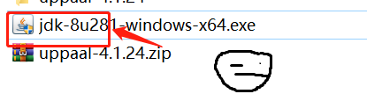
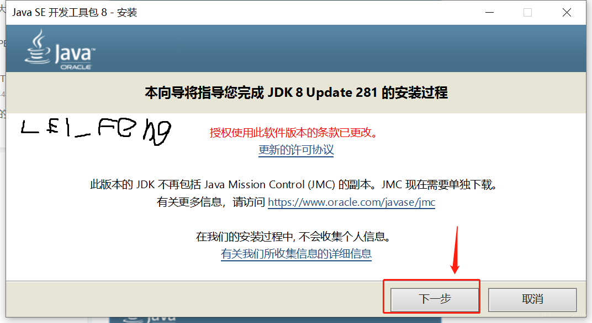
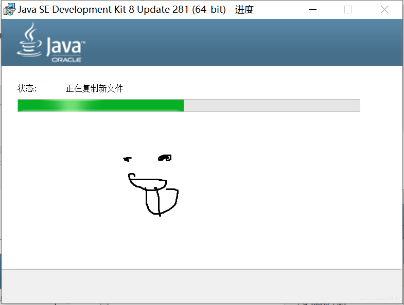
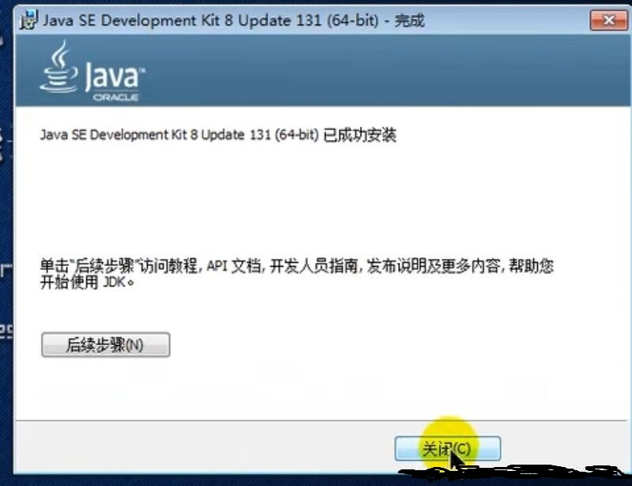
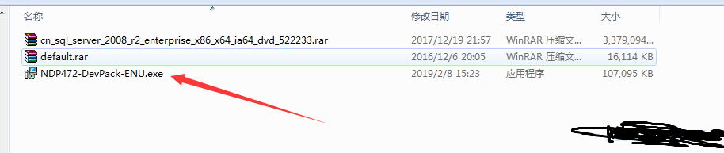
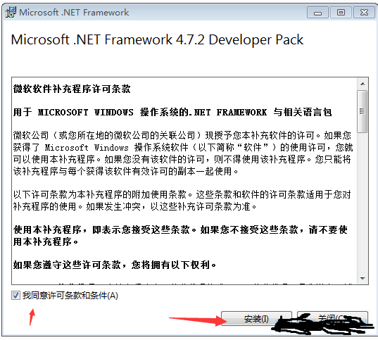
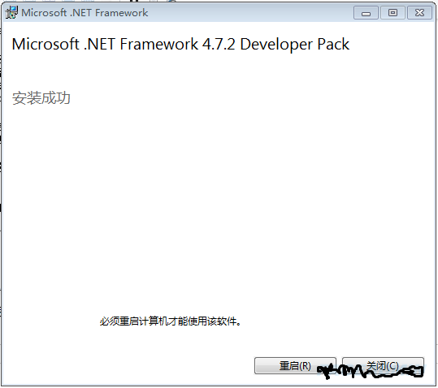
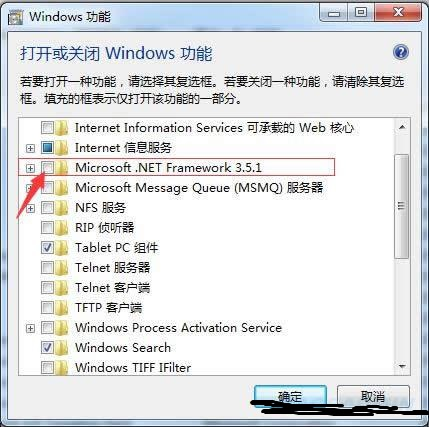

# FDP使用方法与一键包整合

## 开纪一键包（不含配置）

接下来不会做任何改动除非有重大更新 and 跟随最新的[FDP](https://github.com/SkidderMC/FDPClient)版本

V1更新log：

- [x] 优化各种占用

- [x] 超简单的HUD（HUD不会随着配置改的）

- [x] 上手即用（但是XP系统要自己下载lib）

- [x] 兼容32位系统（机房小子狂喜）

- [x] 免费和没后门（有本事你测测看）

- [x] 好的视觉

- [x] 不会花里胡哨

火绒检测已通过

> [蓝奏云下载](https://pvphack.lanzoue.com/iZB6h0s4bkhg) 访问密码：`2kby`
> 
> SHA1校验：`2d4fed7d27f9acdc35b9f9a06004cb5facb15b95`
> 
> 配置切换：`.cfg load 配置名`

视频演示：https://www.bilibili.com/video/BV1Ec411W7xF

## 基础环境安装

> 有错漏可以到评论区友善交流

### 安装java （必须）

下面的链接可能在中国大陆比较慢。

java8 [下载网页](https://www.java.com/en/download/manual.jsp)

java16 [下载网页](https://www.oracle.com/java/technologies/javase/jdk16-archive-downloads.html)

java17 [下载网页](https://www.oracle.com/java/technologies/javase/jdk17-archive-downloads.html)

**我的世界Java版本要求**：

- Java版`1.12`至Java版`1.16.5`需要`Java 8`启动游戏。
- Java版`1.17`至Java版`1.17.1`需要`Java 16`启动游戏。
- Java版`1.18`起需要`Java 17`启动游戏。

### Java安装过程

**点击Java.exe安装**



**Java安装页面**



**一路点击`下一步`直到这个页面**



**安装完毕后的样子**



### 32位和64位Java的RAM设置

| 32位          | 64位      |
| ------------ | -------- |
| 最大1024MB内存分配 | 无限运行内存分配 |

学校电脑微机可以使用32位的`Java`。

如果你的机器是64位的，建议安装64位的`Java`以获得最佳性能。

## NET安装（不用安装）

`Windows XP SP3`支持的`.net framework`最高版本是**4.0.3**。

`Windows 7 SP1`可以下载 `.net framework 4.8`最高版本尚不清楚。

[NET 4.0.3 WindowsXP 下载页面](https://www.microsoft.com/zh-CN/download/details.aspx?id=28181)

[NET 4.8 Windows7 下载](https://dotnet.microsoft.com/zh-cn/download/dotnet-framework/thank-you/net48-offline-installer)

### NET安装过程

**点击EXE**



**跳出安装界面**



**一路按提示安装即可，安装需要一点时间，出现如下界面，则表示安装成功。**



**最后重启电脑framework即可生效。**

**注意：有些win7电脑安装高版本后默认还是使用自带的.Net Framework3.5，需要手工取消**



## PVP 材质包和FDP HUD配置

我发现很多新手FDP默认的HUB很乱很长很浪费性能

这里提供了简单的材质包和经过优化的HUD配置

下面是我自用的材质包和音效包和HUD

- [x] FPS++ 40FPS变56FPS

- [x] 良好的手感

- [x] 好看的天空

- [x] 好看的视觉

- [x] 不会因HUD而卡了

### 过时的一键包

> [蓝奏云下载](https://pvphack.lanzoue.com/iIT3C0pvw8he) [归档网盘下载](https://drive2.xpdbk.com/)
> 
> 访问密码:`60ju` 无压缩密码

## V2 HUD


把下面的字段覆盖到你的 `.minecraft\FDPCLIENT-1.8\hud.json`

```json
[
  {
    "Type": "Armor",
    "X": -15.0,
    "Y": 60.0,
    "Scale": 0.99999994,
    "HorizontalFacing": "Middle",
    "VerticalFacing": "Down",
    "Mode": "LiquidBounce",
    "Alignment": "Horizontal",
    "Blur": 0.0
  },
  {
    "Type": "Notifications",
    "X": 20.0,
    "Y": -1.0,
    "Scale": 1.0,
    "HorizontalFacing": "Right",
    "VerticalFacing": "Down",
    "BackGroundAlpha": 255,
    "TitleShadow": false,
    "Motionblur": false,
    "ContentShadow": false,
    "WhiteTextColor": true,
    "CustomModeColored": false,
    "Mode": "Tenacity",
    "Blur": 0.0
  },
  {
    "Type": "Scoreboard",
    "X": 9.0,
    "Y": 31.0,
    "Scale": 1.0,
    "HorizontalFacing": "Right",
    "VerticalFacing": "Middle",
    "Text-R": 255,
    "Text-G": 255,
    "Text-B": 255,
    "Background-R": 0,
    "Background-G": 0,
    "Background-B": 0,
    "Background-Alpha": 0,
    "Rect": false,
    "Rect-Color": "Custom",
    "Rect-R": 255,
    "Rect-G": 255,
    "Rect-B": 255,
    "Rect-Alpha": 255,
    "RainbowBar": false,
    "ShadowText": false,
    "ServerIp": "ClientName",
    "NoPoints": true,
    "Font": {
      "fontName": "Minecraft Font",
      "fontSize": -1
    },
    "Shadow": false,
    "Shadow-Strength": 0.0,
    "Shadow-Color": "Background",
    "Shadow-Red": 255,
    "Shadow-Green": 255,
    "Shadow-Blue": 255,
    "Blur": 0.0
  },
  {
    "Type": "Effects",
    "X": -1.0,
    "Y": 50.0,
    "Scale": 1.0,
    "HorizontalFacing": "Left",
    "VerticalFacing": "Middle",
    "Blur": 0.0
  },
  {
    "Type": "Arraylist",
    "X": 1.0,
    "Y": 1.0,
    "Scale": 1.0,
    "HorizontalFacing": "Right",
    "VerticalFacing": "Up",
    "Text-Color": "Custom",
    "Text-R": 255,
    "Text-G": 255,
    "Text-B": 255,
    "Tag-Color": "Custom",
    "Tag-R": 0,
    "Tag-G": 0,
    "Tag-B": 255,
    "AllSpeed": 400,
    "Rect-Color": "Custom",
    "Rect-R": 255,
    "Rect-G": 255,
    "Rect-B": 255,
    "Rect-Alpha": 255,
    "Random-Saturation": 1.0,
    "Random-Brightness": 1.0,
    "TagsStyle": "None",
    "ShadowText": false,
    "SplitName": false,
    "SlideInAnimation": true,
    "NoRenderModules": true,
    "Background-Color": "Custom",
    "Background-R": 255,
    "Background-G": 255,
    "Background-B": 255,
    "Background-Alpha": 0,
    "Background-Expand": 0,
    "RainbowSpeed": 1,
    "Rect": "None",
    "Case": "Normal",
    "Space": 0.0,
    "TextHeight": 9.954023,
    "TextY": 0.0,
    "Font": {
      "fontName": "Minecraft Font",
      "fontSize": -1
    },
    "TextAlpha": 255,
    "Shadow": false,
    "Shadow-NoCut": false,
    "Shadow-Strength": 1,
    "Shadow-Color": "Background",
    "Shadow-Red": 255,
    "Shadow-Green": 255,
    "Shadow-Blue": 255,
    "CRainbow-Seconds": 1,
    "CRainbow-Distance": 1,
    "Blur": 0.0
  },
  {
    "Type": "Targets",
    "X": 180.0,
    "Y": -25.0,
    "Scale": 1.0,
    "HorizontalFacing": "Middle",
    "VerticalFacing": "Middle",
    "Mode": "Arris",
    "RiseMode": "Rise6",
    "Chill-FontSpeed": 0.01,
    "Font": {
      "fontName": "Minecraft Font",
      "fontSize": -1
    },
    "Shadow": false,
    "Shadow-Strength": 1.0,
    "Shadow-Color": "Background",
    "Shadow-Red": 0,
    "Shadow-Green": 111,
    "Shadow-Blue": 255,
    "AnimSpeed": 10,
    "HpAnimType": "SINE",
    "HpAnimOrder": "FAST_AT_START_AND_END",
    "SwitchMode": "Slide",
    "SwitchAnimType": "SINE",
    "SwitchAnimOrder": "FAST_AT_START_AND_END",
    "SwitchAnimSpeed": 10,
    "No-Animation": false,
    "Global-AnimSpeed": 3.0,
    "ArrisRounded": true,
    "Color": "Health",
    "Red": 252,
    "Green": 96,
    "Blue": 66,
    "Saturation": 0.0,
    "Brightness": 0.0,
    "Background-Red": 255,
    "Background-Green": 255,
    "Background-Blue": 255,
    "Background-Alpha": 60,
    "TenacityNewStaticRainbow": false,
    "RainbowSpeed": 1,
    "FadeAnim": false,
    "Fade-Speed": 0.0,
    "Seconds": 1,
    "RiseHurt": false,
    "RiseAlpha": 130,
    "Rise-Count": 5,
    "Rise-Size": 1.0,
    "Rise-Alpha": 0.7,
    "Rise-Distance": 1.0,
    "Rise-MoveTime": 20,
    "Rise-FadeTime": 20,
    "GradientLoop": 19,
    "GradientDistance": 88,
    "GradientRoundedBar": true,
    "Rice-Particle": true,
    "Rice-ParticleSpin": true,
    "GenerateAmount": 10,
    "Circle-Particles": "Solid",
    "Rect-Particles": "Solid",
    "Triangle-Particles": "Solid",
    "Rice-ParticleSpeed": 0.05,
    "Rice-ParticleFade": true,
    "ParticleFadingSpeed": 0.05,
    "Rice-ParticleRange": 50.0,
    "MinParticleSize": 0.0,
    "MaxParticleSize": 0.0,
    "Blur": 0.0
  },
  {
    "Type": "Text",
    "X": 10.0,
    "Y": 10.0,
    "Scale": 1.0,
    "HorizontalFacing": "Left",
    "VerticalFacing": "Up",
    "DisplayText": "BlocksmcV3.5 https://blog.xpdbk.com",
    "Shadow": false,
    "Shadow-Strength": 1.0,
    "Red": 255,
    "Green": 216,
    "Blue": 255,
    "Alpha": 255,
    "Color": "Custom",
    "Rect": "None",
    "RectColor": "Custom",
    "RectRed": 0,
    "RectGreen": 0,
    "RectBlue": 0,
    "RectAlpha": 0,
    "RectExpand": 0.0,
    "RectRoundingMultiplier": 0.1,
    "RainbowSpeed": 1,
    "RainbowIndex": 1,
    "Font": {
      "fontName": "Minecraft Font",
      "fontSize": -1
    },
    "Blur": 0.0
  }
]
```

## V1 HUD

[蓝奏云下载](https://pvphack.lanzoue.com/b031s24ba)

访问密码:`aizs`

HUD压缩包密码：`awawawa`

解压后把FDP文件夹放入.minecraft根目录