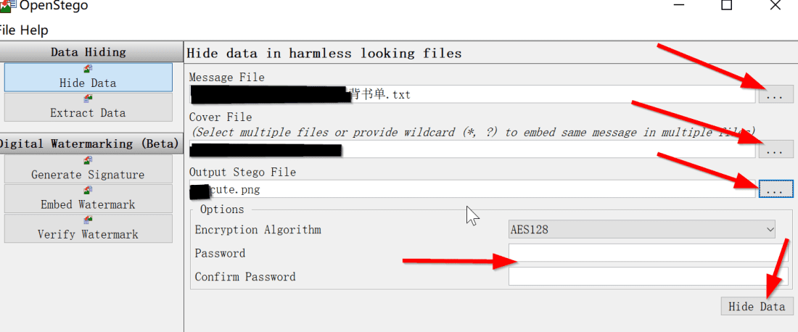
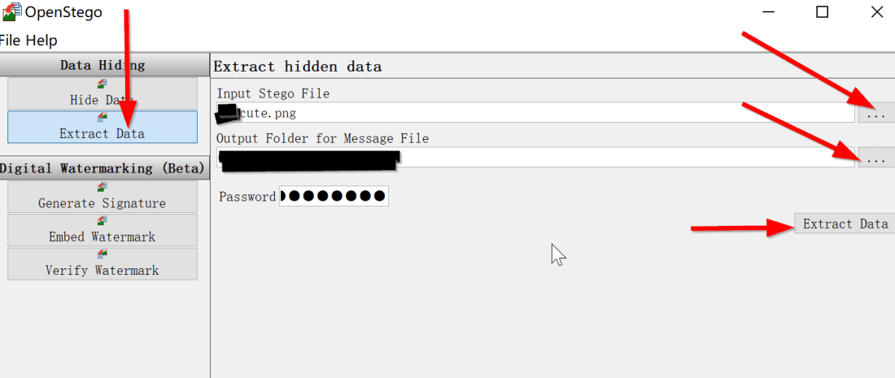

# 如何防止你的文件被别人偷看？

> 本篇文章将教你如何传文件才不会被好兄弟看到

使用加密工具，可以在使用百度网盘等服务，安全地储存下载好的东西。

加密工具的局限是要求通信双方都掌握加密/解密的方法，使用门槛较高，沟通效率较低，难以大范围普及。

## 1 网盘加密

1.可以使用 Veracrypt 创建的虚拟加密盘（对称加密，需另循安全渠道向接收方发送密码），或者

2.使用 GnuPG 加密（非对称加密，需事先交换公钥）文件，

3.较为低阶的做法是直接使用加密的压缩包。加密完成后可修改文件名后缀，将其伪装成因损坏而无法打开的文件。

## 2 隐写术

隐写术 (steganography) 是指对图片中每个像素的颜色进行肉眼无法察觉的微调，借此向图片文件中写入密文。

> 隐写术需要借助 [OpenStego （打开新窗口）](https://pvphack.lanzoue.com/b031u7isd)
> 
> 访问密码:g0el

等专门的软件进行，写入信息过程是在软件中分别导入图片和写入信息的文档（如 .txt），选择加密算法和设置密码，最后由软件生成合成了原图片和文档的新图片；提取信息的过程是将图片导入软件，输入密码解密后提取出写入的信息。需要注意的是写入密文的图片必须以原图形式传输，如图片被压缩或修改将导致信息无法被读取。

可以在公共聊天室传短信息到你的朋友的手里

### 打开Stego

OpenStego 是一个隐写术应用程序，它提供两种功能：

1. 数据隐藏：它可以隐藏图像文件中的任何数据。

2. 水印：使用不可见签名为图像文件加水印。它可用于检测未经授权的文件复制。

对于图形用户界面：

如果您使用安装程序，请使用 OpenStego 的菜单快捷方式。对于 zip 下载，使用捆绑的批处理文件或 shell 脚本启动 GUI。

```
openstego.bat                (Windows)
```

```
./openstego.sh               (Linux / MacOS)
```

### 隐藏信息

在隐藏信息之前需要做做两样准备，也就是**Cover**以及**Message文件**。第一个就是我们需要用来作伪装的无害的图片，第二个message文件就是我们用来存储信息的文件，一般创建一个.txt的文件即可。   首先我们找好一张可以隐藏真实意图的图片，比如这样一张：      然后我们新建一个txt文件，并写下这样一段话   “我年轻的时候就读过：论语，老子，孟子，尚书，礼记，大学，中庸，周易，左转，庄子，墨子，荀子，韩非子，孙子兵法………常识，老人与海，世界秩序,…….”   然后文件准备就绪以后，就开始想办法把这两个文件合二为一。   

**打开软件界面**      第一行浏览咱们需要隐藏的装有需要传输的信息的文件，第二行死Cover，也就是咱们选好的看起来非常友好无害的图片，最后需要选择输出文件的名字和地址，到时候便于知道输出的图片在哪里叫什么名字。   然后需要选择加密算法设置密码，最后点击右下角的**Hide Data**隐藏信息即可。咱们查看一下隐藏好信息的图片发现和原来的图片没有什么区别但是其实里面已经包含了**背书单**文件了：

**提取隐藏信息**  
这个操作相对简单，必须要知道对称加密的密码才可以提取，而且**要保证图片没有被压缩过或者修改过**，有时候为了防止通讯软件压缩图片会考虑选择以传输压缩文件的方式传输。  
  
首先选择**Extract Data**提取数据，然后第一行找到含有隐藏数据的文件，第二行浏览输出地址，就是提取出来的文件保存在哪里，最后必须要输入密码才可以解密，因此需要正确的输入密码，最后就是提取数据。  
操作很简单吧(●’◡’●)，可以自己试试看。

## 使用DES加密短文

**☆提供高质量的数据保护，防止数据未经授权的泄露和未被察觉的修改；**

**☆具有相当高的复杂性，使得破译的开销超过可能获得的利益，同时又要便于理解和掌握；**

**☆DES密码体制的安全性应该不依赖于算法的保密，其安全性仅以加密密钥的保密为基础；**

离线加解密DES [HTML文件下载](https://leak.ptik.ga/d/%E8%A7%A3%E5%AF%86%E5%B7%A5%E5%85%B7/DES%E8%A7%A3%E5%AF%86.7z?sign=4yJi9D0j47i7eQO7aB0wz7yTsenV6eDtyiT-XTWAu8Q=:0)