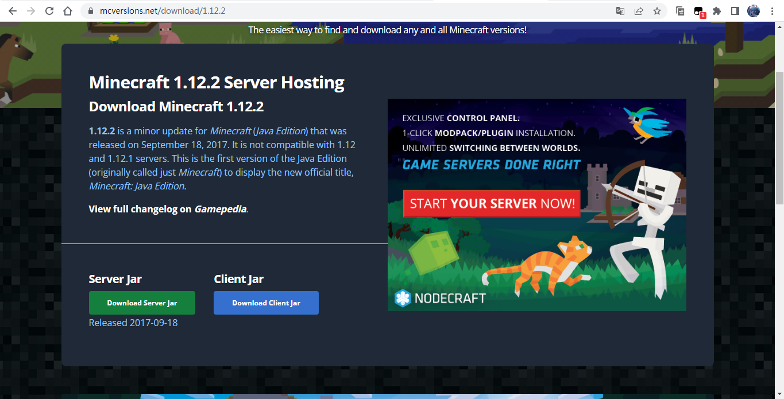
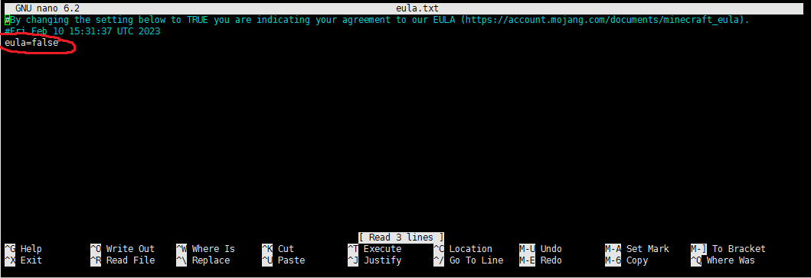
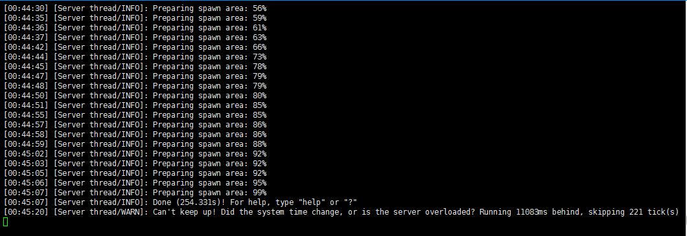

# 基于VPS搭建Minecraft服务器（Linux）

## 一、为啥要搭建

我们玩`Minecraft`的时候，可能需要联机玩。但是在 `Minecraft Java` 上只有 `LAN` 在线。这时候我们就需要搭建一个服务器，让不同地区的玩家可以一起联机。

> 英文版正在制作

## 二、安装环境

- VPS系统版本：`Ubuntu 22.04` 64位
- Minecraft版本：`1.12.2` `Java`版

## 三、搭建步骤

1. SSH连接上服务器

2. 输入以下命令，安装Jdk环境包

> 不懂SSH的可以百度或者bing

### Jdk 环境包

对于`1.16`及之前版本，需要安装`Jdk8`

```shell
sudo apt install openjdk-8-jdk
```

对于`1.17`需要安装`Jdk16`

```shell
sudo apt install openjdk-16-jdk
```

`1.18`及以上需要`Jdk17`

```shell
sudo apt install openjdk-17-jdk
```

### 服务端下载

1. 进入 [https://mcversions.net/](https://mcversions.net/) ，找到你想要下载的服务端版本

2. 复制 `server.jar` 的链接

例如以下页面

[1.12.2](https://mcversions.net/download/1.12.2)



输入下面的命令，下载mc的服务端

```shell
wget -N 复制的链接
```

输入下面的命令，启动服务端

```shell
java -server -XX:+UseG1GC  -Xmx2048M -Xms1024M -jar server.jar nogui
```

打开`eula.txt`，修改红框部分为`eula=true`



修改`server.properties`文件，修改以下部分

    view-distance=10
    max-build-height=256
    server-ip=
    level-seed=
    gamemode=0 # 1为创造，2为旁观
    server-port=25565 # 服务器端口，建议修改
    enable-command-block=false
    allow-nether=true
    enable-rcon=false
    op-permission-level=4
    enable-query=false
    generator-settings=
    resource-pack=
    player-idle-timeout=0
    level-name=world
    motd=A Minecraft Server # 服务器介绍
    announce-player-achievements=true
    force-gamemode=false
    hardcore=false
    white-list=false
    pvp=true
    spawn-npcs=true
    generate-structures=true
    spawn-animals=true
    snooper-enabled=true
    difficulty=1
    network-compression-threshold=256
    level-type=DEFAULT
    spawn-monsters=true
    max-tick-time=60000
    max-players=20 # 服务器最多承受玩家人数
    use-native-transport=true
    online-mode=true # false为取消正版验证
    allow-flight=false
    resource-pack-hash=
    max-world-size=29999984

创建一个screen，然后编写一个启动脚本

 创建脚本文件

```shell
nano start.sh
```

填写脚本内容

```bash
#!/bin/sh

for ((i=0; i<10; i ++))
do
	java -server -XX:+UseG1GC  -Xms1024M -Xmx2048M -jar server.jar nogui -noverify -XX:+AggressiveOpts -XX:+UseCompressedOops
done
```

**Ctrl+X 保存**

提权

```shell
chmod 777 start.sh
```

```shell
./start.sh
```

## 注意

需要停止服务器端，请进到`screen`，然后输入 `/stop` 命令正常关闭服务器程序

你可以使用下面的命令检查是否已经在你的服务器上安装了`screen`

```shell
screen -v
```

```shell
apt-get -y install screen
```

### 如何启动一个 screen 会话

```shell
screen -S name
```

将 “`name`” 替换为对你会话有意义的名字（例如mc）


### 从 screen 会话中分离

要从当前的 screen 会话中分离，你可以按下 `Ctrl-A` 和 `d`。所有的 screen 会话仍将是活跃的，你之后可以随时重新连接。

### 重新连接到 screen 会话

如果你从一个会话分离，或者由于某些原因你的连接被中断了，你可以使用下面的命令重新连接：

```shell
screen -r mc
```

如果你有多个 screen 会话，你可以用 `ls` 参数列出它们。

```shell
# 输入 
screen -ls
# 列出会话
There are screens on
# 114514是会话号
114514.session    (Detached)
  
1919810.homo   (Detached)
  
514441.session1   (Detached)
  
3 Sockets in /var/run/screen/S-root
```

在我们的例子中，我们有三个活跃的 `screen` 会话。因此，如果你想要还原 “`session2`” 会话，你可以执行：

```shell
screen -r 1919810
```

```shell
# 或者使用字符
screen -r -S homo
```

### 删除Screen

在当前**screen**下，输入`Ctrl+D`，**删除**该**screen**.

## 服务器开好了之后的样子



`Ctrl+c`退出 按照上面`screen`重新搞一次

然后键入服务器公网IP（有的服务器需要把防火墙或者安全组关了才行）

进入游戏