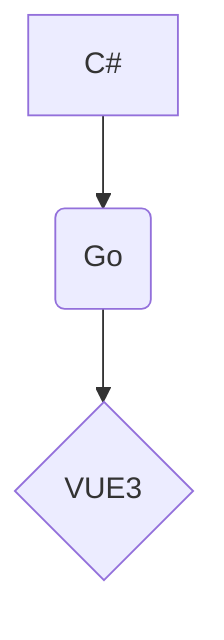
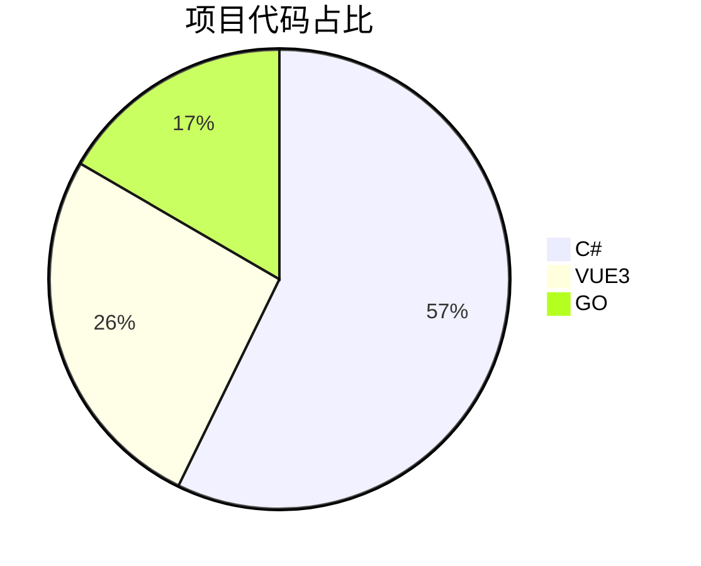

# 2B2T分布式基地管理器

> 2B2T基地管理器是一款专门为《Minecraft》2B2T服务器玩家设计的~~强大~~（挖坑）工具。无论你是新手还是老手，使用它都能够极大地提高您在这个服务器上的分布式基地建设体验。
> 
> 该工具可以帮助您自动化和简化许多基地管理任务。例如，您可以轻松地查看历史日志看看是谁炸了哪个基地，让您省去很多登录操作

## 整个项目的结构

### 项目结构

### 项目代码占比

